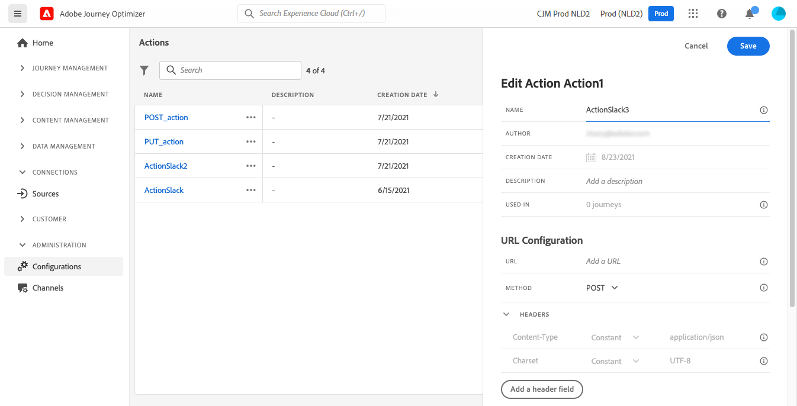
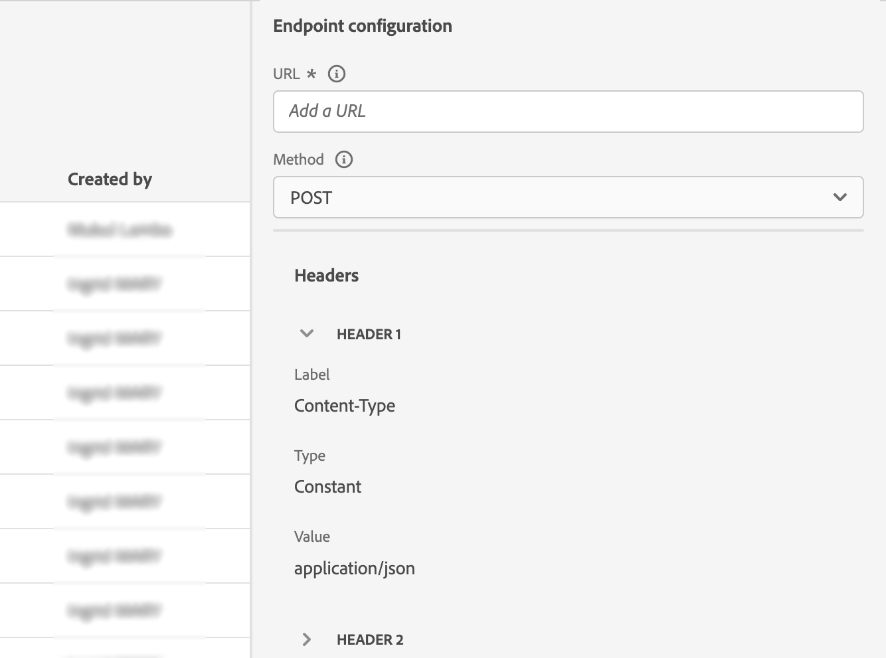
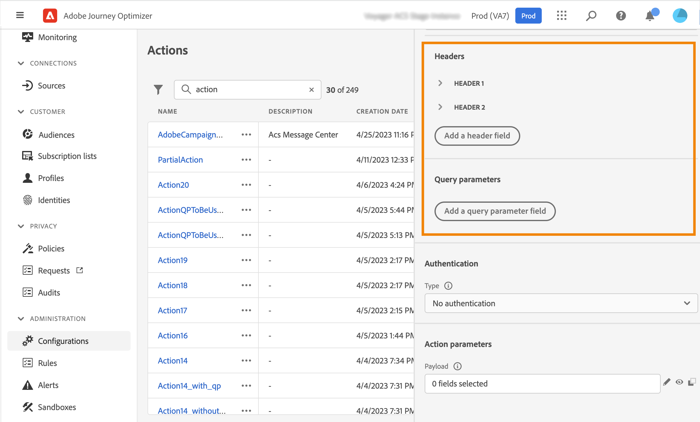
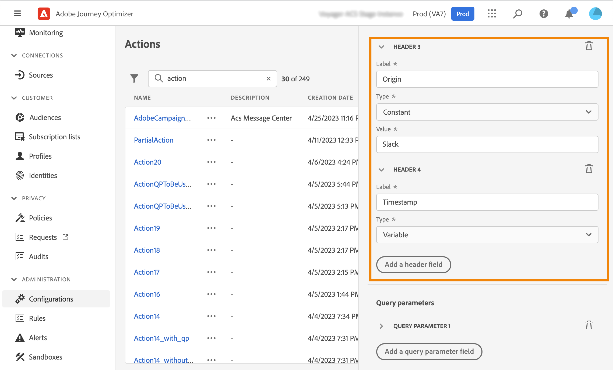
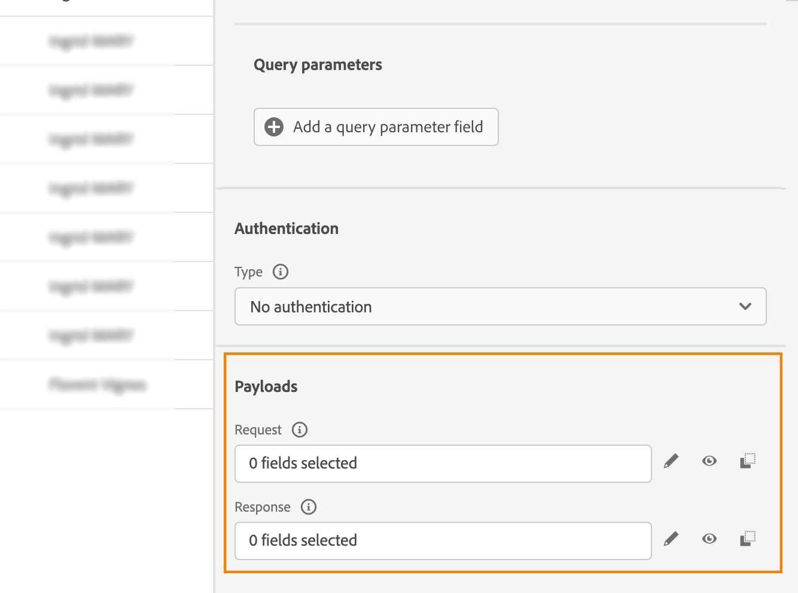

# Configure a custom action {#configure-an-action}

>[!CONTEXTUALHELP]
>id="ajo_journey_action_custom_configuration"
>title="Custom actions"
>abstract="If you are using a third-party system to send messages or if you want journeys to send API calls to a third-party system, use custom actions to configure its connection to your journey. For example you can connect to the following systems with custom actions: Epsilon, Slack, [Adobe Developer](https://developer.adobe.com), Firebase, etc." 

If you are using a third-party system to send messages or if you want journeys to send API calls to a third-party system, use custom actions to configure its connection to your journey. For example you can connect to the following systems with custom actions: Epsilon, Slack, [Adobe Developer](https://developer.adobe.com){target="_blank"}, Firebase, etc.

Custom actions are additional actions defined by technical users and made available to marketers. Once configured, they appear in the left palette of your journey, in the **[!UICONTROL Action]** category. Learn more in [this page](../building-journeys/about-journey-activities.md#action-activities). 

## Limitations{#custom-actions-limitations}

Custom actions come with a few limitations listed in [this page](../start/guardrails.md).

In custom action parameters, you can pass a simple collection, as well as a collection of objects. Learn more about collection limitations in [this page](../building-journeys/collections.md#limitations). 

Also note that the custom actions parameters have an expected format (example: string, decimal, etc.). You must be careful to respect these expected formats. Learn more in this [use case](../building-journeys/collections.md).

## Best practices{#custom-action-enhancements-best-practices}

When choosing an endpoint to target using a custom action, be sure that:

* This endpoint can support journey's throughput, using configurations from the [Throttling API](../configuration/throttling.md) or [Capping API](../configuration/capping.md) to limit it. Be cautious that a throttling configuration cannot go below 200 TPS. Any endpoint targeted will need to support at least 200 TPS.
* This endpoint needs to have a response time as low as possible. Depending of your expected throughput, having a high response time could impact the actual throughput.

A capping limit of 300,000 calls over one minute is defined for all custom actions. In addition, the default capping is performed per host and per sandbox. For example, on a sandbox, if you have two endpoints with the same host (eg: `https://www.adobe.com/endpoint1` and `https://www.adobe.com/endpoint2`), the capping will apply for all endpoints under the adobe.com host. "endpoint1" and "endpoint2" will share the same capping configuration and having one endpoint reach the limit will have an impact on the other endpoint.

This limit has been set based on customers usage, to protect external endpoints targeted by custom actions. You need to take this into account in your audience-based journeys by defining an appropriate reading rate (5000 profiles/s when custom actions are used). If needed, you can override this setting by defining a greater capping or throttling limit through our Capping/Throttling APIs. See [this page](../configuration/external-systems.md).

You should not target public endpoints with custom actions for various reasons:

* Without proper capping or throttling, there is a risk of sending too many calls to a public endpoint that may not support such volume.
* Profile data can be sent through custom actions, so targeting a public endpoint could lead to inadvertently sharing personal information externally.
* You have no control on the data being returned by public endpoints. If an endpoint changes its API or starts sending incorrect information, those will be made available in communications sent, with potential negative impacts.

## Consent and data governance {#privacy}

In Journey Optimizer, you can apply data governance and consent policies to your custom actions to prevent specific fields from being exported to third-party systems or exclude customers who have not consented to receive email, push or SMS communication. For more information, refer to the following pages:

* [Data governance](../action/action-privacy.md).
* [Consent](../action/action-privacy.md).

## Configuration steps {#configuration-steps}

Here are the main steps required to configure a custom action:

1. In the ADMINISTRATION menu section, select **[!UICONTROL Configurations]**. In the  **[!UICONTROL Actions]** section, click **[!UICONTROL Manage]**. Click **[!UICONTROL Create Action]** to create a new action. The action configuration pane opens on the right side of the screen.

    

1. Enter a name for your action.

    >[!NOTE]
    >
    >Do not use spaces or special characters. Do not use more than 30 characters.

1. Add a description to your action. This step is optional.
1. The number of journeys that use this action is displayed in the **[!UICONTROL Used in]** field. You can click the **[!UICONTROL View journeys]** button to display the list of  journeys using this action.
1. Define the different **[!UICONTROL URL Configuration]** parameters. See [this page](../action/about-custom-action-configuration.md#url-configuration).
1. Configure the **[!UICONTROL Authentication]** section. This configuration is the same as for data sources.  See [this section](../datasource/external-data-sources.md#custom-authentication-mode).
1. Define the **[!UICONTROL Action parameters]**. See [this page](../action/about-custom-action-configuration.md#define-the-message-parameters).
1. Click **[!UICONTROL Save]**.

    The custom action is now configured and ready to be used in your journeys. See [this page](../building-journeys/about-journey-activities.md#action-activities).

    >[!NOTE]
    >
    >When a custom action is used in a journey, most parameters are read-only. You can only modify the **[!UICONTROL Name]**, **[!UICONTROL Description]**, **[!UICONTROL URL]** fields and the **[!UICONTROL Authentication]** section.

## Endpoint configuration {#url-configuration}

When configuring a custom action, you need to define the following **[!UICONTROL Endpoint Configuration]** parameters:

{width="70%" align="left"}

1. In the **[!UICONTROL URL]** field, specify the URL of the external service:

    * If the URL is static, enter the URL in this field.

    * If the URL includes a dynamic path, enter only the static part of the URL, that is, the scheme, the host, the port, and, optionally, a static part of the path.

        Example: `https://xxx.yyy.com/somethingstatic/`

        You will specify the dynamic path of the URL when adding the custom action to a journey. [Learn more](../building-journeys/using-custom-actions.md).

    >[!NOTE]
    >
    >For security reasons, we strongly recommend that you use the HTTPS scheme for the URL. We don't allow the use of Adobe addresses that are not public and the use of IP addresses.
    >
    >Only the default ports are allowed when defining a custom action: 80 for http and 443 for https.

1. Select the call **[!UICONTROL Method]**: it can be either **[!UICONTROL POST]**, **[!UICONTROL GET]** or **[!UICONTROL PUT]**.

    >[!NOTE]
    >
    > The **DELETE** method is not supported. If you need to update an existing resource, select the **PUT** method.

1. Define the headers and query parameters:

   * In the **[!UICONTROL Headers]** section, click **[!UICONTROL Add a header field]** to define the HTTP headers of the request message to be sent to the external service. The **[!UICONTROL Content-Type]** and **[!UICONTROL Charset]** header fields are set by default. You cannot modify or delete these fields.

   * In the **[!UICONTROL Query parameters]** section, click **[!UICONTROL Add a Query parameter field]** to define the parameters you want to add in the URL.

    

1. Enter the label or name of the field.

1. Select the type: **[!UICONTROL Constant]** or **[!UICONTROL Variable]**. If you have selected **[!UICONTROL Constant]**, then enter the constant value in the **[!UICONTROL Value]** field. If you have selected **[!UICONTROL Variable]**, then you will specify this variable when adding the custom action to a journey. [Learn more](../building-journeys/using-custom-actions.md).

    

    >[!NOTE]
    >
    >After you have added the custom action to a journey, you can still add header or query parameters fields to it if the journey is in draft status. If you do not want the journey to be affected by configuration changes, duplicate the custom action and add the fields to the new custom action.
    >
    >Headers are validated according to field parsing rules. Learn more in [this documentation](https://tools.ietf.org/html/rfc7230#section-3.2.4){_blank}.

## Define the payload parameters {#define-the-message-parameters}

1. In the **[!UICONTROL Request]** section, paste an example of the JSON payload to send to the external service. This field is optional and only available for POST and PUT calling methods.

1. In the **[!UICONTROL Response]** section, paste an example of the payload returned by the call. This field is optional and available for all calling methods. For detailed information on how to leverage API call responses in custom actions, refer to [this page](../action/action-response.md).

>[!NOTE]
>
>The response capability is currently available in beta.

{width="70%" align="left"}

>[!NOTE]
>
>The payload example cannot contain null values. Field names in the payload cannot contain a "." character. They cannot start with a "$" character.

You will be able to define the parameter type (e.g.: string, integer, etc.).

You will also have a choice between specifying if a parameter is a constant or a variable:

* **Constant** means that the value of the parameter is defined in the action configuration pane by a technical persona. The value will be always the same across journeys. It will not vary and the marketer won't see it when using the custom action in the journey. It could be for example an ID the third-party system expects. In that case, the field on the right of the toggle constant/variable is the value passed.
* **Variable** means the value of the parameter will vary. Marketers using this custom action in a journey will be free to pass the value they wants or to specify where to retrieve the value for this parameter (e.g. from the event, from Adobe Experience Platform, etc.). In that case, the field on the right of the toggle constant/variable is the label marketers will see in the journey to name this parameter.

