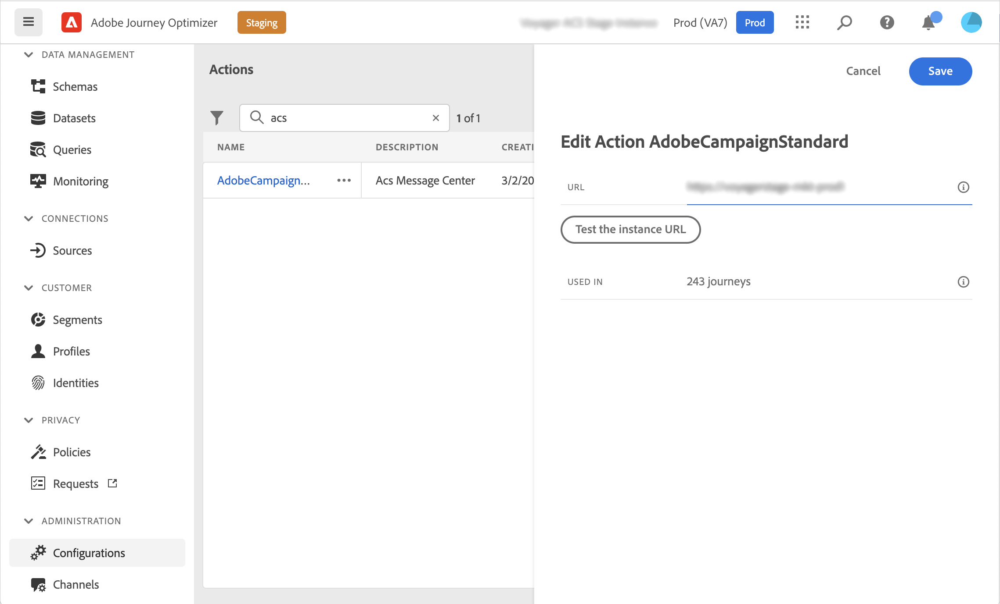
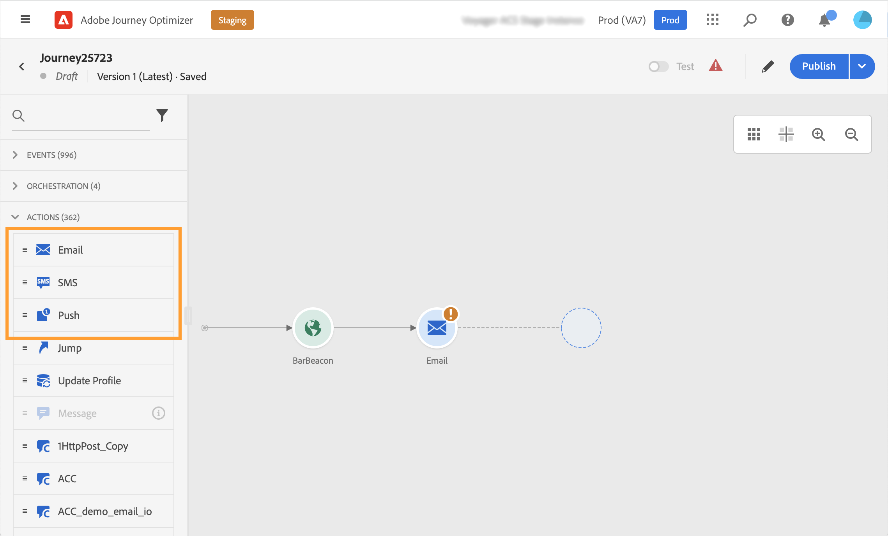

# Integrate with Adobe Campaign Standard {#using_adobe_campaign_standard}

You can send emails, push notifications and SMS using the Adobe Campaign Standard's Transactional Messaging capabilities.

If you have Adobe Campaign Standard, a built-in action is available to allow the connection to Adobe Campaign Standard. 

The Campaign Standard transactional message and its associated event must be published in order to be used in Journey Optimizer. If the event is published but the message is not, it will not be visible in the Journey Optimizer interface. If the message is published but its associated event is not, it will be visible in the Journey Optimizer interface but it will not be usable.

## Important notes {#important-notes}

* A capping rule of 4000 calls per 5 minutes is automatically defined for Adobe Campaign Standard actions. This corresponds to the official scale of Adobe Campaign Standard Transactional Messaging. Read more about transactional messaging SLAs in [Adobe Campaign Standard Product Description](https://helpx.adobe.com/legal/product-descriptions/campaign-standard.html).

* Adobe Campaign Standard integration is set up through a dedicated built-in action in the action list. This needs to be configured for each sandbox.

* You cannot use a Campaign Standard action with a Segment qualification or Read segment activity.

* A journey cannot use both Messages and Campaign Standard actions.

## Configuring the action {#configure-action}

Here are the steps to configure it:

1. Select **[!UICONTROL Configurations]** in the ADMINISTRATION menu section. In the  **[!UICONTROL Actions]** section, click **[!UICONTROL Manage]**. The list of actions is displayed.

1. Select the built-in **[!UICONTROL AdobeCampaignStandard]** action. The action configuration pane opens on the right side of the screen.

    

1. Copy your Adobe Campaign Standard instance URL and paste it in the **[!UICONTROL URL]** field.

1. Click the **[!UICONTROL Test the instance URL]** to test the validity of the instance.

    >[!NOTE]
    >
    >This test verifies that:
    >
    >The host is ".campaign.adobe.com", ".campaign-sandbox.adobe.com", ".campaign-demo.adobe.com", ".ats.adobe.com" or ".adls.adobe.com".
    >
    >The URL starts with https,
    >
    >The ORG associated to this Adobe Campaign Standard's instance is the same as the Journey Optimizer's ORG.

When designing your journey, three actions will be available in the **[!UICONTROL Action]** category: **[!UICONTROL Email]**, **[!UICONTROL Push]**, **[!UICONTROL SMS]** (see [Using Adobe Campaign actions](../building-journeys/using-adobe-campaign-standard.md)). 

You can use a **Reactions** event to react to tracking data related to a Campaign Standard message sent within the same journey. For push notifications, you can react to clicked, sent or failed messages. For SMS messages, you can react to sent or failed messages. For emails, you can react to clicked, sent, opened or failed messages. See [Reactions events](../building-journeys/reaction-events.md).

If you're using a third-party system to send messages, you need to add and configure a custom action. See [About custom action configuration](../action/about-custom-action-configuration.md).
