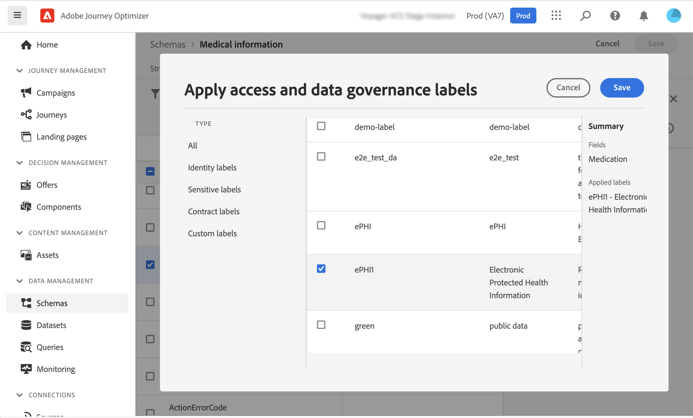
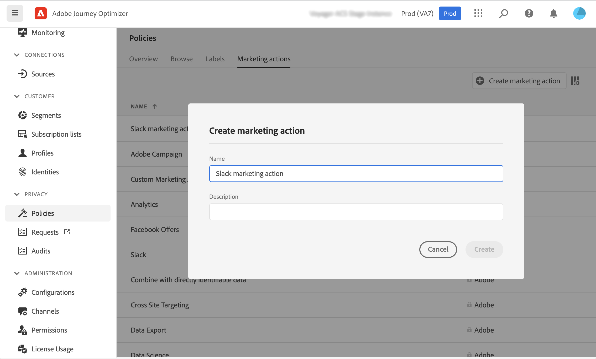
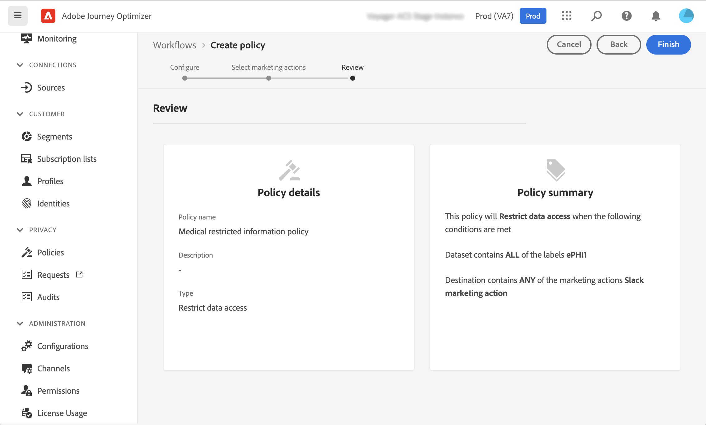
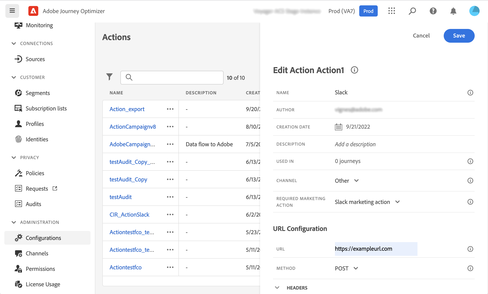
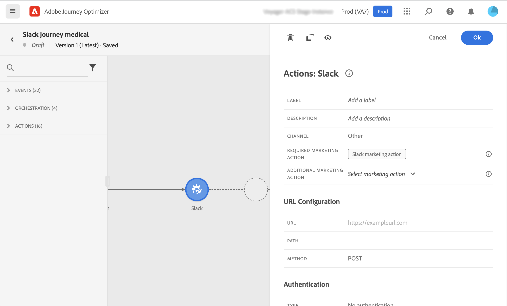
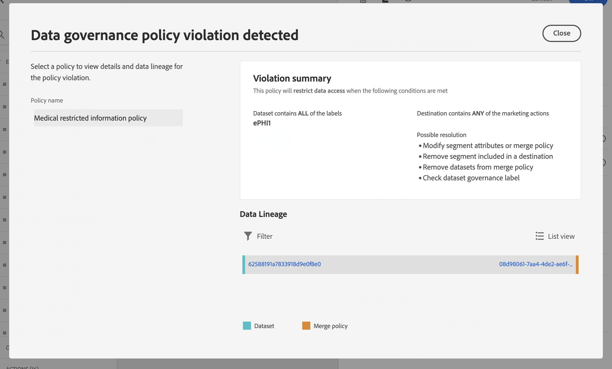

# Data Governance {#restrict-fields}

>[!IMPORTANT]
>
>The use of Data Usage Labelling and Enforcement (DULE) is currently restricted to selected customers, and will be deployed to all environments in a future release.

With its Data Usage Labelling and Enforcement (DULE) governance framework, Journey Optimizer can now leverage Adobe Experience Platform governance policies to prevent sensitive fields from being exported to third-party systems through custom actions. If the system identifies a restricted field in the custom action parameters, an error is displayed preventing you from publishing the journey.

Adobe Experience Platform allows you to label your fields and create marketing actions for each channel. You then define a governance policy linked to a label and a marketing action.

In Journey Optimizer, you can apply these policies to your custom actions to prevent specific fields from being exported to third-party systems. 

For more information on the Data Governance framework and how to work with labels and policies, refer to Adobe Experience Platform documentation:

* [Data Governance service overview](https://experienceleague.adobe.com/docs/experience-platform/data-governance/home.html)
* [Data usage labels overview](https://experienceleague.adobe.com/docs/experience-platform/data-governance/labels/overview.html)
* [Data usage policies](https://experienceleague.adobe.com/docs/experience-platform/data-governance/policies/overview.html)

## Important notes {#important-notes}

* Data governance only applies to custom actions in journeys. Campaign Classic and Campaign Standard actions are not supported.
* Governance policies only apply when a marketing action (required or additional) is set at the custom action level. 

## Define governance policies {#governance-policies}

You can use existing labels, marketing actions and policies. Here are the main configuration steps to create new ones:

* Add a label and apply it to specific fields that you do not want to be exported to third-party systems, for example the blood type of a person. 
* Define a marketing action for each third-party custom action used in your journeys.
* Create a governance policy and associate it to the label and marketing action.

For more information on how to manage policies, refer to this [documentation](https://experienceleague.adobe.com/docs/experience-platform/data-governance/policies/user-guide.html#consent-policy)

Let's take the example of the blood type field that you need to label as sensitive and restrict from being exported to a third-party. Here are the different steps:

1. In the left menu, under **Privacy**, click **Policies**.
1. Select the **Labels** tab and click **Create label**.
    
1. Define a name and friendly name for this label. For example, _ePHI1_.
1. In the left menu, under **Data management**, click **Schemas**, and click the **Apply access and data governance labels** button. Select your schema and field (blood type) and select the label previously created, _ePHI1_ in our example.
    
1. Go back to the **Policies** menu, select the **Marketing action** tab and click **Create marketing action**. We recommend that you create one marketing action for each third-party custom action used in your journeys. For example, let's create a _Slack marketing action_ which will be used for your Slack custom action.
    
1. Select the **Browse** tab, click **Create policy** and select **Data governance policy**. Select your label (_ePHI1_) and marketing action (_Slack marketing action_).
    

When you will use, in a journey, your Slack custom action configured with the _Slack marketing action_, the associated policy will be leveraged. 

## Configure the custom action {#consent-custom-action}

In the left menu, under **Administration**, click **Configurations** and select **Actions**. Open your Slack custom action. When configuring a custom action, two fields can be used for data governance.

* The **Channel** field allows you to select the channel related to this custom action: **Email**, **SMS**, or **Push notification**. It will prefill the **Required marketing action** field with the default marketing action for the selected channel. If you select **other**, no marketing action will be defined by default. In our example, we select the channel **other**.

* The **Required marketing action** allows you to define the marketing action related to your custom action. For example, if you use that custom action to send emails using a third-party, you can select **Email targeting**. In our example, we select the _Slack marketing action_. The governance policies associated to that marketing action are retrieved and leveraged.

The other steps for configuring a custom action are detailed in [this section](../action/about-custom-action-configuration.md#consent-management).  

## Build the journey {#consent-journey}

In the left menu, under **Journey management**, click **Journeys**. Create your journey and add your custom action.  When adding the custom action in a journey, several options allow you to manage data governance. Click the **Show read-only fields** to display all parameters.

The **Channel** and **Required marketing action**, defined when configuring the custom action, are displayed at the top of the screen. You cannot modify these fields.

You can define an **Additional marketing action** to set the type of custom action. This allows you to define the purpose of the custom action in this journey. In addition to the required marketing action, which is usually specific to a channel, you can define an additional marketing action which will be specific to the custom action in this particular journey. For example: a workout communication, a newsletter, a fitness communication, etc. Both the required marketing action and the additional marketing action will apply.

In our example, we do not use an additional marketing action.

If one of the fields labelled _ePHI1_ (the blood type field in our example) are detected in the action parameters, an error is displayed, preventing you from publishing the journey.

The other steps for configuring a custom action in a journey are detailed in [this section](../building-journeys/using-custom-actions.md).
