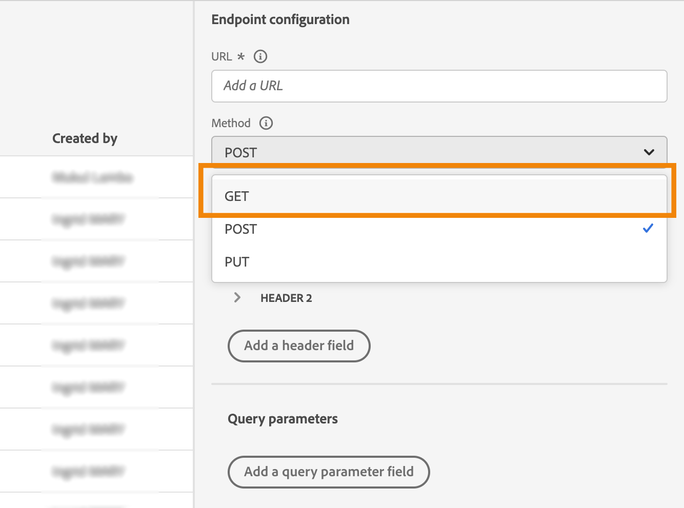
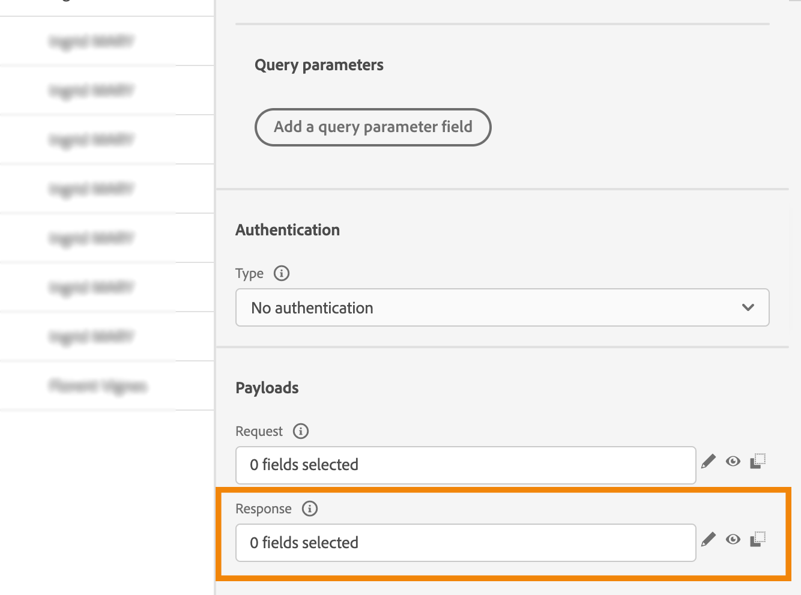
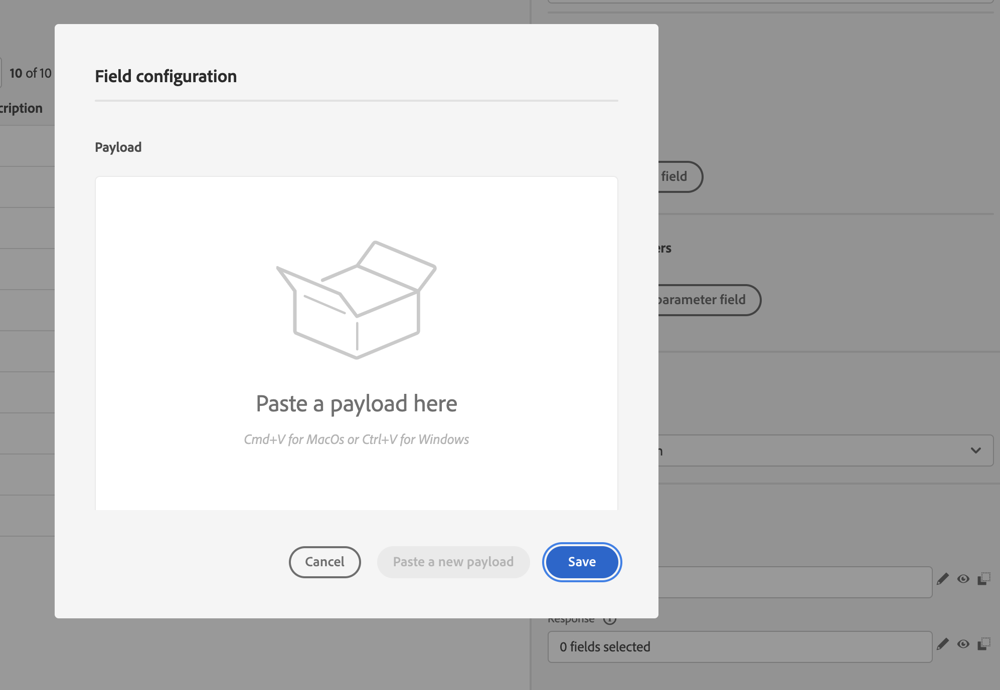
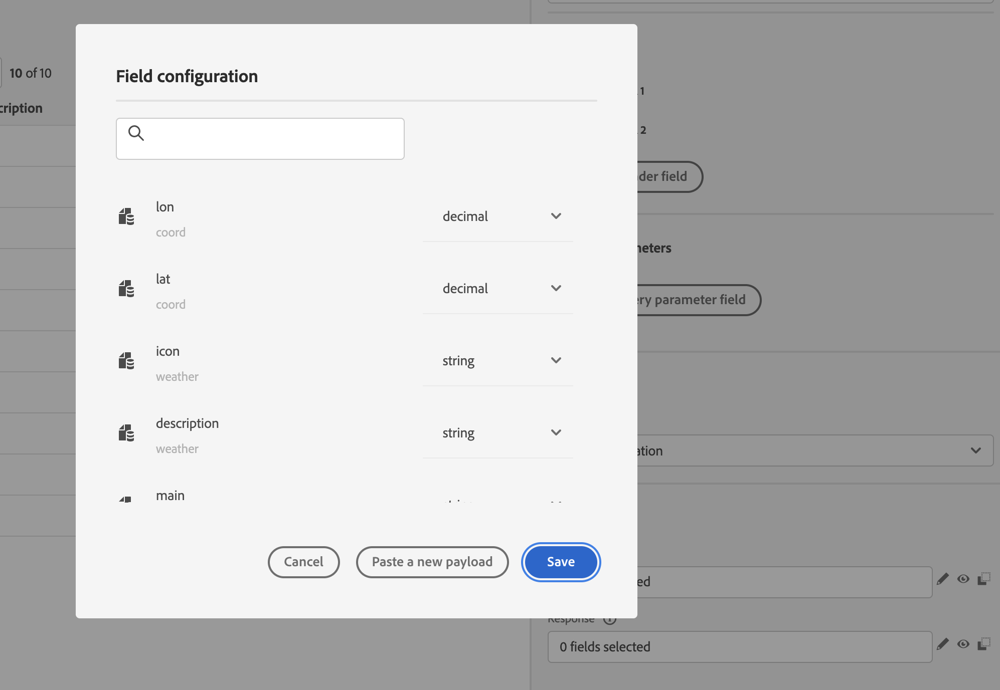
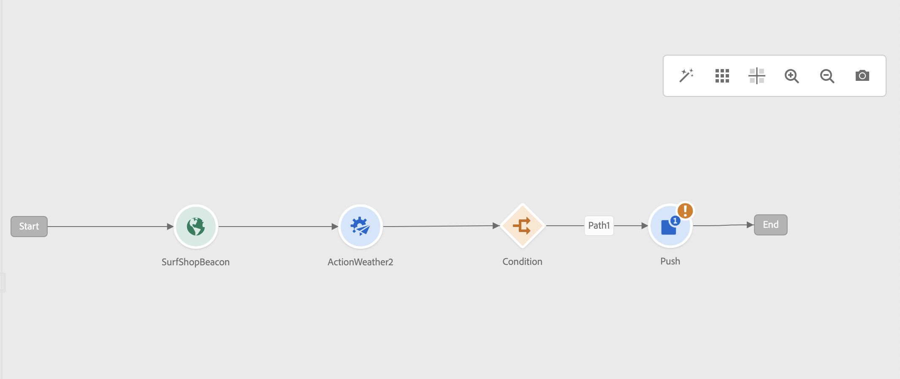
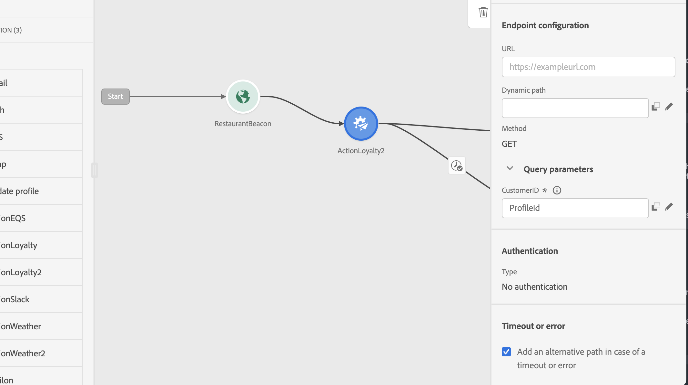
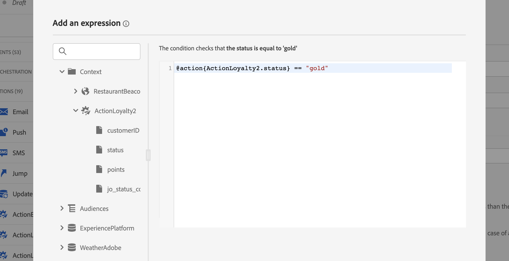
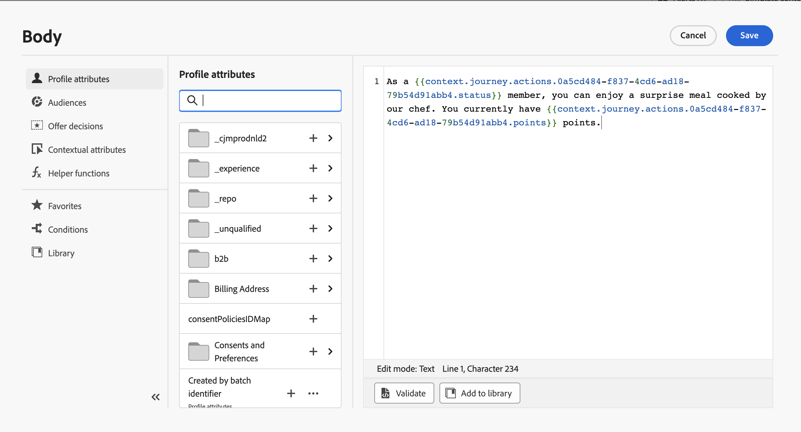
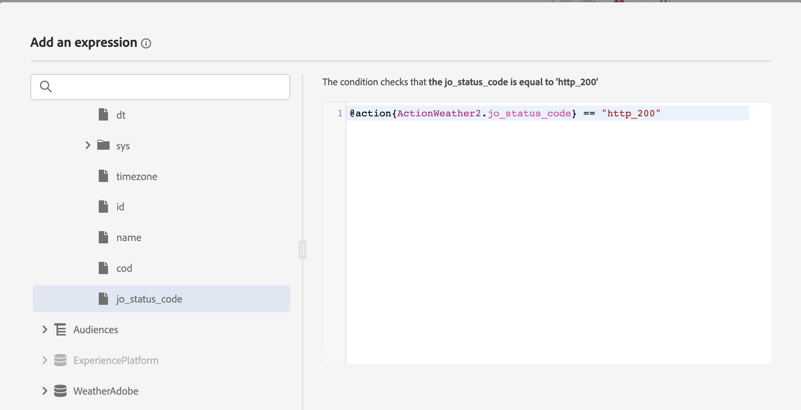
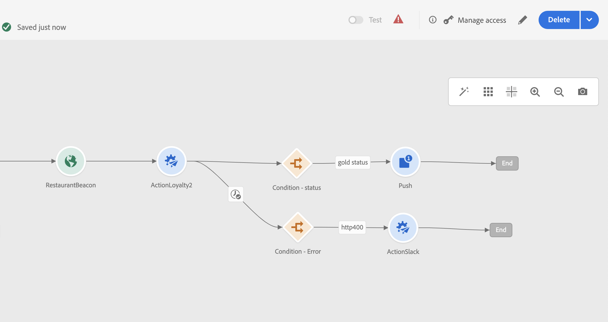

# Custom action enhancements {#custom-action-enhancements}

You can now leverage API call responses in custom actions and orchestrate your journeys based on these responses.

This capability was previously only available when using data sources. You can now use it with custom actions. 

>[!AVAILABILITY]
>
>This feature is currently available as a private beta.

>[!WARNING]
>
>Custom actions should only be used with private or internal endpoints, and used with an appropriate capping or throttling limit. See [this page](../configuration/external-systems.md).

## Define the custom action {#define-custom-action}

When defining the custom action, two enhancements have been made available: the addition of the GET method and the new payload response field. The other options and parameters are unchanged. See [this page](../action/about-custom-action-configuration.md).

### Endpoint configuration {#endpoint-configuration}

The **URL configuration** section has been renamed **Endpoint configuration**.

In the **Method** drop-down, you can now select **GET**.

{width="70%" align="left"}

### Payloads {#payloads-new}

The **Action parameters** section has been renamed **Payloads**. Two fields are available:

* The **Request** field: this field is only available for POST and PUT calling methods.
* The **Response** field: this is the new capability. This field as available for all calling methods.

>[!NOTE]
> 
>Both these fields are optional.

{width="70%" align="left"}

1. Click inside the **Response** field. 

    {width="80%" align="left"}

1. Paste an example of the payload returned by the call. Verify that the field types are correct (string, integer, etc.). Here is an example of response payload captured during the call. Our local endpoint sends the number of loyalty points and the status of a profile. 

    ```
    {
    "customerID" : "xY12hye",    
    "status":"gold",
    "points": 1290 }
    ```

    {width="80%" align="left"}

    Each time the API is called, the system will retrieve all the fields included in the payload example.

1. Let's also add the customerID as a query parameter.

    {width="80%" align="left"}

1. Click **Save**.

## Leverage the response in a journey {#response-in-journey}

Simply add the custom action to a journey. You can then leverage the response payload fields in conditions, other actions and message personalization.

For example, you can add a condition to check the number of loyalty points. When the person enters the restaurant, your local endpoint sends a call with the profile's loyalty information. You can send a push if the profile is a gold customer. And if an error is detected in the call, send a custom action to notify your system administrator.



1. Add your event and the Loyalty custom action created earlier. 

1. In the Loyalty custom action, map the customer ID query parameter with the profile ID. Check the option **Add an alternative path in case of a timeout or error**.

    

1. In the first branch, add a condition and use the advanced editor to leverage the action response fields, under the **Context** node.

    

1. Then add your push, and personalize your message using the response fields. In our example, we personalize the content using the number of loyalty points and the customer status. The action response fields are available under **Contextual attributes** > **Journey Orchestration** > **Actions**.

    

    >[!NOTE]
    >
    >Each profile entering the custom action will trigger a call. Even if the response is always the same, Journey will still perform one call per profile.

1. In the timeout and error branch, add a condition and leverage the built-in **jo_status_code** field. In our example, we're using the 
**http_400** error type. See [this section](#error-status).

    ```
    @action{ActionLoyalty.jo_status_code} == "http_400"
    ```

    

1. Add a custom action that will be sent to your organization.

    

## Error status {#error-status}

The **jo_status_code** field is always available even when no response payload is defined.

Here are the possible values for this field: 

* http status code: http_`<HTTP API call returned code>`, for instance http_200 or http_400
* timeout error: **timedout**
* capping error: **capped**
* internal error: **internalError**

An action call is considered in error when the returned http code is greater than 2xx or if an error occurs. The journey flows to the dedicated timeout or error branch in such cases.

>[!WARNING]
>
>Only newly created custom actions include the **jo_status_code** field out-of-the-box. If you want to use it with an existing custom action, you need to update the action. For example, you can update the description and save.

## Expression syntax {#exp-syntax}

Here is the syntax:

```json
#@action{myAction.myField} 
```

Here are a few examples:

```json
 // action response field
 @action{<action name>.<path to the field>}
 @action{ActionLoyalty.status}
```

```json
 // action response field
 @action{<action name>.<path to the field>, defaultValue: <default value expression>}
 @action{ActionLoyalty.points, defaultValue: 0}
 @action{ActionLoyalty.points, defaultValue: @{myEvent.newPoints}}
```

For more information on field references, see [this section](../building-journeys/expression/field-references.md).
