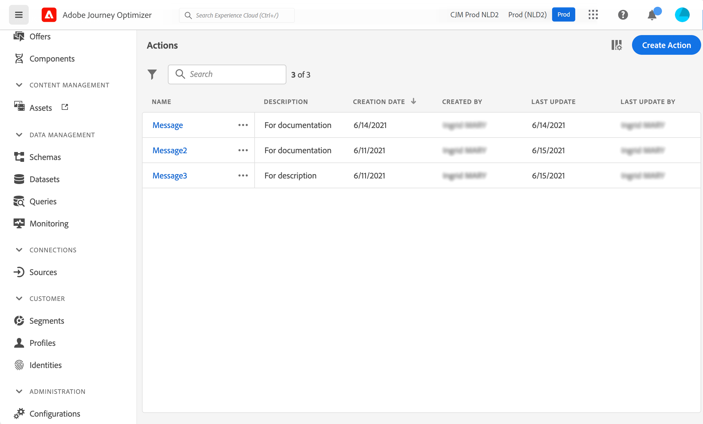

# About actions {#about_actions}

>[!CONTEXTUALHELP]
>id="ajo_journey_action_list"
>title="About actions"
>abstract="This is where you define the connection to the system that will send messages. The actions defined here will then be available in the left palette of your journey, in the Action category."

Actions are connections through which you deliver personalized, real-time experiences to customers such as push notifications, email, or any other means of digital engagement you use in your business.

➡️ [Discover this feature in video](#video)

[!DNL Journey Optimizer] comes with built-in message capability. Refer to 

If you have Adobe Campaign v7 or v8, an integration is available upon request. Refer to [this page](../action/acc-action.md).

If you're using a third-party system to send messages such as Epsilon, Facebook, [Adobe Developer](https://developer.adobe.com){target="_blank"}, Firebase, etc, you need to add and configure a custom action. Refer to [this page](../action/about-custom-action-configuration.md).

Custom actions enable you to configure connection of a third-party system to send messages or API calls. An action can be configured with any service from any provider that can be called through a REST API with a JSON-formatted payload.

>[!CAUTION]
>
>The configuration of custom actions must be performed by a **technical user**.

The actions are available in the left palette of your journey, in the **[!UICONTROL Action]** category. See [this page](../building-journeys/about-journey-activities.md#action-activities).

To view the action list or configure a new action, select **[!UICONTROL Configurations]** in the ADMINISTRATION menu section. In the  **[!UICONTROL Actions]** section, click **[!UICONTROL Manage]**. The list of actions is displayed. See [this page](../start/user-interface.md) for more information on the interface.

## How-to video {#video}

Learn how to configure custom actions.

>[!VIDEO](https://video.tv.adobe.com/v/334257?quality=12)
