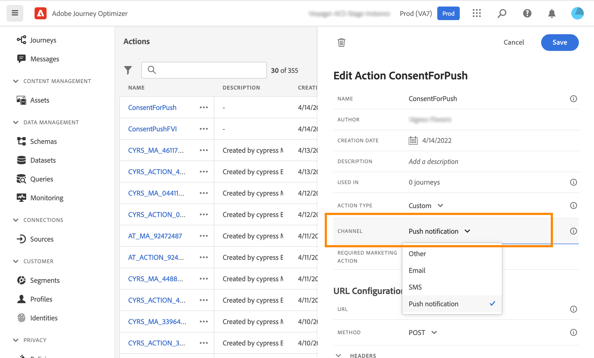
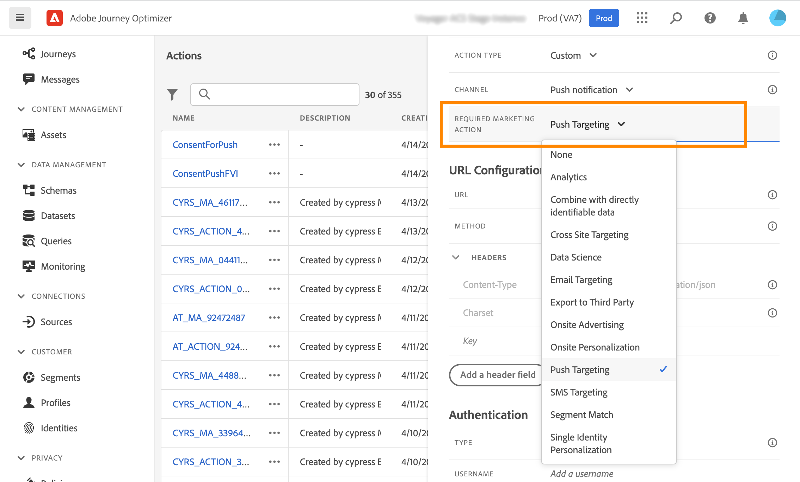
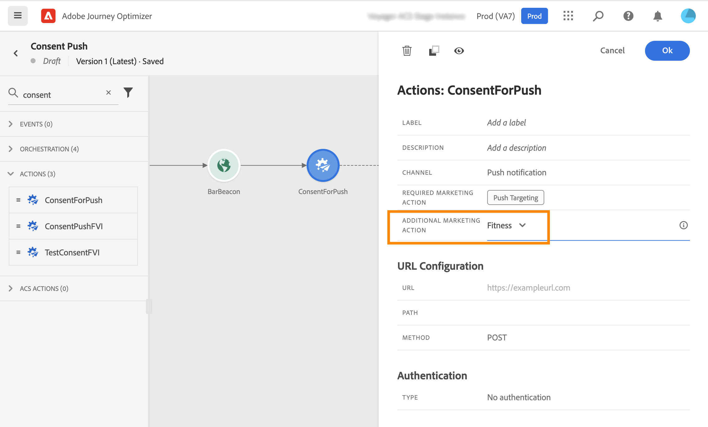

# Work with consent policies {#consent-management}

Adobe Experience Platform allows you to easily adopt and enforce marketing policies to respect the consent preferences of your customers. Consent policies are defined in Adobe Experience Platform. Refer to [this documentation](https://experienceleague.adobe.com/docs/experience-platform/data-governance/policies/user-guide.html#consent-policy).

In Journey Optimizer, you can apply these consent policies to your custom actions. For example, you can define consent policies to exclude customers who have not consented to receive email, push or SMS communication. 

>[!NOTE]
>
>Consent policies are currently only available for organizations that have purchased the Healthcare Shield add-on offering.

In Journey Optimizer, consent is defined at several levels:

* when **configuring a custom action**, you can define a channel and marketing action. See this [section](../action/consent.md#consent-custom-action).
* when adding the **custom action in a journey**, you can define an additional marketing action. See this [section](../action/consent.md#consent-journey).

## Important notes {#important-notes}

In Journey Optimizer, consent can be leveraged in custom actions. If you want to use it with the build-in message capabilities, you need to use a condition activity to filter customers in your journey.

With consent management, two journey activities are analyzed: 

* Read segment: the retrieved segment is taken into account.
* Custom action: consent management takes into account the attributes used ([action parameters](../action/about-custom-action-configuration.md#define-the-message-parameters)) as well as the  marketing action(s) defined (required marketing action and additional marketing action).
* Attributes that are part of a field group using the out-of-the-box Union Schema are not supported. These attributes will be hidden from the interface. You need to create another field group using a different schema.
* Consent policies only apply when a marketing action (required or additional) is set at the custom action level. 

All other activities used in a journey are not taken into account. If you start your journey with a Segment qualification, the segment is not taken into account.

In a journey, if a profile is excluded by a consent policy in a custom action, the message is not sent to him, but he continues the journey. The profile does not go to the timeout and error path when using a condition.

Before refreshing policies in a custom action positioned in a journey, make sure your journey has no error. 

<!--
There are two types of latency regarding the use of consent policies:

* **User latency**: the delay from the time a profile changes a consent settings to the moment it is applied in Experience Platform. This can take up to 48h. 
* **Consent policy latency**: the delay from the time a consent policy is created or updated to the moment it is applied. This can take up to 6 hours
-->

## Configuring the custom action {#consent-custom-action}

>[!CONTEXTUALHELP]
>id="ajo_consent_required_marketing_action_admin"
>title="Define a required marketing action"
>abstract="The Required marketing action allows you to define the marketing action related to your custom action. For example, if you use that custom action to send emails, you can select Email targeting. When used in a journey, all consent policies associated with that marketing action will be retrieved and leveraged. This cannot be modified on the canvas." 

When configuring a custom action, two fields can be used for consent management.

The **Channel** field allows you to select the channel related to this custom action: **Email**, **SMS**, or **Push notification**. It will prefill the **Required marketing action** field with the default marketing action for the selected channel. If you select **other**, no marketing action will be defined by default. 

The **Required marketing action** allows you to define the marketing action related to your custom action. For example, if you use that custom action to send emails, you can select **Email targeting**. When used in a journey, all consent policies associated with that marketing action will be retrieved and leveraged. A default marketing action is selected, but you can click the down arrow to select any available marketing actions from the list.

For certain types of important communications, for example a transactional message sent to reset the client's password, you may not want to apply a consent policy. You will then select **None** in the **Required marketing action** field.

The other steps for configuring a custom action are detailed in [this section](../action/about-custom-action-configuration.md#consent-management).  

### Building the journey {#consent-journey}

>[!CONTEXTUALHELP]
>id="ajo_consent_required_marketing_action_canvas"
>title="Required marketing action"
>abstract="A required marketing action is defined while creating a custom action. This required marketing action cannot be removed from the action or modified."

>[!CONTEXTUALHELP]
>id="ajo_consent_additional_marketing_action_canvas"
>title="Additional marketing action"
>abstract="Add another marketing action in addition to the required one. Consent policies related to both marketing actions will be enforced." 

>[!CONTEXTUALHELP]
>id="ajo_consent_refresh_policies_canvas"
>title="Visualize consent policies that will apply at runtime"
>abstract="Marketing actions bring in consent policies that combine action parameters and individual profile consent values to filter out users. Get the latest definition of these policies by clicking the button to refresh." 

When adding the custom action in a journey, several options allow you to manage consent. Click the **Show read-only fields** to display all parameters.

The **Channel** and **Required marketing action**, defined when configuring the custom action, are displayed at the top of the screen. You cannot modify these fields.

You can define an **Additional marketing action** to set the type of custom action. This allows you to define the purpose of the custom action in this journey. In addition to the required marketing action, which is usually specific to a channel, you can define an additional marketing action which will be specific to the custom action in this particular journey. For example: a workout communication, a newsletter, a fitness communication, etc. Both the required marketing action and the additional marketing action will apply.

Click the **Refresh policies** button, at the bottom of the screen, to update and check the list of policies taken into consideration for this custom action. This is for information purpose only, while building a journey. With live journeys, consent policies are retrieved and updated automatically every 6 hours.

<!--
The following data is taken into account for consent:

* marketing actions and additional marketing actions defined in the custom action
* action parameters defined in the custom action, see this [section](../action/about-custom-action-configuration.md#define-the-message-parameters) 
* attributes used as criteria in a segment when the journey starts with a Read segment, see this [section](../building-journeys/read-segment.md) 

>[!NOTE]
>
>Please note that there can be a latency when updating the list of policies applied, refer to this [this section](../action/consent.md#important-notes).
-->

The other steps for configuring a custom action in a journey are detailed in [this section](../building-journeys/using-custom-actions.md).
