# Attribute-based access control {#attribute-based-access}

>[!IMPORTANT]
>
>The use of Attribute-based access control is currently available in early access to select users only. If you want to leverage this feature, contact your Adobe account executive.

Attribute-based access control (ABAC) lets you define authorizations to manage data access for specific teams or groups of users. Its purpose is to protect sensitive digital assets from unauthorized users allowing further protection of personal data. 

In Adobe Journey Optimizer, ABAC allows you to protect data and grant specific access to specific field elements including Experience Data Model (XDM) schemas, Profile attributes, and segments.

<!--For a more detailed list of the terminology used with ABAC, refer to Adobe Experience Platform documentation.-->

In this example, we want to add a label to the **Nationality** schema field to restrict unauthorized users from using it. For this to work, you need to perform the following steps:

1. Assign a  **[!UICONTROL Label]** to the **Nationality** schema field in Adobe Experience Platform.

2. Create a new  **[!UICONTROL Role]** and assign it with the corresponding  **[!UICONTROL Label]** for users to be able to access and use the schema field.

3. Use the  **[!UICONTROL Schema field]** in Adobe Journey Optimizer.

## Assign labels to an object in Adobe Experience Platform {#assign-label}

>[!WARNING]
>
>Incorrect label usage can break access to people and trigger policy violations.

**[!UICONTROL Labels]** can be used to assign specific feature areas using Attribute-based access control.
In this example, we want to restrict access to the **Nationality** field. This field will only be accessible to users with the corresponding **[!UICONTROL Label]** to their  **[!UICONTROL Role]**. 

Note that you can also add  **[!UICONTROL Label]** to  **[!UICONTROL Schema]**,  **[!UICONTROL Datasets]** and  **[!UICONTROL Segments]**.

1. Create your **[!UICONTROL Schema]**. For more on this, refer to [this documentation](https://experienceleague.adobe.com/docs/experience-platform/xdm/schema/composition.html?lang=en).

    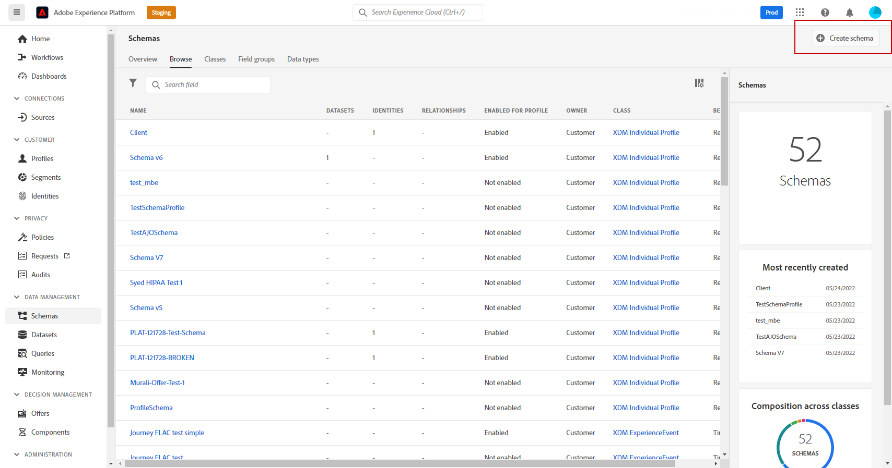

1. In the newly created **[!UICONTROL Schema]**, we first add the **[!UICONTROL Demographic details]** field group that contains the **Nationality** field.

    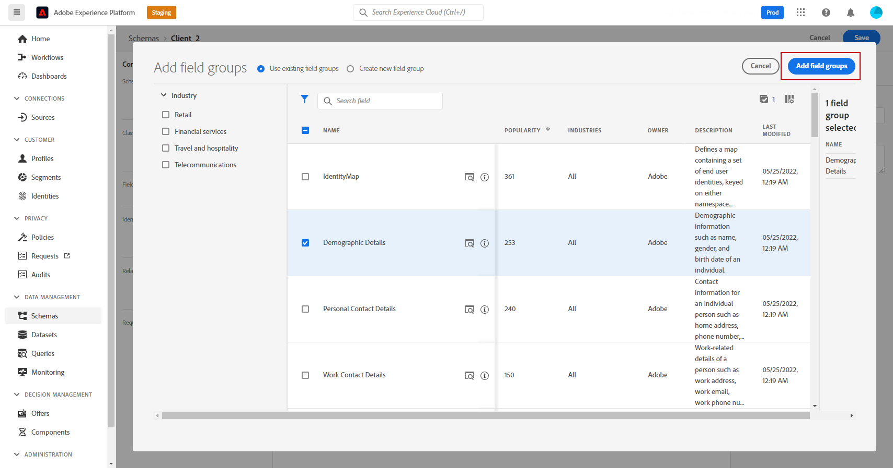

1. From the **[!UICONTROL Labels]** tab, check the restricted field name, here **Nationality**. Then, from the right pane menu, select **[!UICONTROL Edit governance labels]**.

    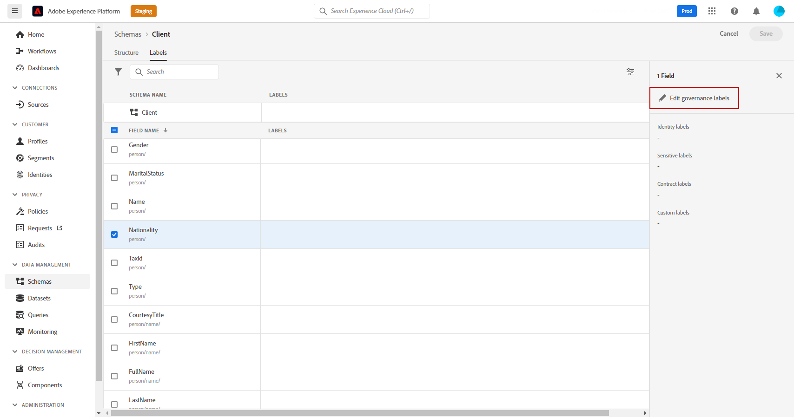

1. Select the corresponding **[!UICONTROL Label]**, in this case, the C2 - Data cannot be exported to a third-party. For the detailed list of available labels, refer to [this page](https://experienceleague.adobe.com/docs/experience-platform/data-governance/labels/reference.html#contract-labels).

    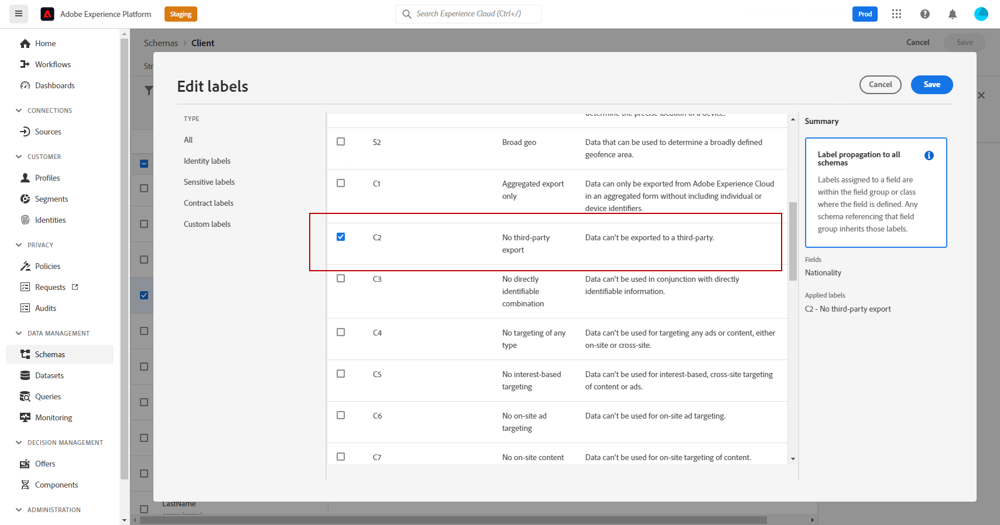

1. Further personalize your schema if needed then enable it. For the detailed steps on how to enable your schema, refer to this [page](https://experienceleague.adobe.com/docs/experience-platform/xdm/ui/resources/schemas.html#profile).

Your schema's field will now be only visible and can now only be used by users which are a part of a role set with the C2 label. 
By applying a **[!UICONTROL Label]** to your **[!UICONTROL Field name]**, note that the **[!UICONTROL Label]** will automatically be applied to the **Nationality** field in every created schema.

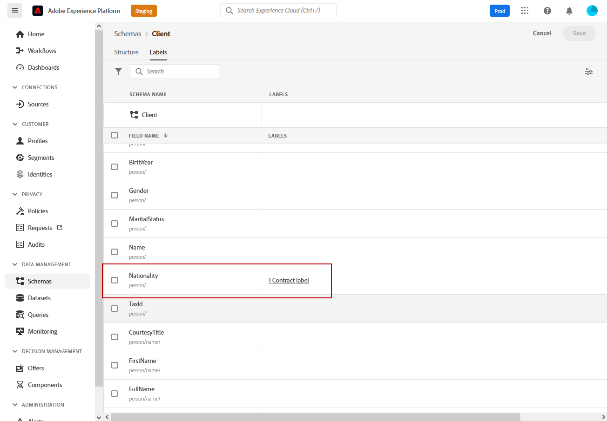

## Create a role and assign labels {#assign-role}

**[!UICONTROL Roles]** are a set of users that share the same permissions, labels and sandboxes within your organization. Each user belonging to a **[!UICONTROL Role]** is entitled with the Adobe apps and services contained in the product.
You can also create your own **[!UICONTROL Roles]** if you want to fine-tune your users’ access to certain functionalities or objects in the interface.

We now want to grant selected users access to the **Nationality** field, labeled C2. To do so, we need to create a new **[!UICONTROL Role]** with a specific set of users and grant them the label C2 allowing them to use the **Nationality** details in a **[!UICONTROL Message]** or **[!UICONTROL Journey]**.

1. From the [!DNL Permissions] product, select **[!UICONTROL Role]** from the left pane menu and click **[!UICONTROL Create role]**. Note that you can also add **[!UICONTROL Label]** to built-in roles.

    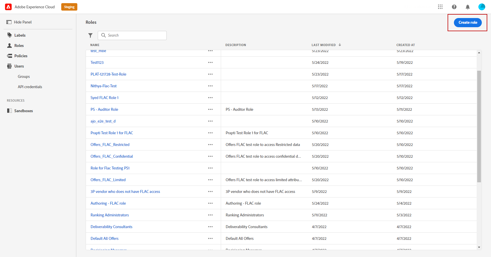

1. Add a **[!UICONTROL Name]** and **[!UICONTROL Description]** to your new **[!UICONTROL Role]**, here: Restricted role demographic.

1. From the drop-down, select your **[!UICONTROL Sandbox]**.

    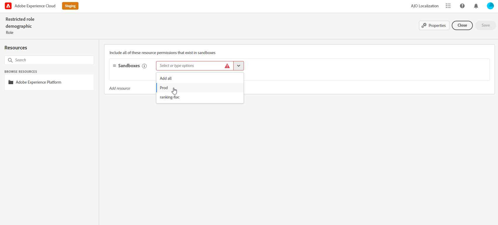

1. From the **[!UICONTROL Resources]** menu, click **[!UICONTROL Adobe Experience Platform]** to open the different capabilities. Here, we select **[!UICONTROL Messages]**.

    

1. From the drop down, select the **[!UICONTROL Permissions]** linked to the selected feature such as **[!UICONTROL View messages]** or **[!UICONTROL Publish journeys]**.

    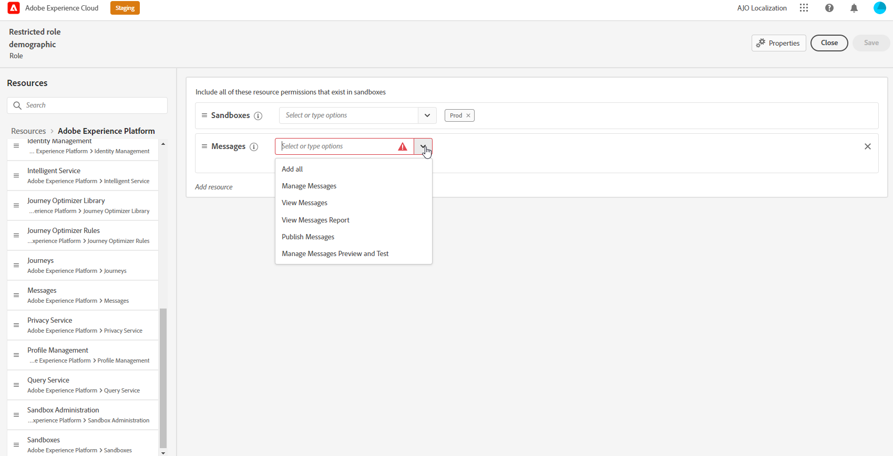

1. After saving your newly created **[!UICONTROL Role]**, click **[!UICONTROL Properties]** to further configure access to your role.

    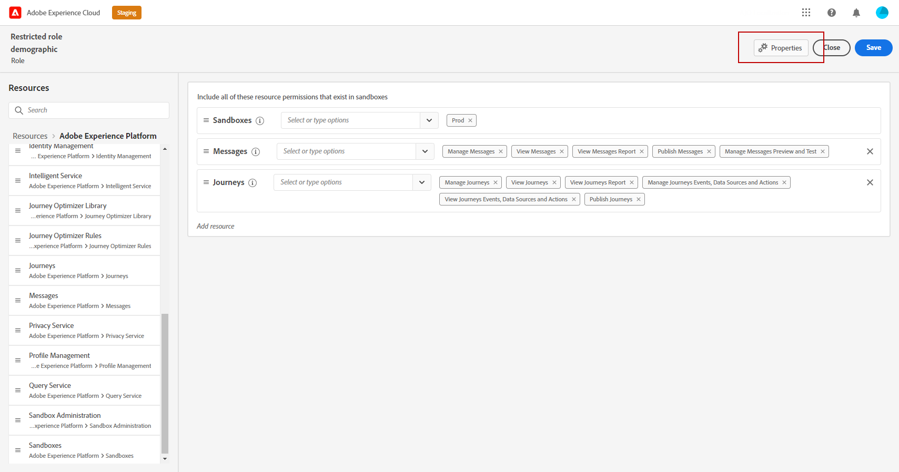

1. From the **[!UICONTROL Users]** tab, click **[!UICONTROL Add users]**.

    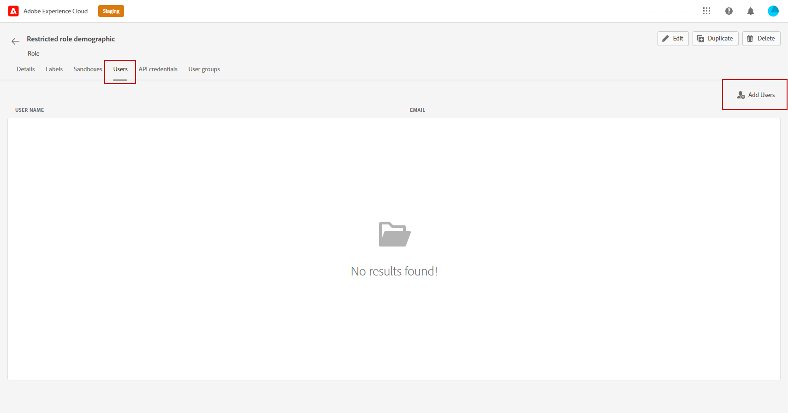

1. From the **[!UICONTROL Labels]** tab, select **[!UICONTROL Add label]**. 

    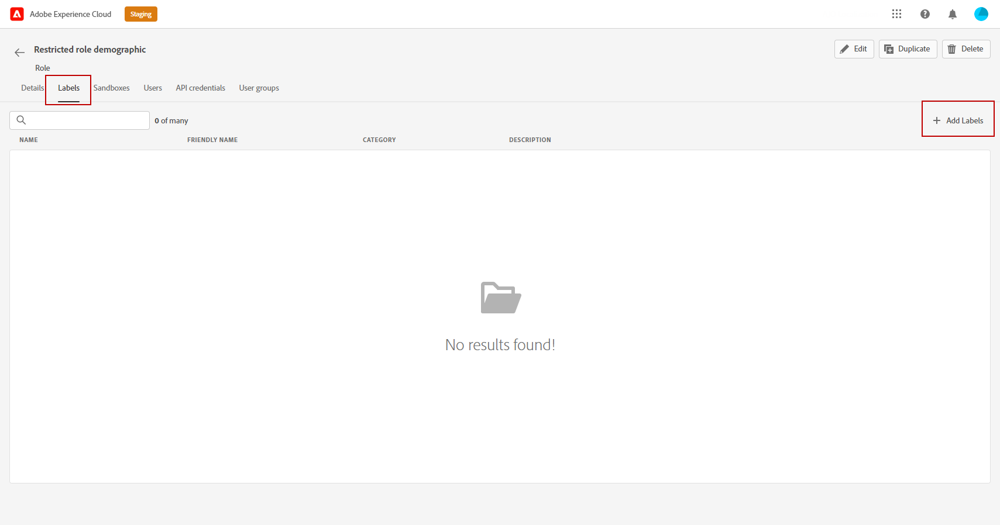

1. Select the **[!UICONTROL Labels]** you want to add to your role and click **[!UICONTROL Save]**. For this example, we grant the label C2 for users to have access to the previously restricted schema's field.

    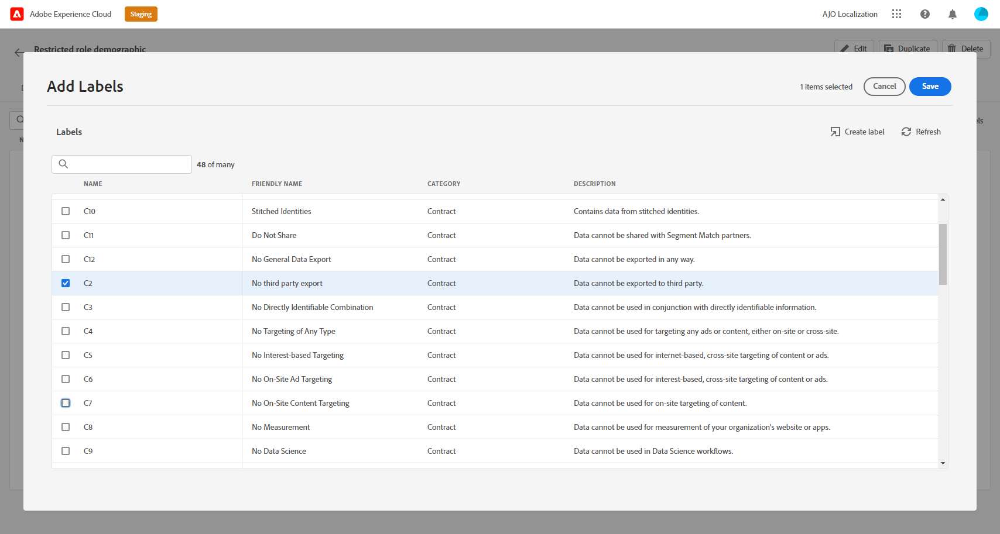

The users in the **Restricted role demographic** role have now access to the C2 labeled objects.

## Access labeled objects in Adobe Journey Optimizer {#attribute-access-ajo}

After labeling our **Nationality** field name in a new schema and our new role, we can now see the impact of this restriction in Adobe Journey Optimizer.
For our example, a first user X with access to objects labeled C2 will create a Journey with a condition targeting the restricted **[!UICONTROL Field name]**. A second user Y without access to objects labeled C2 will then need to publish the Journey.

1. From Adobe Journey Optimizer, you first need to configure the **[!UICONTROL Data source]** with your new schema.

    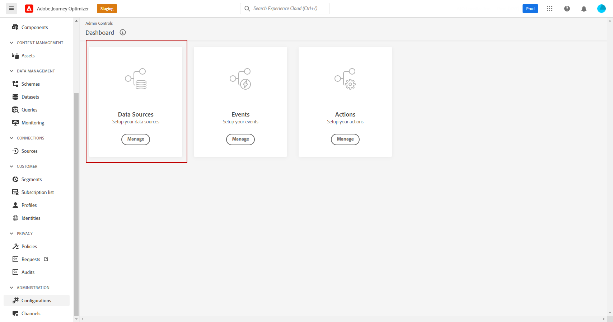

1. Add a new **[!UICONTROL Field group]** of your newly created **[!UICONTROL Schema]** to the built-in **[!UICONTROL Data source]**. You can also create a new external **[!UICONTROLDdata source]** and associated **[!UICONTROL Field groups]**.

    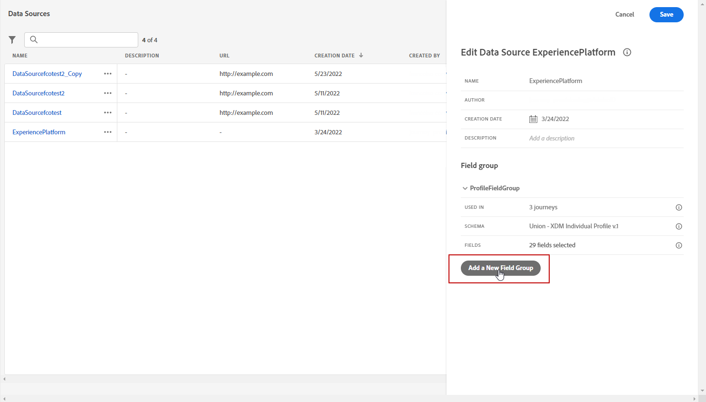

1. After selecting your previously created **[!UICONTROL Schema]**, click **[!UICONTROL Edit]** from the **[!UICONTROL Fields]** category.

    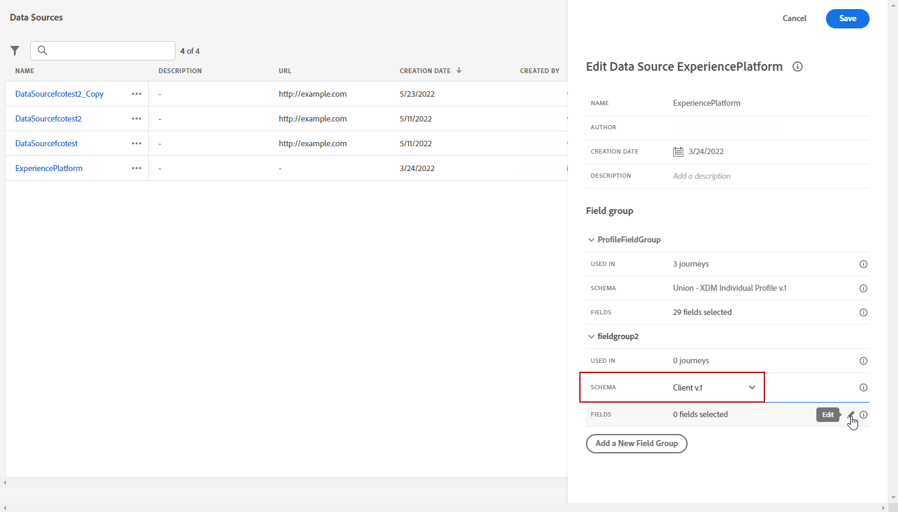

1. Select the **[!UICONTROL Field name]** you want to target. Here we select the restricted **Nationality** field.

    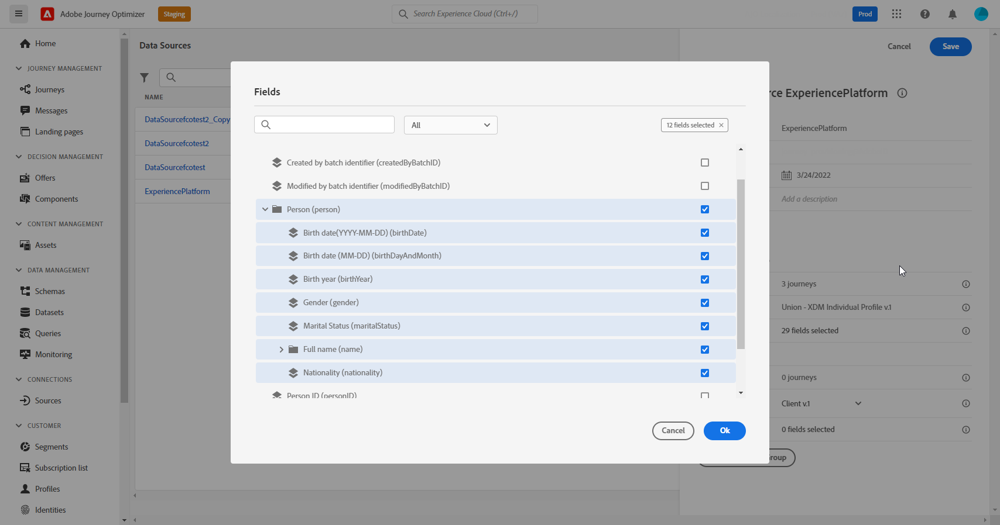

1. Then, create a Journey which will send a message to users with a specific nationality. Add an **[!UICONTROL Event]** then a **[!UICONTROL Condition]**.

    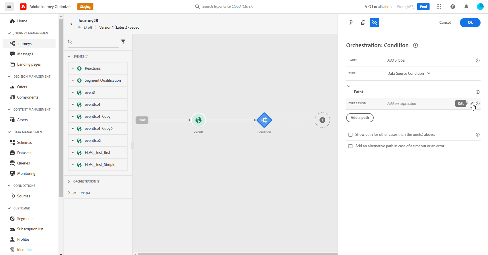

1. Select the restricted **Nationality** field to start building your expression.

    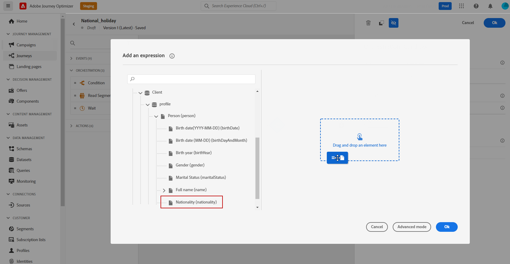

1. Edit your **[!UICONTROL Condition]** to target a specific population with the restricted **Nationality** field. 

    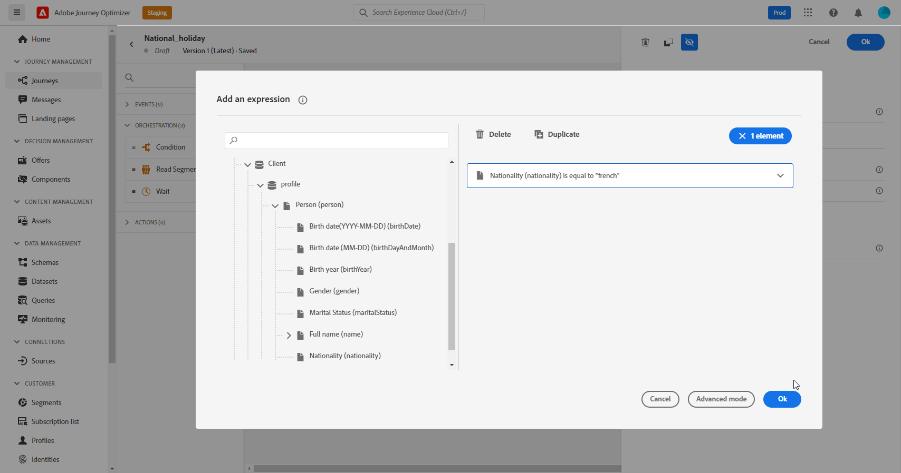

1. Personalize your journey as needed, here we add a **[!UICONTROL Message]** action.

    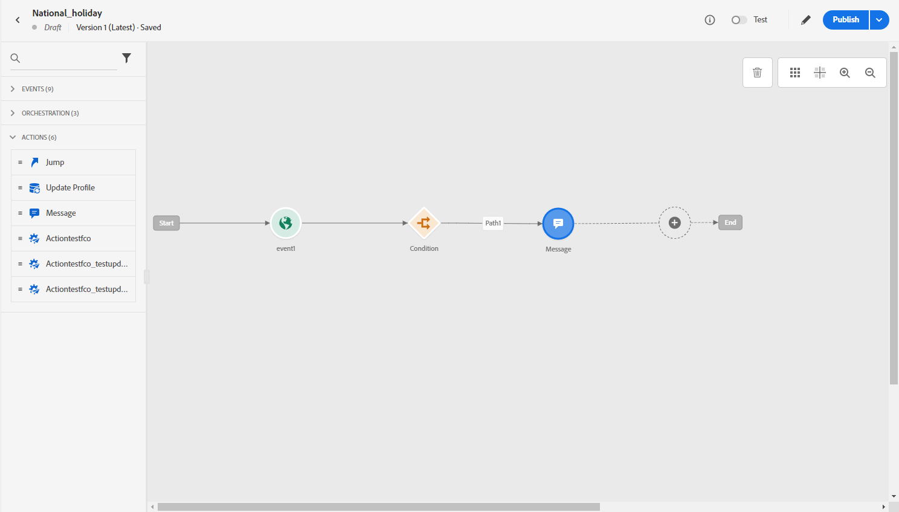

If the User Y without access to label C2 objects needs to access this journey or any messages with this restricted field:

* User Y will not be able to use the restricted Field name since it will not be visible.

* User Y will not be able to edit the Expression with the restricted Field name in Advanced mode. The following error will appear `The expression is invalid. Field is no longer available or you don't have enough permission to see it`.

* User Y can delete the Expression.

* User Y will not be able to test the Journey or Message.

* User Y will not be able to publish the Journey or Message.

