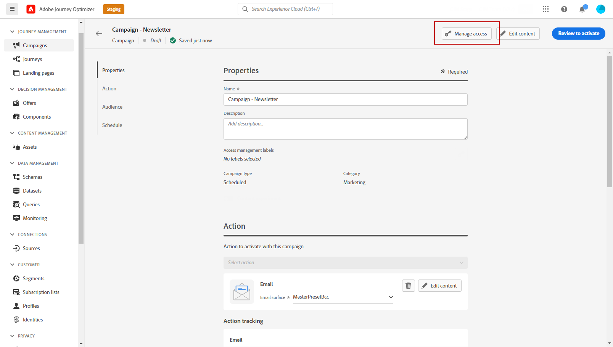
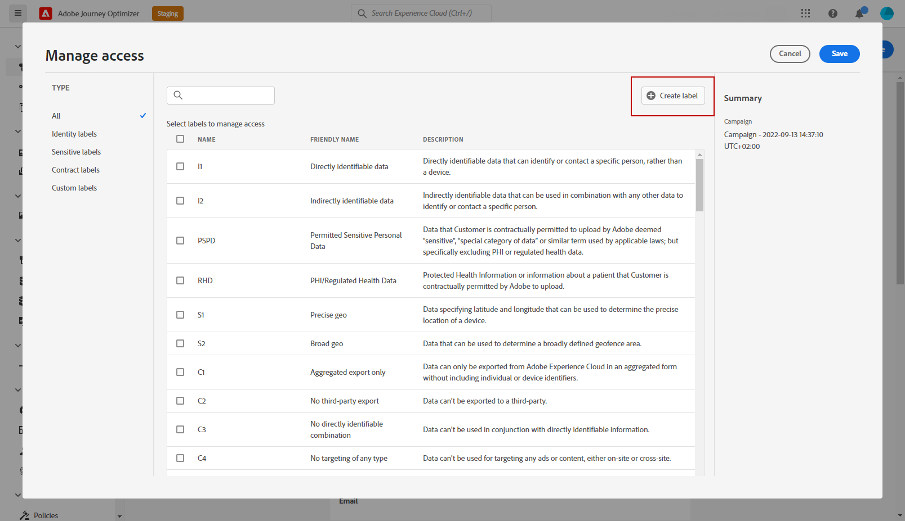
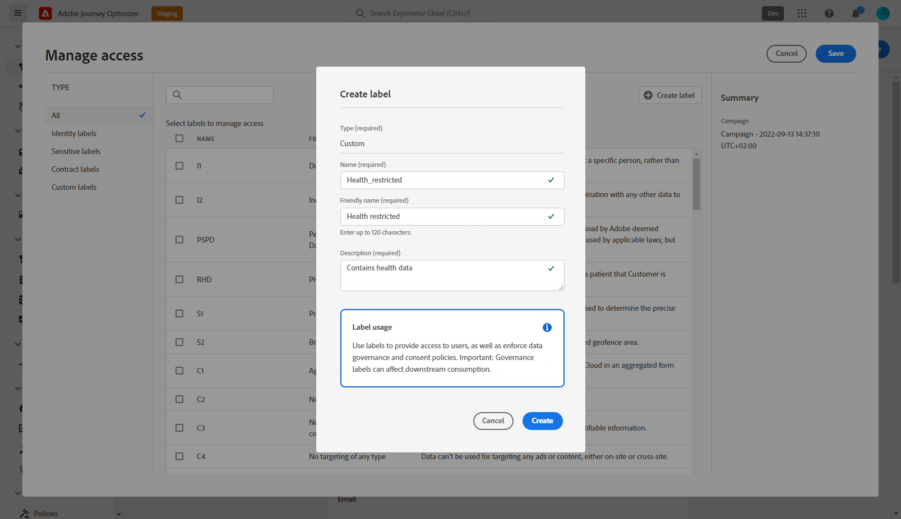
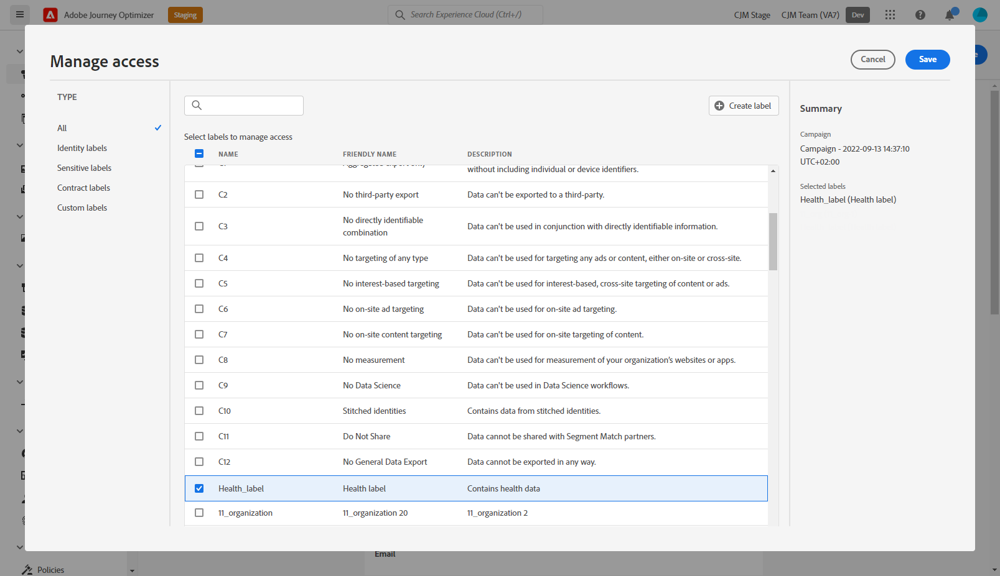

# Object level access control {#object-level-access}

>[!CONTEXTUALHELP]
>id="ajo_olac_manage_access"
>title="Object level access control"
>abstract="If you apply any labels that you don't have access to, then your access to this object will be revoked."

>[!IMPORTANT]
>
>The use of Object level access control is currently restricted to selected customers, and will be deployed to all environments in a future release.

Object level access control (OLAC) lets you define authorizations to manage data access to a selection of objects:

* Journey
* Campaign
* Landing page
* Offers
* Offer collection
* Offer decisioning

Its purpose is to protect sensitive digital assets from unauthorized users allowing further protection of personal data. 

In Adobe Journey Optimizer, OLAC allows you to protect data and grant specific access to specific objects.

## Create labels {#create-assign-labels}

>[!IMPORTANT]
>
>To be able to create labels, you must be part of a role with the **[!UICONTROL Manage usage labels]** permission.

**[!UICONTROL Labels]** allow you to categorize datasets and fields according to usage policies that apply to that data. **[!UICONTROL Labels]** can be applied at any time, providing flexibility in how you choose to govern data. 

You can create labels in the [!DNL Permissions] product. For more on this, refer to [this page](https://experienceleague.adobe.com/docs/experience-platform/access-control/abac/permissions-ui/labels.html). 

**[!UICONTROL Labels]** can also be created directly in Journey Optimizer:

1. From an Adobe Journey Optimizer object, here a newly created **[!UICONTROL Campaign]**, click the **[!UICONTROL Manage access]** button.

    

1. From the **[!UICONTROL Manage access]** window, click **[!UICONTROL Create label]**.

    

1. Configure your label, you must specify:
    * **[!UICONTROL Name]**
    * **[!UICONTROL Friendly name]**
    * **[!UICONTROL Description]**

    

1. Click **[!UICONTROL Create]** to save your **[!UICONTROL Label]**.

Your newly created **[!UICONTROL Label]** is now available in the list. If needed, you can modify it in the [!DNL Permissions] product.

## Assign labels {#assign-labels}

>[!IMPORTANT]
>
>To be able to assign labels, you must be a part of a role with a Manage permission i.e., [!DNL Manage journeys], [!DNL Manage Campaigns] or [!DNL Manage decisions]. Without this permission, the **[!UICONTROL Manage access]** button will be greyed out.

To assign custom or core data usage labels to your Journey Optimizer objects: 

1. From an Adobe Journey Optimizer object, here a newly created **[!UICONTROL Campaign]**, click the **[!UICONTROL Manage access]** button.

    

1. From the **[!UICONTROL Manage access]** window, select your custom or core data usage label(s) to manage access to this object. 

    For more information on core data usage labels, refer to [this page](https://experienceleague.adobe.com/docs/experience-platform/data-governance/labels/reference.html).

    

1. Click **[!UICONTROL Save]** to apply this label restriction. 

To have access to this object, users will need to have the specific **[!UICONTROL Label]** included to their **[!UICONTROL Roles]**. 
For example, a user with the C1 label will only have access to C1 labeled or unlabeled objects.

For more information on how to assign **[!UICONTROL Label]** to a **[!UICONTROL Role]**, refer to [this page](https://experienceleague.adobe.com/docs/experience-platform/access-control/abac/permissions-ui/permissions.html?lang=en#manage-labels-for-a-role).
