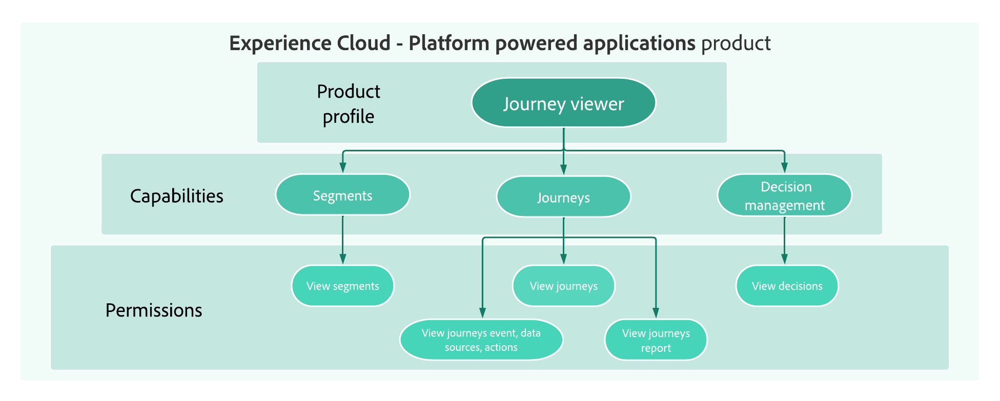

# Get started with user management {#permissions-overview}

[!DNL Journey Optimizer] allows you to define and manage the permissions assigned to different users. Permissions are a set of rights and restrictions that authorize or deny access access to in-product features and capabilities. 

➡️ [Learn more about access control in Adobe Journey Optimizer in this video](#video)

User management in [!DNL Journey Optimizer] is based on three concepts:

* **[!UICONTROL Product profile]**: A set of unitary rights which allows users access to certain functionalities or objects in the interface. Refer to the [Out-of-the-box product profiles](ootb-product-profiles.md) section

* **[!UICONTROL Permissions]**: Unitary rights that allow you to define the authorizations assigned to **[!UICONTROL Product profile]**. Each permission is gathered under capabilities, e.g. Journey or Offers, which represents the different functionalities or objects in [!DNL Journey Optimizer]. Refer to the [Permission levels](high-low-permissions.md) section.

* **[!UICONTROL Sandbox]**: Virtual sandboxes that partition instances into separate, isolated virtual environments. Refer to the [Using sandboxes](sandboxes.md)

Each concept can be managed by **[!UICONTROL Product administrators]** that have access to the Admin console. [Learn more about Adobe Admin Console](https://helpx.adobe.com/enterprise/managing/user-guide.html).

## How-to video{#video}

Learn more about access control system and custom product profiles in Adobe Journey Optimizer. Learn how to manage product profiles and permissions and how to add and manage users.

>[!VIDEO](https://video.tv.adobe.com/v/333998?quality=12)
