# Manage users and roles {#manage-permissions}

>[!IMPORTANT]
>
> Each of the procedures detailed below can only be carried out by a **[!UICONTROL Product]** or **[!UICONTROL System]** administrator. For more information on this, refer to the [Admin console documentation](https://helpx.adobe.com/enterprise/admin-guide.html/enterprise/using/admin-roles.ug.html).

**[!UICONTROL Roles]** refer to a collection of users who share the same permissions and sandboxes. These roles allow you to easily manage access and permissions for different groups of users within your organization.

With the [!DNL Journey Optimizer] product, you have the ability to choose from a range of pre-existing **[!UICONTROL Roles]**, each with varying levels of permissions, to assign to your users. For more information on the available **[!UICONTROL Roles]**, refer to this [page](ootb-product-profiles.md).

When a user belongs to a **[!UICONTROL Role]**, they are granted access to the Adobe apps and services contained within the product.

If the pre-existing roles do not meet your organization's specific needs, you can also create custom **[!UICONTROL Roles]** to fine-tune access to certain functionalities or objects in the interface. This way, you can ensure that each user has access to only the resources and tools that they require to perform their tasks efficiently.

## Assign a role {#assigning-role}

You can choose to assign an out-of-the-box or custom **[!UICONTROL Role]** to your users.

The list of every out-of-the-box roles with assigned permissions can be found in the [Built-in roles](ootb-product-profiles.md) section.

To assign a **[!UICONTROL Role]**:

1. To assign a role to a user in the [!DNL Permissions] product, navigate to the **[!UICONTROL Roles]** tab and select the desired role.

    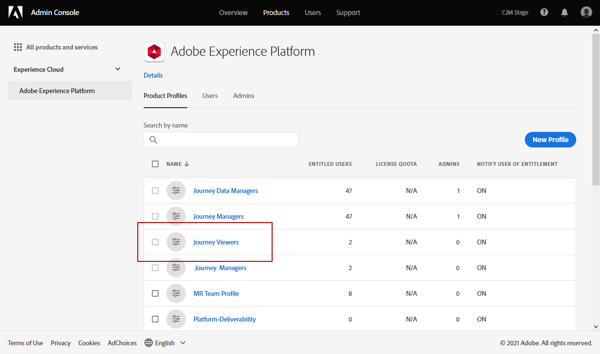

1. From the **[!UICONTROL Users]** tab, click **[!UICONTROL Add user]**.

    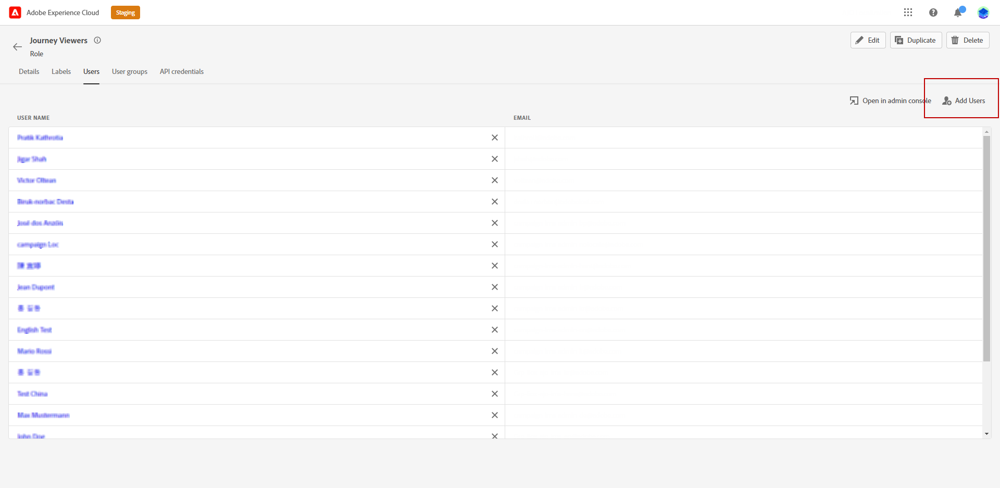

1. Type in your user's name or email address or select the user fom the list and click **[!UICONTROL Save]**.

   If the user was not previously created in the [!DNL Admin Console], refer to the [Add users documentation](https://helpx.adobe.com/enterprise/admin-guide.html/enterprise/using/manage-users-individually.ug.html#add-users).

    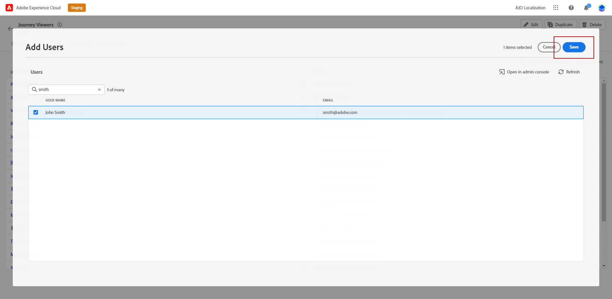

Your user should then receive an email redirecting to your instance.

For more information on users management, refer to the [Admin Console documentation](https://helpx.adobe.com/enterprise/admin-guide.html/enterprise/using/manage-users-individually.ug.html).

When accessing the instance, your user will see a specific view depending on the assigned permissions in the **[!UICONTROL Role]**. If the user does not have the right access to a feature, the following message will appear: 

`You don't have permission to access this feature. Permission needed: XX.`

## Edit an existing role {#edit-product-profile}

For out-of-the-box or custom **[!UICONTROL Roles]**, you can decide at any time to add or delete permissions.

In this example, we want to add **[!UICONTROL Permissions]** related to the **[!UICONTROL Journeys]** resource for users assigned to the Journey viewer **[!UICONTROL Role]**. The users will then be able to publish journeys.

Note that if you modify an out-of-the-box or custom **[!UICONTROL Role]**, it will impact every user assigned to this **[!UICONTROL Role]**.

1. To assign a role to a user in the [!DNL Permissions] product, navigate to the **[!UICONTROL Roles]** tab and select the desired role, here the Journey viewer **[!UICONTROL Role]**.
    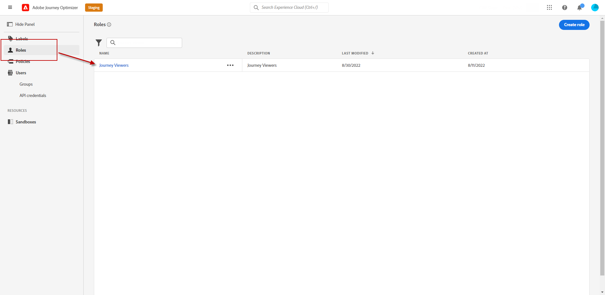

1. From your **[!UICONTROL Role]** dashboard, click **[!UICONTROL Edit]**.

    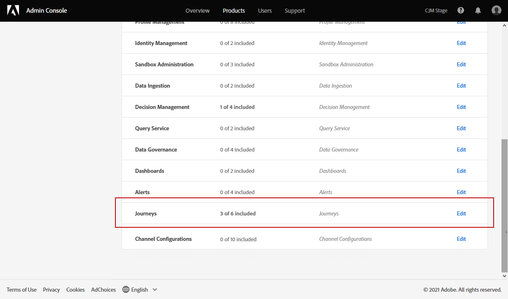

1. The **[!UICONTROL Resources]** menu displays the list of resources that apply to the **[!UICONTROL Experience Cloud - Platform powered applications]** product. Drag and drop resources to assign permission.

    From the **[!UICONTROL Journeys]** resource drop-down, we choose here the Publish journey **[!UICONTROL Permission]**.

    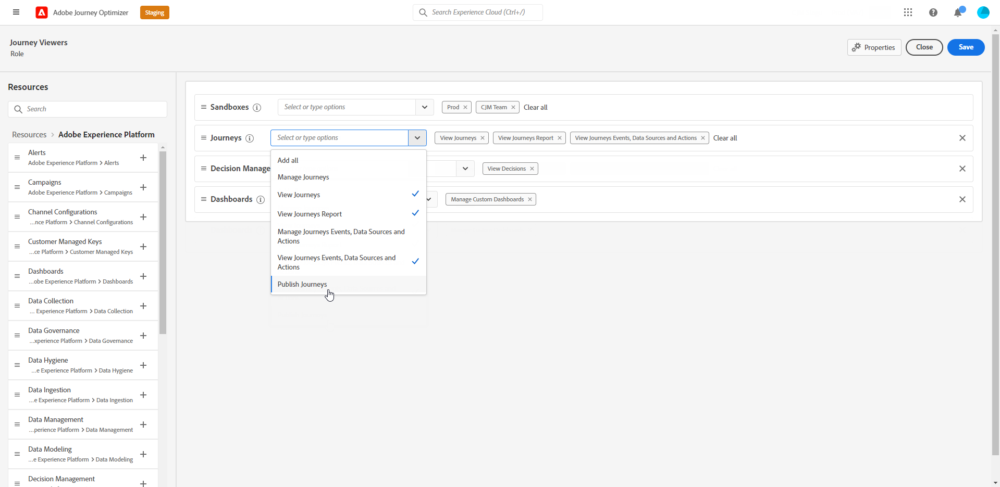

1. If needed, under **[!UICONTROL Included Permission Items]**, click the X icon next to remove permissions or resources to your role.

1. When finished, click **[!UICONTROL Save]**.

If needed, you can also create new role with specific permissions. For more on this, refer to [Create a new role](#create-product-profile).

## Create a new role {#create-product-profile}

[!DNL Journey Optimizer] allows you to create your own **[!UICONTROL Roles]** and assign a set of permissions and sandboxes to your users. With **[!UICONTROL Roles]**, you can authorize or deny access to certain functionalities or objects in the interface.

For more information on how to create and manage sandboxes, refer to [Adobe Experience Platform documentation](https://experienceleague.adobe.com/docs/experience-platform/sandbox/ui/user-guide.html){target="_blank"}.

In this example, we will create a role named **Journeys read-only** where we will grant read-only rights to the Journey feature. Users will only be able to access and view journeys and will not be able to access other features such as **[!DNL  Decision management]** in [!DNL Journey Optimizer].

To create our **Journeys read-only** **[!UICONTROL Role]**:

1. To assign a role to a user in the [!DNL Permissions] product, navigate to the **[!UICONTROL Roles]** tab and click **[!UICONTROL Create role]**.

    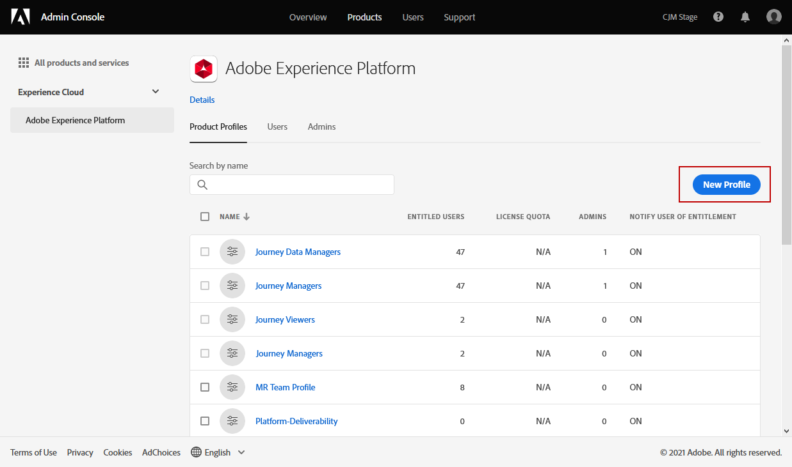

1. Add a **[!UICONTROL Name]** and **[!UICONTROL Description]** for your new **[!UICONTROL Role]**. Then, click **[!UICONTROL Confirm]**.

    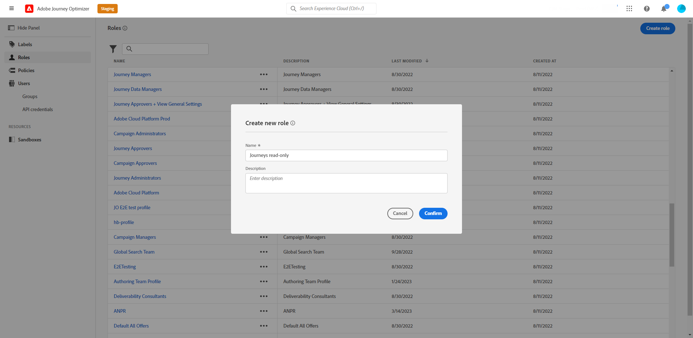

1. From the **[!UICONTROL Sandbox]** resource drop-down, choose which sandbox(es) to assign to your **[!UICONTROL Role]**. [Learn more about sandboxes](sandboxes.md).

    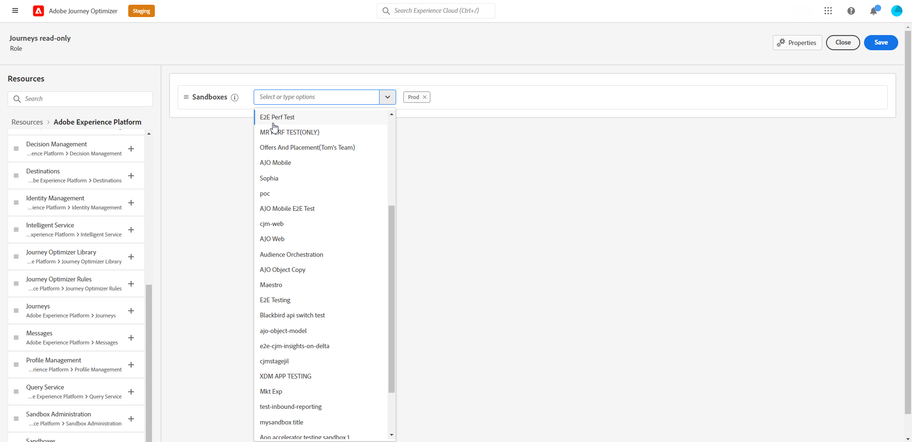

1. Select between the different resources such as **[!DNL Journeys]**, **[!DNL Segments]** or **[!DNL Decision management]** available in [!DNL Journey Optimizer] listed in the left-hand menu. 
    
    Here we select the **[!UICONTROL Journeys]** resource.

    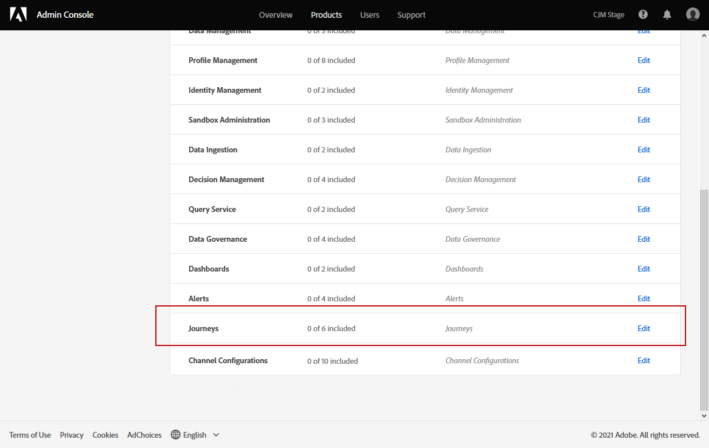

1. From the **[!UICONTROL Journeys]** drop-down, select the permissions to assign to your **[!UICONTROL Role]**.

    Here we select **[!DNL View journeys]**, **[!DNL View journeys report]**  and **[!DNL View journeys event, data sources, actions]**.

    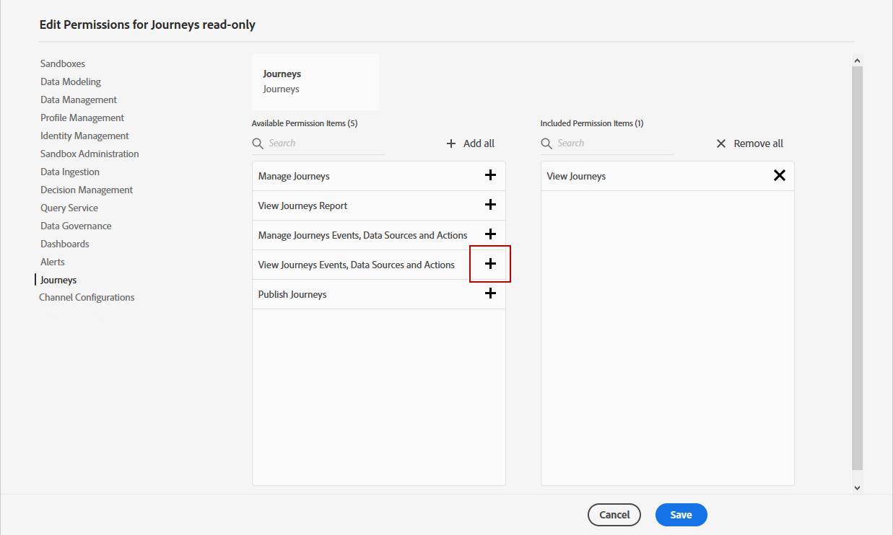

1. When finished, click **[!UICONTROL Save]**.

Your **[!UICONTROL Role]** is now created and configured. You now need to assign it to users.

For more information on role creation and management, refer to the [Admin Console documentation](https://experienceleague.adobe.com/docs/experience-platform/access-control/abac/permissions-ui/roles.html?lang=en).