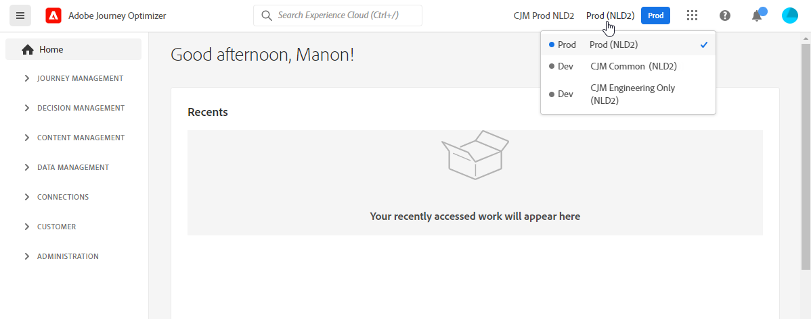
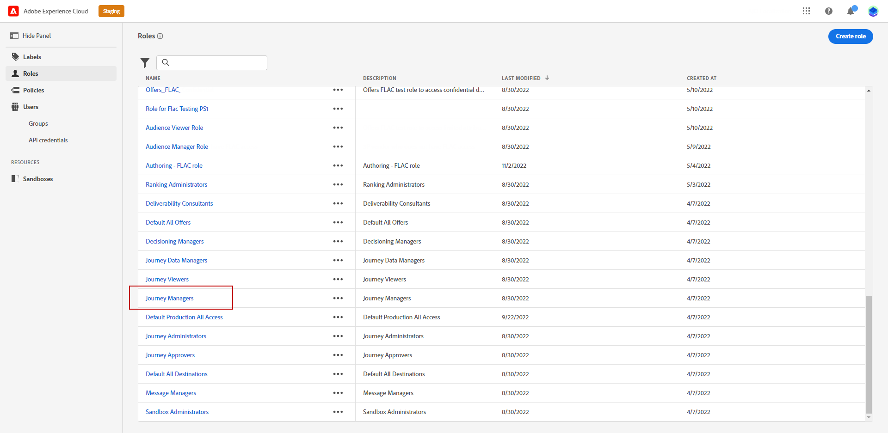
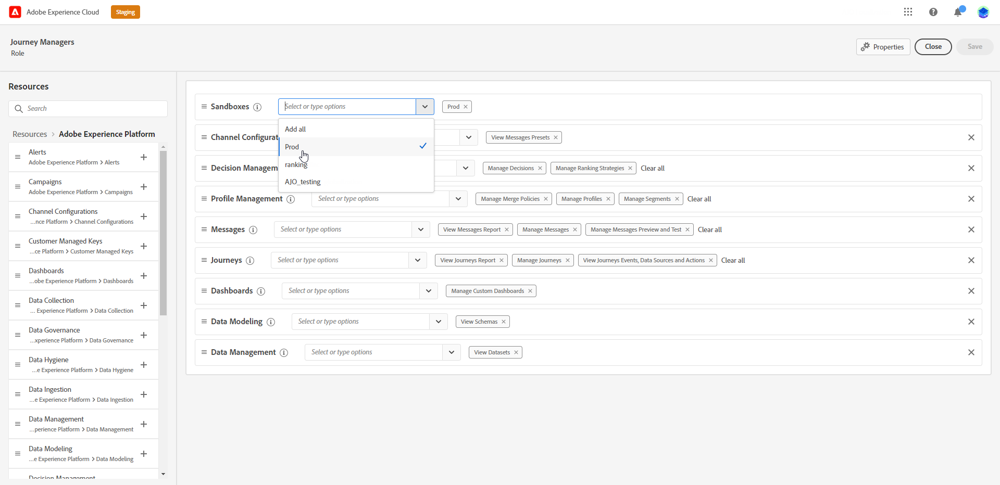
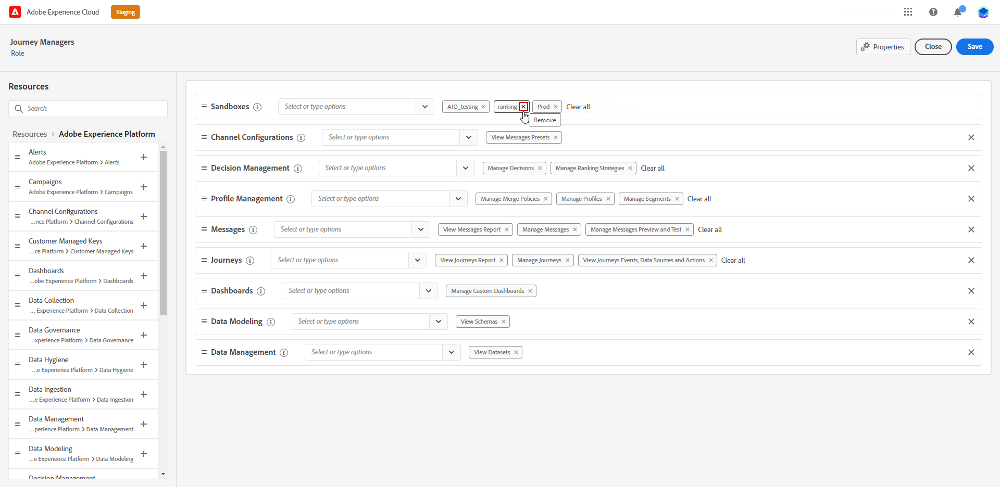
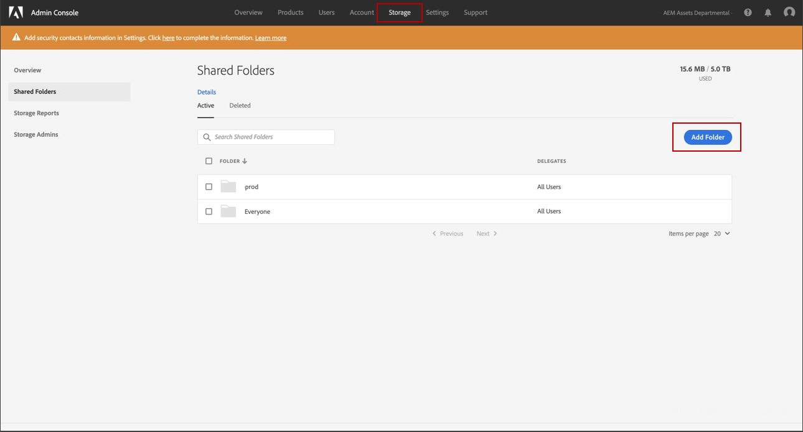

# Sandboxes management {#sandboxes}

## Use sandboxes {#using-sandbox}

[!DNL Journey Optimizer] allows you to partition your instance into separated virtual environments called sandboxes.
Sandboxes are assigned through roles in Permissions. [Learn how to assign sandboxes](permissions.md#create-product-profile).

[!DNL Journey Optimizer] reflects Adobe Experience Platform sandboxes which were created for a given organization.
Adobe Experience Platform sandboxes can be created or reset from your Adobe Experience Platform instance. [Learn more in the Sandbox user guide](https://experienceleague.adobe.com/docs/experience-platform/sandbox/ui/user-guide.html){target="_blank"}.

You can find the sandbox switcher control at the top-right of your screen next to your Organization's name. To switch from one sandbox to another, click the currently active sandbox in the switcher and select another sandbox from the drop-down list.

➡️ [Learn more on sandboxes in this video](#video)

## Assign sandboxes {#assign-sandboxes}

>[!IMPORTANT]
>
> Sandboxes management can only be carried out by a **[!UICONTROL Product]** or **[!UICONTROL System]** administrator. For more information on this, refer to the [Admin console documentation](https://helpx.adobe.com/enterprise/admin-guide.html/enterprise/using/admin-roles.ug.html){target="_blank"}.

You can choose to assign different sandboxes to out-of-the-box or custom **[!UICONTROL Roles]**.

To assign sandboxes:

1. In [!DNL Permissions], from the **[!UICONTROL Roles]** tab, select a **[!UICONTROL Role]**.
    
    

1. Click **[!UICONTROL Edit]**.

1. From the **[!UICONTROL Sandboxes]** resource drop-down, select the sandbox which will be assigned to your role.

    

1. If needed, click the X icon next to remove sandboxes access to your **[!UICONTROL Role]**.

    

1. Click **[!UICONTROL Save]**.

## Access to Content {#content-access}

To configure your content accessibility, you need to assign a content shared folder to each of your sandboxes. You can create and configure your shared folder in the **[!UICONTROL Storage]** tab displayed in the [!DNL Admin Console] for administrators. If you have access to the [!DNL Admin Console] as a system administrator, you can create shared folders and add delegates with different access level to your shared folders.

Note that for your content to sync with the correct sandbox, you have to follow the same syntax as the sandbox e.g. if your sandbox is called development your shared folder should have the same name.

[Learn how to manage shared folders](https://helpx.adobe.com/enterprise/admin-guide.html/enterprise/using/manage-adobe-storage.ug.html){target="_blank"}.

## How-to video{#video}

Understand what sandboxes are and how to distinguish between development and production sandboxes. Learn how to create, reset, and delete sandboxes.

>[!VIDEO](https://video.tv.adobe.com/v/334355?quality=12)