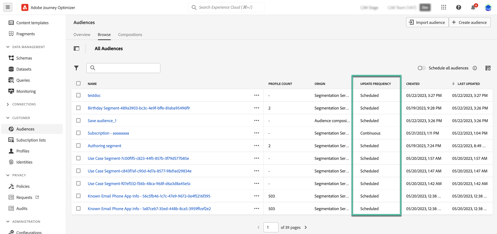

# Get started with Adobe Experience Platform audiences {#about-segments}

>[!CONTEXTUALHELP]
>id="ajo_campaigns_content_experiment_segment"
>title="Audience"
>abstract="By leveraging Real-Time Customer Profile data, Adobe Experience Platform enables you to easily build segment definitions to create targeted audiences that capture the unique behaviors and preferences of your customers."

>[!CONTEXTUALHELP]
>id="ajo_campaigns_audience"
>title="Select the campaign audience"
>abstract="This list displays all available Adobe Experience Platform audiences. Select the audience to target with your campaign. The message configured in the campaign will be sent to all the individuals belonging to the selected audience. [Learn more on audiences](../audience/about-audiences.md)"

[!DNL Journey Optimizer] allows you to build and leverage Adobe Experience Platform audiences using Real-Time Customer Profile data directly from the **[!UICONTROL Audiences]** menu, and use them into your journeys or campaigns.

Learn more in the [Adobe Experience Platform Segmentation Service documentation](https://experienceleague.adobe.com/docs/experience-platform/segmentation/home.html).

## Use audiences in [!DNL Journey Optimizer] {#segments-in-journey-optimizer}

You can leverage audiences in **[!DNL Journey Optimizer]** in different ways:

* Choose an audience for a **campaign**, where the message is sent to all the individuals belonging to the selected audience. [Learn how to define the audience of a campaign](../campaigns/create-campaign.md#define-the-audience-audience).

* Use a **Read audience** orchestration activity in a journey to make all individuals in the audience enter the journey and receive the messages included in your journey.

    Let's say you have a "silver customer" audience. With this activity, you can make all silver customers enter a journey and send them a series of personalized messages. [Learn how to configure a Read audience activity](../building-journeys/read-audience.md#configuring-segment-trigger-activity).

* Use the **Audience qualification** event activity in a journey to make individuals enter or move forward in the journey based on Adobe Experience Platform audience entrances and exits.

    For example, you can make all new silver customers enter a journey and send them messages. For more on how to use this activity, refer to [Learn how to configure an Audience qualification activity](../building-journeys/audience-qualification-events.md).

* Use the **Condition** activity in a journey to build conditions based on audience membership. [Learn how to use audiences in conditions](../building-journeys/condition-activity.md#using-a-segment).

## Audience evaluation methods{#evaluation-method-in-journey-optimizer}

In Adobe Journey Optimizer, audiences are generated from segment definitions using one of two evaluation methods:

* **Streaming segmentation**: The profiles list for the audience is kept up-to-date in real-time as new data flows into the system.

    Streaming segmentation is an ongoing data selection process that updates your audiences in response to user activity. Once a segment definition has been built and the resulting audience has been saved, the segment definition is applied against incoming data to Journey Optimizer. This means that individuals are added or removed from the audience as their profile data changes, ensuring that your target audience is always relevant.

* **Batch segmentation**: The profiles list for the audience is evaluated every 24 hours.

    Batch segmentation is an alternative to streaming segmentation that processes all profile data at once through segment definitions. This creates a snapshot of the audience that can be saved and exported for use. However, unlike streaming segmentation, batch segmentation does not continuously update the audience list in real-time, and new data that comes in after the batch process will not be reflected in the audience until the next batch process."

The determination between batch segmentation and streaming segmentation is made by the system for each audience, based on the complexity and the cost of evaluating the segment definition rule. You can view the evaluation method for each audience in the **[!UICONTROL Evaluation method]** column of the audience list.
    

>[!NOTE]
>
>If the **[!UICONTROL Evaluation method]** column does not display, you  need to add it using configuration button on the top right of the list.

After you have first defined an audience, profiles are added to the audience when they qualify.

Backfilling the audience from prior data can take up to 24&nbsp;hours. After the audience has been backfilled, the audience is continuously kept up-to-date and is always ready for targeting.
