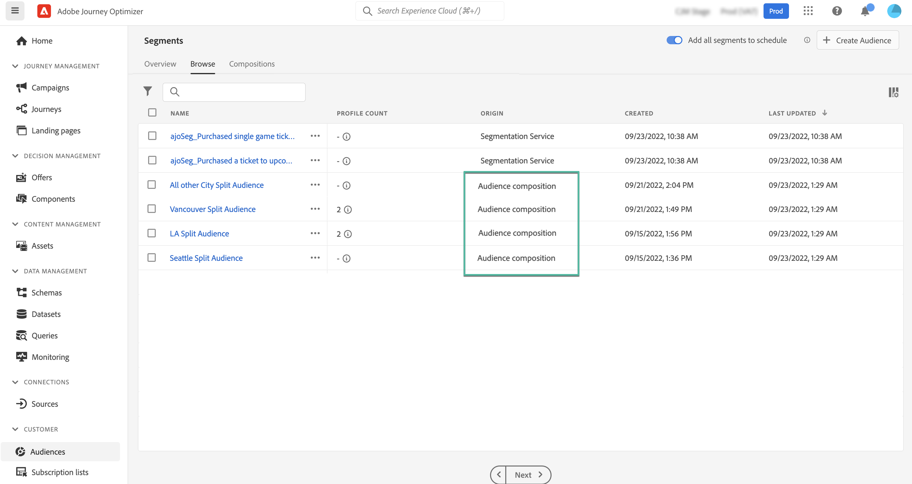

# Access and manage audiences {#access-manage-audiences}

>[!BEGINSHADEBOX]

This documentations provides detailed information on how to work with audience composition within Adobe Journey Optimizer. If you are not using Adobe Journey Optimizer, [click here](https://experienceleague.adobe.com/docs/experience-platform/segmentation/ui/audience-composition.html){target="_blank"}.

>[!ENDSHADEBOX]

Audiences resulting from audience composition are accessible from the **[!UICONTROL Browse]** tab in the **[!UICONTROL Audiences]** menu.

This tab lists all audiences stored into Adobe Experience Platform. Audiences created using audience compositions are identifiable by the **[!UICONTROL Audience composition]** origin.

>[!NOTE]
>
>For more information on other types of audiences available in Adobe Experience Platform, refer to the [Segmentation Service documentation](https://experienceleague.adobe.com/docs/experience-platform/segmentation/ui/overview.html).

The **[!UICONTROL Profile count]** column provides information on the number of profiles included in an audience. Click the "i" button for more information on the date this information has been calculated.

To assign custom or core data usage labels to an audience, click the ellipsis button then select **[!UICONTROL Manage Access]**. [Learn more on Object Level Access Control (OLA)](../administration/object-based-access.md)

<!--
-edit an audience?
-->
