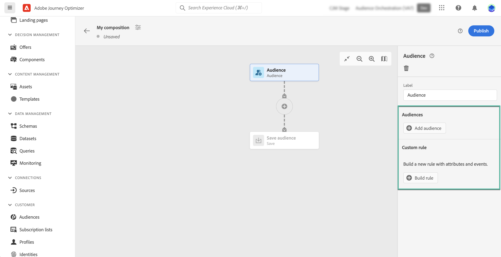
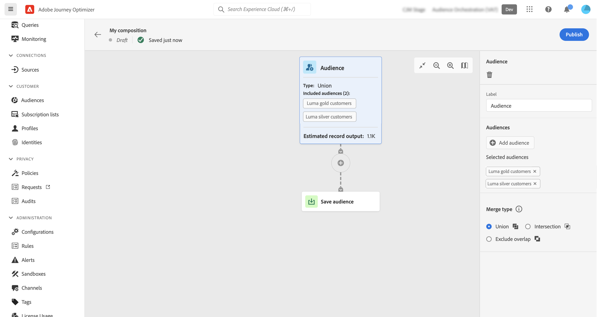
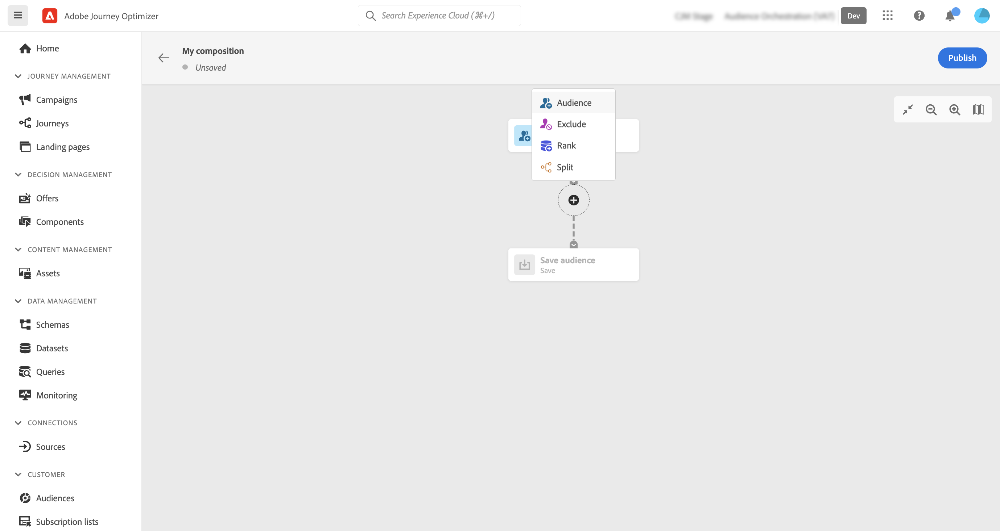
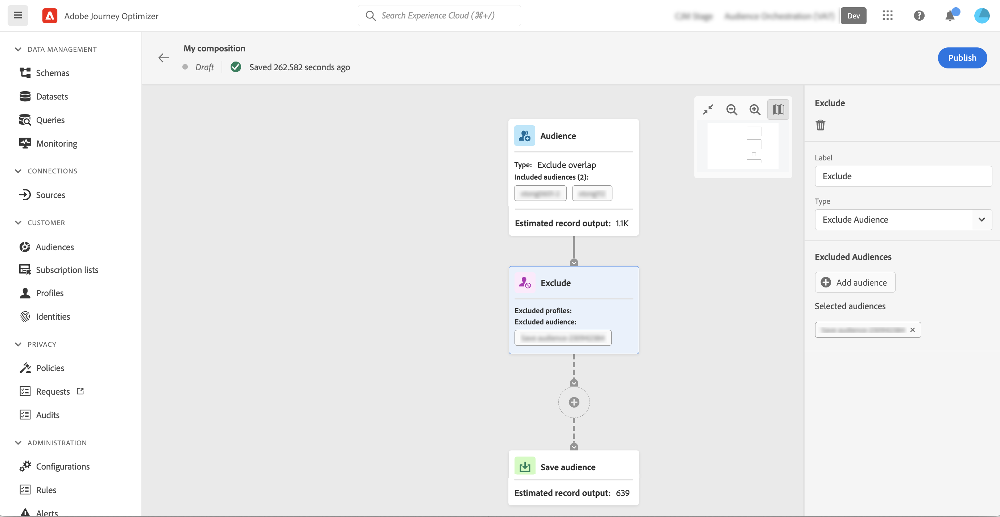
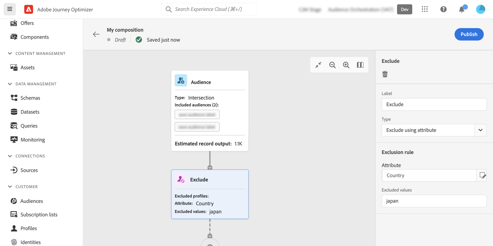
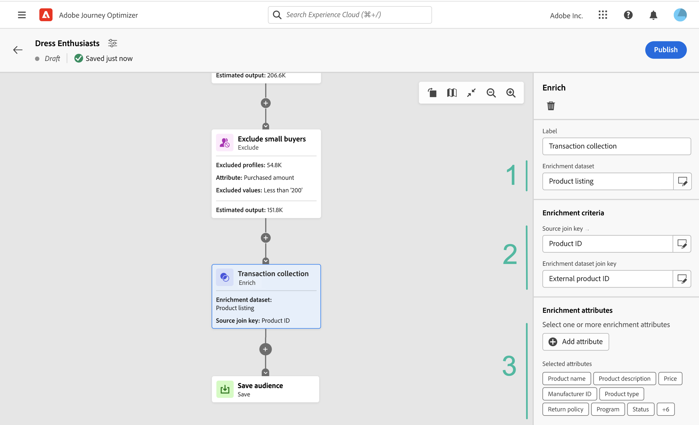
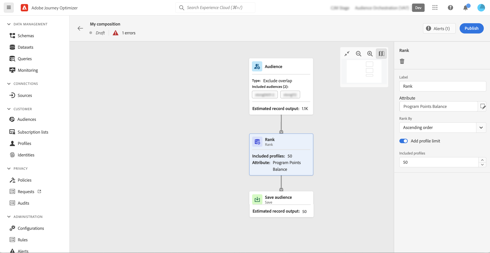
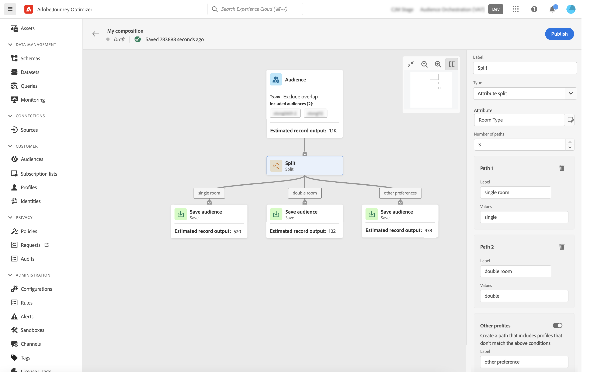
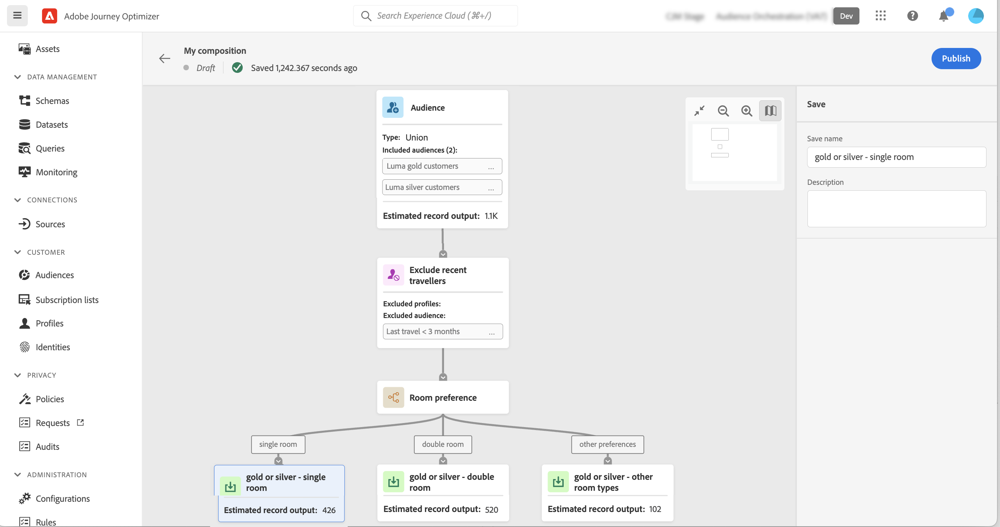

# Work with the composition canvas {#composition-canvas}

>[!BEGINSHADEBOX]

This documentations provides detailed information on how to work with audience composition within Adobe Journey Optimizer. If you are not using Adobe Journey Optimizer, [click here](https://experienceleague.adobe.com/docs/experience-platform/segmentation/ui/audience-composition.html){target="_blank"}.

>[!ENDSHADEBOX]

Audience composition provides a visual canvas that allows you to create audiences and use various activites (split, enrich, etc.).

The steps to compose an audience in the canvas are as follows:

1. [Define your starting audience(s)](#starting-audience)
1. [Add one or multiple activities](#action-activities)
1. [Save the results into a new audience](#save) 

## Select the starting audience {#starting-audience}

The first step to create a composition is to select one or multiple existing audiences as a basis of your composition.

1. Select the **[!UICONTROL Audience]** activity then provide a label for the activity.

1. Choose the audience to target:

    * Click the **[!UICONTROL Add audience]** button to select one or multiple existing audiences,
    * Click the **[!UICONTROL Build rule]** button to create a new audience definition using the [Segmentation Service](https://experienceleague.adobe.com/docs/experience-platform/segmentation/ui/overview.html).

    

1. If multiple audiences are selected, specify how the profiles of these audiences should be merged:

* **[!UICONTROL Union]**: include all profiles from the selected audiences,
* **[!UICONTROL Intersection]**: include profiles that are common to all the selected audiences,
* **[!UICONTROL Exclude overlap]**: include profiles that belong to one of the audiences only. Profiles belonging to more than one audiences will not be included.

In this example, we want to target all profiles belonging to the gold and silver audiences.

Once audiences have been selected, the estimated number of profiles displays at the bottom of the activity.

## Add activites {#action-activities}

Add activites after selecting your starting audience to refine your selection.

To do this, click the + button on the composition path then select the desired activity. The right pane opens, allowing you to configure the newly added activity.

Available activites are: 

* [Audience](#audience): include additional profiles belonging to one or multiple existing audiences,
* [Exclude](#exclude): exclude profiles belonging to an existing audience or exclude profiles based on specific attributes,
* [Enrich](#enrich): enrich your audience with additional attributes coming from Adobe Experience Platform datasets,
* [Rank](#rank): rank profiles based on a specific attribute, specify the number of profiles to keep and include them into your composition,
* [Split](#split): divide your composition into multiple paths based on random percentages or on attributes. 

You can add as many **[!UICONTROL Audience]** and **[!UICONTROL Exclude]** activities as needed in your composition. However, no additional activity can be added after **[!UICONTROL Rank]** and **[!UICONTROL Split]** activites.

You can remove an activity from the canvas at any time by clicking the delete button in the right pane.  If the activity that you want to delete is a parent of other activites in the composition, a message displays, allowing you to specify if you want to delete the selected activity only, or all its child activities.

### Audience activity {#audience}

>[!CONTEXTUALHELP]
>id="ajo_ao_audience"
>title="Audience activity"
>abstract="The Audience activity allows you to include in your composition additional profiles belonging to an existing audience."

>[!CONTEXTUALHELP]
>id="ajo_ao_merge_types"
>title="Merge types"
>abstract="Specify how the profiles of the selected audiences should be merged."

The **[!UICONTROL Audience]** activity allows you to include in your composition additional profiles belonging to an existing audience.

The configuration of this activity is identical to the starting [Audience activity](#starting-audience).

### Exclude activity {#exclude}

>[!CONTEXTUALHELP]
>id="ajo_ao_exclude_type"
>title="Exclude type"
>abstract="Use the Exclude audience type to exclude profiles belonging to an existing audience. The Exclude using attribute type allows you to exclude profiles based on a specific attribute."

>[!CONTEXTUALHELP]
>id="ajo_ao_exclude"
>title="Exclude activity"
>abstract="The Exclude activity allows you to exclude profiles from your composition by selecting an existing audience or using a rule."

The **[!UICONTROL Exclude]** activity allows you to exclude profiles from your composition. Two types of exclusion are available:

* **[!UICONTROL Exclude Audience]**: Exclude profiles belonging to an existing audience. 

    Click the **[!UICONTROL Add audience]** button then select the audience to exclude.

    

* **[!UICONTROL Exclude using attribute]**: Exclude profiles based on a specific attribute.

    Select the attribute to look up then specify the value to exclude. In this example, we are excluding from the composition profiles whose home address is in Japan.

    >[!NOTE]
    >
    >Only one exclusion value can be specified.

    

### Enrich activity {#enrich}

>[!CONTEXTUALHELP]
>id="ajo_ao_enrich"
>title="Enrich activity"
>abstract="Use the Enrich activity to enrich your audience with additional attributes coming from Adobe Experience Platform datasets. For example, you can add information related to the product purchased like its name, price, or manufacturer ID and leverage these information to personalize the deliveries sent to the audience."

>[!CONTEXTUALHELP]
>id="ajo_ao_enrich_dataset"
>title="Enrichment dataset"
>abstract="Select the enrichment dataset containing the data that you want to associate to the audience."

>[!CONTEXTUALHELP]
>id="ajo_ao_enrich_criteria"
>title="Enrichment criteria"
>abstract="Select the fields to use as reconciliation key between the source dataset, i.e. the audience, and the enrichment dataset."

>[!CONTEXTUALHELP]
>id="ajo_ao_enrich_attributes"
>title="Enrichment attributes"
>abstract="Select one or multiple attributes from the enrichment dataset to associate to the audience. Once the composition is published, these attributes are associated to the audience and can be leveraged in Journey Optimizer campaigns to personalize deliveries."

The **[!UICONTROL Enrich]** activity allows you to enrich your audience with additional attributes coming from Adobe Experience Platform datasets. For example, you can add information related to the product purchased like its name, price, or manufacturer ID and leverage these information to personalize the deliveries sent to the audience.

Note the following limitations when working with the **[!UICONTROL Enrich]** activity:

* **Datasets** for enrichment must be of record-type (as opposed to event-type), and they cannot be a system dataset, nor be marked for profile. They must be under 1GB.
* **Enrichment supports a 1:1 join**. This means that if the join keys have more than one match on the enrichment dataset, the system picks one of the matches and uses that for the 1:1 join.
* **Audiences can be activated in RTCDP Destinations**, but their enrichment attributes, if any, cannot.

To configure the activity, follow these steps:

1. Select the **[!UICONTROL Enrichment dataset]** containing the data that you want to associate to the audience.

1. In the **[!UICONTROL Enrichment criteria]** section, select the fields to use as reconciliation key between the source dataset, i.e. the audience, and the enrichment dataset. In this example, we are using the ID of the purchased product as reconciliation key.

1. Click the **[!UICONTROL Add atttributes]** button then select one or multiple attributes from the enrichment dataset to associate to the audience.

    

Once the composition is published, the selected attributes are associated to the audience and can be leveraged in campaigns to personalize deliveries.

### Rank activity {#rank}

>[!CONTEXTUALHELP]
>id="ajo_ao_ranking"
>title="Rank activity"
>abstract="The Rank activity allows you to rank profiles based on a specific attribute and include them into your composition. For example, include the 50 profiles with the largest amount of loyalty points."

>[!CONTEXTUALHELP]
>id="ajo_ao_rank_profilelimit_text"
>title="Add profile limit"
>abstract="Toggle this option on to specify a maximum number of profiles to include in the composition."

The **[!UICONTROL Rank]** activity allows you to rank profiles based on a specific attribute and include them into your composition. You can, for example, include the 50 profiles with the largest amount of loyalty points.

1.  Select the attribute that you want to look up and specify a ranking order (ascending or descending).

    >[!NOTE]
    >
    >You can select attributes with the following data types: integer, numbers, short <!--(other?)-->

1. Toggle the **[!UICONTROL Add profile limit]** option on and specify a maximum number of profiles to include in the composition.

    

### Split activity {#split}

<!-- [!CONTEXTUALHELP]
>id="ajo_ao_control_group_text"
>title="Control Group"
>abstract="Use control groups to isolate a portion of the profiles. This allows you to measure the impact of a marketing activity and make a comparison with the behavior of the rest of the population."-->

>[!CONTEXTUALHELP]
>id="ajo_ao_split"
>title="Split activity"
>abstract="The Split activity allows you to divide your composition into multiple paths. When publishing the composition, one audience will be saved into Adobe Experience Platform for each path."

>[!CONTEXTUALHELP]
>id="ajo_ao_split_type"
>title="Split type"
>abstract="Use the Percent split type to randomly split profiles into multiple paths. The Attribute split type allows you to split profiles based on a specific attribute."

>[!CONTEXTUALHELP]
>id="ajo_ao_split_otherprofiles_text"
>title="Other profiles"
>abstract="Toggle this option on to create an additional path with the remaining profiles that do not match any of the conditions specified in the other paths."

The **[!UICONTROL Split]** activity allows you to divide your composition into multiple paths.

This operation automatically adds a **[!UICONTROL Save]** activity at the end of each path. When publishing the composition, one audience will be saved into Adobe Experience Platform for each path.

Two types of split operations are available:

* **[!UICONTROL Percent split]**: randomly split profiles into two or more paths. For example, you can split the profiles into 2 distinct paths of 50% each. <!--and add an additional path for control group.-->

    

* **[!UICONTROL Attribute split]**: split profiles based on a specific attribute. In this example, we are splitting profiles based on their room type preferences.

    

    To set up an attribute-based split activity, follow these steps:
    
    1. Click the button located next to the **[!UICONTROL Attribute]** field to select the attribute to use as your split criteria.
    1. Add as many paths as needed. For each path, provide a label and specify the value that will be used to determine which profiles should be included in that particular path.

        >[!NOTE]
        >
        >Only one value can be specified for each path.
    
    1. Toggle on the **[!UICONTROL Other profiles]** option to create an additional path with the remaining profiles that do not match any of the conditions specified in the other paths.

## Save your audiences {#save}

Configure the resulting audiences that will be saved into Adobe Experience Platform.

To do this, select the **[!UICONTROL Save audience]** activity at the end of each path then specify the name of the new audience to create.

Once your composition is ready, you can publish it. [Learn how to create compositions](create-compositions.md)
