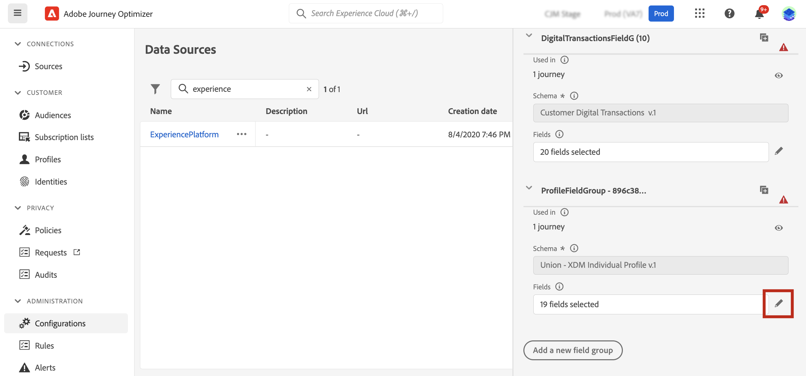
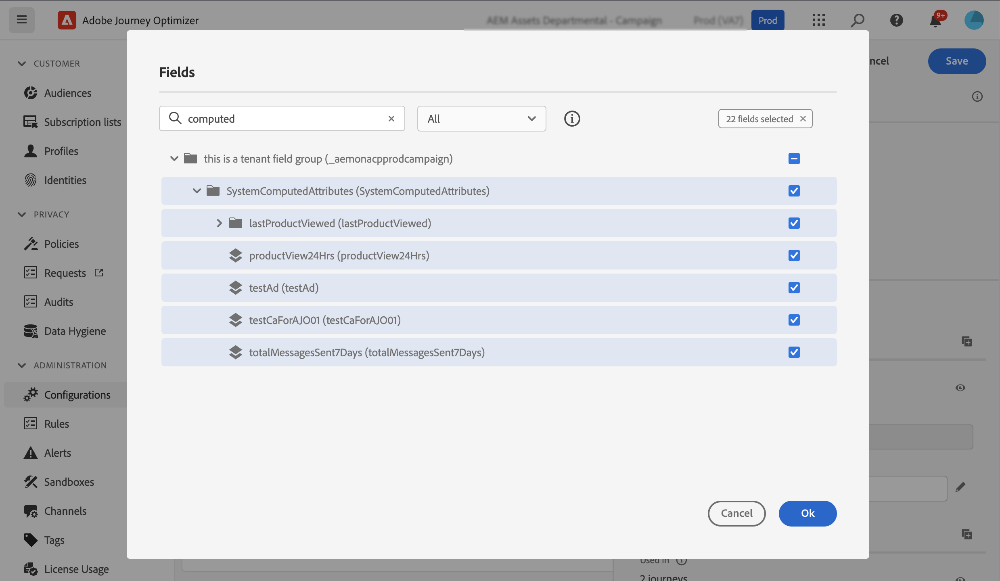
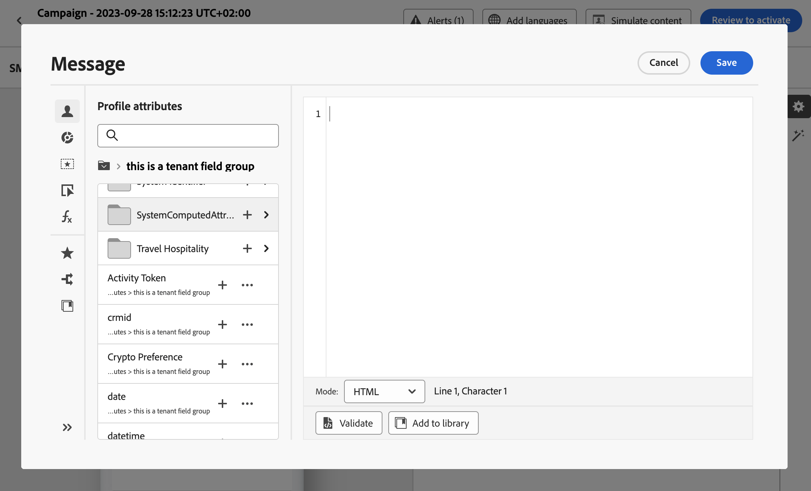

# Work with computed attributes {#computed-attributes}

Computed attributes allow you to summarize individual behavioral events into computed profile attributes available on Adobe Experience Platform. These computed attributes are based on Profile-enabled Experience Event datasets ingested into Adobe Experience Platform and serve as aggregated data points stored within customer profiles.

Each computed attribute is a profile attribute that you can leverage for segmentation, personalization, and activation in journeys and campaigns. This simplification enhances the ability to deliver timely and meaningful personalized experiences to your customers.

>[!NOTE]
>
>To get access to computed attributes, you need to have the appropriate permissions (**View Computed attributes** and **Manage Computed attributes**).

## Create computed attributes {#manage}

To create computed attributes, navigate to the **[!UICONTROL Computed attributes]** tab in the **[!UICONTROL Profiles]** menu located on the left hand-side.

From this screen, you can construct computed attributes by building rules that combine event attributes, aggreagte functions, alonside a specified lookback period. For example, you can calculate the sum of purchases made in the last three months, identify the most recent item viewed by a profile withwho hasn't made a purchase in the last week, or tally up the total reward points accumulated by each profile. 

Once your rule is ready, publish the computed attribute to make it available in other downstream services, including Journey Optimizer.

Detailed information on how to create and manage computed attributes are available in the [Computed attributes documentation](https://experienceleague.adobe.com/docs/experience-platform/profile/computed-attributes/overview.html)

## Add computed attributes to the Adobe Experience Platform data source {#source}

In order to be able to leverage computed attributes in Journey Optimizer, you first need to add them to Journey Optimizer **Experience Platform** data source.

Adobe Experience Platform data source defines the connection to Adobe Real-time Customer Profile. This data source is designed to retrieve Profile data and Experience Events data from Real-time Customer Profile Service.

To add computed attributes to the data source, follow these steps:

1. Navigate to the **[!UICONTROL Configurations]** left hand-side menu, then click the **[!UICONTROL Data sources]** card.

1. Select the **[!UICONTROL Experience Platform]** data source.

    
    
1. Add the **[!UICONTROL SystemComputedAttributes]** field group containing all the created computed attributes.

    

Computed attributes are now available for use in Journey Optimizer. [Learn how to use computed attributes in Journey Optimizer](#use)

Detailed information on how to add field groups to the Adobe Experience Platform data source is available in [this section](../datasource/adobe-experience-platform-data-source.md).

## Use computed attributes in Journey Optimizer {#use}

>[NOTE]
>
>Before starting, make sure you have added your computed attributes into Adobe Experience Platform data source. [Learn how in this section](#source).

Computed attributes offer a versatile set of capabilities within Journey optimizer. You can use them for various purposes, such as personalizing message content, creating new audiences, or splitting journeys based on a specific computed attribute. For example, you can split a journey's path based on a profile's total purchases in the last three weeks, by adding a single computed attribute in a Condition activity. You can also personalize an email by displaying the most recently viewed item for each profile.

Since computed attributes are profile attribute fields created on your profile union schema, you can access them from the Expression Editor within the **SystemComputedAttributes** field group. From there, you can then add computed attribute into your expressions, treating them like any other profile attribute to perform the desired operations.

