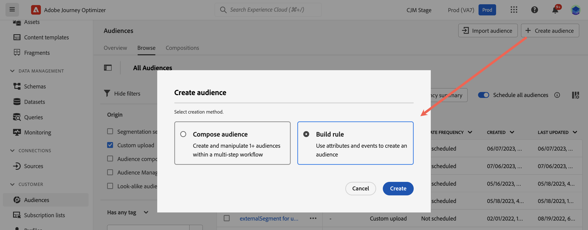
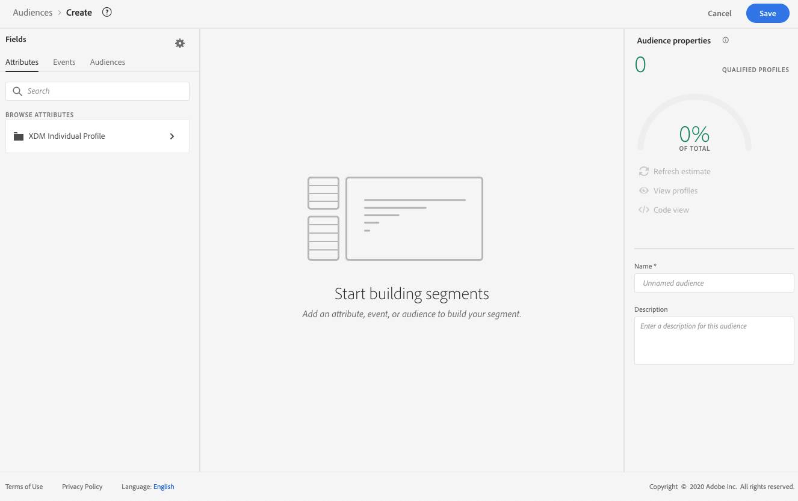
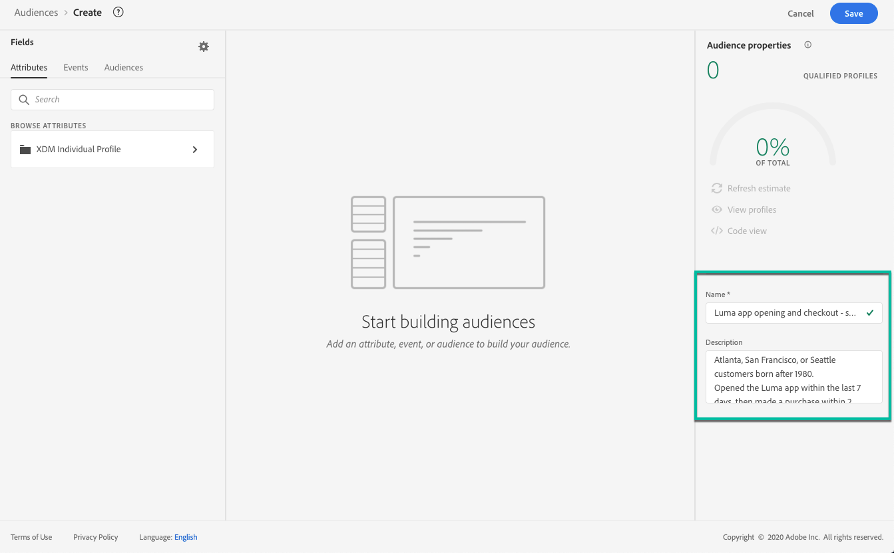
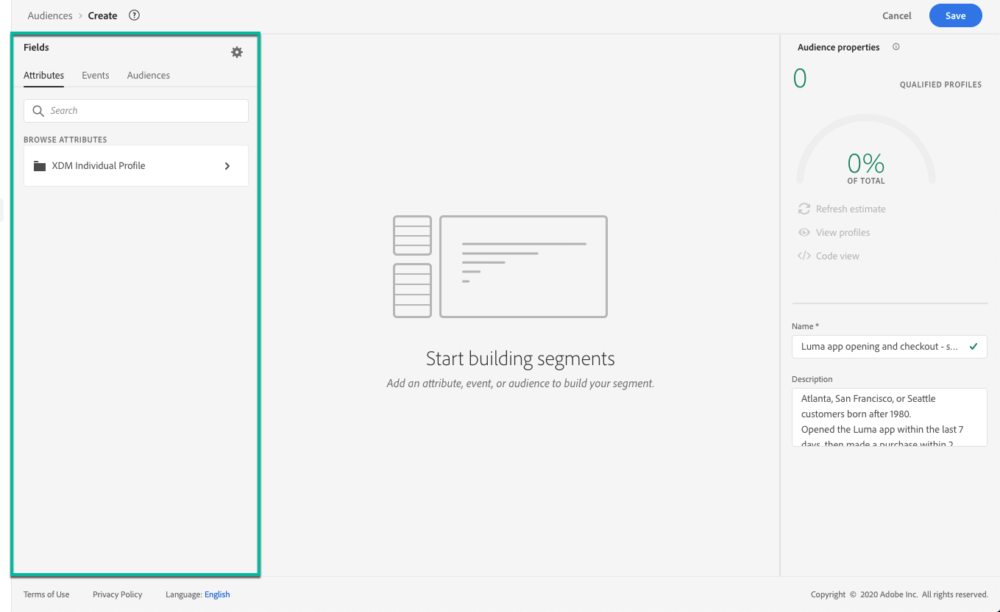
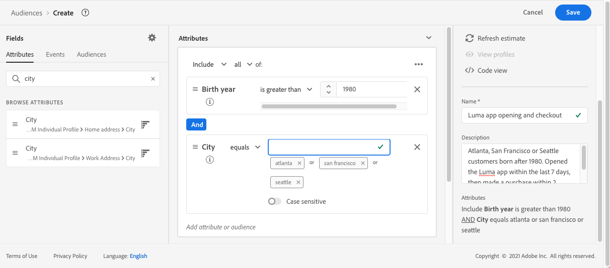
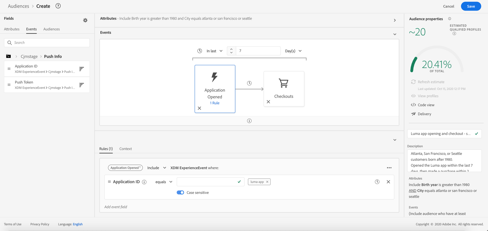
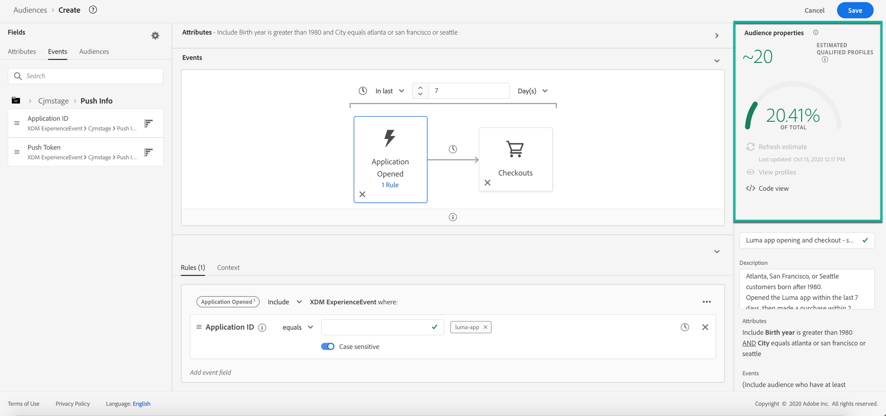

# Build segment definitions {#build-segments}

>[!CONTEXTUALHELP]
>id="ajo_ao_create_rule"
>title="Create a rule"
>abstract="The Build rule creation method allows you to create a new audience definition using Adobe Experience Platform Audienceation Service."

In this example, we will build an audience to target all customers living in Atlanta, San Francisco, or Seattle and born after 1980. All these customers should have opened the Luma application within the last 7 days, then made a purchase within 2 hours after opening the application.

➡️ [Learn how to create audiences in this video](#video-segment)

1. From the **[!UICONTROL Audiences]** menu, click the **[!UICONTROL Create audience]** button and select **[!UICONTROL Build rule]**.
    
    

    The segment definition screen allows you to configure all the required fields to define your audience. Learn how to configure audiences in the [Segmentation Service documentation](https://experienceleague.adobe.com/docs/experience-platform/segmentation/ui/overview.html){target="_blank"}.

    

1. In the **[!UICONTROL Audience properties]** pane, provide a name and a description (optional) for the audience.

    

1. Drag and drop the desired fields from the left pane into the center workspace, then configure them according to your needs.

    >[!NOTE]
    >
    >Note that the fields available in the left pane vary depending on how the **XDM Individual Profile** and **XDM ExperienceEvent** schemas have been configured for your organization.  Learn more in the [Experience Data Model (XDM) documentation](https://experienceleague.adobe.com/docs/experience-platform/xdm/home.html){target="_blank"}.

    

    In this example, we need to rely on **Attributes** and **Events** fields to build the audience:

    * **Attributes**: profiles living in Atlanta, San Francisco or Seattle born after 1980

        
        
    * **Events**: profiles who opened the Luma application within the last 7 days, then made a purchase within 2 hours after opening the application.

        

1. As you are adding and configuring new fields in the workspace, the **[!UICONTROL Audience Properties]** pane is automatically updated with information on the estimated profiles belonging to the audience.

    

1. Once the audience is ready, click **[!UICONTROL Save]**. It displays in the list of Adobe Experience Platform audiences. Note that a search bar is available to help you search a specific audience in the list.

The audience can now be used in your journeys. For more on this, refer to [this section](../audience/about-audiences.md).

## How-to video{#video-segment}

Learn how to create audiences.

>[!VIDEO](https://video.tv.adobe.com/v/334281?quality=12)
