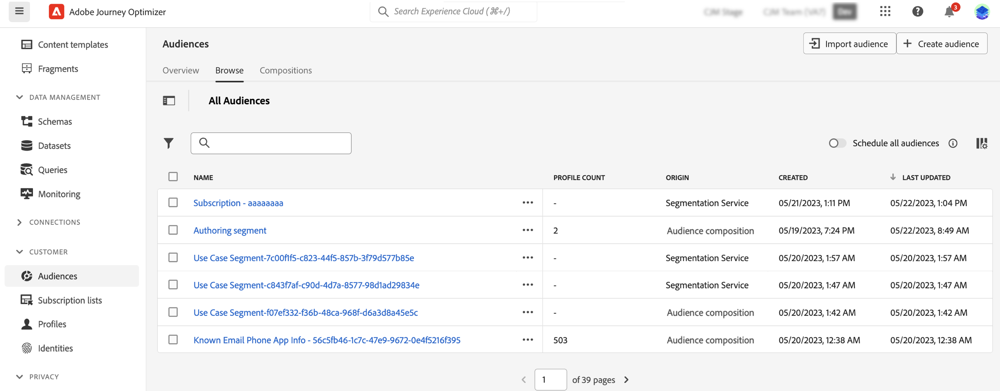
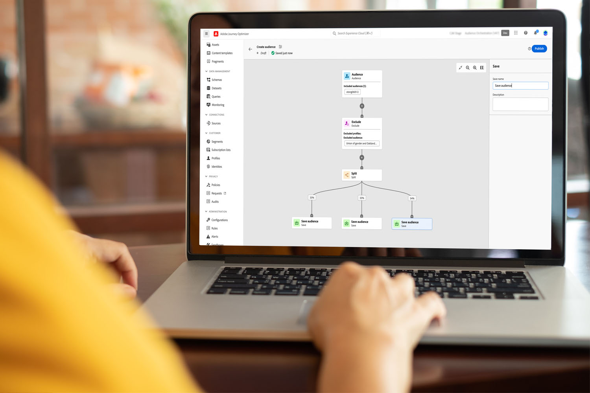

# Get started with audience composition {#get-start-audience-composition}

>[!CONTEXTUALHELP]
>id="ajo_ao_create_composition"
>title="Create a composition"
>abstract="Create a composition workflow to combine existing Adobe Experience Platform audiences into a visual canvas and leverage various activites (split, exclude...) to create new audiences."

Audience composition allows you to create **composition workflows**, where you can combine existing Adobe Experience Platform audiences into a visual canvas and leverage various activites (split, exclude...) to create new audiences.

Once done, the **resulting audiences** are saved backed into Adobe Experience Platform along with existing audiences and can be **leveraged in campaigns** to target customers. [Learn how to work with campaigns](../campaigns/get-started-with-campaigns.md)

>[!IMPORTANT]
>
>Audiences resulting from composition workflows can be targeted into Journey Optimizer campaigns only. They are not available for use in journeys.
>
>Campaigns in Adobe Journey Optimizer are not yet integrated with the policy enforcement service. Therefore, any data usage labels you apply to your audience attributes will not be enforced in Journey Optimizer campaigns.

Audience composition is accessible from Adobe Journey Optimizer **[!UICONTROL Audiences]** menu:

* The **[!UICONTROL Overview]** tab provides a dedicated dashboard with key metrics related to your organization’s audience data. To learn more, refer to [Adobe Experience Platform Dashboards guide](https://experienceleague.adobe.com/docs/experience-platform/dashboards/guides/segments.html).

* The **[!UICONTROL Browse]** tab lists all existing audiences stored into Adobe Experience Platform.

* The **[!UICONTROL Compositions]** tab allows you to create composition workflows where you can combine and arrange audiences to create new ones.

Click on each card to learn how to work with audience composition:

<table style="table-layout:fixed"><tr style="border: 0;">
<td>

<a href="create-compositions.md"><strong>Create your first composition workflow</strong></a>
</td>
<td>

<a href="composition-canvas.md"><strong>Work with the composition canvas</strong></a>
</td>
<td>

<a href="access-audiences.md"><strong>Access and manage audiences</strong></a>
</td>
</tr></table>
