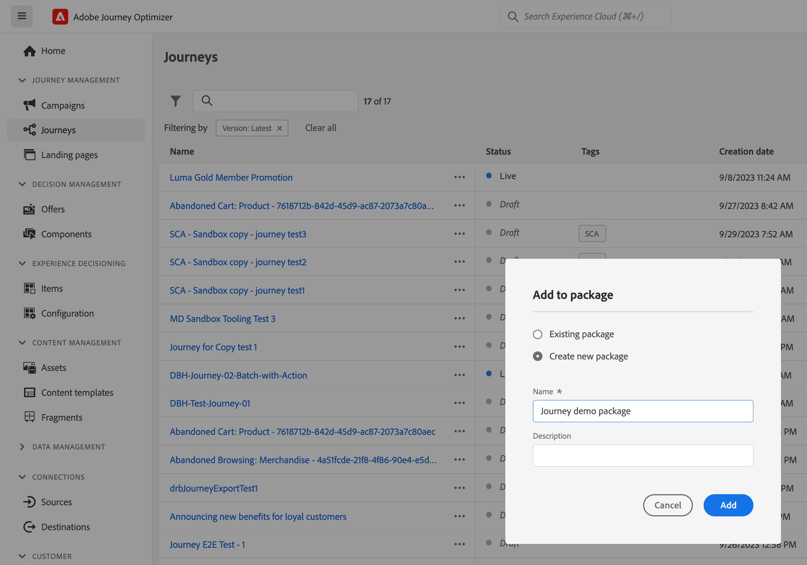
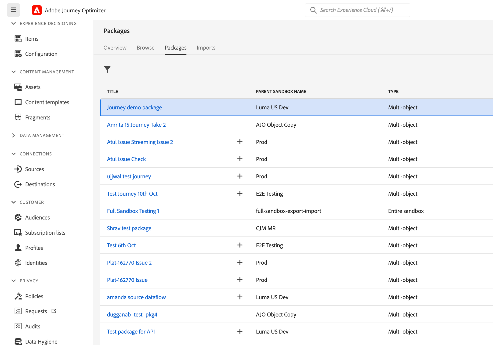
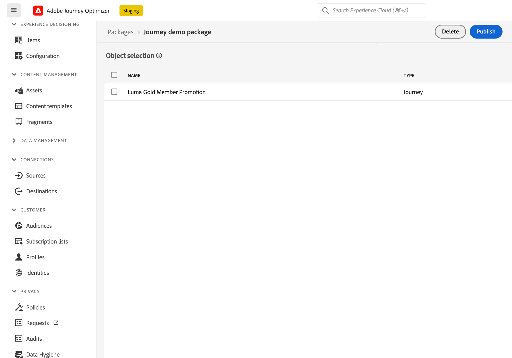
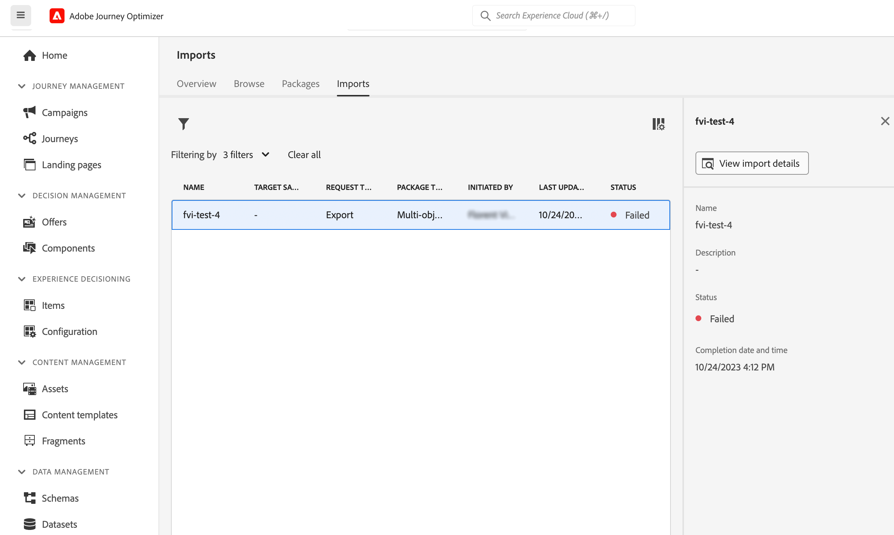
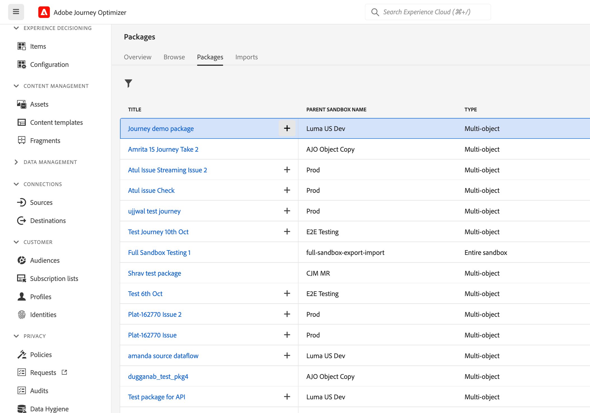
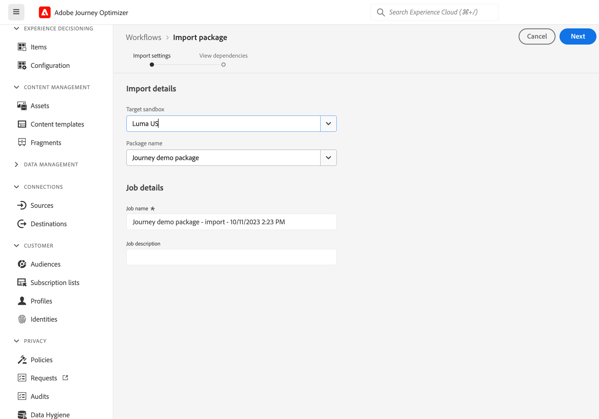
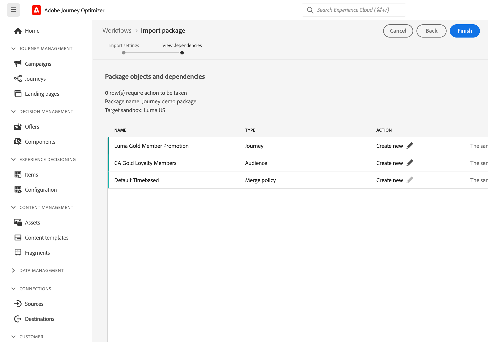
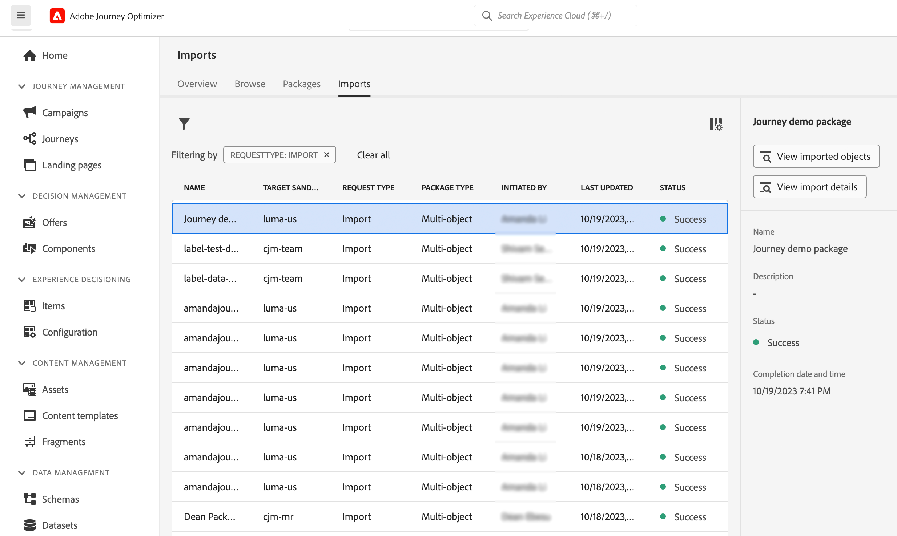

# Copy a journey to another sandbox {#copy-to-sandbox}

<!--
>[!CONTEXTUALHELP]
>id="ajo_journey_copy_main"
>title="Copy a journey to another sandbox"
>abstract="Journey Optimizer allows you to copy an entire journey from one sandbox to another. For example, you can copy a journey from the Stage sandbox environment to your Production sandbox. In addition to the Journey itself, Journey Optimizer also copies most of the objects the journey depends on."

>[!CONTEXTUALHELP]
>id="ajo_journey_copy_sandbox_details"
>title="Sandbox details"
>abstract="Select the destination sandbox you want to copy the journey to. Only sandboxes within your organization are available."

>[!CONTEXTUALHELP]
>id="ajo_journey_copy_object_details"
>title="Object details"
>abstract="This is the journey you are going to copy."

>[!CONTEXTUALHELP]
>id="ajo_journey_copy_dependent_objects"
>title="Dependent objects"
>abstract="This is the list of associated objects used in the journey. This list displays the name, the object type, as well as the internal Journey Optimizer ID."
-->

Sandbox Tooling allows you to copy objects across multiple sandboxes by leveraging package export and import. A package can consist of a single object or multiple objects. Any objects that are included in a package must be from the same sandbox. 

This page describes the Sandbox tooling use case in the context of Journey Optimizer. For more information on the feature itself, refer to the [Experience Platform documentation](https://experienceleague.corp.adobe.com/docs/experience-platform/sandbox/ui/sandbox-tooling.html).

## Get started with Sandbox Tooling{#sandbox-gs}

Journey Optimizer allows you to copy an entire journey from one sandbox to another. For example, you can copy a journey from your Stage sandbox environment to your Production sandbox. In addition to the journey itself, Journey Optimizer also copies most of the objects the journey depends on: audiences, schemas, events and actions. For more details on copied objects, refer to this [section](https://experienceleague.adobe.com/docs/experience-platform/sandbox/ui/sandbox-tooling.html#abobe-journey-optimizer-objects).

>[!CAUTION]
>
>We do not guarantee that all linked elements will be copied to the destination sandbox. We strongly recommend that you perform a thorough check before publishing the journey. This will allow you to identify any potential missing object. 

The copied objects in the target sandbox are unique and there is no risk of overwriting existing elements. Both the journey and any messages inside the journey are brought over in draft mode. This allows you to perform a thorough validation before publication on the target sandbox. The copy process only copies over the metadata about the journey and the objects in that Journey. No profile or dataset data is being copied as part of this process. 

## Export the journey {#export}

To copy a journey to another sandbox, follow these steps:

1. In the JOURNEY MANAGEMENT menu section, click **[!UICONTROL Journeys]**. The list of journeys is displayed.

1.  Search for the journey you want to copy, click the **More actions** icon (the three dots next to the journey name) and click **Add to package**.

   

   The **Add to package** window is displayed.

   

1. Choose if you want to add the journey to an existing package or create a new package:

   * **Existing package**: select the package from the drop-down menu.
   * **Create a new package**: type the package name. You can also add a description.

1. In the ADMINISTRATION menu section, click **[!UICONTROL Sandboxes]**, select the **Packages** tab and click on the package you want to export. 

   

1. Select the objects you wish to export, and click **Publish**

   

   If the publication failed, you can check the logs to identify the failure reason. Open the package, click **See failed jobs**, select the import job and click **View import details**.

   

## Import the journey {#export}

1. From the package list, click the + icon, next to the package name. 

   

1. Select the **Target sandbox** from the drop-down field and click **Next**. Only sandboxes within your organization are available.

   

1. Review the package objects and dependencies. This is the list of associated objects used in the journey. This list displays the name and the object type. For each object, you can choose to create a new one or use an existing one in the target sandbox. 

   

1. Click the **Finish** button, in the top-right corner, to start copying the package to the target sandbox. The copying process varies based on the complexity of the journey and how many objects need to be copied over. 

1. Click the import job to review the copy result:

   * Click **View imported objects** to display each individual object copied. 
   * Click **View import details** to check the import results for each object.

   

1. Access your target sandbox and perform a thorough check of all the copied objects. 
