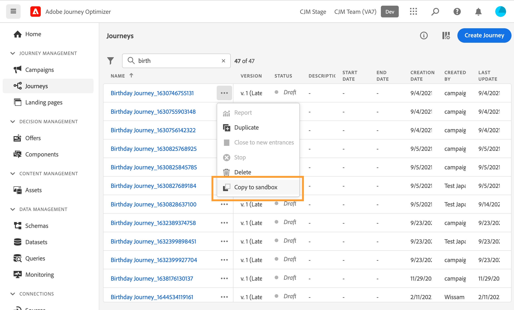
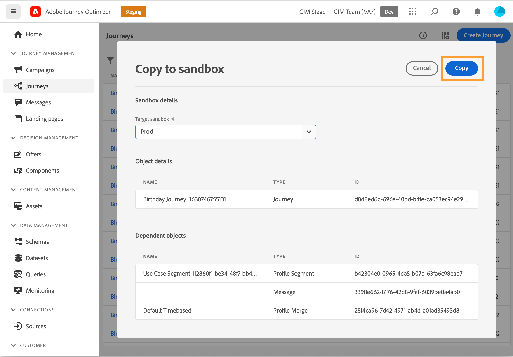
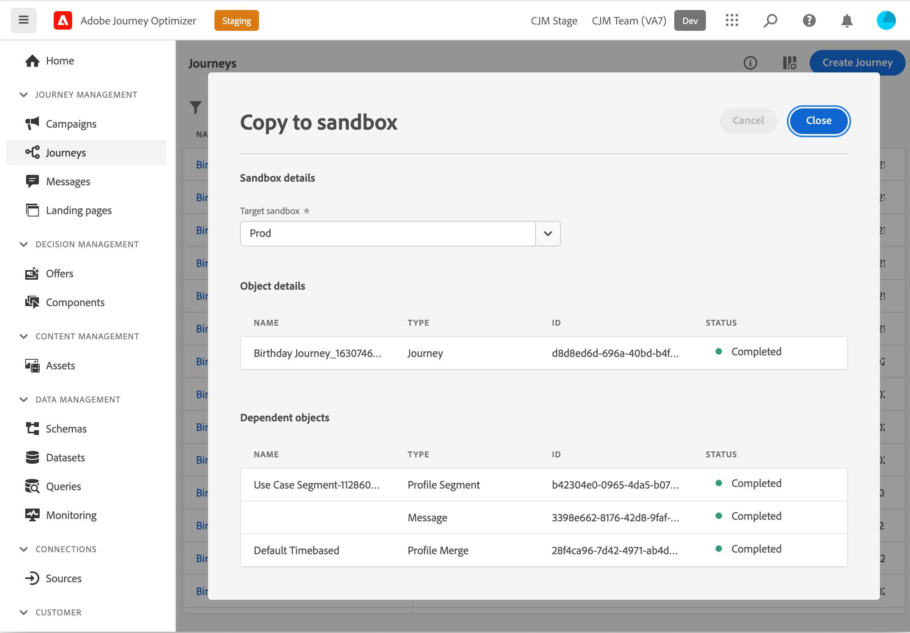

# Copy a journey to another sandbox {#copy-to-sandbox}

>[!CONTEXTUALHELP]
>id="ajo_journey_copy_main"
>title="Copy a journey to another sandbox"
>abstract="Journey Optimizer allows you to copy an entire journey from one sandbox to another. For example, you can copy a journey from the Stage sandbox environment to your Production sandbox. In addition to the Journey itself, Journey Optimizer also copies most of the objects the journey depends on."

>[!CONTEXTUALHELP]
>id="ajo_journey_copy_sandbox_details"
>title="Sandbox details"
>abstract="Select the destination sandbox you want to copy the journey to. Only sandboxes within your IMS organization are available."

>[!CONTEXTUALHELP]
>id="ajo_journey_copy_object_details"
>title="Object details"
>abstract="This is the journey you are going to copy."

>[!CONTEXTUALHELP]
>id="ajo_journey_copy_dependent_objects"
>title="Dependent objects"
>abstract="This is the list of associated objects used in the journey. This list displays the name, the object type, as well as the internal Journey Optimizer ID."

Journey Optimizer allows you to copy an entire journey from one sandbox to another. For example, you can copy a journey from your Stage sandbox environment to your Production sandbox. In addition to the journey itself, Journey Optimizer also copies most of the objects the journey depends on: messages, segments, presets, schemas, events and actions. Refer to the [limitations](../event/about-events.md)

>[!CAUTION]
>
>We do not guarantee that all linked elements will be copied to the destination sandbox. We strongly recommend that you perform a thorough check before publishing the journey. This will allow you to idenity any potential missing object. 

The copied objects in the target sandbox are unique and there is no risk of overwriting existing elements. Both the journey and any messages inside the journey are brought over in draft mode. This allows you to perform a thorough validation before publication on the target sandbox. The copy process only copies over the metadata about the journey and the objects in that Journey. No profile or dataset data is being copied as part of this process. 

To copy a journey to another sandbox, follow these steps:

1. In the JOURNEY MANAGEMENT menu section, click **[!UICONTROL Journeys]**. The list of journeys is displayed.

2. Search for the journey you want to copy, click the **More actions** icon (the three dots next to the journey name) and click **Copy to sandbox**.

   

   The **Copy to sandbox** screen is displayed.

   

3. Select the **Target sandbox** from the drop-down field. Only sandboxes within your IMS organization are available.

4. Review the **Dependent objects** section. This is the list of associated objects used in the journey. This list displays the name, the object type, as well as the internal Journey Optimizer ID.

5. Click the **Copy** button, in the top-right corner, to start copying the journey to the target sandbox.

   

   The copying process begins and the progress of each individual object is displayed. The copying process varies based on the complexity of the journey and how many objects need to be copied over. If an error is encountered, a message is displayed for the related object. 

   

6. Once the copying is complete, click **Close**. 

7. Access your target sandbox and perform a thorough check of all the copied objects. 

## Copy process and limitations {#limitations}

We do not guarantee that all linked elements will be copied to the destination sandbox. We strongly recommend that you perform a thorough check. Identify any potential missing object and create them manually before publishing the journey.

The following objects are copied:

* Segment

   A segment can only be copied once from one sandbox to another. Subsequent requests to copy the segment will fail. Once a segment is copied, it is not editable on the destination sandbox.

* Schema

   The schemas used in this journey are copied.

* Message

   The physical message(s) used in the journey (either email or push messages). Fields used for personalization in the message are not checked for completeness. Content blocks are not copied.

* Journey - canvas details

   The representation of the journey on the canvas including the objects in the journey such as conditions, actions, events, read segments, etc. The Jump activity is excluded from the copy.

* Event

   The events and the event details used in the journey are copied.

* Action

   The actions and action details used in the journey are copied.

Presets are not copied over. The system automatically selects the closest possible match on the destination sandbox, based on message type and preset name. If there are no presets found on the target sandbox, then the preset copy will fail. This will mean that the message copy will fail as well beacause a message requires a preset to be available for setup. In this case at least one preset needs to be created, for the right channel of the message, in order for the copy to work.

