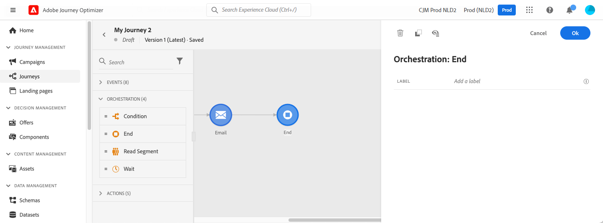

# End activity{#end-activity}

>[!CONTEXTUALHELP]
>id="ajo_journey_end"
>title="End activity"
>abstract="The End activity allows you to mark the end of each path of the journey. It is not mandatory but recommended for visual clarity. Indeed, if the journey has several end activities, we recommend that you add a label to each end to make reports easier to read."

The **[!UICONTROL End]** activity allows you to mark the end of each path of the journey. It is not mandatory but recommended for visual clarity. Indeed, if the journey has several end activities, we recommend that you add a label to each end to make reports easier to read. See [this page](../reports/live-report.md).

