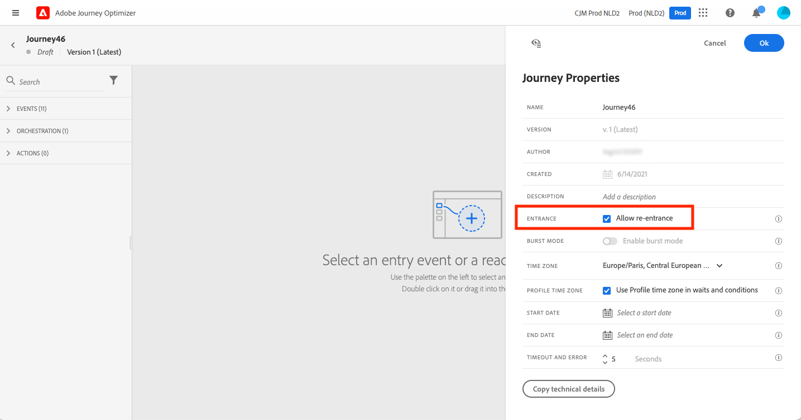

# Profile entry management {#entry-management}

By default, new journeys allow re-entrance. You can uncheck the option for “one shot” journeys, for example if you want to offer a one-time gift when a person enters a shop. In that case, you don't want the customer to be able to re-enter the journey and receive the offer again.

When a journey ends, its status is **[!UICONTROL Closed]**. New individuals can no loger enter the journey. Persons already in the journey finish the journey normally.

After the default global timeout of 30 days, the journey switches to the **Finished** status.  [Learn more](journey-gs.md#global_timeout).

## Unitary journeys{#entry-unitary}

Unitary journeys (starting with an event or a segment qualification) include a guardrail that prevents journeys from being erroneously triggered multiple times for the same event. Profile re-entrance is temporally blocked by default for 5 minutes. For instance, if an event triggers a journey at 12:01 for a specific profile and another one arrives at 12:03 (whether it is the same event or a different one triggering the same journey) that journey will not start again for this profile.

In addition:

* If re-entrance is enabled, a profile can enter a journey several times, but cannot do it until they fully exited that previous instance of the journey.

* If re-entrance is disabled, a profile cannot enter multiple times the same journey

## Read segment journeys{#entry-read-segment}

In a read segment journey:

* For non-recurring journeys: the profile enters once and only once the journey.

* For recurring journeys: the profile enters the journey on each recurrence, if they are in the segment/ expected status. If they were still in the journey from a previous recurrence, they will restart it from the beginning.

In business event journeys starting with a **Read segment** activity: knowing that this journey is based on the reception of a business event, if the profile is qualified in the expected segment, they will enter the journey for each business event received, meaning that this profile can be multiple times in the same journey, at the same time, but in the context of different business events.