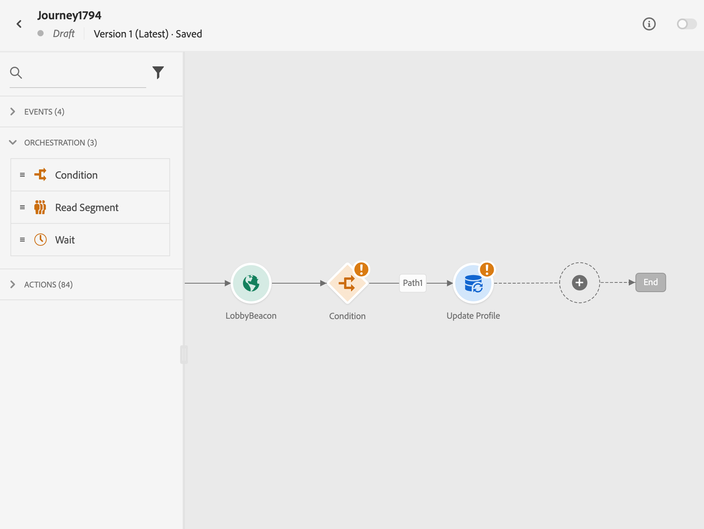
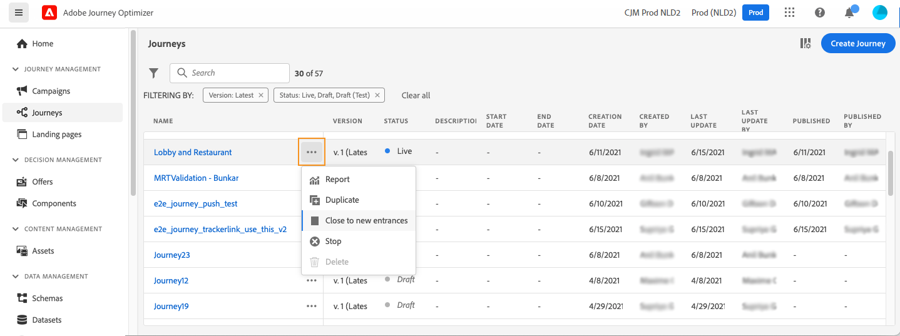

# Journey lifecycle{#journey-lifecyle}

## Profiles in journeys{#profile-journey}

In a unitary journey:

* If re-entrance is enabled, a profile can enter a journey several times, but cannot do it until he fully exited that previous instance of the journey.

* If re-entrance is disabled, a profile cannot enter multiple times the same journey

For more information on profile re-entrance, refer to this [section](../building-journeys/journey-gs.md#change-properties).

In a read segment journey:

* For non-recurring journeys: the profile enters once and only once the journey.
* for recurring journeys: the profile enters the journey on each recurrence, if he is in the segment/expected status. If he was still in the journey from a previous recurrence, he will restart it from the beginning.

In business event journeys starting with a read segment :

Knowing that this journey is based on the reception of a business event, if the profile is qualified in the expected segment, he will enter the journey for each business event received, meaning that this profile can be multiple times in the same journey, at the same time, but in the context of different business events.

## Journey ending{#journey-ending}

A journey can end for an individual in two specific contexts:

* The person arrives at the last activity of a path.
* The person arrives at a **Condition** activity (or a **Wait** activity with a condition) and does not match any of the conditions.

The person can then re-enter the journey if re-entrance is allowed. See [this page](../building-journeys/journey-gs.md#change-properties)

To terminate a live journey, we recommend that you close it. The arrival of new customers in the journey will then be blocked. Customers who already entered in the journey are able to experience it to the end. See [this section](../building-journeys/journey-end.md#close-journey)

You can stop a journey only if an emergency occurred and all processing needs to be ended immediately on a journey. People who already entered a journey are all stopped in their progress. See [this section](../building-journeys/journey-end.md#stop-journey)

>[!NOTE]
>
>Note that you cannot resume a closed or stopped journey.

### Journey end tag{#end-tag}

While authoring a journey, an "end taf" is displayed at the end of each path. This node cannot be added by a user, cannot be removed and only its label can be changed. It marks the end of each path of the journey. If the journey has several paths, we recommend that you add a label to each end to make reports easier to read. See [this page](../reports/live-report.md).

<!--

### End activity{#journey-end-activity}

The **[!UICONTROL End]** activity allows you to mark the end of each path of the journey. It is not mandatory but recommended for visual clarity. See [this page](../building-journeys/end-activity.md)

-->

### Close a journey{#close-journey}

A journey can close because of the following reasons:

* The journey is closed manually via the **[!UICONTROL Close to new entrances]** button. 
* A one-shot segment based journey that has finished executing.
* After the last occurrence of a recurring segment based journey.

Closing a journey manually ensures that customers who already entered the journey can finish their path but new users are not able to enter the journey. When a journey is closed (for any of the reasons above), it will have the status **[!UICONTROL Closed]**. The journey stops letting new individuals enter the journey. Persons already in the journey can finish the journey normally. After the default global timeout of 30 days, the journey will switch to the **Finished** status. See this [section](../building-journeys/journey-gs.md#global_timeout).

A closed journey version cannot be restarted or deleted. You can create a new version of it or duplicate it. Only finished journeys can be deleted.

To close a journey from the list of journeys, click the **[!UICONTROL Ellipsis]** button that is located to the right of the journey name and select **[!UICONTROL Close to new entrances]**.

You can also:

1. In the **[!UICONTROL Journeys]** list, click on the journey you want to close.
1. On the top-right, click the down arrow.

    

1. Click **[!UICONTROL Close to new entrances]**, and confirm in the dialog box.

### Stop a journey{#stop-journey}

In case you need to stop the progress of all individuals in the journey, you can stop it. Stopping the journey will timeout all individuals in the journey. However, stopping a journey involves that people who already entered a journey are all stopped in their progress. The journey is basically switched off. If you want to put an end to a journey we recommend that you close it. 

A stopped journey version cannot be restarted.

When stopped, the journey status is set to **[!UICONTROL Stopped]**. 

You can stop a journey, for example, if a marketer realizes that the journey targets the wrong audience or a custom action supposed to deliver messages is not working correctly. To stop a journey from the list of journeys, click the **[!UICONTROL Ellipsis]** button that is located to the right of the journey name and select **[!UICONTROL Stop]**.

You can also:

1. In the **[!UICONTROL Journeys]** list, click on the journey you want to stop.
1. On the top-right, click on the down arrow.
   
1. Click **[!UICONTROL Stop]**, and confirm in the dialog box.
