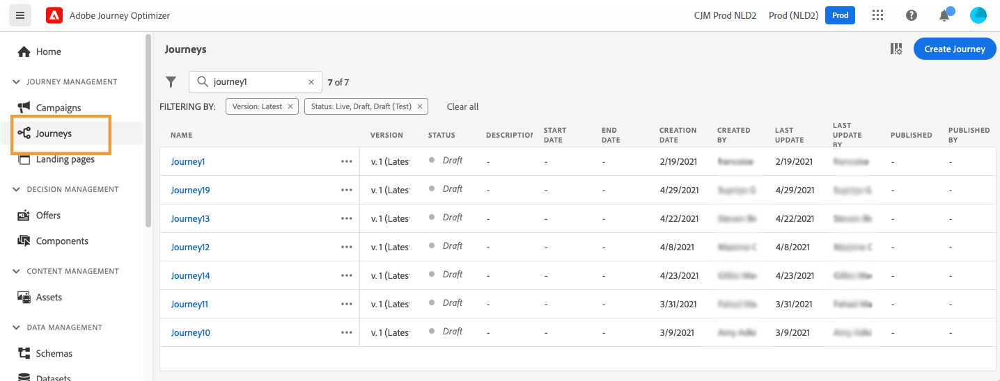
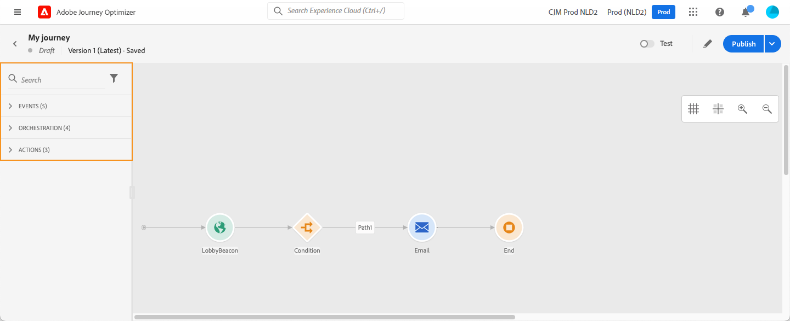
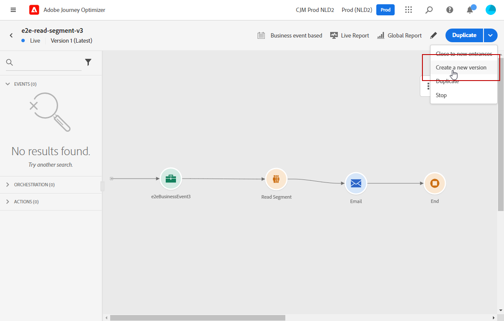

# Get started with journeys{#jo-general-principle}

Use [!DNL Journey Optimizer] to build real-time orchestration use cases using contextual data stored in events or data sources.

Design multistep advanced scenarios powered by following capabilities:

* Send real-time **unitary delivery** triggered when an event is received, or **in batch** using Adobe Experience Platform segments.

* Leverage **contextual data** from events, information from Adobe Experience Platform, or data from third-party API services.

* Use the **built-in actions** to send messages designed in [!DNL Journey Optimizer] or create **custom actions** if you're using a third-party system to send your messages.

* With the **journey designer**, build your multistep use cases: easily drag and drop an entry event or a read segment activity, add conditions and send personalized messages.

## Steps to create a journey{#steps-journey}

Use Adobe Journey Optimizer to design and orchestrate personalized journeys from a single canvas.

Adobe Journey Optimizer includes an omnichannel orchestration canvas which allows marketers to harmonize marketing outreach with one-to-one customer engagement. The user interface allows you to easily drag and drop activities from the palette into the canvas to build your journey. 

Learn how to start and create your first journey in [this page](journey-gs.md).

The omnichannel journey designer helps you build multi-step journeys with targeted audiences, updates based on real-time customer or business interactions, and omnichannel messages using an intuitive drag-and-drop interface.

Read more in [this section](using-the-journey-designer.md).

As a data engineer, steps to configure your journeys, including Data Sources, Events and Actions are detailed in [this section](../configuration/about-data-sources-events-actions.md).

## Use cases{#uc-journey}

Learn how to build journeys in the following end-to-end use cases.

Business use cases:

* [Send multi-channel messages](journeys-uc.md)
* [Send a message using Campaign v7/v8](campaign-classic-use-case.md)
* [Send a message to subscribers](message-to-subscribers-uc.md)

Technical use cases:

* [Pass collections dynamically using custom actions](collections.md)
* [Ramp up deliveries](ramp-up-deliveries-uc.md)
* [Limit throughput with External Data Sources and Custom Actions](limit-throughput.md)

## Journey versions{#journey-versions}

In the journey list, all journey versions are displayed with the version number. See [this page](../building-journeys/using-the-journey-designer.md). 

When you search for a journey, newest versions appear at the top of the list the first time the application opens. Then, you can define the sorting you want and the application will keep it as a user preference. The journey's version is also displayed at the top of the journey edition interface, above the canvas.

>[!NOTE]
>
>Usually, a profile cannot be present multiple times in the same journey, at the same time. If re-entrance is enabled, a profile can reenter a journey, but cannot do it until he fully exited that previous instance of the journey. [Read more](end-journey.md).

If you need to modify to a live journey, create a new version of your journey.

1. Open the latest version of your live journey, click **[!UICONTROL Create a new version]** and confirm.

    

    >[!NOTE]
    >
    >You can only create a new version from the latest version of a journey.

1. Make your modifications, click **[!UICONTROL Publish]** and confirm.

    

From the moment the journey is published, individuals will start to flow into the latest version of the journey. People who have already entered a previous version stay in it until they finish the journey. If they later re-enter the same journey, they will go into the latest version.

Journey versions can be stopped individually. All versions of journeys have the same name.

When you publish a new version of a journey, the previous version automatically ends and switches to the **Closed** status. No entrance in the journey can happen. Even if you stop the latest version, the previous version stays closed.

>[!NOTE]
>
>Learn more about journey versions guardrails and limitations, in [this page](../start/guardrails.md#journey-versions-limitations)