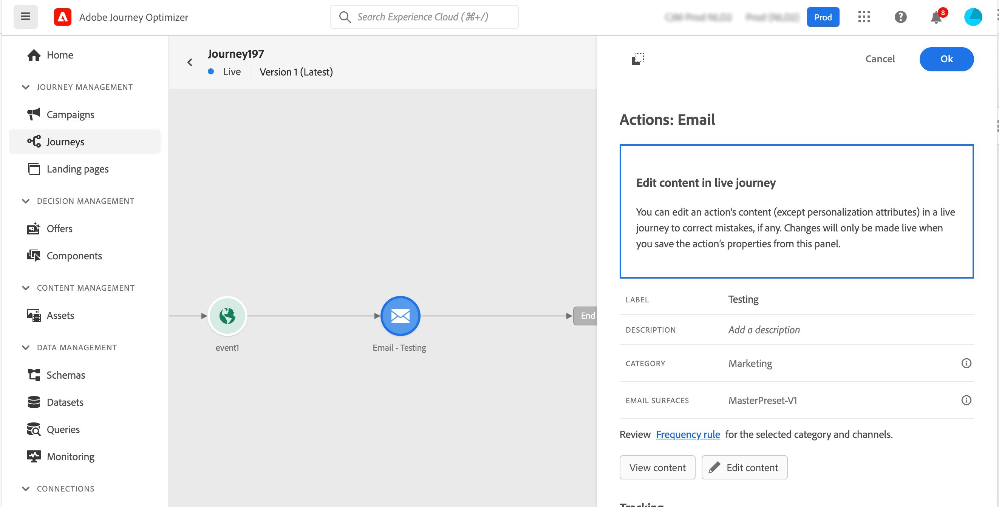

# Email, SMS, Push{#add-a-message-in-a-journey}

[!DNL Journey Optimizer] comes with built-in message capabilities. You can simply add, in your journey, a push, an SMS, or email message activity and define settings and content. It is then executed and sent in the context of the journey.

You can also set up specific actions to send you messages:

* If you are using a third-party system to send your messages, you can create a custom action. Learn more in this [section](../action/action.md).

* If you are working with Campaign and Journey Optimizer, refer to these sections:

   * [[!DNL Journey Optimizer] and Campaign Classic v7/Campaign v8](../action/acc-action.md)
   * [[!DNL Journey Optimizer] and Campaign Standard](../action/acs-action.md)

To add a message in a journey, follow the steps below:

1. Start your journey with an [Event](general-events.md) or a [Read Segment](read-segment.md) activity.

1. From the **Actions** section of the palette, drag and drop an **email**, an **SMS** or a **Push** activity into the canvas.

1. Configure your activity. Learn detailed steps to create your message content in the following pages:

   <table style="table-layout:fixed">
   <tr style="border: 0;">
   <td>
   
   
<a href="../email/create-email.md"><strong>Create emails</strong>
   

   

   </td>
   <td>
   
   

   <a href="../push/create-push.md"><strong>Create push notifications<strong></a>
   

   

   </td>
   <td>
   
   

   <a href="../sms/create-sms.md"><strong>Create SMS messages</strong></a>
   

   

   </td>
   </tr>
   </table>

## Update live content{#update-live-content}

You can update the content of a message (email, sms, push) in a live journey. 

To do this, open your live journey, select the message activity and click **Edit content**.

However, you cannot change the attributes used in personalisation, whether they are profile attributes or contextual data (from event or journey properties).

## Send-Time Optimization{#send-time-optimization}

>[!CONTEXTUALHELP]
>id="jo_bestsendtime_disabled"
>title="About Sent time optimization"
>abstract="Adobe Journey Optimizer's Send-Time Optimization feature, powered by Adobe's AI services, can predict the best time to send an email or push message to maximize engagement based on historical open and click rates."

### About Send-Time Optimization {#about-send-time}

Adobe Journey Optimizer's Send-Time Optimization feature, powered by Adobe's AI services, can predict the best time to send an email or push message to maximize engagement based on historical open and click rates. Use our machine-learning model to schedule personalized send times for each user to grow the open and click rates of your messages.

The Send-Time Optimization model ingests your Adobe Journey Optimizer data and looks at user-level open (for email and push) and click (for email) rates to determine when your customers are most likely to engage with your messaging. Send-Time Optimization requires a minimum of one month of message-tracking data to make informed recommendations. For each user, the system will automatically pick the best time using the following scores:

* The best hour of each day of the week to maximize engagement
* The best day of the week to maximize engagement
* The best hour of the best day of the week to maximize engagement

The model varies whether you are talking about scoring or training. Training is conducted weekly initially and then quarterly. Scoring is weekly initially and then monthly.

* Training - the development of the algorithm used to make the score
* Scoring - the application of a score to individual profiles based on the trained model

This information is stored with the user's profile and is referenced at journey execution to tell Adobe Journey Optimizer when to send your message. 

>[!CAUTION]
>
>This feature is not compatible with burst mode.

### Activate Send-Time Optimization{#activate-send-time-optimization}

>[!CONTEXTUALHELP]
>id="jo_bestsendtime_email"
>title="Activate Send-Time Optimization"
>abstract="Choose whether to optimize on email opens or email click-throughs by selecting the appropriate radio button. You can also choose to bracket the send times used by the system by entering a value for the Send within the next option."

>[!CONTEXTUALHELP]
>id="jo_bestsendtime_push"
>title="Activate Send-Time Optimization"
>abstract="Push messages defaults to the opens option, as clicks are not applicable for push messaging. You can also choose to bracket the send times used by the system by entering a value for the Send within the next option."

Enable Send-Time Optimization on an email or push message by selecting the **Send-Time Optimization** switch from the activity parameters. 

For email messages, choose whether to optimize on email opens or email click-throughs by selecting the appropriate radio button. Push messages defaults to the opens option, as clicks are not applicable for push messaging. 

You can also choose to bracket the send times used by the system by entering a value for the **Send within the next** option. If you choose "six hours" as the value, [!DNL Journey Optimizer] will check each user profile and pick the optimal send time within six hours from the journey execution time.
