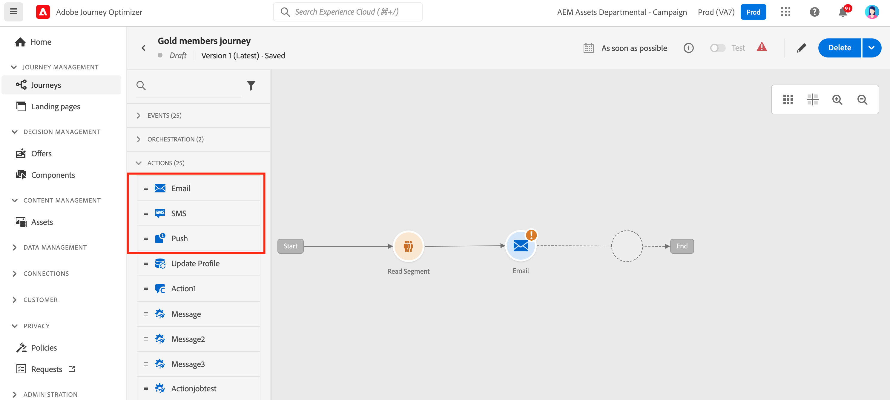

# Email, SMS, Push{#add-a-message-in-a-journey}

[!DNL Journey Optimizer] comes wit built-in message capabilities. You can simply add, in your journey, a push, an SMS, or email message activity and [define settings and content](../messages/messages-in-journeys.md). It is then executed and sent in the context of the journey.

You can also set up specific actions to send you messages:

* If you are using a third-party system to send your messages, you can create a custom action. Learn more in this [section](../action/action.md).

* If you are working with Campaign and Journey Optimizer, refer to these sections:

   * [[!DNL Journey Optimizer] and Campaign Classic v7/Campaign v8](../action/acc-action.md)
   * [[!DNL Journey Optimizer] and Campaign Standard](../action/acs-action.md)

To add a message in a journey, follow the steps below:

1. Start your journey with an [Event](general-events.md) or a [Read Segment](read-segment.md) activity.

1. From the **Actions** section of the palette, drag and drop an **email**, an **SMS** or a **Push** activity into the canvas.  

   

   All steps to configure the message and define its content are detailed in [this section](../messages/get-started-content.md).

