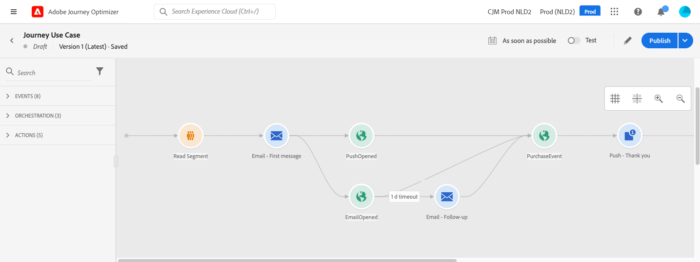
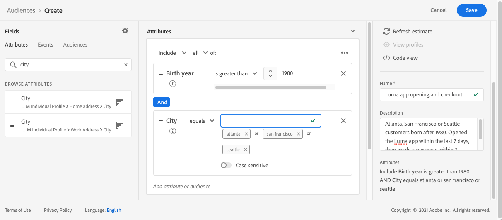
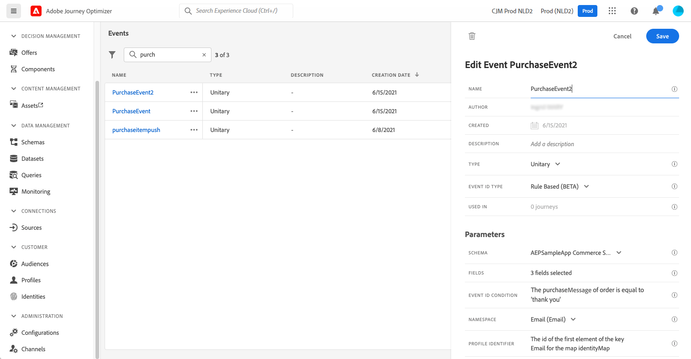
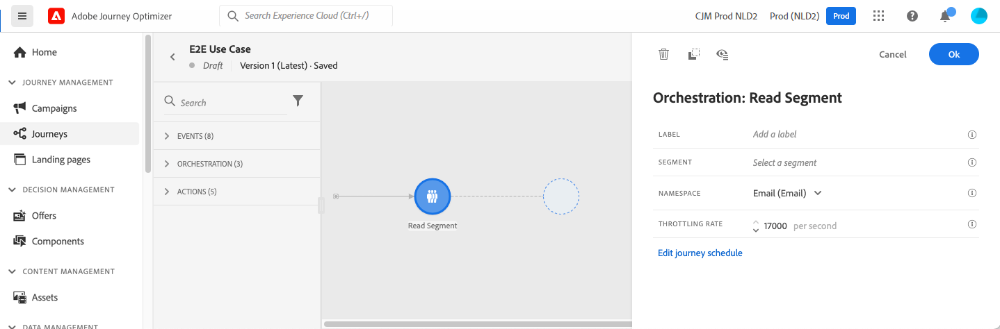
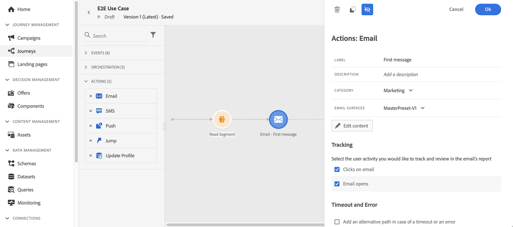

# Use case: send multi-channel messages{#send-multi-channel-messages}

This section presents a use case that combines a Read Audience, an event, reaction events and email/push messages.

## Description of the use case

In this use case, we want to send a first email message to all customers belonging to a specific audience. 

Based on their reaction to the first message, we want to send specific messages.

If the customer opens the email, we wait for a purchase and send a push message to thank the customer. 

If there is no reaction, we send them a follow-up email.

## Prerequisites

For this use case to work, you need to configure the following:

* an audience for all customers living in Atlanta, San Francisco, or Seattle and born after 1980.
* a purchase event

### Create the audience

In our journey, we want to leverage a specific audience of customers. All individuals belonging to the audience enter the journey and follow the different steps. In our example, we need an audience that targets all customers living in Atlanta, San Francisco, or Seattle and born after 1980. 

For more information on audiences, refer to this [page](../audience/about-audiences.md).

1. From the CUSTOMER menu section, select **[!UICONTROL Audiences]**.

1. Click the **[!UICONTROL Create audience]** button that is located at the top right of the audience list.

1. In the **[!UICONTROL Audience properties]** pane, enter a name for the audience.

1. Drag and drop the desired fields from the left pane into the center workspace, and then configure them according to your needs. In this example, we use the **City** and **Birth year** attributes fields.

1. Click **[!UICONTROL Save]**. 

   

The audience is now created and ready to be used in your journey. Using a **Read Audience** activity, you can make all individuals belonging to the audience enter the journey. 

### Configure the event

You need to configure an event that is sent to your journey when a customer makes a purchase. When the journey receives the event, it triggers the "thank you" message.

For this, we use a rule-based event. For more information on events, refer to this [page](../event/about-events.md).

1. In the ADMINISTRATION menu section, select **[!UICONTROL Configurations]**, then click **[!UICONTROL Events]**. Click **[!UICONTROL Create event]** to create a new event. 

1. Enter the name of your event.

1. In the **[!UICONTROL Event ID type]** field, select **[!UICONTROL Rule Based]**. 

1. Define the **[!UICONTROL Schema]** and payload **[!UICONTROL Fields]**. You can use several fields, for example, the product purchased, the purchase date and the purchase id. 

1. In the **[!UICONTROL Event ID condition]** field, define the condition used by the system to identify the events that trigger your journey. For example, you can add a `purchaseMessage` field and define the following rule: `purchaseMessage="thank you"`

1. Define the **[!UICONTROL Namespace]** and **[!UICONTROL Profile Identifier]**.

1. Click **[!UICONTROL Save]**. 

   

The event is now configured and ready to be used in your journey. Using the corresponding event activity, you can trigger an action every time a customer makes a purchase.

## Design the journey

1. Start the journey with a **Read Audience** activity. Select the audience created previously. All individuals belonging to the audience enter the journey.

   

1. Drop an **Email** action activity and define the content of the "first message". This message is sent to all individuals in the journey. Refer to this [section](../email/create-email.md) to learn how to configure and design an email.

   

1. Add a **Reaction** event and select **Email opened**. The event is triggered when an individual belonging to the audience opens the email.

1. Check the **Define the event timeout** box, define a duration (1 day in our example) and check **Set a timeout path**. This creates another path for individuals who do not open the push or email first message.

1. In the timeout path, drop an **Email** action activity and define the content of the "follow-up" message. This message is sent to the individuals who do not open the email or push first message in the next day. Refer to this [section](../email/create-email.md) to learn how to configure and design an email.

1. In the first path, add the purchase event created previously. The event is triggered when an individual makes a purchase.

1. After the event, drop a **Push** action activity and define the content of the "thank you" message. Refer to this [section](../push/create-push.md) to learn how to configure and design a push.

## Test and publish the journey

1. Before testing your journey, verify that it is valid and that there is no error.

1. Click on the **Test** toggle, located in the top right corner, to activate the test mode. Refer to this [section](testing-the-journey.md) to learn how to use the test mode.

1. When the journey is ready, publish it using the **Publish** button, located in the top right corner.
