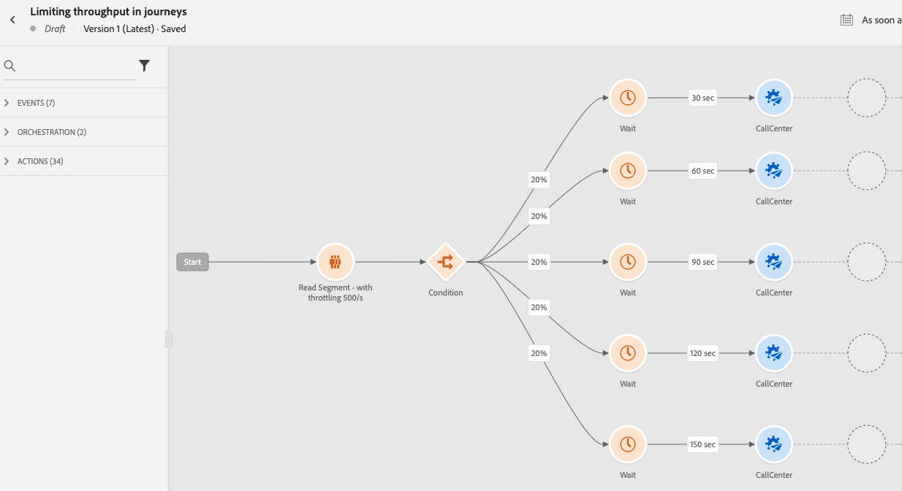

# Use case: limit throughput with External Data Sources and Custom Actions{#limit-throughput}

## Description of the use case

Adobe Journey Optimizer allows practitioners to send API calls to external systems through the use of Custom Actions and Data Sources.

This can be done with :

* **Data Sources**: to gather information from external systems and use it in the journey context, for example to get weather information about the profile city and have a dedicated journey flow based on that.

* **Custom Actions**: to send information to external systems, for example to send emails through an external solution using Journey Optimizer's orchestration capabilities alongside profile information, audience data and journey context.

If you're working with external data sources or custom actions, you may want to protect your external systems by limiting journey throughput: up to 5000 instances/second for unitary journeys and up to 20000 instances/second for audience-triggered ones. 

For custom actions, throttling capabilities are available at product level. Refer to this [page](../configuration/external-systems.md#capping).

For external data sources, you can define a capping limits at endpoint level to avoid overwhelming those external systems through Journey Optimizer's Capping APIs. However, all remaining requests after the limit is reached will be dropped. In this section, you will find workarounds that you can use to optimize your throughput. 

For more information on how to integrate with external systems, refer to this [page](../configuration/external-systems.md).

## Implementation

For **audience-triggered journeys**, you can define the reading rate of your Read Audience activity that will impact journey throughput. [Read more](../building-journeys/read-audience.md)

>[!NOTE]
>
> This is the maximum number of profiles that can enter the journey per second. This rate applies only to this activity and no others in the journey. [Read more](../building-journeys/read-audience.md)

You can modify this value from 500 to 20 000 instances per second. If you need to go lower than 500/s, you can also add "percentage split" conditions with wait activities to split your journey into multiple branches and have them execute at a specific time.

Let's take an example of a **audience-triggered journeys** working with a population of **10 000 profiles** and sending data to an external system supporting **100 requests/second**.

1. You can define your Read Audience to read profiles with a throughput of 500 profiles/second, meaning that it will take 20 seconds to read all your profiles. On second 1, you will read 500 of them, on second 2 500 more, etc. 

1. You can then add a "percentage split" Condition activity with a 20% split to have at each second 100 profiles in each branch.

1. After that, add Wait activities with a specific timer in each branch. Here we've set up a 30 seconds wait for each one. At every second, 100 profiles will flow into each branch.

    * On branch 1, they will wait for 30 seconds, meaning that:
         * on second 1, 100 profiles will wait for second 31
         * on second 2, 100 profiles will wait for second 32, etc.

    * On branch 2, they will wait for 60 seconds, meaning that:
         * On second 1, 100 profiles will wait for second 61 (1'01'')
         * On second 2, 100 profiles will wait for second 62 (1'02''), etc.

    * Knowing that we expect 20 seconds maximum to read all profiles, there will be no overlap between each branch, second 20 being the last one where profiles will flow into the condition. Between second 31 and second 51, all profiles in branch 1 will be processed. Between second 61 (1'01'') and second 81 (1'21''), all profiles in branch 2 will be processed, etc.

    * As a guardrail, you can also add a sixth branch to have less than 100 profiles per branch, especially if your external system only supports 100 requests/second. 

>[!IMPORTANT]
>
>As with any workaround, please test that solution thoroughly before going into production to make sure it does what you want.

As an additional guardrail, you can also use Capping capabilities.

>[!NOTE]
>
>Unlike Capping capabilities, which protect an endpoint by being global to all journeys of a sandbox, this workaround works only at journey level. This means that if multiple journeys are running in parallel and are targeting the same endpoint, you will need to take that into account while designing your journey. This workaround is therefore not suitable for every use case.
