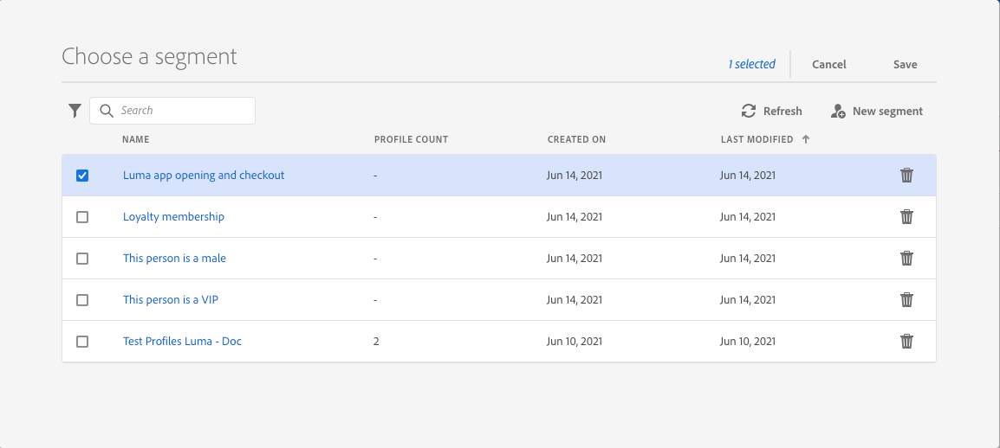
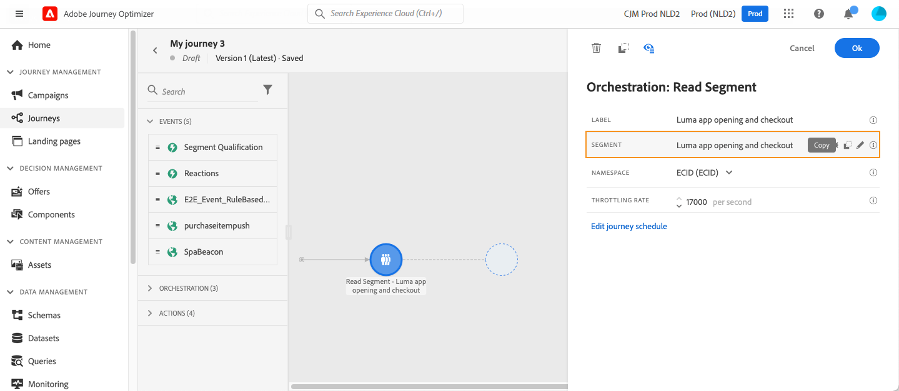
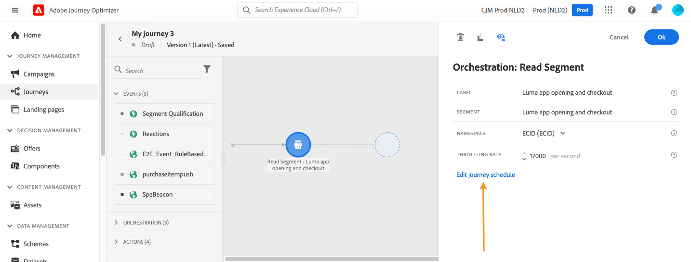
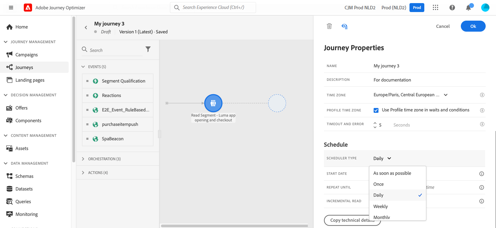
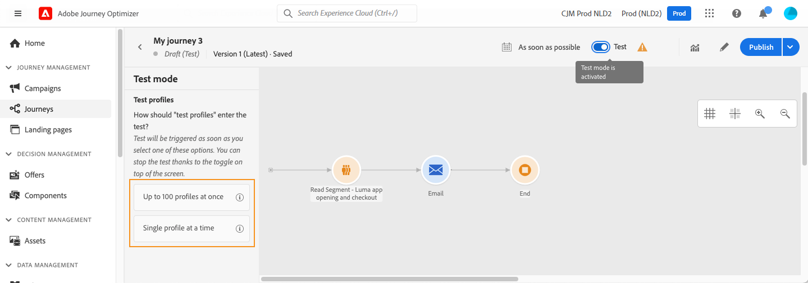
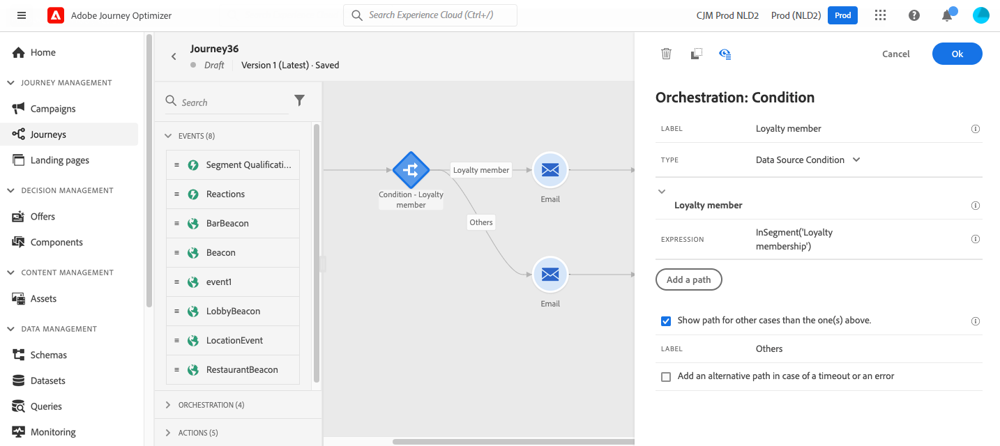
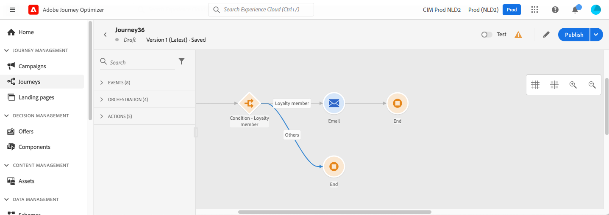
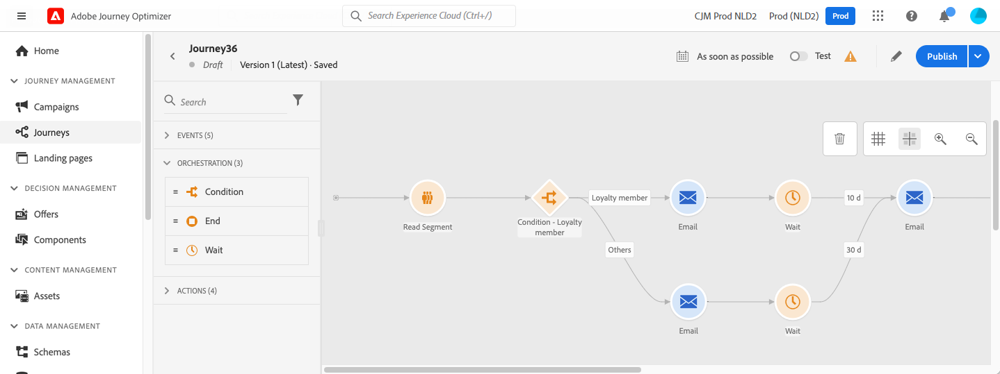

# Use an audience in a journey {#segment-trigger-activity}

## Add a Read Audience activity {#about-segment-trigger-actvitiy}

>[!CONTEXTUALHELP]
>id="ajo_journey_read_segment"
>title="Read Audience activity"
>abstract="The Read Audience activity allows you to make all individuals belonging to an Adobe Experience Platform audience enter a journey. Entrance into a journey can be executed either once, or on a regular basis."

Use the **Read Audience** activity to make all individuals of a audience enter the journey. Entrance into a journey can be executed either once, or on a regular basis.

Let's take as an example the "Luma app opening and checkout" audience created in the [Build audiences](../audience/about-audiences.md) use case. With the Read Audience activity, you can make all individuals belonging to this audience enter a journey and make them flow into individualized journeys that will leverage all journey functionalities: conditions, timers, events, actions.

## Must-read {#must-read}

* For journeys using a **Read Audience** activity, there is a maximum number of journeys that can start at the exact same time. Retries will be performed by the system but avoid having more than five journeys (with **Read Audience**, scheduled or starting "as soon as possible") starting at the exact same time. Best practice is to spread them over time, for example 5 to 10 minutes apart.

* Experience event field groups can not be used in journeys starting with a **Read audience** activity, an **[Audience qualification](audience-qualification-events.md)** activity, or a business event activity.

* As a best practice, we recommend you only use batch audiences in a **Read audience** activity. This will provide reliable and consistent count for the audiences used in a journey. Read audience is designed for batch use cases. If your use case needs real time data please use **[Audience qualification](audience-qualification-events.md)** activity.

* For now, the use of audiences [imported from a CSV file](https://experienceleague.adobe.com/docs/experience-platform/segmentation/ui/overview.html#import-audience) or resulting from [composition workflows](../audience/get-started-audience-orchestration.md) into journeys is available as a private beta. For more information, contact your Adobe representative.

## Configure the activity {#configuring-segment-trigger-activity}

The steps to configure the Read Audience activity are as follows:

1. Unfold the **[!UICONTROL Orchestration]** category and drop a **[!UICONTROL Read Audience]** activity into your canvas.

    The activity must be positioned as the first step of a journey.

1. Add a **[!UICONTROL Label]** to the activity (optional).

1. In the **[!UICONTROL Audience]** field, choose Adobe Experience Platform audience that will enter the journey, then click **[!UICONTROL Save]**. You can select any Adobe Experience Platform audience generated using [segment definitions](../audience/creating-a-segment-definition.md).

    >[!NOTE]
    >
    >In addition, you can also target Adobe Experience Platform audiences created using [audience compositions](../audience/get-started-audience-orchestration.md) or [uploaded from a CSV file](https://experienceleague.adobe.com/docs/experience-platform/segmentation/ui/overview.html#import-audience){target="_blank"}. These capabilities are currently available as a private beta.

    Note that you can customize the columns displayed in the list and sort them.

    

   Once the audience is added, the **[!UICONTROL Copy]** button allows you to copy its name and ID:

   `{"name":"Luma app opening and checkout","id":"8597c5dc-70e3-4b05-8fb9-7e938f5c07a3"}`

   

    >[!NOTE]
    >
    >Only the individuals with the **Realized** and **Existing** audience participation statuses will enter the journey. For more on how to evaluate an audience, refer to the [Segmentation Service documentation](https://experienceleague.adobe.com/docs/experience-platform/segmentation/tutorials/evaluate-a-segment.html#interpret-segment-results){target="_blank"}. 

1. In the **[!UICONTROL Namespace]** field, choose the namespace to use in order to identify the individuals. By default, the field is pre-filled with the last used namespace. [Learn more about namespaces](../event/about-creating.md#select-the-namespace).

    >[!NOTE]
    >
    >Individuals belonging to an audience that does not have the selected identity (namespace) among their different identities cannot enter the journey. You can only select a people-based identity namespace. If you have defined a namespace for a lookup table (for example: ProductID namespace for a Product lookup), it will not be available in the **Namespace** dropdown list.

1. Set the **[!UICONTROL Reading rate]**. This is the maximum number of profiles that can enter the journey per second. This rate applies only to this activity and no others in the journey. If you want to define a throttling rate on custom actions, for example, you need to use the throttling API. Refer to this [page](../configuration/throttling.md).
    
    This value is stored in the journey version payload. The default value is 5,000 profiles per second. You can modify this value from 500 to 20,000 profiles per second.

    >[!NOTE]
    >
    >The overall reading rate per sandbox is set to 20,000 profiles per second. Therefore, the reading rate of all the read audiences that run simultaneously in the same sandbox add up to at most 20,000 profiles per second. You cannot modify this cap.

1. The **[!UICONTROL Read Audience]** activity allows you to specify the time at which the audience will enter the journey. To do this, click the **[!UICONTROL Edit journey schedule]** link to access the journey's properties, then configure the **[!UICONTROL Scheduler type]** field.

    

    By default, audiences enter the journey **[!UICONTROL As soon as possible]**. If you want to make the audience enter the journey on a specific date/time or on a recurring basis, select the desired value from the list.

    >[!NOTE]
    >
    >Note that the **[!UICONTROL Schedule]** section is only available when a **[!UICONTROL Read Audience]** activity has been dropped in the canvas.

    

    **Incremental read** option: when a journey with a recurring **Read audience** executes for the first time, all the profiles in the audience enter the journey. This option allows you to target, after the first occurence, only the individuals who entered the audience since the last execution of the journey. 

    **Force reentrance on recurrence**: this option allows you to make all profiles still present in the journey automatically exit it on the next execution. For example, if you have a 2 days wait in a daily recurrent journey, by activating this option, profiles will always be moved on the next journey execution (so the day after), whether they are in the next run audience or not. If the lifespan of your profiles in this journey may be longer than the recurrence frequency, do not activate this option to make sure that profiles can finish their journey.

<!--

### Segment filters {#segment-filters}

[!CONTEXTUALHELP]
>id="jo_segment_filters"
>title="About segment filters"
>abstract="You can choose to target only the individuals who entered or exited a specific segment during a specific time window. For example, you can decide to only retrieve all the customers who entered the VIP segment since last week."

You can choose to target only the individuals who entered or exited a specific segment during a specific time window. For example, you can decide to only retrieve all the customers who entered the VIP segment since last week. Only the new VIP customers will be targeted. All the customers who were already part of the VIP segment before will be excluded.

To activate this mode, click the **Segment Filters** toggle. Two fields are displayed:

**Segment membership**: choose whether you want to listen to segment entrances or exits. 

**Lookback window**: define when you want to start to listen to entrances or exits. This lookback window is expressed in hours, starting from the moment the journey is triggered.  If you set this duration to 0, the journey will target all members of the segment. For recurring journeys, it will take into account all entrances/exits since the last time the journey was triggered.

-->

>[!NOTE]
>
>One-shot Read audience journeys move to the Finished status 30 days after the journey execution. For scheduled Read audiences, it is 30 days after the execution of the last occurrence.

## Test and publish the journey {#testing-publishing}

The **[!UICONTROL Read Audience]** activity allows you to test the journey on a unitary profile.

To do this, activate the test mode.

Configure and run the test mode as usual. [Learn how to test a journey](testing-the-journey.md).

Once the test is running, the **[!UICONTROL Show logs]** button allows you to see the test results. For more on this, refer to [this section](testing-the-journey.md#viewing_logs)

Once the tests are successful, you can publish your journey (see [Publishing the journey](publishing-the-journey.md)). Individuals belonging to the audience will enter the journey on the date/time specified in the journey's properties **[!UICONTROL Scheduler]** section.

>[!NOTE]
>
>For recurring audience-based journeys, the journey will automatically close once its last occurrence is executed. If no end date/time has been specified, you will have to close the journey to new entrances manually to end it.

## Audience targeting in audience-based journeys

Audience-based journeys always start with a **Read Audience** activity to retrieve individuals belonging to an Adobe Experience Platform audience.

The audience belonging to the audience is retrieved once or on a regular basis.

After entering the journey, you can create audience orchestration use cases, making individuals from the initial audience flow into different branches of the journey. 

**Segmentation**

You can use conditions to perform segmentation using the **Condition** activity. For example, you can make VIP persons take a particular path and non-VIP flow in another path.

The segmentation can be based on:

* data source data
* the context of events part of the journey data, for example: did a person click on the message received an hour ago?
* a date, for example: are we in June when a person go through the journey?
* a time, for example: is it morning in the person's timezone?
* an algorithm splitting the audience flowing in the journey based on a percentage, for example: 90% - 10% to exclude a control group

**Exclusion**

The same **Condition** activity used for segmentation (see above) also allows you to exclude part of the population. For example, you can exclude VIP persons by making them flow into a branch with an end step right after.

This exclusion could happen right after audience retrieval, for population counting purposes or along a multistep journey.

**Union**

Journeys allow you to create N branches and join them together after a segmentation.

As a result, you can make two audiences return to a common experience.

For example, after following a different experience during ten days in a journey, VIP and non-VIP customers can return to the same path.

After a union, you can split the audience again by performing a segmentation or an exclusion.

