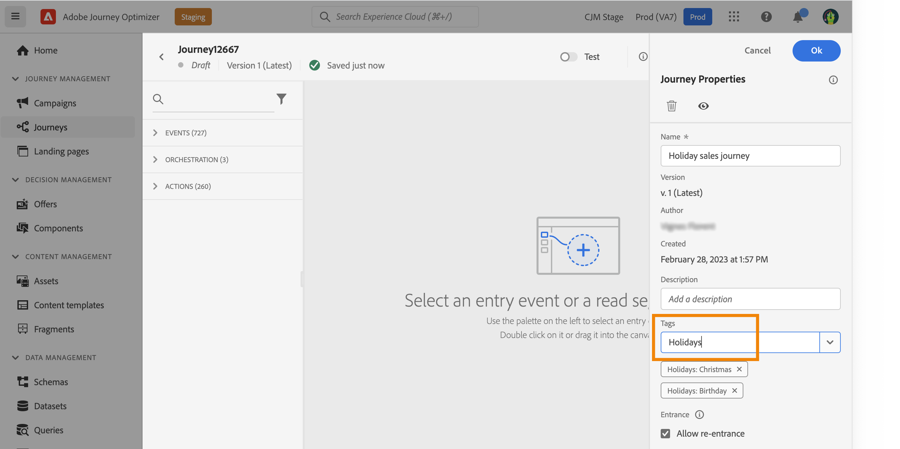
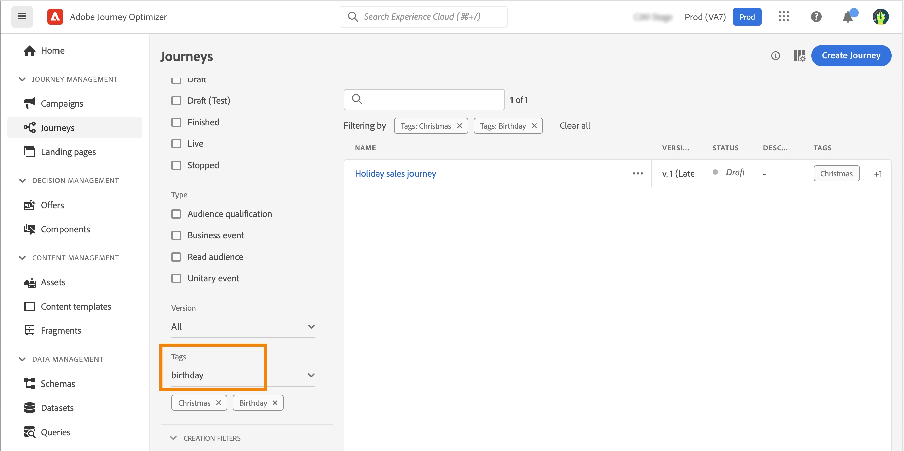
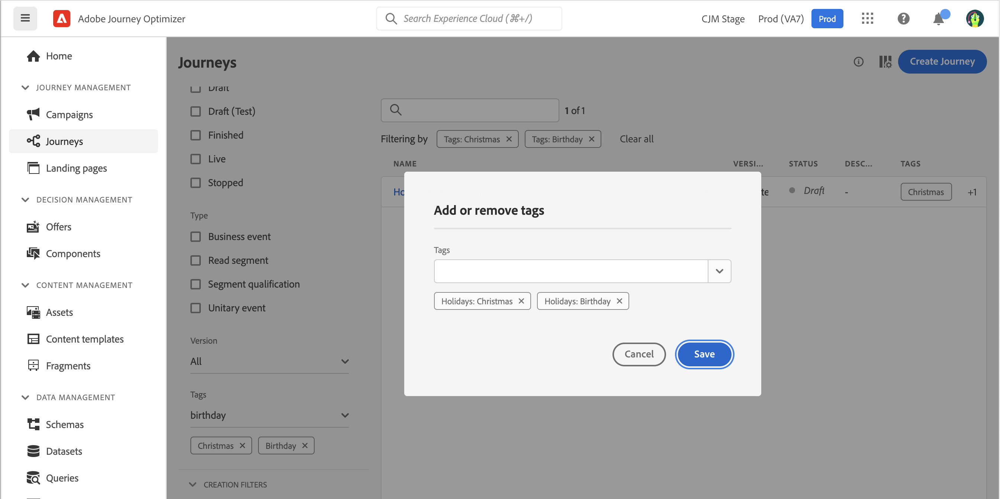

# Manage tags in journeys {#journey_tags}

As a Journey Optimizer practitioner, you can organize your journeys using tags. Tags are a quick and easy way of classifying objects to improve search.

>[!CAUTION]
>
> Unified tags are currently in Beta. The documentation and the functionality are subject to change.

## Important notes

* Tags are case in-sensitive
* To completely delete a tag, you must delete it from all objects.
* If you duplicate or create a new version of a journey, tags are preserved.

## Add tags when creating a journey

The **Tags** field, in the journey properties, allows you to define tags for your journey. You can either select an existing tag, or create a new one. Start typing the name of the desired tag and select it from the list. If it is not available, click **Create** to create a new one and add it to your journey. You can define as many tags as needed.

The list of tags defined is displayed below the field. You can delete them.

## Edit tags and filter

The Journey list displays a dedicated column so you can easily visualize your tags. 

A filter is also available to only display journeys with certain tags.

You can add or delete tags from any type of journey (live, draft, etc). Click the **More actions** icon next to the journey, and select **Edit tags**. 

## Advanced management

Administrators can add tags and organize them by categories using the **Tags** menu, under **ADMINISTRATION**. Refer to this [documentation](https://experienceleague.adobe.com/docs/experience-platform/administrative-tags/overview.html). 
