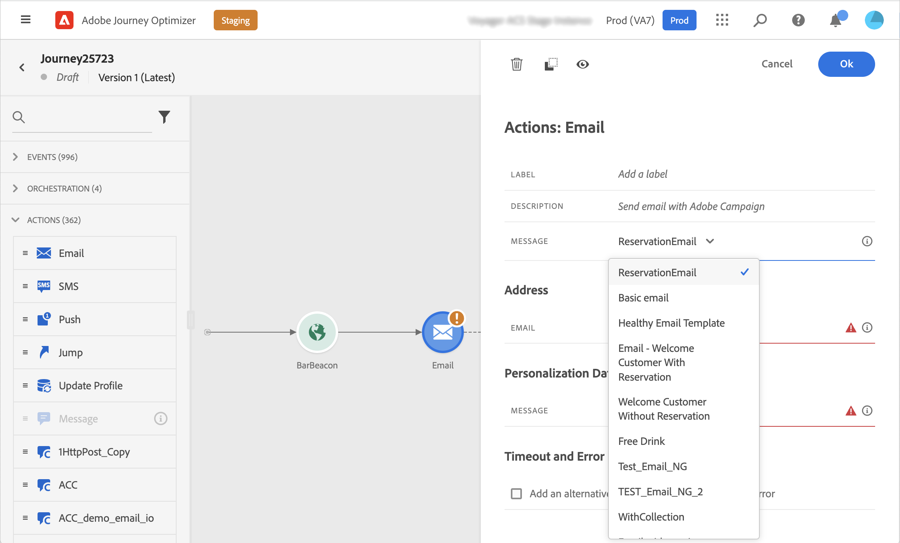
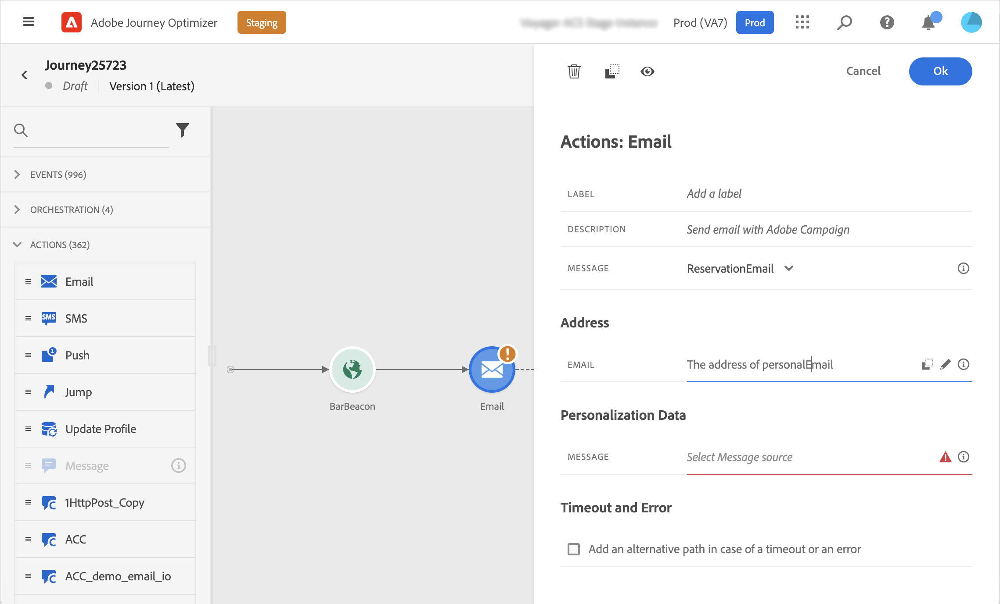
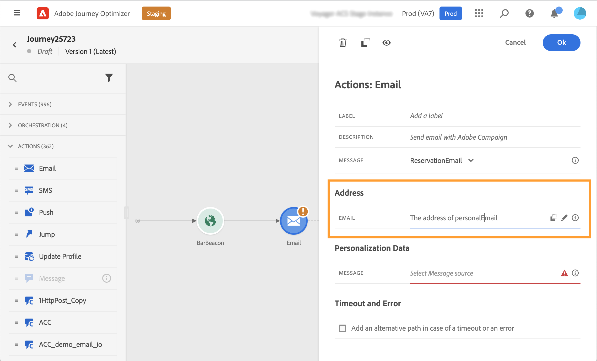
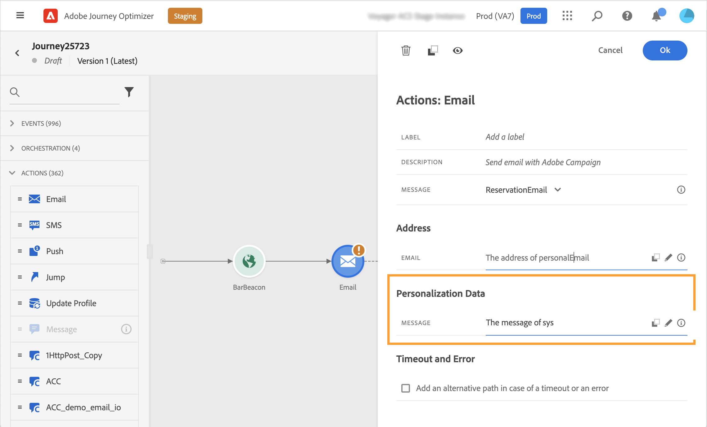
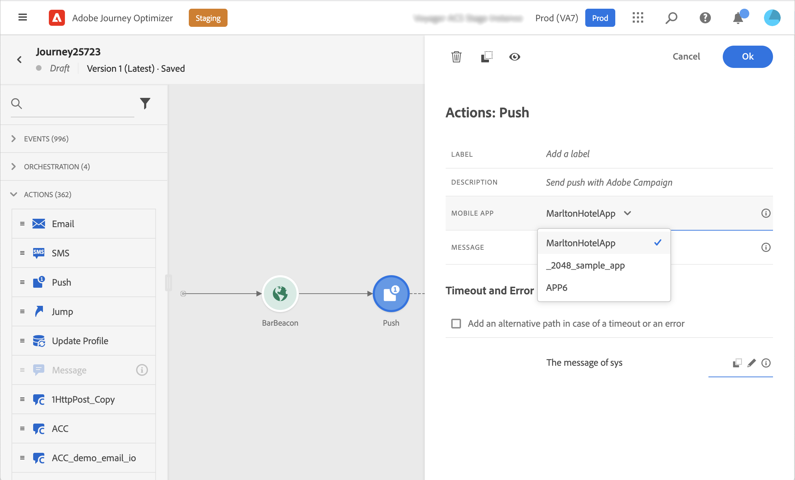

# Adobe Campaign Standard actions {#using_campaign_action}

>[!CONTEXTUALHELP]
>id="ajo_journey_action_custom_acs"
>title="Custom actions"
>abstract="An integration is available if you have Adobe Campaign Standard. It allows you to send emails, push notifications and SMS using Adobe Campaign Transactional Messaging capabilities."

If you have Adobe Campaign Standard, the following built-in action activities are available: **[!UICONTROL Email]**, **[!UICONTROL Push]** and **[!UICONTROL SMS]**. 

>[!NOTE]
>
>For this, you need to configure the built-in action. Refer to [this page](../action/acs-action.md).

For each of these channels, you select an Adobe Campaign Standard Transactional Messaging **template**. For the built-in email, SMS and push channels, we rely on Transactional Messaging to execute message sending. It means that if you want to use a certain message template in your journeys, you must publish it in Adobe Campaign Standard. Refer to [this page](https://experienceleague.adobe.com/docs/campaign-standard/using/communication-channels/transactional-messaging/getting-started-with-transactional-msg.html) to learn how to use this feature.

>[!NOTE]
>
>The Campaign Standard transactional message and its associated event must be published in order to be used in Journey Optimizer. If the event is published but the message is not, it will not be visible in the Journey Optimizer interface. If the message is published but its associated event is not, it will be visible in the Journey Optimizer interface but it will not be usable.



You can use an event (also known as real-time) or profile transactional messaging template.

>[!NOTE]
>
>When we send real-time transactional messages (rtEvent) or when we route messages with a third-party system thanks to a custom action, a specific setup is required for fatigue, block list or unsubscription management. For example, if an "unsubscribe" attribute is stored in the Adobe Experience Platform or in a third-party system, a condition will have to be added before the message sending to check this condition.

When you select a template, all the fields expected in the message payload are displayed in the activity configuration pane under **[!UICONTROL Address]** and **[!UICONTROL Personalization Data]**. You need to map each of these fields with the field you want to use, either from the event or from the data source. You can also use the advanced expression editor to pass a value manually, perform data manipulation on retrieved information (for example convert a string to uppercase) or use functions such as "if, then, else". See [this page](expression/expressionadvanced.md).



## Email and SMS {#section_asc_51g_nhb}

For **[!UICONTROL Email]** and **[!UICONTROL SMS]**, the parameters are identical.

>[!NOTE]
>
>When utilizing a profile's transactional template for email, the unsubscription mechanism is automatically handled by Adobe Campaign Standard. To implement this, you can easily include an **[!UICONTROL Unsubscription link]** content block within [the transactional email template](https://experienceleague.adobe.com/docs/campaign-standard/using/communication-channels/transactional-messaging/getting-started-with-transactional-msg.html). However, if you're using an event-based template (rtEvent), you must incorporate a link in the message that passes the recipient's email as a URL parameter, and directs them to an unsubscription landing page. It is necessary to create this landing page and ensure that the recipient's decision to unsubscribe is effectively transmitted to Adobe.

First, you need to choose a transactional messaging template.

Two categories are available: **[!UICONTROL Address]** and **[!UICONTROL Personalization Data]**.

You can easily define where to retrieve the **[!UICONTROL Address]** or the **[!UICONTROL Personalization Data]** using the interface. You can browse through events and available data source’s fields. You can also use the advanced expression editor for more advanced use cases such as using a data source that requires the passing of parameters or performing manipulations. See [this page](expression/expressionadvanced.md).

**[!UICONTROL Address]**

>[!NOTE]
>
>This category is only visible if you select an "event" transactional message. For "profile" messages, the **[!UICONTROL Address]** field is automatically retrieved from Adobe Campaign Standard by the system.

These are the fields the system requires to know where to send the message. For an email template, it's the email address. For an SMS, it's the mobile phone number.



**[!UICONTROL Personalization Data]**

>[!NOTE]
>
>You cannot pass a collection in personalization data. If the transactional email or SMS expects collections, it will not work. Also note that the personalization data has an expected format (example: string, decimal, etc.). You must be careful to respect these expected formats. 

These are the fields expected by the Adobe Campaign Standard message. These fields can be used to personalize the message, apply conditional formatting, or pick a specific message variant. 



## Push {#section_im3_hvf_nhb}

Prior to using the push activity, your mobile app needs to be configured along with Campaign Standard to send push notifications. Use this [article](https://helpx.adobe.com/campaign/kb/integrate-mobile-sdk.html) to take the necessary implementation steps for mobile.

First, you need to choose a mobile app from the drop-down list and a transactional message.



Two categories are available: **[!UICONTROL Target]** and **[!UICONTROL Personalization Data]**.

**[!UICONTROL Target]**

>[!NOTE]
>
>This category is only visible if you select an event message. For profile messages, the **[!UICONTROL Target]** fields are automatically retrieved by the system using the reconciliation performed by Adobe Campaign Standard.

In this section, you need to define the **[!UICONTROL Push platform]**. The drop-down list allows you to select **[!UICONTROL Apple Push Notification Server]** (iOS) or **[!UICONTROL Firebase Cloud Messaging]** (Android). You can alternatively select a specific field from an event or a data source, or define an advanced expression.

You also need to define the **[!UICONTROL Registration Token]**. The expression depends on how the token is defined in the event payload or in other [!DNL Journey Optimizer] information. It can be a simple field or a more complex expression in case the token is defined in a collection for instance:

```
@event{Event_push._experience.campaign.message.profileSnapshot.pushNotificationTokens.first().token}
```

**[!UICONTROL Personalization Data]**

>[!NOTE]
>
>You cannot pass a collection in personalization data. If the transactional push expects collections, it will not work. Also note that the personalization data has an expected format (example: string, decimal, etc.). You must be careful to respect these expected formats.

These are the fields expected by the transactional template used in your Adobe Campaign Standard message. These fields can be used to personalize your message, apply conditional formatting, or pick a specific message variant.
