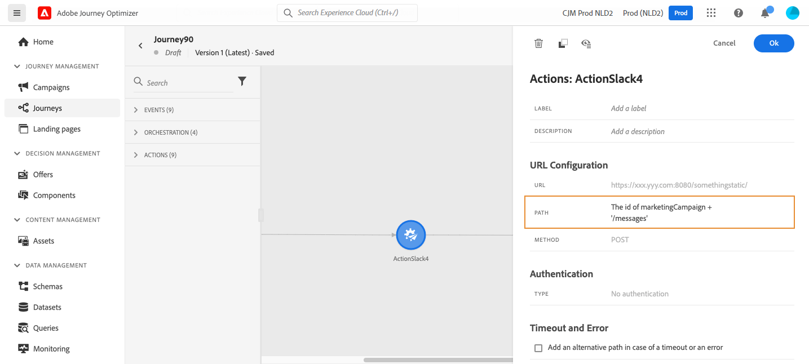
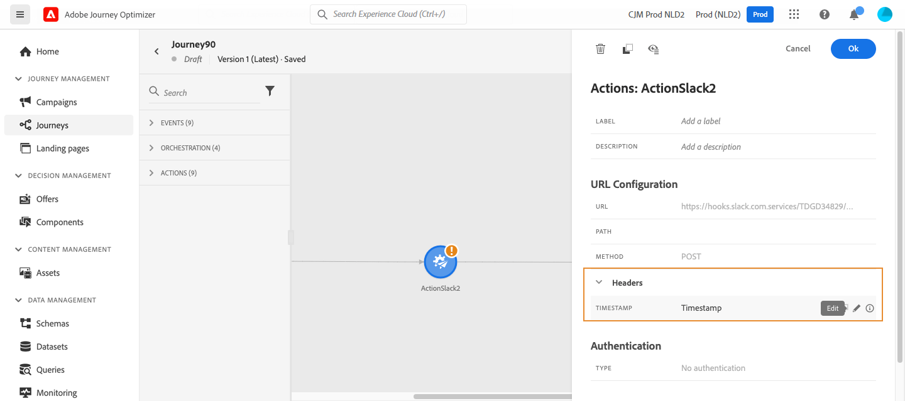

# Use custom actions {#use-custom-actions}

>[!CONTEXTUALHELP]
>id="ajo_journey_action_custom"
>title="Custom actions"
>abstract="Custom actions enable you to configure connection of a third-party system to send messages or API calls. An action can be configured with any service from any provider that can be called through a REST API with a JSON-formatted payload."

Custom actions enable you to configure connection of a third-party system to send messages or API calls. An action can be configured with any service from any provider that can be called through a REST API with a JSON-formatted payload.

## Consent and data governance {#privacy}

In Journey Optimizer, you can apply data governance and consent policies to your custom actions to prevent specific fields from being exported to third-party systems or exclude customers who have not consented to receive email, push or SMS communication. For more information, refer to the following pages:

* [Data governance](../action/action-privacy.md).
* [Consent](../action/consent.md).

## URL configuration

The configuration pane of the **Custom action** activity shows the URL configuration parameters and the authentication parameters that are configured for the custom action. You cannot set up the static part of the URL in the journey, but in the global configuration of the custom action. [Learn more](../action/about-custom-action-configuration.md).

### Dynamic path

If the URL includes a dynamic path, specify the path in the **[!UICONTROL Path]** field.

To concatenate fields and plain text strings, use the String functions or the Plus sign (+) in the advanced expression editor. Enclose plain text strings in single quotation marks (') or in double quotation marks ("). [Learn more](expression/expressionadvanced.md).

This table shows an example of configuration:

| Field | Value |
| --- | --- |
| URL | `https://xxx.yyy.com:8080/somethingstatic/` |
| Path | `The id of marketingCampaign + '/messages'` |

The concatenated URL has this form:

`https://xxx.yyy.com:8080/somethingstatic/`\<campaign ID\>`/messages` 

### Headers

The **[!UICONTROL URL Configuration]** section shows the dynamic header fields, but not the constant header fields. Dynamic header fields are HTTP header fields whose value is configured as a variable. [Learn more](../action/about-custom-action-configuration.md).

If required, specify the value of dynamic header fields:

1. Select the custom action in the journey.
1. In the configuration pane, click the pencil icon next to the header field in the **[!UICONTROL URL Configuration]** section.

   

1. Select a field and click **[!UICONTROL OK]**.

## Action parameters

In the **[!UICONTROL Action parameters]** section, you'll see the message parameters defined as _"Variable"_. For these parameters, you can define where to get this information (example: events, data sources), pass values manually or use the advanced expression editor for advanced use cases. Advanced uses cases can be data manipulation and other function usage. Refer to this [page](expression/expressionadvanced.md).

**Related topics**

[Configure an action](../action/about-custom-action-configuration.md)
