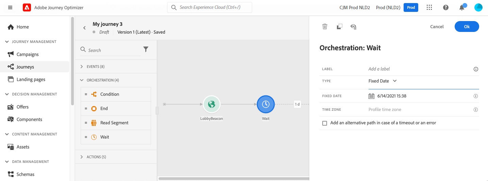
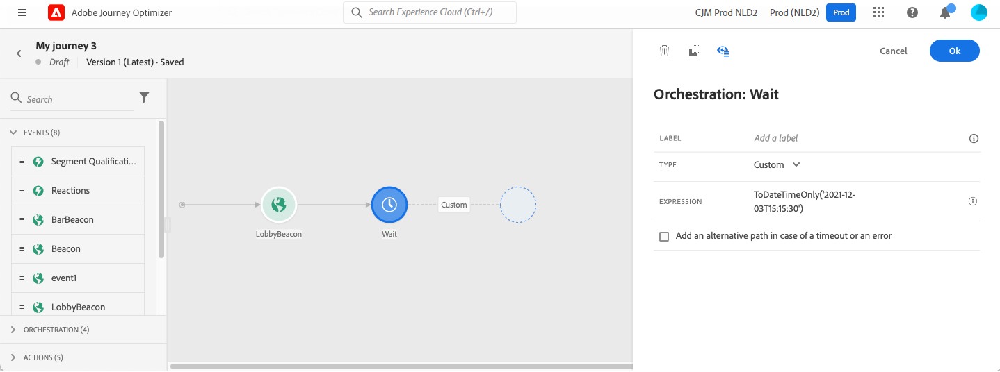

# Wait activity{#wait-activity}

>[!CONTEXTUALHELP]
>id="ajo_journey_wait"
>title="Wait activity"
>abstract="If you want to wait before executing the next activity in the path, you can use a Wait activity. It allows you to define the moment when the next activity will be executed. Two options are available: duration and custom."

If you want to wait before executing the next activity in the path, you can use a **[!UICONTROL Wait]** activity. It allows you to define the moment when the next activity will be executed. The following options are available:

* [Duration](#duration) 
* [Custom](#custom) 

<!--
* [Email send time optimization](#email_send_time_optimization)
* [Fixed date](#fixed_date) 
-->

## About the Wait activity{#about_wait}

The maximum wait duration is 29 days. In test mode, the **[!UICONTROL Wait time in test]** parameter allows you to define the time that each wait activity will last. The default time is 10 seconds. This will ensure that you get the test results quickly. See [this page](../building-journeys/testing-the-journey.md).

Be cautious when using multiple Wait activities in a journey as the global journey timeout is 30 days, meaning that a profile will always drop out of the journey maximum 30 days after he/she entered it. See [this page](../building-journeys/journey-gs.md#global_timeout).

An individual can enter a wait activity only if he or she has enough time left in the journey to complete the wait duration before the 30 days journey timeout. For example, if you add two wait activities set to 20 days each, the system will detect that the second wait will end after the 30 days timeout. The second wait will therefore be ignored and the individual will exit the journey before starting it. In that example, the customer will stay 20 days in total in the journey.

It is a best practice to not use waits to block re-entrance. Instead, use the **Allow re-entrance** option at the journey properties level. See [this page](../building-journeys/journey-gs.md#entrance).

## Duration wait{#duration}

Select the duration of the wait before the execution of the next activity. The maximum duration is 29 days.

<!--
## Fixed date wait{#fixed_date}

Select the date for the execution of the next activity.

-->

## Custom wait{#custom}

This option lets you define a custom date, for example 12 July 2020 at 5pm, using an advanced expression based on a field coming from an event or a data source. It does not let you define a custom duration, for example, 7 days. The expression in the expression editor should provide a dateTimeOnly format. Refer to this [page](expression/expressionadvanced.md). For more information on dateTimeOnly format, see this [page](expression/data-types.md).

>[!NOTE]
>
>You can leverage a dateTimeOnly expression or use a function to convert to a dateTimeOnly. For example: toDateTimeOnly(@event{Event.offerOpened.activity.endTime}), the field in the event being of the form 2016-08-12T09:46:06Z.
>
>The **time zone** is expected in the properties of your journey. As a result, it is not possible today from the interface to directly point at a full ISO-8601 timestamp mixing time and time zone offset like 2016-08-12T09:46:06.982-05. See [this page](../building-journeys/timezone-management.md).

To validate that the wait activity works as expected, you can use step events. See [this page](../reports/query-examples.md#common-queries).

<!--## Email send time optimization{#email_send_time_optimization}

This type of wait uses a score calculated in Adobe Experience Platform. The score calculates the propensity to click or open an email in the future based on past behavior. Note that the algorithm calculating the score needs a certain amount of data to work. As a result, when it does not have enough data, the default wait time will apply. At publication time, you'll be notified that the default time applies.

>[!NOTE]
>
>The first event of your journey must have a namespace.
>
>This capability is only available after an **[!UICONTROL Email]** activity. You need to have Adobe Campaign Standard.

1. In the **[!UICONTROL Amount of time]** field, define the number of hours to consider to optimize email sending.
1. In the **[!UICONTROL Optimization type]** field, choose if the optimization should increase clicks or opens.
1. In the **[!UICONTROL Default time]** field, define the default time to wait if the predictive send time score is not available.

    >[!NOTE]
    >
    >Note that the send time score can be unavailable because there is not enough data to perform the calculation. In this case, you will be informed, at publication time, that the default time applies.

-->
