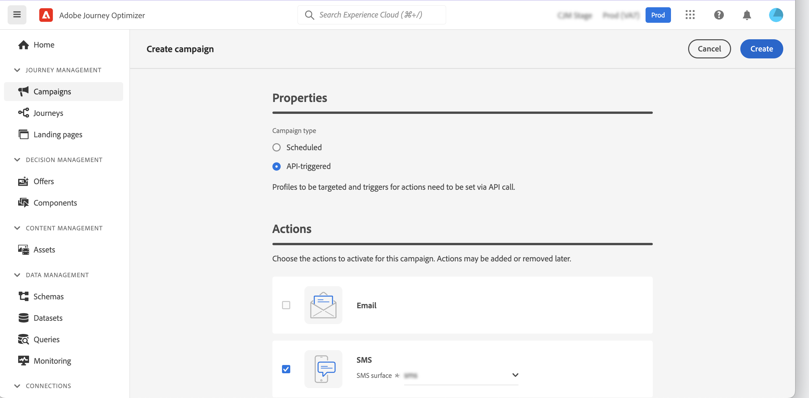
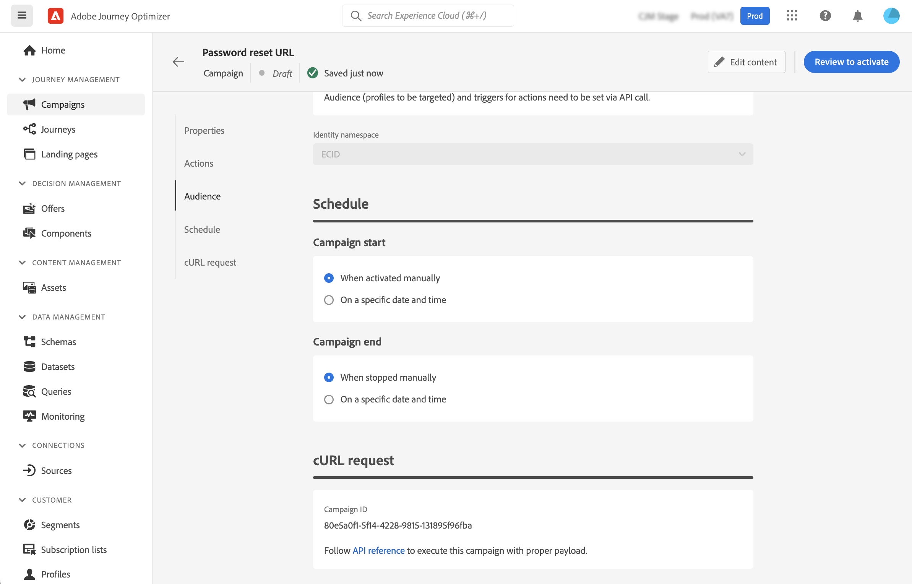
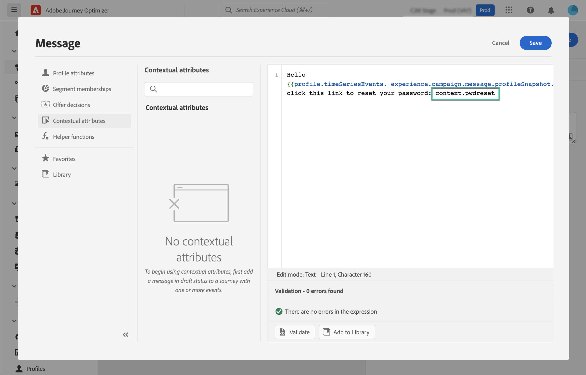
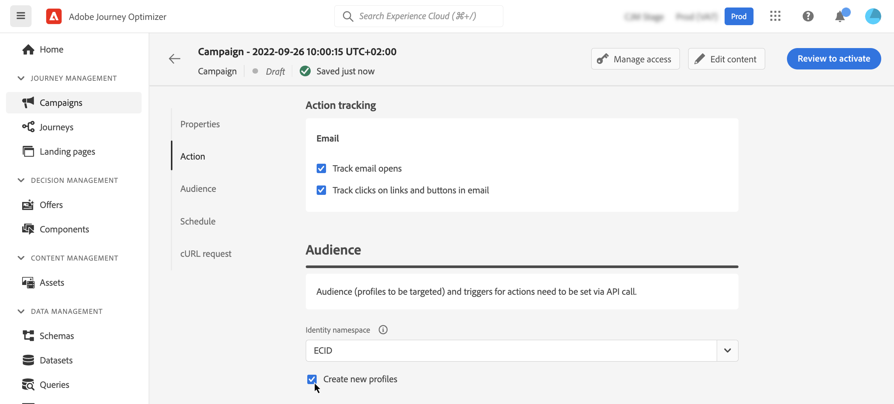

# Trigger campaigns using APIs {#trigger-campaigns}

## About API-triggered campaigns {#about}

With [!DNL Journey Optimizer], you can create campaigns and then invoke them from an external system based on user trigger using the [Interactive Message Execution REST API](https://developer.adobe.com/journey-optimizer-apis/references/messaging/#tag/execution). This allows you to cover various operational and transactional messaging needs like password resets, OTP token, among others. 

To do this, you first need to create an API-triggered campaign in Journey Optimizer, and then launch its execution through an API call.

Available channels for API-triggered campaigns are Email, SMS and Push messages.

## Create an API-triggered campaign {#create}

### Configure and activate the campaign {#create-activate}

The process to create API-triggered campaigns remains the same as scheduled campaigns, except for the audience selection which is performed in the API payload. Detailed information on how to create a campaign is available in [this section](create-campaign.md).

To create an API-triggered campaign, follow these steps:

1. Create a new campaign with the **[!UICONTROL API-triggered]** type.

1. Choose the channel and the channel surface to use to send your message, then click **[!UICONTROL Create]**.

    
    
1. Specify a title and a description for the campaign, then click **[!UICONTROL Edit content]** to configure the message to send.

    >[!NOTE]
    >
    >You can pass additional data into the API payload that you can leverage to personalize your message. [Learn more](#contextual)
    >
    >Using a large number or heavy contextual data in your content may impact performances.

1. In the **[!UICONTROL Audience]** section, specify the namespace to use to identify the individuals from the audience.

    The **[!UICONTROL Create new profiles]** option allows you to automatically create profiles that do not exist in the database. [Learn more on profile creation at campaign execution](#profile-creation)

1. Configure the campaign's start and end dates. 

    If you configure a specific start and/or end date for a campaign, it will not be executed outside these dates, and API calls will fail if the campaign is triggered by APIs.

1. Click **[!UICONTROL Review to activate]** to check that your campaign is correctly configured, then activate it.

You are now ready to execute the campaign from the APIs. [Learn more](#execute)

### Execute the campaign {#execute}

Once your campaign has been activated, you need to retrieve the generated sample cURL request and use it into the API to build your payload and trigger the campaign.

1. Open the campaign, then copy-paste the sample request from the **[!UICONTROL cURL request]** section.

    

1. Use this cURL request into the APIs to build your payload and trigger the campaign. For more information, refer to the [Interactive Message Execution API documentation](https://developer.adobe.com/journey-optimizer-apis/references/messaging/#tag/execution).

    >[!NOTE]
    >
    >If you have configured a specific start and/or end date when creating the campaign, it will not be executed outside these dates, and API calls will fail.

## Use contextual attributes in API-triggered campaigns {#contextual}

With API-triggered campaigns, you can pass additional data in the API payload and use them inside the campaign to personalize your message.

Let's take this example, where customers want to reset their password, and you want to send them a password reset URL that is generated in a third-party tool. With API-triggered campaigns, you can pass this generated URL into the API payload, and leverage it into the campaign to add it into the message.

>[!NOTE]
>
>Unlike profile-enabled events, the contextual data passed in the REST API is used for one-off communication and not stored against profile. At maximum, profile is created with the namespace details, if it was found missing.

In order to use these data in your campaigns, you need to pass them into the API payload, and add them in your message using the Expression editor. To do this, use the `{{context.<contextualAttribute>}}` syntax, where `<contextualAttribute>` should match the name of the variable in your API payload containing the data that you want to pass.

The `{{context.<contextualAttribute>}}` syntax is mapped to a String datatype only.

>[!IMPORTANT]
>
>The contextual attributes passed into the request cannot exceed 50kb.
>
>The `context.system` syntax is restricted to Adobe internal usage only, and should not be used to pass contextual attributes.

Note that, for now, no contextual attribute is available for use in the left rail menu. Attributes must be typed directly in your personalization expression, with no check being performed by [!DNL Journey Optimizer].

## Profile creation at campaign execution {#profile-creation}

In some cases, you may need to send transactional messages to profiles that do not exist in the system. For example if an unknown user tries to reset password on your website.

When a profile does not exist in the database, Journey Optimizer allows you to automatically create it when executing the campaign to allow sending the message to this profile.

>[!IMPORTANT]
>
>This feature is provided for **very small volume profile creation** in a large volume transactional sending use case, with bulk of profiles already existing in platform.

To activate profile creation at campaign execution, toggle the **[!UICONTROL Create new profiles]** option on in the **[!UICONTROL Audience]** section. 

>[!NOTE]
>
>Unknown profiles are created in the **AJO Interactive Messaging Profile Dataset** dataset, in three default namespace (email, phone and ECID) respectively for each outbound channels (Email, SMS and Push).
