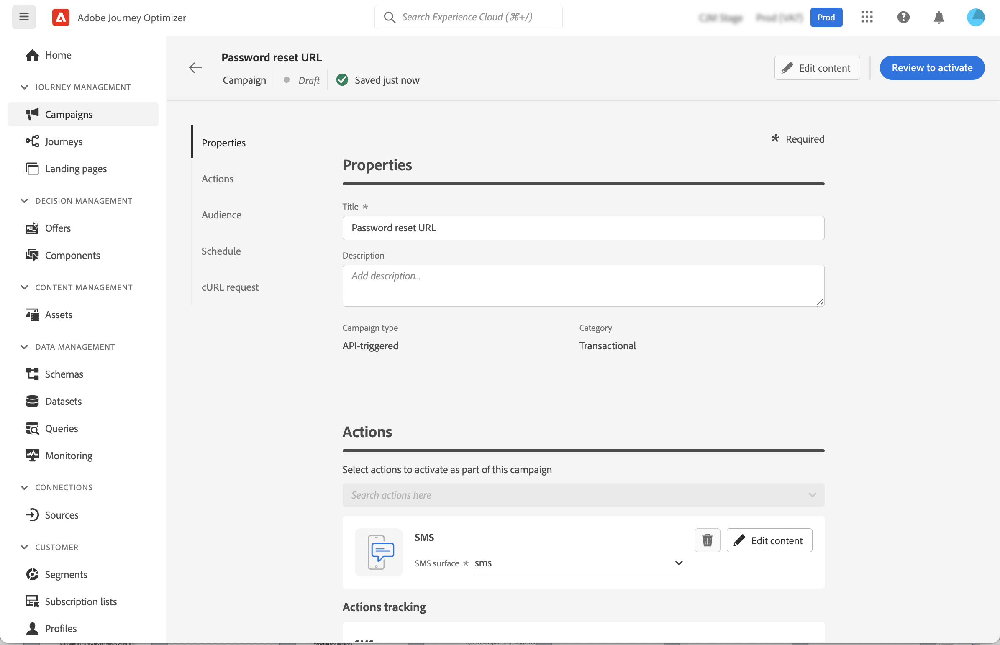
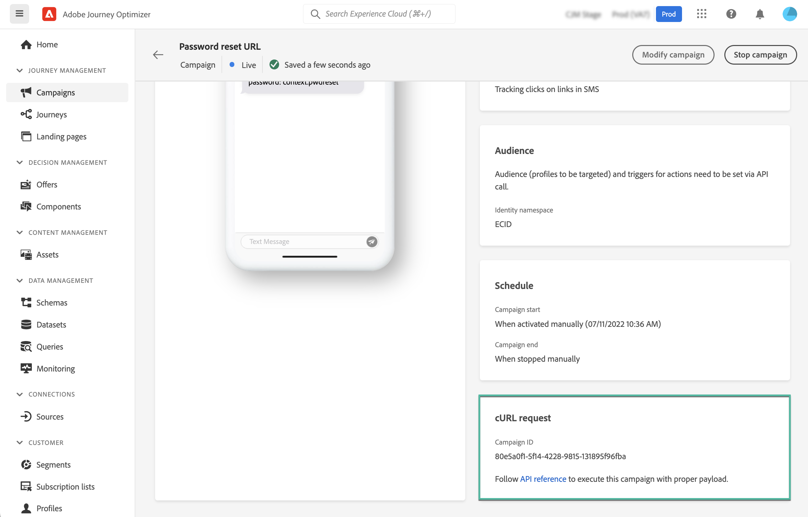

# Trigger campaigns using APIs {#trigger-campaigns}

## About API-triggered campaigns {#about}

With [!DNL Journey Optimizer], you can create campaigns and then invoke them from an external system based on user trigger using the [Interactive Message Execution REST API](https://developer.adobe.com/journey-optimizer-apis/references/messaging/#tag/execution). This allows you to cover various operational and transactional messaging needs like password resets, OTP token, among others. 

To do this, you first need to create an API-triggered campaign in Journey Optimizer, and then launch its execution through an API call.

Available channels for API-triggered campaigns are Email, SMS and Push messages.

>[!NOTE]
>
>The Interactive Message Execution API is currently in beta, which may be subject to frequent updates without notice.

## Create an API-triggered campaign {#create}

The process to create API-triggered campaigns remains the same as scheduled campaigns, excepted for the audience selection which is performed in the API payload. Detailed information on how to create a campaign is available in [this section](create-campaign.md).

To create an API-triggered campaign, follow these steps:

1. Create a new campaign with the **[!UICONTROL API-triggered]** type.

1. Choose the channel and the message surface to use to send your message, then click **[!UICONTROL Create]**.

    

1. Specify a title and a description for the campaign, then configure the message to send.

    

    >[!NOTE]
    >
    >You can pass additional data into the API payload that you can leverage to personalize your message. [Learn more](#contextual)

1. Specify the namespace to use to identify the individuals from the segment.

1. Configure the campaign's start and end dates. 

    If you configure a specific start and/or end date for a campaign, it will not be executed outside these dates, and API calls will fail if the campaign is triggered by APIs.

1. In the **[!UICONTROL cURL request]** section, retrieve the **[!UICONTROL Campaign ID]** to use in the API payload.

    

1. Click **[!UICONTROL Review to activate]** to check that your campaign is correctly configured, then activate it.

## Use contextual attributes in API-triggered campaigns {#contextual}

With API-triggered campaigns, you can pass additional data in the API payload and use them inside the campaign to personalize your message.

Let's take this example, where customers want to reset their password, and you want to send them a password reset URL that is generated in a third-party tool. With API-triggered campaigns, you can pass this generated URL into the API payload, and leverage it into the campaign to add it into the message.

>[!NOTE]
>
>Unlike profile-enabled events, the contextual data passed in the REST API is used for one-off communication and not stored against profile. At maximum, profile is created with the namespace details, if it was found missing.

In order to use these data in your campaigns, you need to pass them into the API payload, and add them in your message using the Expression Editor. To do this, use the `{{context.<contextualAttribute>}}` syntax, where `<contextualAttribute>` should match the name of the variable in your API payload containing the data that you want to pass.

The `{{context.<contextualAttribute>}}` syntax is mapped to a String datatype only.

>[!IMPORTANT]
>
>The `context.system` syntax is restricted to Adobe internal usage only, and should not be used to pass contextual attributes.
Note that, for now, no contextual attribute is available for use in the left rail menu. Attributes must be typed directly in your personalization expression, with no check being performed by [!DNL Journey Optimizer].

## Execute the campaign {#execute}

To execute an API-triggered campaign, you first need to retrieve its ID and pass it into the API payload. To do this, open the campaign, then copy-paste the ID from the **[!UICONTROL cURL request]** section.

You can then use this ID into your API payload to trigger the campaign. Refer to the [Interactive Message Execution API documentation](https://developer.adobe.com/journey-optimizer-apis/references/messaging/#tag/execution) for more information.

>[!NOTE]
>
>If you have configured a specific start and/or end date when creating the campaign, it will not be executed outside these dates, and API calls will fail.

## Additional resources

* [Get started with campaigns](get-started-with-campaigns.md)
* [Create a campaign](create-campaign.md)
* [Modify or stop a campaign](modify-stop-campaign.md)
* [Campaign live report](campaign-live-report.md)
* [Campaign global report](campaign-global-report.md)
