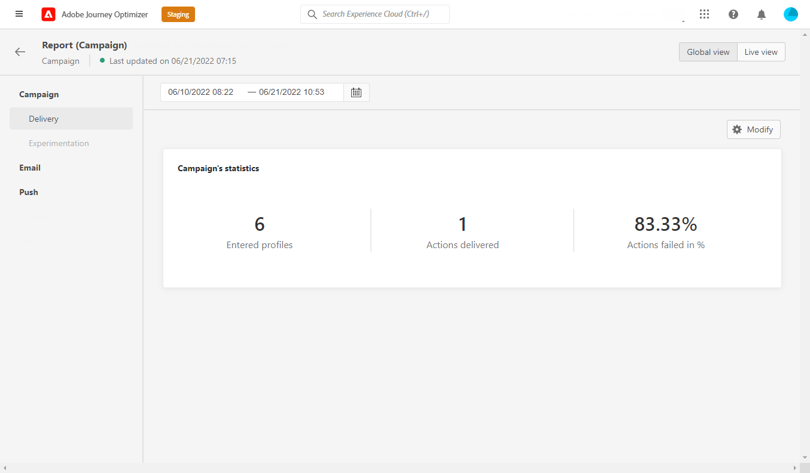

# Campaign Global report {#campaign-global-report}

Campaign Global report can be accessed directly from your Campaign with the **[!UICONTROL Reports]** button. 

After selecting the **[!UICONTROL All time]** tab, the Campaign **[!UICONTROL Global report]** page will be displayed with the following tabs:

* [Campaign](#campaign-global)
* [Email](#email-global)
* [Push](#push-global)

The Campaign **[!UICONTROL Global report]** is divided into different widgets detailing your campaign's success and errors. Each widget can be resized and deleted if needed. For more information on this, refer to this [section](../reports/global-report.md#modify-dashboard).

## Campaign tab {#campaign-global}

### Delivery {#delivery-global}

The **[!UICONTROL Campaign's Statistics]** widget details the main information relative to your campaign:

* **[!UICONTROL Entered profiles]**: Number of profiles who started the journey.

* **[!UICONTROL Actions delivered]**: Total number of unique times an action in the journey has been delivered.

* **[!UICONTROL Actions failed in %]**: Total number of unique times an action failed in the journey compared to the total number of unique times an action has been delivered.

## Email tab {#email-global}

From your Campaign **[!UICONTROL Global report]**, the **[!UICONTROL Email]** tab details the main information relative to the email deliveries sent in your Campaign.

The **[!UICONTROL Email Sending Statistics]** graph details the success of your delivery:

* **[!UICONTROL Targeted]**: Total number of messages processed during the delivery analysis.

* **[!UICONTROL Sent]**: Total number of sends for the delivery.

* **[!UICONTROL Delivered]**: Number of messages successfully sent, in relation to the total number of sent messages.

* **[!UICONTROL Delivery Rate]**: Percentage of messages successfully sent.

* **[!UICONTROL Bounces]**: Total of errors cumulated during delivery and automatic return processing in relation to the total number of sent messages.

* **[!UICONTROL Bounce Rate]**: Percentage of emails that bounced compared to emails sent.

* **[!UICONTROL Errors]**: Total number of errors that occurred during a delivery preventing it from being sent to profiles.

* **[!UICONTROL Error Rate]**: Percentage of errors that occurred during a delivery preventing it from being sent compared to emails sent.

* **[!UICONTROL Retries]**: Number of emails in the queue for retries.

* **[!UICONTROL Excluded]**: Number of profiles which have been excluded by Adobe Journey Optimizer.

The **[!UICONTROL Email - Tracking statistics]** widget contains the available data for recipient activity for your delivery:

* **[!UICONTROL Opens]**: Number of times the delivery was opened in a delivery.

* **[!UICONTROL Unique Opens]**: Percentage of opened deliveries.

* **[!UICONTROL Open Rate]**: Total number of opened emails compared to the number of delivered emails.

* **[!UICONTROL Clicks]**: Number of times a content was clicked in an email.

* **[!UICONTROL Unique Clicks]**:Number of recipients who clicked on a content in an email.

* **[!UICONTROL Unique Click Rate]**: Percentage of users who interacted with the delivery.

* **[!UICONTROL Unsubscriptions]**: Number of clicks on the unsubscription link.

* **[!UICONTROL Spam complaints]**: Number of times a message was declared as spam or junk.

The **[!UICONTROL Sending Statistics]** graph contains the data available for sent emails, such as:

* **[!UICONTROL Delivered]**: Number of messages successfully sent, in relation to the total number of sent messages.

* **[!UICONTROL Bounces]**: Total of errors cumulated during delivery and automatic return processing in relation to the total number of sent messages.

* **[!UICONTROL Retries]**: Number of emails in the queue for retries.

* **[!UICONTROL Errors]**: Total number of errors that occurred during a delivery preventing it from being sent to profiles.

The **[!UICONTROL Bounce Reasons]** and **[!UICONTROL Bounce categories]** widgets contain the data available related to bounced messages, such as:

* **[!UICONTROL Hard bounce]**: The total number of permanent errors, such as a wrong email address. This involves an error message that explicitly states that the address is invalid, such as Unknown user.

* **[!UICONTROL Soft bounce]**: The total number of temporary errors, such as a a full inbox.

* **[!UICONTROL Ignored]**: The total number of temporary, such as Out of office, or a technical error, for example if the sender type is postmaster.

For more information on bounces, refer to the [Suppression list](../reports/suppression-list.md) page.

The **[!UICONTROL Error Reasons]** graph and table allow you to see which error occurred during your delivery.

The **[!UICONTROL Excluded reasons]** graph and table display the different reasons that prevented user profiles, excluded from the targeted profiles, from receiving the message.

The **[!UICONTROL Email - Top Url]** graph and table details which URLs from your delivery are the most visited.

The **[!UICONTROL Email - Top recipient domain]** graph and table details which domains are the most used by recipients to open the email.

>[!NOTE]
>
>The **[!UICONTROL Optimized vs non optimized]** and **[!UICONTROL Send time optimization]**  widgets are only available if the Send-Time Optimization option is activated for your delivery. For more information on Send-Time Optimization, refer to [this page](../messages/send-time-optimization.md).

The **[!UICONTROL Optimized vs non optimized]** graph details the main information relative to your message whether they are optimized or not:

* **[!UICONTROL Sent]**: Total number of sends for the delivery.
* **[!UICONTROL Opens]**: Number of times the delivery was opened in a delivery.
* **[!UICONTROL Clicks]**: Number of times a content was clicked in an email.

The **[!UICONTROL Send time optimization]** details the success of your delivery depending on the sending method: optimized or normal.

* **[!UICONTROL Delivered]**: Number of messages successfully sent, in relation to the total number of sent messages.
* **[!UICONTROL Bounces]**: Total of errors cumulated during delivery and automatic return processing in relation to the total number of sent messages.

## Push tab {#push-global}

From your Campaign **[!UICONTROL Global report]**, the **[!UICONTROL Push]** tab details the main information relative to the push deliveries sent in your campaign.

The **[!UICONTROL Push notification - Sending statistics]** table details the main information relative to your push notifications with graph and KPIs:

* **[!UICONTROL Targeted]**: Total number of messages processed during the delivery analysis.

* **[!UICONTROL Sent]**: Total number of sends for the delivery.

* **[!UICONTROL Delivered]**: Number of messages successfully sent, in relation to the total number of sent messages.

* **[!UICONTROL Delivery Rate]**: Percentage of messages successfully sent.

* **[!UICONTROL Bounces]**: Total of errors cumulated during delivery and automatic return processing in relation to the total number of sent messages.

* **[!UICONTROL Bounce Rate]**: Percentage of push notifications that bounced compared to push notifications sent.

* **[!UICONTROL Errors]**: Total number of errors that occurred during a delivery preventing it from being sent to profiles.

* **[!UICONTROL Error Rate]**: Percentage of errors that occurred during a delivery preventing it from being sent compared to push notifications sent.

* **[!UICONTROL Excluded]**: Number of profiles which have been excluded by Adobe Journey Optimizer.

The **[!UICONTROL Push - Tracking statistics]** contains the available data for recipient activity for your delivery:

* **[!UICONTROL Opens]**: Number of times a message was opened in a delivery.

* **[!UICONTROL Open Rate]**: Percentage of opened push notifications.

* **[!UICONTROL Actions]**: Total number of actions on the push notification delivered, e.g. button click or dismissal.

* **[!UICONTROL Engagements]**: Total number of opens and actions for this push notification, i.e. if the profile opened the push or if a button was clicked on.

* **[!UICONTROL Engagement Rate]**: Percentage of opens and actions for this push notification, i.e. if the profile opened the push or if a button was clicked on.

The **[!UICONTROL Push notification summary]** graph contains the data available for sent push notifications, such as:

* **[!UICONTROL Opens]**: Number of times a message was opened in a delivery.

* **[!UICONTROL Actions]**: Total number of actions on the push notification delivered, e.g. button click or dismissal.

* **[!UICONTROL Bounces]**: Total of errors cumulated during delivery and automatic return processing in relation to the total number of sent messages.

* **[!UICONTROL Delivered]**: Number of messages successfully sent, in relation to the total number of sent messages.

* **[!UICONTROL Errors]**: Total number of errors that occurred during a delivery preventing it from being sent to profiles.

>[!NOTE]
>
>The **[!UICONTROL Optimized vs non optimized]** and **[!UICONTROL Send time optimization]**  widgets are only available if the Send-Time Optimization option is activated for your delivery. For more information on Send-Time Optimization, refer to [this page](../messages/send-time-optimization.md).

The **[!UICONTROL Optimized vs non optimized]** graph details the main information relative to your message whether they are optimized or not:

* **[!UICONTROL Delivered]**: Number of messages successfully sent, in relation to the total number of sent messages.
* **[!UICONTROL Opens]**: Number of times the delivery was opened in a delivery.
* **[!UICONTROL Actions]**: Total number of actions on the push notification delivered, e.g. button click or dismissal.

The **[!UICONTROL Send time optimization]** details the success of your delivery depending on the sending method: optimized or normal.

* **[!UICONTROL Delivered]**: Number of messages successfully sent, in relation to the total number of sent messages.
* **[!UICONTROL Bounces]**: Total of errors cumulated during delivery and automatic return processing in relation to the total number of sent messages.

The **[!UICONTROL Error Reasons]** graph and table allow you to see which error occurred during your delivery.

The **[!UICONTROL Excluded reasons]** graph and table display the different reasons that prevented user profiles, excluded from the targeted profiles, from receiving the message.

The **[!UICONTROL Tracking by platform]**, **[!UICONTROL Sending by platform]** and **[!UICONTROL Breakdown by platform]** graphs and tables details the success of your push notification depending on your recipient's operational system.
