# Create a content experiment {#content-experiment}

The content experiment feature allows you to define multiple delivery treatments. The audience of interest is randomly allocated to each treatment in order to determine which one performs best with respect to the metric of interest. You can choose to vary the email’s content, subject, or sender. 

In the example below, the delivery target has been split into two groups, each representing 45% of the targeted population, and a holdout group of 10%, who will not receive the delivery.

Each person in the targeted audience will receive one version of the email, with a subject line that is one of the following two:

* one directly promoting a 10% offer on the new collection and an image.
* the other one only advertising a special offer without specifying the 10% off without any image. 

The goal here is to see if recipients will interact with the email depending on the received experiment. We therefore will choose **[!UICONTROL Email Opens]** as the primary goal metric in this Content Experiment.

## Create your Campaign {#campaign-experiment}

1. From the **[!UICONTROL Campaigns]** page, click **[!UICONTROL Create Campaign]**.

    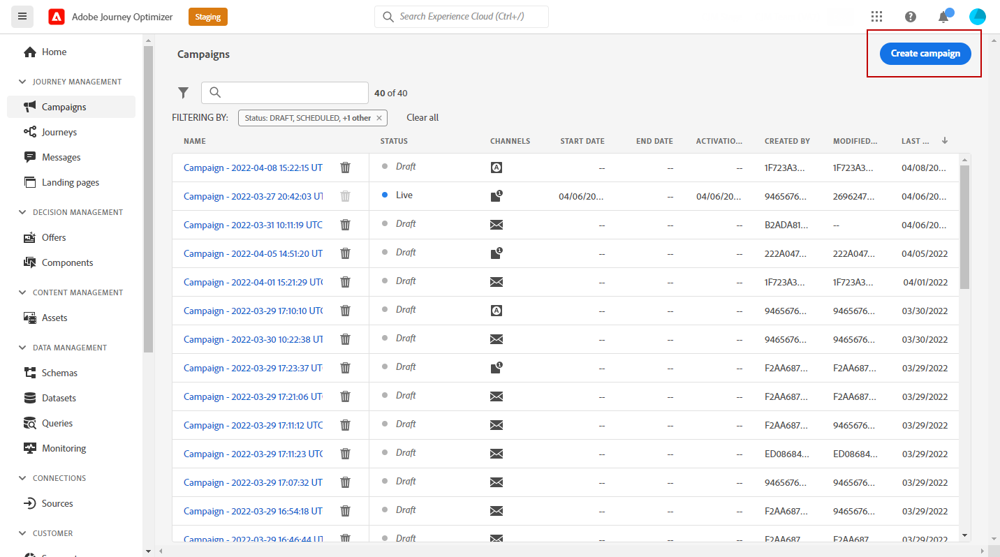

1. Select **[!UICONTROL Email]** then the **[!UICONTROL Surface]** you want to use for this delivery. For more on this, refer to the [Channel surfaces](../configuration/channel-surfaces.md) page.

    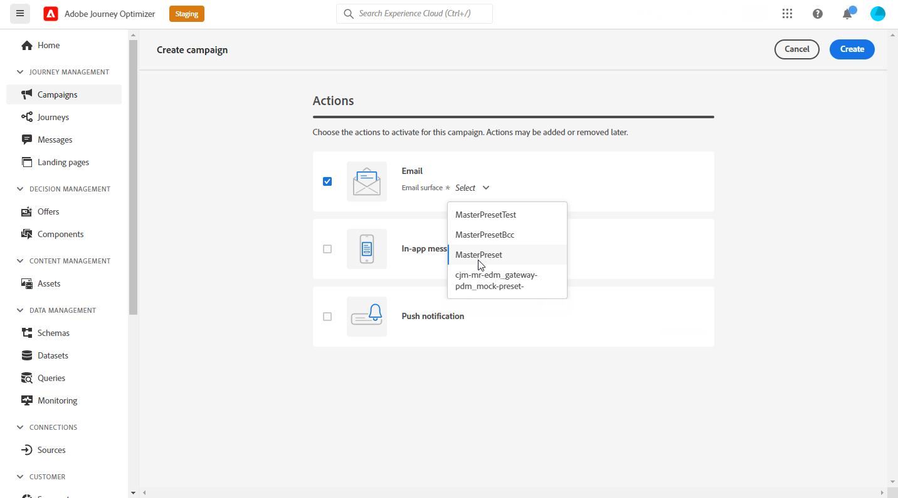

1. Click **[!UICONTROL Create]**.

1. Set up the **[!UICONTROL Properties]** of your delivery:
    * **[!UICONTROL Title]**
    * **[!UICONTROL Description]**
    * **[!UICONTROL Category]**: **[!UICONTROL Marketing]** / **[!UICONTROL Transactional]**

1. To start your content experiment, toggle the **[!UICONTROL Content experiment]** option. The **[!UICONTROL Content experiment]** menu will appear.

    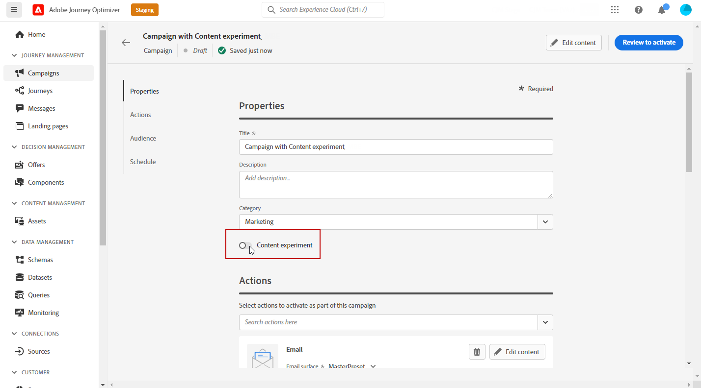

1. Set up the **[!UICONTROL Audience]** and **[!UICONTROL Schedule]** parameters for your deliveries. [Learn more](create-campaign.md)

1. Click **[!UICONTROL Edit content]** to start personalizing your different **[!UICONTROL Treatments]**.

    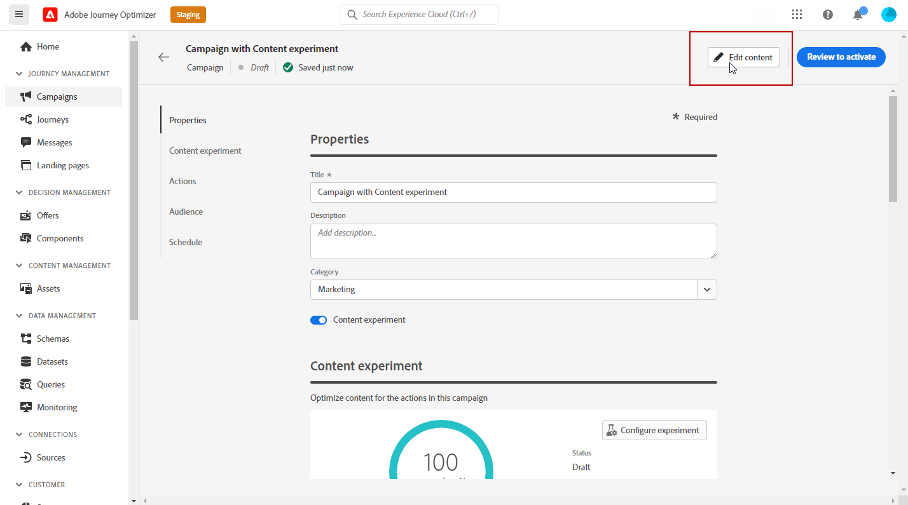

## Create your treatments {#treatment-experiment}

1. From the **[!UICONTROL Edit content]** window, add the **[!UICONTROL Subject line]** for your Treatment A email and click **[!UICONTROL Save]**.

    For this treatment, we specify the offer directly in the subject line.

    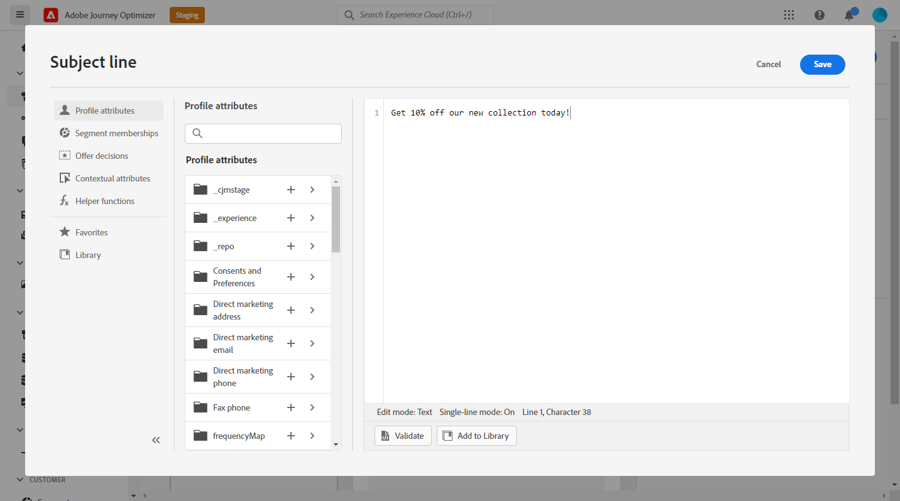

1. Click **[!UICONTROL Email designer]** to start personalizing your deliveries. 

    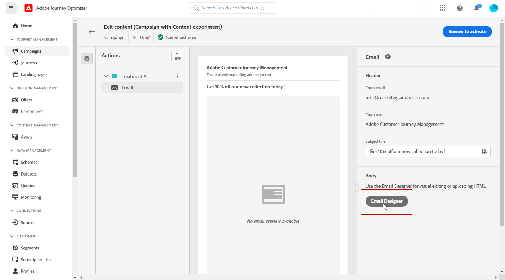

1. After designing your email, click **[!UICONTROL Save]** and get back to the **[!UICONTROL Edit content]** window to create Treatment B. 

1.  From the **[!UICONTROL More actions]** button, click **[!UICONTROL Duplicate]**. 

    You can also choose to start a new treatment from scratch clicking the **[!UICONTROL Content experiment]** button to access the advanced options then **[!UICONTROL Add treatment]**.

    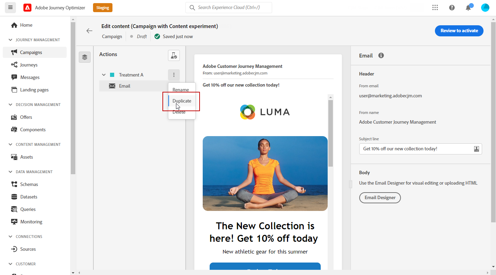

1. Change the **[!UICONTROL Title]** of your treatment to better differentiate them.

    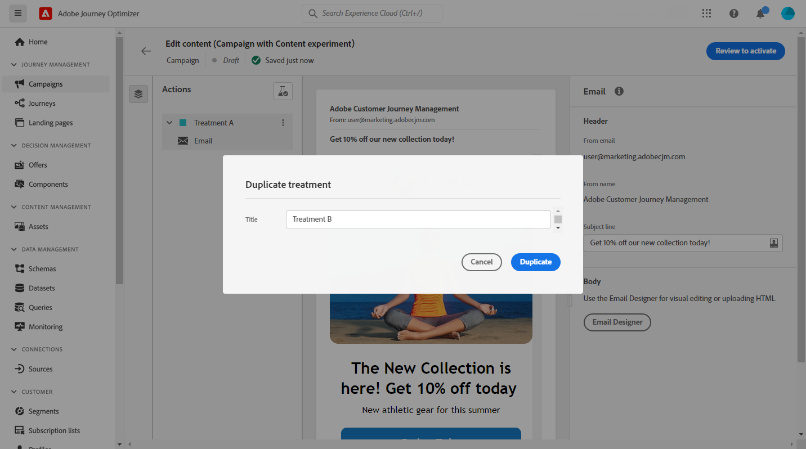

1. Select the email delivery linked to your newly created **[!UICONTROL Treatment]**.

1. Add the **[!UICONTROL Subject line]** for your delivery. 

    For this treatment, we choose to not specify the offer in the **[!UICONTROL Subject line]**.

    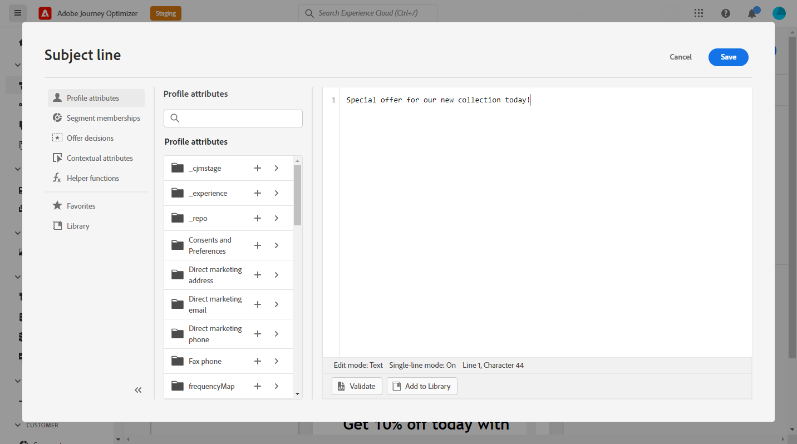

1. Click **[!UICONTROL Email designer]** to further personalize the Treatment B delivery if needed.

Once your treatments are personalized, you can start configuring your content experiment.

## Configure your content experiment {#configure-experiment}

1. When both deliveries are personalized, from the **[!UICONTROL Edit content]** window, select **[!UICONTROL Configure content experiment]**.

    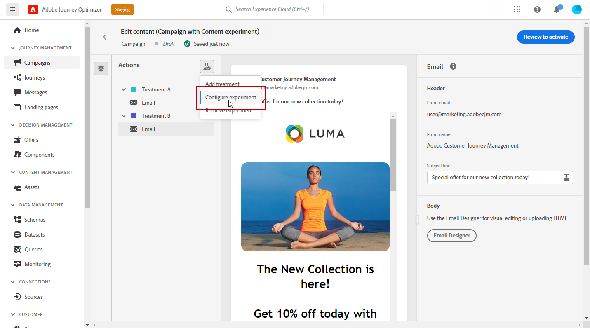

1. Select the objectives you want to set for your experiment.

    For our experiment, we select **[!UICONTROL Email open]** to test if recipients will open their emails if the promo code is in the subject line.

    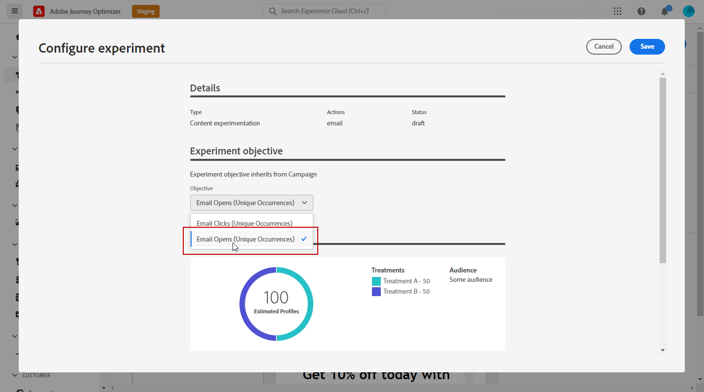

1. Choose to add a **[!UICONTROL Holdout]** group to your delivery. This group will not receive any content from this campaign. 

    Switching on the toggle bar will automatically take 10% of your population, you can adjust this percentage if needed.

    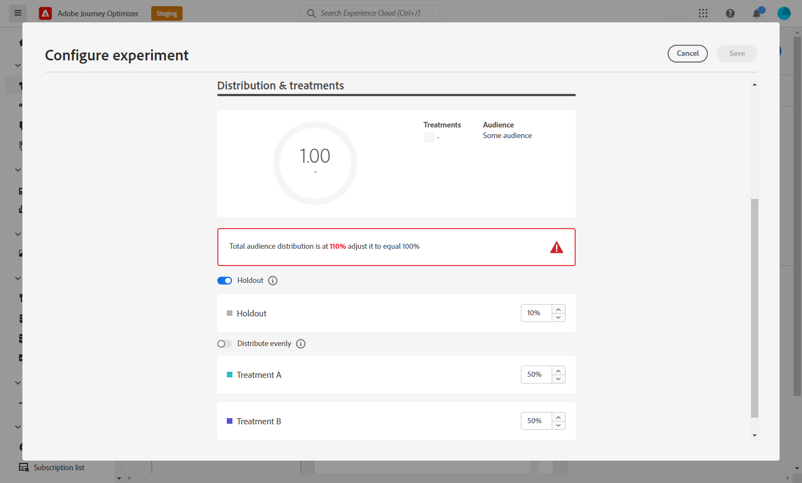

1. You can then choose to allocate a precise percentage to each **[!UICONTROL Treatment]** or simply switch on the **[!UICONTROL Distribute evenly]** toggle bar.

    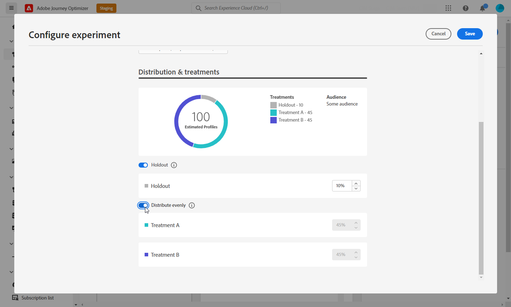

1. Click **[!UICONTROL Save]** when your configuration is set.

1. When your content experiment is ready, you can click **[!UICONTROL Review to activate]** to display a summary of the campaign. Alerts display if any parameter is incorrect or missing.

    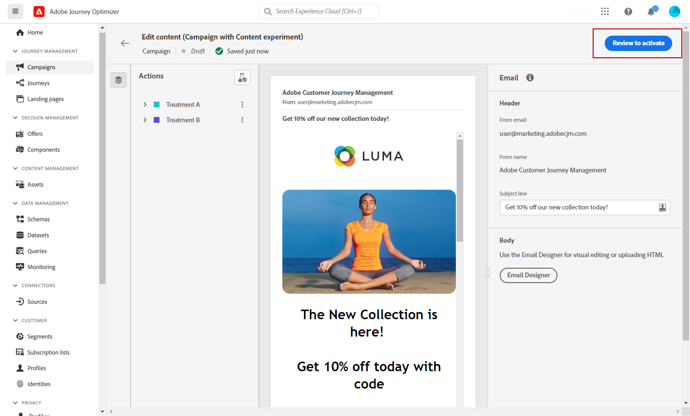

1. Check that your campaign is correctly configured, then click **[!UICONTROL Activate]** to launch it.

    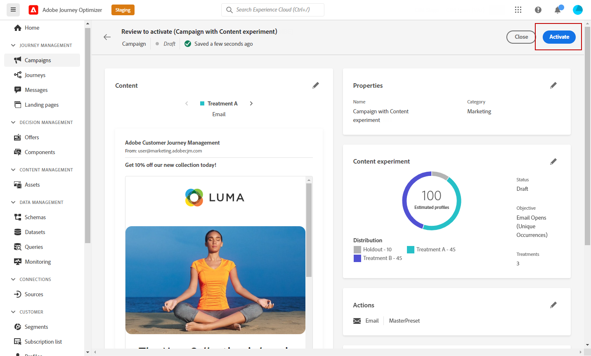

