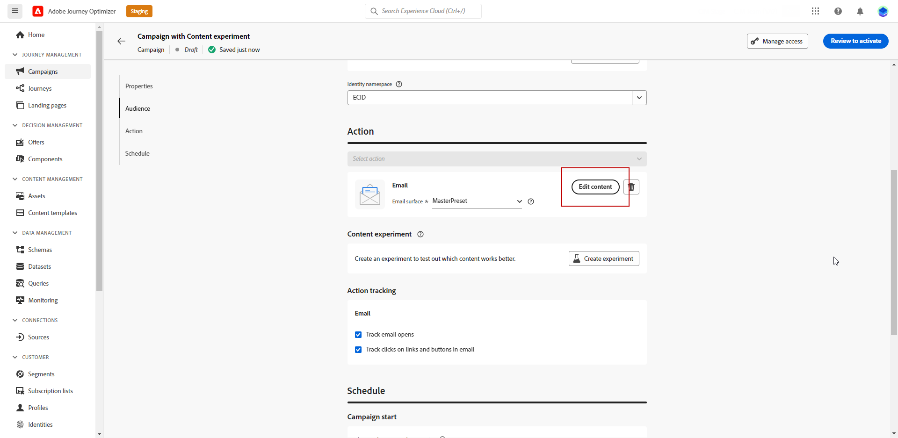
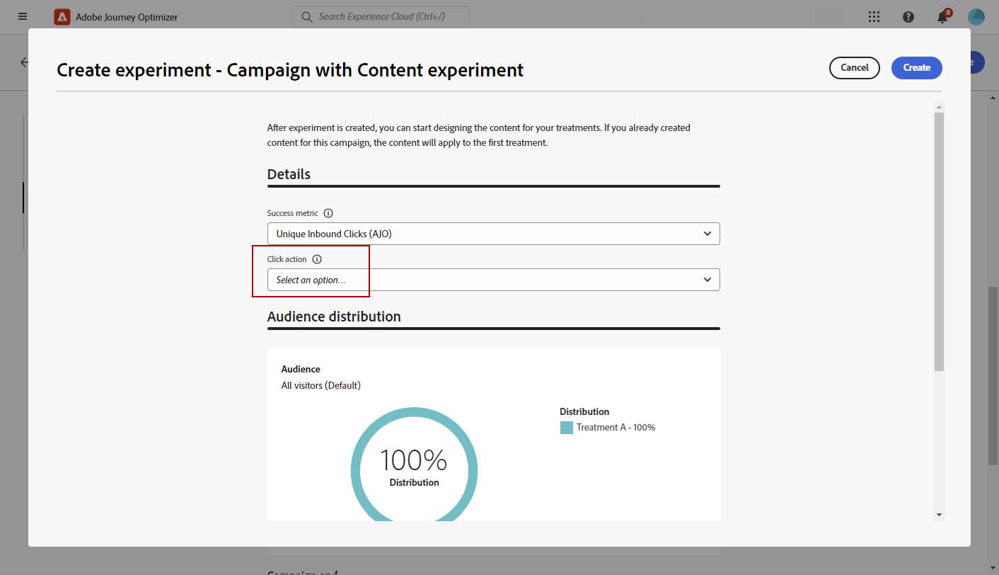
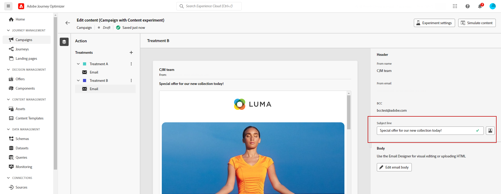
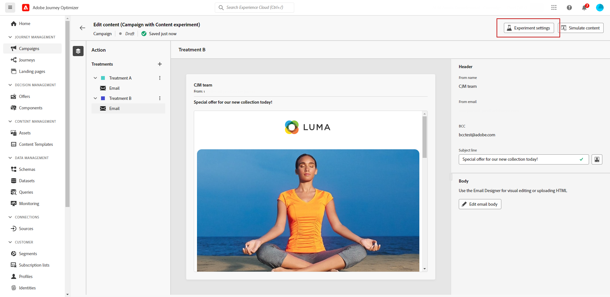

# Create a content experiment {#content-experiment}

>[!CONTEXTUALHELP]
>id="ajo_campaigns_content_experiment"
>title="Content experiment"
>abstract="You can choose to vary the message content, subject, or sender in order to define multiple treatments and determine the best combination for your audiences."

>[!NOTE]
>
>Before starting with Content Experiment, make sure that your reporting configuration is set for your custom datasets. Learn more in [this section](reporting-configuration.md).

The Journey Optimizer Content Experiment enables you to define multiple delivery treatments in order to measure which one performs best for your target audience. You can choose to vary the delivery content, subject, or sender. The audience of interest is randomly allocated to each treatment to determine which one works best in terms of the specified metric.

In the example below, the delivery target has been split into two groups, each representing 45% of the targeted population, and a holdout group of 10%, who will not receive the delivery.

Each person in the targeted audience will receive one version of an email, with a subject line that is one of the following two:

* one directly promoting a 10% offer on the new collection and an image.
* the other one only advertising a special offer without specifying the 10% off without any image. 

The goal here is to see if recipients will interact with the email depending on the received experiment. We therefore will choose **[!UICONTROL Email Opens]** as the primary goal metric in this Content Experiment.

## Create your campaign {#campaign-experiment}

1. From the **[!UICONTROL Campaigns]** page, click **[!UICONTROL Create campaign]**.

    

<!--
1. In the **[!UICONTROL Properties]** section, choose your **[!UICONTROL Campaign type]**:

    * **[!UICONTROL Scheduled]**: designed to send marketing messages and can be executed immediately or at a specified date.

    * **[!UICONTROL API-Triggered]**: designed to send transactional messages, such as password reset notifications or cart abandonment reminders. 
    
        To execute an API-triggered campaign, you will need to make an API call. [Learn more](api-triggered-campaigns.md)
-->
1. Select your channel then the **[!UICONTROL Surface]** you want to use for this delivery and click **[!UICONTROL Create]**. For more on this, refer to the [Channel surfaces](../configuration/channel-surfaces.md) page.

    In this example, we choose to send a campaign using emails.

    

1. Set up the **[!UICONTROL Properties]** of your delivery:
    * **[!UICONTROL Name]**
    * **[!UICONTROL Description]**

1. Define the audience to target. To do this, click the **[!UICONTROL Select audience]** button to display the list of available Adobe Experience Platform audiences. [Learn more on audiences](../audience/about-audiences.md)

    In the **[!UICONTROL Identity namespace]** field, choose the namespace to use in order to identify the individuals from the selected audience. [Learn more](get-started-experiment.md#content-experiment-work)

    

1. In the **[!UICONTROL Actions tracking]** section, specify if you want to track how your recipients react to your delivery: you can track clicks and/or opens.
        
    Tracking results will be accessible from the campaign report once the campaign has been executed.

1. To execute your campaign on a specific date or on a recurring frequency, configure the **[!UICONTROL Schedule]** section. [Learn more](create-campaign.md)

1. Click **[!UICONTROL Edit content]** to start personalizing your delivery.

    

1. From the **[!UICONTROL Edit content]** window, start personalizing the treatment A.

    For this treatment, we will specify the special offer directly in the subject line and add personalization.

    

## Configure your content experiment {#configure-experiment}

>[!CONTEXTUALHELP]
>id="ajo_campaigns_content_experiment_dimension"
>title="Dimension"
>abstract="Choose the specific dimension to track for your Experiment, such as specific clicks or views of specific pages."

>[!CONTEXTUALHELP]
>id="ajo_campaigns_content_experiment_success_metric"
>title="Success metric"
>abstract="Success metric is used to track and evaluate the best performing treatment in an experiment. Be sure to set up your dataset for certain metrics before using it."

1. When your message is personalized, from the campaign summary page, click **[!UICONTROL Create experiment]** to start configuring your content experiment.

    

1. Select the **[!UICONTROL Success metric]** you want to set for your experiment.

    For this example, select **[!UICONTROL Email open]** to test if profiles open their emails if the promo code is in the subject line.

    

1. When setting up an experiment using the In-app or Web channel and choosing the **[!UICONTROL Inbound Clicks]**, **[!UICONTROL Unique Inbound Clicks]** , **[!UICONTROL Page Views]** , or **[!UICONTROL Unique Page Views metrics]** , the **[!UICONTROL Click Action]**  drop-down enables you to precisely track and monitor clicks and views on specific pages.

    

1. Click **[!UICONTROL Add treatment]** to create as many new treatment as needed.

    

1. Change the **[!UICONTROL Title]** of your treatment to better differentiate them.

1. Choose to add a **[!UICONTROL Holdout]** group to your delivery. This group will not receive any content from this campaign. 

    Switching on the toggle bar will automatically take 10% of your population, you can adjust this percentage if needed.

    

1. You can then choose to allocate a precise percentage to each **[!UICONTROL Treatment]** or simply switch on the **[!UICONTROL Distribute evenly]** toggle bar.

    

1. Click **[!UICONTROL Create]** when your configuration is set.

## Design your treatments {#treatment-experiment}

1. From the **[!UICONTROL Edit content]** window, select your treatment B to change the content.

    Here, we choose to not specify the offer in the **[!UICONTROL Subject line]**.

    

1. Click **[!UICONTROL Edit email body]** to further personalize your treatment B.

    

1. After designing your treatments, click **[!UICONTROL More actions]** to access options related to your treatments: **[!UICONTROL Rename]**, **[!UICONTROL Duplicate]** and **[!UICONTROL Delete]**.

    

1. If needed, access the **[!UICONTROL Experiment settings]** menu to change your treatments configuration.

    

1. Once your message content has been defined, click the **[!UICONTROL Simulate content]** button to control the rendering of your delivery, and check personalization settings with test profiles. [Learn more](../email/preview.md)

1. When your content experiment is ready, from your Campaign summary page, you can click **[!UICONTROL Review to activate]** to display a summary of the campaign. Alerts display if any parameter is incorrect or missing.

    

1. Check that your campaign is correctly configured, then click **[!UICONTROL Activate]** to launch it.

    

After configuring your experimentation and campaign, you can follow the success of your delivery with the Campaign report. [Learn more](../reports/campaign-global-report.md#experimentation-report)
