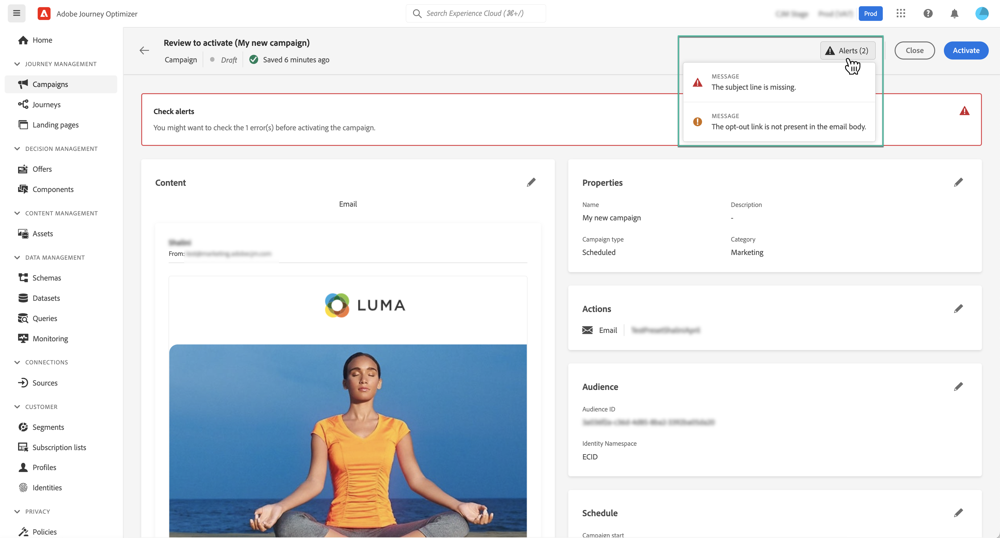
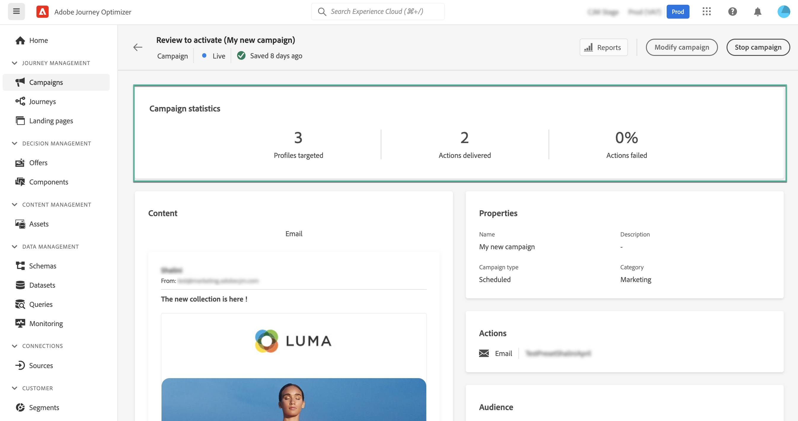

# Create a campaign {#create-campaign}

>[!NOTE]
>
>Before creating a new campaign, make sure you have a message preset and an Adobe Experience Platform segment ready for use. Learn more in these sections:
>
>* [Create message presets](../configuration/message-presets.md) 
>* [Get started with segments](../segment/about-segments.md)

## Configure a campaign {#configure}

The steps to create a campaign are as follows:

1. Access the **[!UICONTROL Campaigns]** menu, then click **[!UICONTROL Create campaign]**.

    

1. In the **[!UICONTROL Properties]** section, specify when you want to execute the campaign:

    * **[!UICONTROL Scheduled]**: execute the campaign immediately or on a specified date defined in the next step,
    * **[!UICONTROL API-triggered]**: execute the campaign using an API call. In this case, profiles to be targeted and triggers for actions need to be set via the API call.

    In the **[!UICONTROL Actions]** section, choose the channel and the message surface (i.e. message preset) to use to send your message.

    

1. Specify a title and a description for the campaign.

    To test the content of your message, toggle the **[!UICONTROL Content experiment]** option on. This allows you to test multiple variables of a delivery on populations samples, in order to define which treatment has the biggest impact on the targeted population.[Learn more about content experiment](../campaigns/content-experiment.md).

    

1. In the **[!UICONTROL Actions]** section, configure the message to send with the campaign:

    1. Click the **[!UICONTROL Edit content]** button, then configure and design your message. [Learn how to configure messages](../messages/get-started-content.md).

        Once your content is ready, click the arrow to go back to the campaign creation screen.

        

    1. In the **[!UICONTROL Actions tracking]** section, specify if you want to track how your recipients react to your delivery. Tracking results will be accessible from the campaign report once the campaign has been executed. [Learn more on campaign reports](campaign-global-report.md)

        

1. Define the audience to target. To do this, click the **[!UICONTROL Select audience]** button to display the list of available Adobe Experience Platform segments. [Learn more on segments](../segment/about-segments.md)

    

    <!--By default, the targeted audience for in-app messages includes all the users of the selected mobile application.-->

    In the **[!UICONTROL Identity namespace]** field, choose the namespace to use in order to identify the individuals from the selected segment. [Learn more on namespaces](../event/about-creating.md#select-the-namespace)

    

    >[!NOTE]
    >
    >Individuals belonging to a segment that does not have the selected identity (namespace) among their different identities  will not be targeted by the campaign. <!--info vue dans section journeys, read segment-->

    <!--If you are creating a campaign to send an in-app message, you can choose how and when the message will be shown to the audience using existing mobile app triggers.-->
    <!-- where are triggers configured?-->

1. Configure the campaign's start and end dates.

    >[!NOTE]
    >
    >By default, Campaigns are configured to start once they are activated manually, and to end as soons as the message has been sent once. <!--For in-app messages, you need to stop the campaign manually or specify an end date.-->

1. Additionally, you can configure a frequency for the execution of the action configured in the campaign.

    

Once your campaign is ready, you can review and publish it (see [Review and activate a campaign](#review-activate)).

## Review and activate a campaign {#review-activate} 

Once your campaign has been configured, you need to review its parameter and content before activating it. To do this, follow these steps:

1. In the campaign configuration screen, click **[!UICONTROL Review to activate]** to display a summary of the campaign.

    The summary allows you to modify your campaign if necessary, and to check if any parameter is incorrect or missing.

    >[!IMPORTANT]
    >
    >In case of errors, you will not be able to activate the campaign. Resolve the errors before proceeding.

    

1. Check that your campaign is correctly configured, then click **[!UICONTROL Activate]**.

    

1. The campaign is now activated and has the **[!UICONTROL Live]** status (or **[!UICONTROL Scheduled]**  if you specified a start date). [Learn more on campaigns statuses](get-started-with-campaigns.md#statuses)

    The message configured in the campaign is executed immediately or on the specified date.

    >[!NOTE]
    >
    >Once a campaign has been activated, it will keep the "Live" status even after the message has been executed. To change its status, you need to stop it manually. [Learn how to stop a campaign](modify-stop-campaign.md) 

1. Once a campaign has been activated, you can check at any time its information by opening it. The summary allows you to get statistics about number of targeted profiles and delivered and failed actions.

    You can also get additional statistics in dedicated reports by clicking the **[!UICONTROL Reports]** button. [Learn more](campaign-global-report.md)

    

    >[!IMPORTANT]
    >
    >Messages created in campaigns are specific to [!DNL Journey Optimizer] campaign capabilities. Once created, they will be accessible from campaigns only, and will not display in the **[!UICONTROL Messages]** menu.