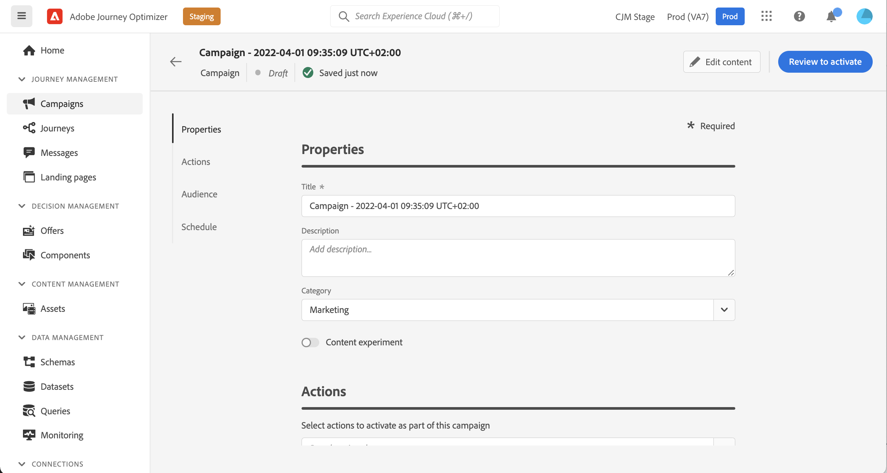
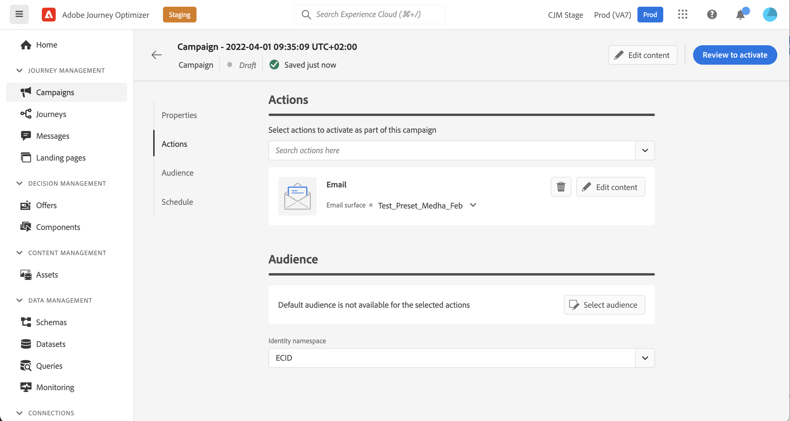
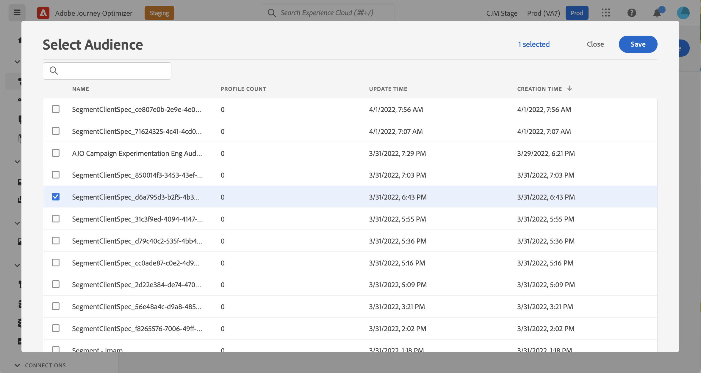
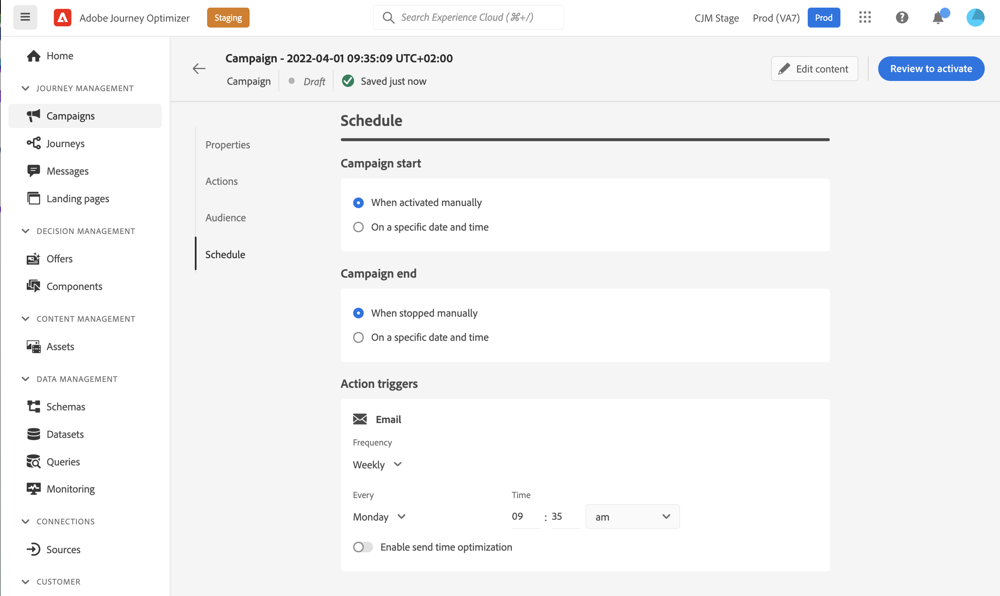
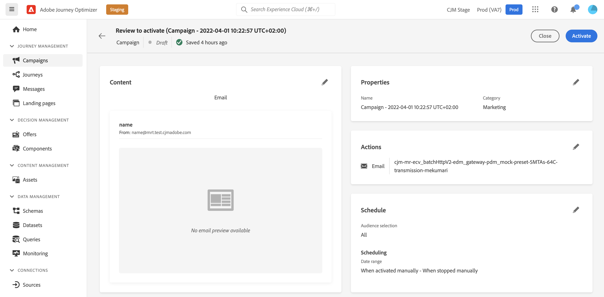
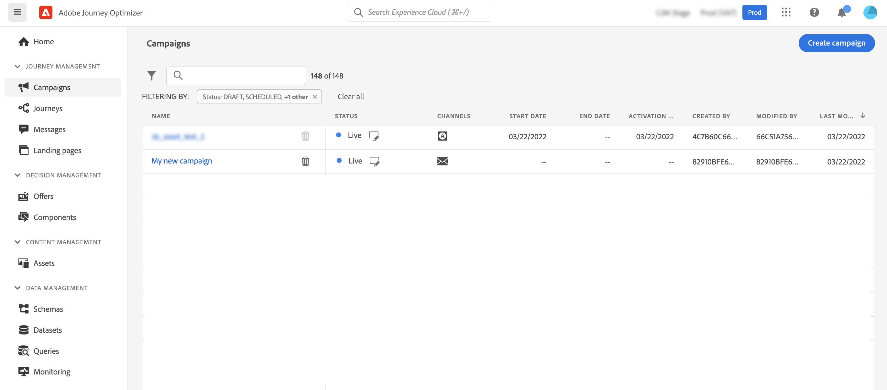

# Create a campaign {#create-campaign}

>[!NOTE]
>
>Before creating a new campaign, make sure you have a message preset and an Adobe Experience Platform segment ready for use. Learn more in these sections:
>
>* [Create message presets](../configuration/message-presets.md) 
>* [Get started with segments](../segment/about-segments.md)

The steps to create a campaign are as follows:

1. Access the **[!UICONTROL Campaigns]** menu, then click **[!UICONTROL Create campaign]**.

    

1. Choose the action to perform with the Campaign and the message surface (aka message preset) to use.

    >[!NOTE]
    >
    >For now, only email messages can be sent using campaigns.

    

1. Specify a title and a description for the campaign.

    <!--message type will be static information and will display "marketing" as campaign are audience based only. cannot send transactional messages.-->

    To test the content of your message, toggle the **[!UICONTROL Content experiment]** option on. [Learn more about content experiment](../campaigns/content-experiment.md).<!-- not for mid april?-->

    

1. Configure the message to send with the campaign. To do this, click the **[!UICONTROL Edit content]** button, then configure and design your message. [Learn how to create an email](../messages/create-email.md)).

    Once your messgae is content is ready, click the arrow to go back to the campaign creation screen.

    

    You can modify the message surface at any time while the campaign is being edited from the message surface drop-down list.

    

1. Define the audience to target. To do this, click the **[!UICONTROL Select audience]** button to display the list of available Adobe Experience Platform segments.

    

    <!--By default, the targeted audience for in-app messages includes all the users of the selected mobile application.-->

    In the **[!UICONTROL Identity namespace]** field, choose the namespace to use in order to identify the individuals from the selected segment. [Learn more about namespaces](../event/about-creating.md#select-the-namespace).

    >[!NOTE]
    >
    >Individuals belonging to a segment that does not have the selected identity (namespace) among their different identities  will not be targeted by the campaign. <!--info vue dans section journeys, read segment-->

    

    <!--If you are creating a campaign to send an in-app message, you can choose how and when the message will be shown to the audience using existing mobile app triggers.-->
    <!-- where are triggers configured?-->

1. Configure the campaign's start and end dates.

    By default, Campaigns are configured to start once they are activated, and to end as soons as the message has been sent once. <!--For in-app messages, you need to stop the campaign manually or specify an end date.-->

    You can configure a frequency at which the action will be performed.

    

    <!-- send time optimization will be available later on -->

7. Click **[!UICONTROL Review and activate]** to display a summary of the campaign. Alerts display if any parameter is incorrect or missing.

    Check that your campaign is correctly configured, then click **[!UICONTROL Activate]** to launch it.

    

The campaign is live. The message configured in the campaign is executed, unless you specified a campaign start date.

