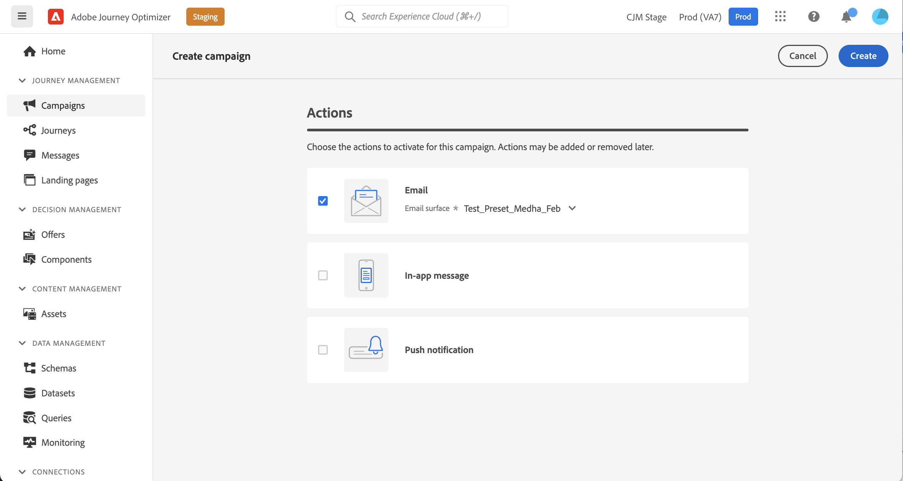
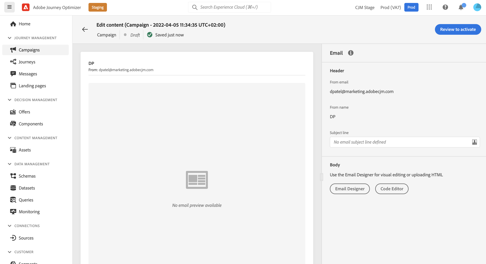
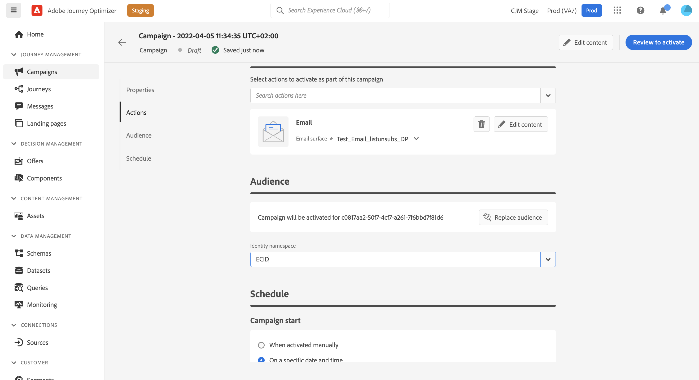

# Create a campaign {#create-campaign}

>[!NOTE]
>
>Before creating a new campaign, make sure you have a surface channel (i.e. message preset) and an Adobe Experience Platform segment ready for use. Learn more in these sections:
>
>* [Create channel surfaces](../configuration/channel-surfaces.md) 
>* [Get started with segments](../segment/about-segments.md)

## Create your first campaign {#create}

1. Access the **[!UICONTROL Campaigns]** menu, then click **[!UICONTROL Create campaign]**.

    >[!NOTE]
    >
    >You can also duplicate an existing live campaign to create a new one. [Learn more](modify-stop-campaign.md#duplicate)

    

1. In the **[!UICONTROL Properties]** section, specify how you want to execute the campaign:

    * **[!UICONTROL Scheduled]**
    * **[!UICONTROL API-triggered]**

    For more information about the campaign type and associated involvements, refer to this [section](#campaigntype).

1. In the **[!UICONTROL Actions]** section, choose the channel and the channel surface to use to send your message, then click **[!UICONTROL Create]**.

    A surface is a configuration which has been defined by a [System Administrator](../start/path/administrator.md). It contains all the technical parameters for sending the message, such as header parameters, subdomain, mobile apps, etc. [Learn more](../configuration/channel-surfaces.md).

    

    >[!NOTE]
    >
    >Only channel surfaces compatible with the marketing campaign type are listed in the drop-down list.

1. Specify a title and a description for the campaign.

    <!--To test the content of your message, toggle the **[!UICONTROL Content experiment]** option on. This allows you to test multiple variables of a delivery on populations samples, in order to define which treatment has the biggest impact on the targeted population.[Learn more about content experiment](../campaigns/content-experiment.md).-->

1. To assign custom or core data usage labels to the campaign, click the **[!UICONTROL Manage access]** button. [Learn more on Object Level Access Control (OLA)](../administration/object-based-access.md)

## Create the message {#content}

In the **[!UICONTROL Actions]** section, create the message to send with the campaign. 

1. Click the **[!UICONTROL Edit content]** button, then create and design your message content.

    Learn detailed steps to create your message content in the following pages:

    <table style="table-layout:fixed">
    <tr style="border: 0;">
    <td>
    
    
<a href="../email/create-email.md"><strong>Create emails</strong>
    

    

    </td>
    <td>
    
    

    <a href="../push/create-push.md"><strong>Create push notifications</strong></a>
    

    

    </td>
    <td>
    
    

    <a href="../sms/create-sms.md"><strong>Create SMS messages</strong></a>
    

    

    </td>
    </tr>
    </table>

1. Once your content is defined, use the **[!UICONTROL Simulate content]** button to preview and test your content with test profiles. [Learn more](../email/preview.md).

1. Click the arrow to go back to the campaign creation screen.

    

1. In the **[!UICONTROL Actions tracking]** section, specify if you want to track how your recipients react to your delivery: you can track clicks and/or opens.
        
    Tracking results will be accessible from the campaign report once the campaign has been executed. [Learn more on campaign reports](../reports/campaign-global-report.md)

## Define the audience {#audience}

1. Define the audience to target. To do this, click the **[!UICONTROL Select audience]** button to display the list of available Adobe Experience Platform segments. [Learn more on segments](../segment/about-segments.md)

    >[!NOTE]
    >
    >For API-triggered campaigns, the audience needs to be set via API call. [Learn more](api-triggered-campaigns.md)

    In the **[!UICONTROL Identity namespace]** field, choose the namespace to use in order to identify the individuals from the selected segment. [Learn more on namespaces](../event/about-creating.md#select-the-namespace)

    

    >[!NOTE]
    >
    >Individuals belonging to a segment that does not have the selected identity (namespace) among their different identities will not be targeted by the campaign.

    <!--If you are are creating an API-triggered campaign, the **[!UICONTROL cURL request]** section allows you to retrieve the **[!UICONTROL Campaign ID]** to use in the API call. [Learn more](api-triggered-campaigns.md)-->

## Schedule the campaign {#schedule}

1. To execute your campaign on a specific date or on a recurring frequency, configure the **[!UICONTROL Schedule]** section. [Learn how to schedule campaigns](#schedule)

1. To assign custom or core data usage labels to the campaign, click the **[!UICONTROL Manage access]** button. [Learn more on Object Level Access Control (OLA)](../administration/object-based-access.md)

Once your campaign is ready, you can review and publish it. [Learn more](#review-activate)

## Campaign type {#campaigntype}

>[!CONTEXTUALHELP]
>id="ajo_campaigns_campaign_type"
>title="Campaign type"
>abstract="TBC"

>[!CONTEXTUALHELP]
>id="ajo_campaigns_campaign_category"
>title="Campaign category"
>abstract="TBC"

There are two types of campaign available:

* **[!UICONTROL Scheduled]**: execute the campaign immediately or on a specified date. Scheduled campaigns are aimed at sending **marketing** type messages.

* **[!UICONTROL API-triggered]**: execute the campaign using an API call. API-triggered campaigns are aimed at sending **transactional** messages, i.e. messages sent out following an action performed by an individual: password reset, card abandonment etc. [Learn how to trigger a campaign using APIs](api-triggered-campaigns.md)
