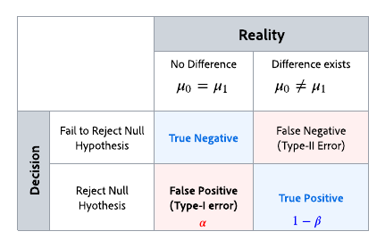
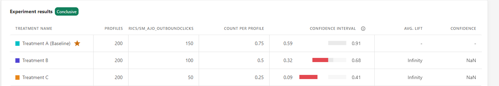

# Understand statistical calculations {#experiment-calculations}

>[!AVAILABILITY]
>
>The **Content Experiment** feature is currently only available for a set of organizations (Limited Availability). For more information, contact your Adobe representative.

This article describes the statistical calculations used when you run Experiments in Adobe Journey Optimizer. 

Experimentation uses advanced statistical methods to calculate **Confidence sequences** and **Confidence**, which allow you to run your experiments for as long as needed, and to monitor your results continuously.

This article describes how the Experimentation works, and provides an intuitive introduction to Adobe's **Any Time Valid Confidence Sequences**. 

For expert users, the technical details and references are detailed in [this page](../campaigns/assets/confidence_sequence_technical_details.pdf).

## Statistical Testing and Controlling Errors {#statistical-testing}

As illustrated in the table above, many statistical inferencing methodologies are designed to control two types of errors:

* **False Positives (Type-I errors)**: is an incorrect rejection of the null hypothesis, when in fact it is true. In the context of online Experimentations, this means that we falsely conclude that the outcome metric is different between each treatment, though it was the same.
 Before we run the experiment, we typically pick a threshold `\alpha`. After the experiment has run, the `p-value` is computed, and we reject the `null if p < \alpha`. A commonly used threshold is `\alpha = 0.05`, which means that in the long run, we expect 5 out of every 100 experiments to be false positives.

* **False Negatives (Type-II Errors)**: means that we fail to reject the null hypothesis though it is false. For Experimentations, this means that we do not reject the null hypothesis, when in fact it is different. To control this type of error, we generally need to have enough users in our experiment to guarantee a certain Power, defined as `1 - \beta`(i.e. one minus the probability of a type-II error).

Most statistical inferencing techniques will require you to fix your sample size ahead of time, based on the effect size you wish to determine, as well as your error tolerance (`\alpha` and `\beta`) ahead of time. However Adobe Journey Optimizer's methodology is designed to allow you to continuously look at your results, for any sample size.

## Adobe's Statistical Methodology: Any Time Valid Confidence Sequences

A **Confidence Sequence** is a sequential analog of a **Confidence Interval**, e.g. if you repeat your experiments one hundred times, and calculate an estimate of the mean metric and its associated 95%-Confidence Sequence for every new user that enters the experiment. A 95% Confidence Sequence will include the true value of the metric in 95 out of the 100 experiments that you ran. A 95% Confidence Interval could only be calculated once per experiment in order to give the same 95% coverage guarantee; not with every single new user. Confidence Sequences therefore allow you to continuously monitor experiments, without increasing False Positive error rates.

The difference between confidence sequences and confidence intervals for a single experiment is shown in the animation below:

**Confidence sequences** shift the focus of Experimentations to estimation rather than hypothesis testing i.e., focusing on accurate estimation of the difference in means between treatments, rather than whether or not to reject a null hypothesis based on a threshold of statistical significance.

However, in a similar manner to the relationship between `p-values`, or **Confidence**, and **Confidence Intervals**, there is also a relationship between **Confidence Sequences** and any time valid `p-values`, or any time valid Confidence. Given the familiarity of quantities like the Confidence, Adobe provides both the **Confidence Sequences** and any time valid Confidence in its reports.

The theoretical foundations of **Confidence Sequences** come from the study of sequences of random variables known as martingales. Some main results are included for expert readers below, but the takeaways of practitioners are clear:

>[!NOTE]
>
>Confidence sequences can be interpreted as safe sequential analogs of confidence intervals.You can look at and interpret data in your Experiments any time you want, and safely stop, or continue experiments. The corresponding Any Time Valid Confidence, or `p-value`, is also safe to interpret.

It is important to note that since confidence sequences are "any time valid", they will be more conservative than a fixed horizon methodology used at the same sample size. The confidence sequence's bounds are generally wider than a confidence interval calculation, while the any time valid confidence will be smaller than a fixed horizon confidence calculation. The benefit of this conservatism is that you can safely interpret your results at all times.

## Declaring an Experiment to be Conclusive

Every time you view the experimentation report, Adobe analyzes the data that has accumulated in the experiment up to this point and will declare an experiment to be "Conclusive" when the anytime valid confidence crosses a threshold of 95% for at least one of the treatments.

At this point, the treatment which is performing the best (based on the conversion rate, or profile-normalized metric value) will be highlighted at the top of the report screen, and indicated with a star in the tabular report. Only treatments that have a confidence greater than 95%, along with the baseline are considered in this determination.

When there are more than two treatments, the Bonferroni correction link is used to correct for multiple comparison problems, and controls the family wise error rate. In this scenario, it is also possible that there are multiple treatments whose confidence is greater than 95%, and whose confidence intervals overlap. In this case, Adobe Journey Optimizer will declare the one with the highest conversion rate (or profile-normalized metric value) to be the best performer.
