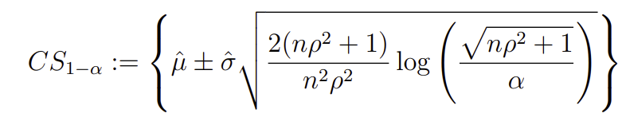
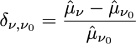
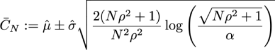
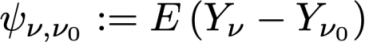
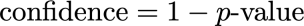
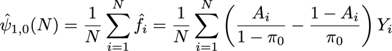
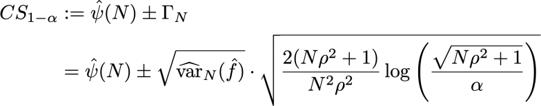
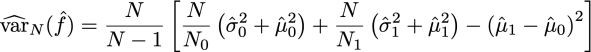

# Understand statistical calculations in Experimentation report {#experiment-report-calculations}

This page documents the detailed statistical calculations used in the Experimentation report for Campaigns in Adobe Journey Optimizer. 

Note that this page is intended for technical users.

## Conversion Rate

The conversion rate or **mean**, μν for each treatment `ν` in an Experiment is defined as a ratio of the sum of the metric to the number of profiles assigned to that metric, Nν:

{width="125" align="center"}

Here, Yiν is the value of the objective metric for each profile `i`, that has been assigned to a given variant *ν*. When the objective metric is a "unique" metric, i.e., it is a count of the number of profiles doing a particular action, this is displayed as a conversion rate, and formatted as a percentage. When the metric is a "count" or "total value" metric (e.g. email opens, revenue respectively), the mean estimate for the metric is displayed as a "Count per Profile", or "Value per Profile". 

Wherever needed, the sample standard deviation is used with the expression:

{width="225" align="center"}

## Lift {#lift}

The lift between a variant  *ν*, and the control variant  *ν0* is the relative "delta" in conversion rates, defined as the calculation below where the individual conversion rates are as defined above. This is displayed as a percentage. 

{width="125" align="center"}

 

## Anytime Valid Confidence Intervals for individual treatments

The Journey Experimentation panel displays "anytime valid" confidence intervals (confidence sequences) for individual treatments in an experiment. 

The confidence sequence for an individual variant `ν` is central to the statistical methodology used by Adobe. You can find its definition in [this page](https://doi.org/10.48550/arXiv.2103.06476) (reproduced from [Waudby-Smith et al.]). 

If you are interested in estimating a target parameter `ψ` such as the conversion rate of a variant in an Experiment, the dichotomy between a sequence of 'fixed-time' Confidence Intervals (CIs), and a time-uniform Confidence Sequence (CS) can be summarized as follows: 

{width="500" align="center"}

For a regular Confidence Interval, the probabilistic guarantee that the target parameter lies within the range of values Ċn is valid only at a single fixed value of `n` (where `n` is the number of samples). Conversely for a Confidence Sequence, we are guaranteed that at all times/ all values of the sample size `t`, the "true" value of the parameter of interest lies within the bounds.

This has a few deep implications which are very important for online testing:

* The CS can be optionally updated whenever new data becomes available.
* Experiments can be continuously monitored, adaptively stopped, or continued.
* The type-I error is controlled at all stopping times, including data-dependent times.

Adobe uses Asymptotic Confidence Sequences, which for an individual variant with mean estimate `μ` has the form:

{width="300" align="center"}

Where:

* `N` is the number of units for that variant.
* `σ` is a sample estimate of the standard deviation (defined above).
* `α` is the desired level of type-I error (or miscoverage probability). This is always set to 0.05. 
* ρ2 is a constant that tunes the sample size at which the CS is tightest. Adobe has chosen a universal value of ρ2 = 10-2.8, which is appropriate for the types of conversion rates seen in online experiments.

## Confidence {#confidence}

The confidence used by Adobe is an "anytime valid" confidence, which is obtained by inverting the confidence sequence for the average treatment effect. 

To be precise, in a two sample *t* test for the difference in means between two variants, there is a 1:1 mapping between the *p*-value for this test, and the confidence interval for the difference in means. By analogy, an anytime valid *p*-value can be obtained by inverting the (anytime valid) confidence sequence for the average treatment effect estimator:

{width="200" align="center"}

Here, *E* is an expectation. The estimator used is an inverse propensity weighted (IPW) estimator. Consider N = N0 +N1 units, the variant assignments for each unit `i` labeled by Ai=0,1 if the unit is assigned to variant `ν`=0,1. If the users are assigned with fixed probability (propensity) π0, (1-π0), and their outcome metric is Yi, then the IPW estimator for the average treatment effect is:

{width="400" align="center"}

Noting that *f* is the influence function, Waudby-Smith et al. showed that the Confidence Sequence for this estimator is:

{width="500" align="center"}

Replacing the assignment probability by its empirical estimates: π0 = N0/N, the variance term can be expressed in terms of individual sample mean estimates μ0,1 and standard deviation estimates, σ0,1 as:

{width="500" align="center"}

Next, recall that for a regular hypothesis test with test statistic z =  (μA-μ0/σp) there is a correspondence between `p`-values and confidence intervals:

{width="500" align="center"}

where `Φ` is the cumulative distribution of the standard normal. For anytime valid `p`-values, given the confidence sequence for the average treatment effect defined above, we can invert this relationship:

{width="600" align="center"}

Finally, the **anytime valid confidence** is: 

{width="200" align="center"}

## Declaring an Experiment to be Conclusive

For an Experiment with two arms, the Journey Optimizer Experimentation panel displays a message stating that an Experiment is **conclusive** when the anytime valid confidence exceeds 95% (i.e., the anytime valid `p`-value is below 5%). 

When more than two variants are present, the Bonferonni correction is applied to control the family wise error rate. For an experiment with `K` treatments, and a single baseline (control) treatment, there are `K-1` independent hypothesis tests. The Bonferonni correction means that we reject the null hypothesis that the control and a given variant have equal means, if the anytime valid `p`-value (defined above) is below a threshold of `α/(K-1)`.

## Best performing arm

When an experiment is declared conclusive, the best performing arm is displayed. This is the arm with the best performance (highest mean or conversion rate), among the Set that includes the control, and all arms that have a `p`-value that is below the Bonferonni threshold.
