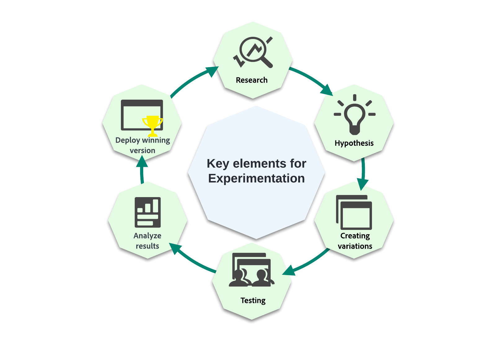
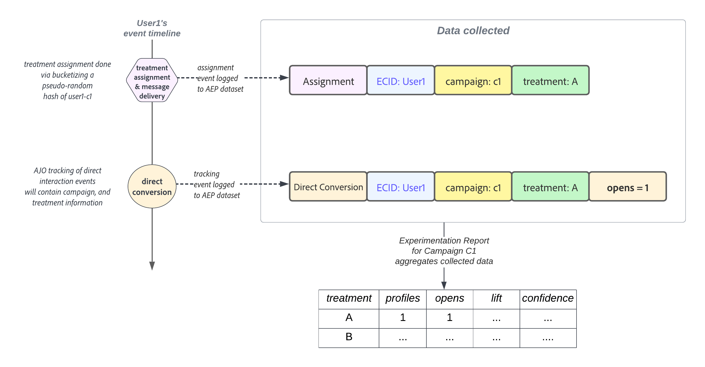
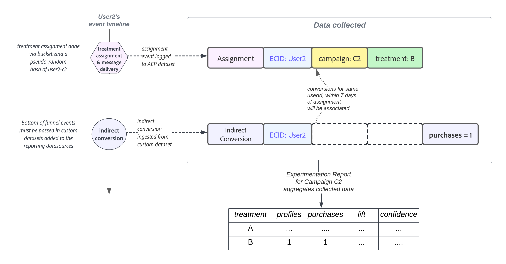
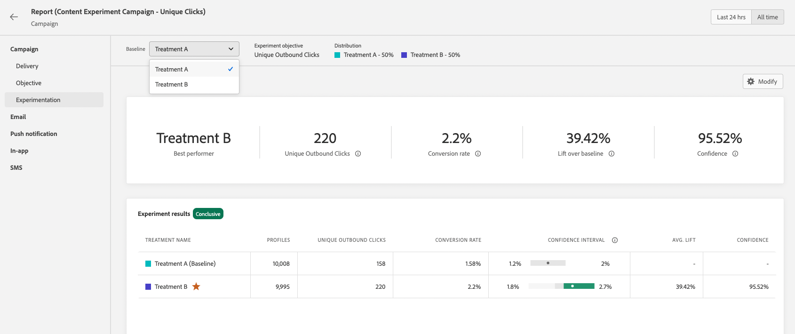

# Get started with content experiments {#get-started-experiment}

## What is a content experiment?

Content experiments allow you to optimize content for the actions in your Campaigns.

Experiments are a set of randomized trials, which in the context of online testing, means that some randomly selected users are exposed to a given variation of a message and another randomly selected set of users to another treatment. After sending the message, you can then measure the outcome metrics you are interested in e.g., opens of emails or clicks.

## Why run Experiments?

Experiments allow you to isolate the changes that lead to improvements in your metrics. As illustrated in the image above: some randomly selected users are exposed to each treatment group meaning that on average the groups will share the same characteristics. Thus, any difference in outcomes can be interpreted as being due to the differences in the treatments received i.e., you are able to establish a causal link between the changes you made, and the outcomes you are interested in.

This allows you to make data driven decisions in optimizing your business goals.

For Content Experiments in Adobe Journey Optimizer, you can test ideas such as:

* **Subject line**: What could be the impact of a change in the tone or in the degree of personalization of a subject line?
* **Message content**: Will changing the visual layout of an email result in more clicks on the email?

## How does content experiment work? {#content-experiment-work}

### Random Assignment 

Content experimentation in Adobe Journey Optimizer uses a pseudo-random hash of the visitor identity to perform random assignment of users in your target audience to one of the treatments that you have defined. The hashing mechanism ensures that in scenarios where the visitor enters a campaign multiple times, they will deterministically receive the same treatment. 

In detail, the MumurHash3 32-bit algorithm is used to hash the user identity string into one of 10,000 buckets. In a content experiment with 50% of traffic assigned to each treatment, users falling in buckets 1– 5,000 will receive the first treatment, while users in the buckets 5,001 to 10,000 will receive the second treatment. Since pseudo-random hashing is used, the visitor splits you observe may not be exactly 50-50; nevertheless, the split will be statistically equivalent to your target split percentage.  

Note that as part of configuring every campaign with a content experiment, you must choose an identity namespace from which the userId will be selected for the randomization algorithm. This is independent of the [execution addresses](../configuration/primary-email-addresses.md).

### Data Collection and Analysis

At the time of assignment i.e., when the message is sent in outbound channels, or when the user enters the campaign in inbound channels, an "assignment record" is logged to the appropriate system dataset. This will record which treatment the user was assigned to, along with experiment and campaign identifiers. 

Objective metrics can be grouped into two main classes:

* Direct metrics, where the user directly reacts to the treatment e.g., opening an email, or clicking on a link.
* Indirect or "bottom of funnel" metrics, which happens after the user has been exposed to the treatment. 

For direct objective metrics where Adobe Journey Optimizer tracks your messages, the response events of end users are automatically tagged with the campaign and treatment identifiers, allowing direct association of the response metric with a treatment. [Learn more on tracking](../email/message-tracking.md).

For indirect or "bottom of funnel" objectives such as purchases, the response events of end users are not tagged with campaign and treatment identifiers i.e., a purchase event happens after the exposure to a treatment, there is no direct association of that purchase with a prior treatment assignment. For these metrics, Adobe will associate the treatment with the bottom of funnel conversion event if:

* The user identity is the same at assignment and conversion event time. 
* The conversion happens within seven days of the treatment assignment. 

Adobe Journey Optimizer then uses advanced "anytime valid" statistical methods to interpret this raw reporting data, which allows you to interpret your experimentation reports. For more on this, refer to [this page](../campaigns/experiment-calculations.md).

## Tips for running Experiments

When running Experiments, it is important to follow certain best practices. Here are some tips for running these experiments:

+++Isolate the variables you are trying to test

Formulate some hypothesis that you intend to test, and restrict this hypothesis to as few changes as possible to determine what made an impact to your delivery.

For example, a good hypothesis can be whether personalization in email subject lines drives better open rates. However, also adding a change in the message content or in images can result in a confusing conclusion.
+++

+++Ensure you are using the right metric

Determine the metric you would like to target, and whether the changes you are making can have some direct impact on this metric.

For example, changing content of the message body is unlikely to affect email open rates.
+++

+++Run your test on the right audience size, or for long enough

If you run your tests for longer, you will be able to detect smaller differences in the goal metric between treatments. However, if the baseline value of your goal metric is small, then you'll need larger sample sizes. 
The number of users that must be included in your experiment depends on the effect size you wish to detect, the variance or spread of your goal metric, as well as your tolerance for false positive and false negative errors. In classical Experiments, you can use a [sample size calculator](https://experienceleague.adobe.com/tools/calculator/testcalculator.html){_blank} to determine how long you must run your test.
+++ 

+++Understand statistical uncertainty

If you are running an experiment where 1000 users have seen one treatment, and the conversion rate is set to 5%. Would this be the real conversion rate if all your users were included? What would be the true conversion rate?
Statistical methods give us a way of formalizing that uncertainty. One of the most important concepts to understand when running online experiments, is that the observed conversion rates are consistent with a range of underlying true conversion rates meaning that you must wait until those estimates are precise enough, before attempting to draw a conclusion. Confidence Intervals, and Confidence help us quantify this uncertainty.
+++

+++Form new hypotheses, and test continuously

To gain true business insights, you should stick to just one Experiment. Instead, follow up experiments by formulating new hypotheses, and running new tests with different changes, on different audiences, and by examining the impact on the different metrics.
+++

## Interpret the results of your Experiments {#interpret-results}

>[!CONTEXTUALHELP]
>id="ajo_campaigns_content_experiment_summary"
>title="Summary widget"
>abstract="The Summary widget provides an overview of your experiment results, including whether they are conclusive or not. It offers a quick and easy way to understand the outcome of your experiment."

This section describes the Experiment reports and how to understand the various statistical quantities that are presented.

Here are some guidelines for interpreting the results of your Content Experiment.

Note that a full description of results should consider all available evidence (i.e. sample sizes, conversion rates, confidence intervals etc.), and not just the declaration of conclusive or not. Even when a result is not yet conclusive, there can still be compelling evidence for one treatment being different from another.

To understand statistical calculations, refer to this [page](../campaigns/experiment-calculations.md).

### 1. Compare normalized metrics {#normalized-metrics}
    
When you compare the performance of two treatments, you should always compare the normalized metrics to account for any differences in the number of profiles exposed to each treatment. 
    
For example, if the experiment objective is set to **[!UICONTROL Unique Opens]**, and a given treatment was shown to 10,000 Profiles with 200 Unique Opens recorded, then this represents a **[!UICONTROL Conversion Rate]** of 2%. For non-unique metrics, e.g. Opens metric, the normalized metric is shown as a **[!UICONTROL Count per Profile]**, while for continuous metrics like Price Total, the normalized metric is shown as a **[!UICONTROL Total per Profile]**.

### 2. Focus on Confidence intervals {#confidence-intervals}

When you run experiments on samples of your profiles, the conversion rate observed for a given treatment represents an estimate of the true underlying conversion rate.
    
For example, if Treatment A has a **[!UICONTROL Conversion Rate]** of 3%, while Treatment B has an observed **[!UICONTROL Conversion Rate]** of 2%, is Treatment A a better performer than Treatment B? To answer this, we must first quantify the uncertainty in these observed conversion rates.

Confidence Intervals help to quantify the amount of uncertainty in the estimated conversion rates but wider confidence intervals imply more uncertainty. As more profiles get added to the experiment, the intervals will become smaller representing a more precise estimate. The confidence interval represents a range of conversion rates that are compatible with the observed data.

If the confidence intervals for two treatments are barely overlapping, this means that the two treatments have different conversion rates. But, if there is a lot of overlap between the confidence intervals for two treatments, then it is more likely that the two treatments have the same conversion rate.

Adobe uses 95% Anytime Valid Confidence Intervals, or Confidence Sequences, which means the results can be safely viewed at any time during the experiment.

### 3. Understand Lift {#understand-lift}

The Experiment report summary shows the **[!UICONTROL Lift over Baseline]**, which is a measure of the percentage improvement in conversion rate of a given treatment over the baseline. Defined precisely, it is the difference in performance between a given treatment and the baseline, divided by the performance of the baseline, expressed as a percentage.

### 3. Understand Confidence {#understand-confidence}

While you should primarily focus on the **[!UICONTROL Confidence interval]** for the performance of each treatment, Adobe also shows the Confidence, which is a probabilistic measure of how much evidence there is that a given treatment is the same as the baseline treatment. A higher confidence indicates less evidence for the assumption that baseline and non-baseline treatments have equal performance. More precisely, the confidence that is displayed is a probability (expressed as a percentage) that we would have observed a smaller difference in conversion rates between a given treatment and the baseline, if in reality there is no difference in the true underlying conversion rates. In terms of p-values, the confidence displayed is 1 - p-value.

Adobe uses "Anytime Valid" Confidence, and "Anytime Valid" p-values that are consistent with the Confidence Sequences described above.

### 4. Statistical Significance

When running Experiments, a result is deemed statistically significant if it was very unlikely to have been observed given a null hypothesis that a given treatment and the baseline have identical true underlying conversion rates/performance. 

Adobe declares an Experiment to be conclusive when the Confidence is above 95%.

## What to do after running an Experiment

After running your Experiment, there are several possible follow up actions:

* **Deploy winning ideas**
    
    With an unambiguous result, you can deploy this winning idea, either by pushing the best performing treatment to all your customers, or by creating new campaigns where the structure of the best performing treatment is replicated. 
     Note that in a dynamic environment, what works well at one time, may not work well later on.

* **Run follow-up tests**

    Sometimes the results of your experiments may be inconclusive, either because there were not enough profiles included to detect any difference in treatments, or because the treatments you defined were not sufficiently different. 
    
    If the hypothesis you were testing is still relevant, running a follow-up test on a larger or different audience, or modifying your treatments so that there are clearer differences may be the best follow up action.

* **Do deeper dive analyses** 

    The treatment that works well for one audience may sometimes not be the best treatment for another audience. Doing deeper analyses on how treatments behaved for different audiences help generate ideas for new tests. 
    
    Similarly, studying the performance of each treatment with different metrics may also give a more comprehensive view of your Experiments. 
    
    >[!CAUTION]
    >
    >More analyses mean a higher chance of detecting a spurious effect, or false positive.
