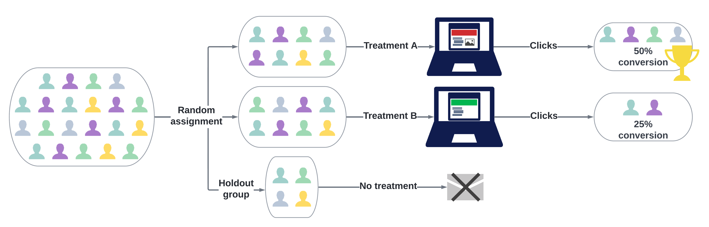
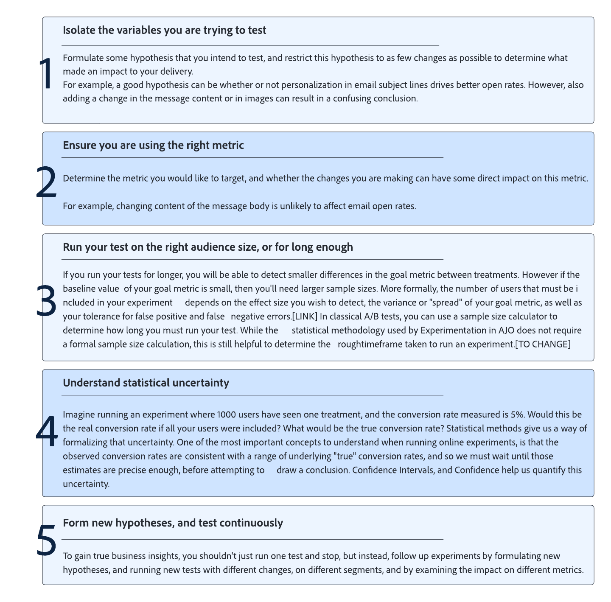

# Get started with Content experiment {#get-started-experiment}

## What is a Content Experiment?

Content Experiments allow you to optimize content for the actions in your Campaigns.

Content experiment is a set of randomized trials, which in the context of online testing, means that we expose some randomly selected users to a given variation of a message and another randomly selected set of users to some other treatment. After sending the message, we can then measure the outcome metrics we are interested in (e.g. opens of emails or clicks).

## Why run Experimentations?

Experimentations allow you to isolate the changes that lead to improvements in your business metrics. The reason is illustrated in the image below: we randomly assigned users to each treatment group meaning that on average the groups will share the same characteristics. Thus, any difference in outcomes can be interpreted as being due to the differences in the treatments received, i.e. we are able to establish a causal link between the changes we made, and the outcomes we are interested in.

This allows you to make data driven decisions in optimizing your business goals.

For content experiments in Adobe Journey Optimizer, you can test ideas such as:

* **Subject line**: will changing the tone of a subject line, or the degree of personalization can impact if emails are opened?
* **Message content**: will changing the visual layout of an email result in more clicks on the email?

## Tips for running Experimentations

When running Experimentations, it is important to follow certain best practices. Here are some tips for running these experiments:

+++Isolate the variables you are trying to test

Formulate some hypothesis that you intend to test, and restrict this hypothesis to as few changes as possible to determine what made an impact to your delivery.

 For example, a good hypothesis can be whether personalization in email subject lines drives better open rates. However, also adding a change in the message content or in images can result in a confusing conclusion.
+++

+++Ensure you are using the right metric

Determine the metric you would like to target, and whether the changes you are making can have some direct impact on this metric.

For example, changing content of the message body is unlikely to affect email open rates.
+++

+++Run your test on the right audience size, or for long enough

If you run your tests for longer, you will be able to detect smaller differences in the goal metric between treatments. However, if the baseline value of your goal metric is small, then you'll need larger sample sizes. 
More formally, the number of users that must be included in your experiment depends on the effect size you wish to detect, the variance or "spread" of your goal metric, as well as your tolerance for false positive and false negative errors. In classical A/B tests, you can use a sample size calculator to determine how long you must run your test.
+++ 

+++Understand statistical uncertainty

If you are running an experiment where 1000 users have seen one treatment, and the conversion rate is set to 5%. Would this be the real conversion rate if all your users were included? What would be the true conversion rate?
Statistical methods give us a way of formalizing that uncertainty. One of the most important concepts to understand when running online experiments, is that the observed conversion rates are consistent with a range of underlying true conversion rates meaning that you must wait until those estimates are precise enough, before attempting to draw a conclusion. Confidence Intervals, and Confidence help us quantify this uncertainty.
+++

+++Form new hypotheses, and test continuously

To gain true business insights, you should not run just one test. Instead, follow up experiments by formulating new hypotheses, and running new tests with different changes, on different segments, and by examining the impact on the different metrics.
+++

## Interpreting the results of your Experimentation

This section describes the Experimentation reports and how to understand the various statistical quantities that are presented.

Here are some guidelines for interpreting the results of your Content Experiment.

Note that a full description of results should consider all available evidence (i.e. sample sizes, conversion rates, confidence intervals etc.), and not just the declaration of conclusive or not. Even when a result is not yet conclusive, there can still be compelling evidence for one treatment being different from another.

### 1. Compare normalized metrics
    
When you compare the performance of two treatments, you should always compare the normalized metrics to account for any differences in the number of profiles exposed to each treatment. 
    
For example, if the experiment objective is set to Unique Opens, and a given treatment was shown to 10,000 Profiles with 200 Unique Opens recorded, then this represents a Conversion Rate of 2%. For non-unique metrics, e.g. Opens metric, the normalized metric is shown as a "Count per Profile", while for continuous metrics like Price Total, the normalized metric is shown as a "Total per Profile".

### 2. Focus on Confidence Intervals 

When you run experiments on samples of your profiles, the conversion rate observed for a given treatment represents an estimate of the true underlying conversion rate.
    
For example, if Treatment A has a Conversion Rate of 3%, while Treatment B has an observed Conversion Rate of 2%, is Treatment A better than Treatment B? To answer this, we must first quantify the uncertainty in these observed conversion rates.

Confidence Intervals help to quantify the amount of uncertainty in the estimated conversion rates but wider confidence intervals imply more uncertainty. As more profiles get added to the experiment, the intervals will become smaller representing a more precise estimate. The confidence interval represents a range of conversion rates that are compatible with the observed data.

If the confidence intervals for two treatments are barely overlapping, this means that the two treatments have different conversion rates. But, if there is a lot of overlap between the confidence intervals for two treatments, then it is more likely that the two treatments have the same conversion rate.

Adobe uses 95% (?)Anytime Valid Confidence Intervals, or Confidence Sequences, which means the results can be safely viewed at any time during the experiment.

### 3. Understanding Lift

The Experiment report summary shows the Lift over Baseline, which is a measure of the percentage improvement in conversion rate of a given treatment over the baseline. Defined precisely, it is the difference in performance between a given treatment and the baseline, divided by the performance of the baseline, expressed as a percentage.

### 3. Understanding Confidence

While you should primarily focus on the confidence interval for the performance of each treatment, Adobe also shows the Confidence, which is a probabilistic measure of how much evidence there is that a given treatment is the same as the baseline treatment. A higher confidence indicates less evidence for the assumption that baseline and non-baseline treatments have equal performance. More precisely, the confidence that is displayed is a probability (expressed as a percentage) that we would have observed a smaller difference in conversion rates between a given treatment and the baseline, if in reality there is no difference in the true underlying conversion rates. In terms of p-values, the confidence displayed is 1 - p-value.

Adobe uses "Anytime Valid" Confidence, and "Anytime Valid" p-values that are consistent with the Confidence Sequences described above. For further details see [LINK]

### 4. Statistical Significance

When running Experimentations, a result is deemed statistically significant if it was very unlikely to have been observed given a null hypothesis that a given treatment and the baseline have identical true underlying conversion rates/performance. 

Adobe declares an Experiment to be conclusive when the Confidence is above 95%.

## What to do after running an Experiment

After running your Experiment, there are several possible follow up actions:

* **Deploy winning ideas**
    
    With an unambiguous result, you can deploy this winning idea, either by pushing the best performing treatment to all your customers, or by creating new campaigns where the structure of the best performing treatment is replicated. 
     Note that in a dynamic environment, what works well at one time, may not work well later on.

* **Run follow-up tests**

    Sometimes the results of your experiments may be inconclusive, either because there were not enough profiles included to detect any difference in treatments, or because the treatments you defined were not sufficiently different. 
    
    If the hypothesis you were testing is still relevant, running a follow-up test on a larger or different audience, or modifying your treatments so that there are clearer differences may be the best follow up action.

* **Do deeper dive analyses** 

    The treatment that works well for one audience may sometimes not be the best treatment for another audience. Doing deeper analyses on how treatments behaved for different segments help generate ideas for new tests. 
    
    Similarly, studying the performance of each treatment with respect different metrics may also give a more comprehensive view of your Experimentations. 
    
    >[!CAUTION]
    >
    >More analyses mean a higher chance of detecting a spurious effect, or false positive.

