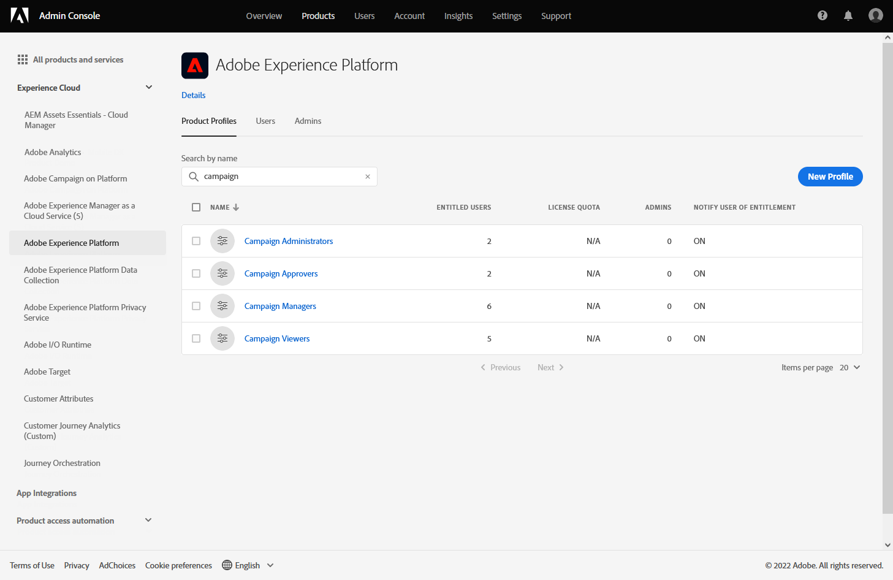
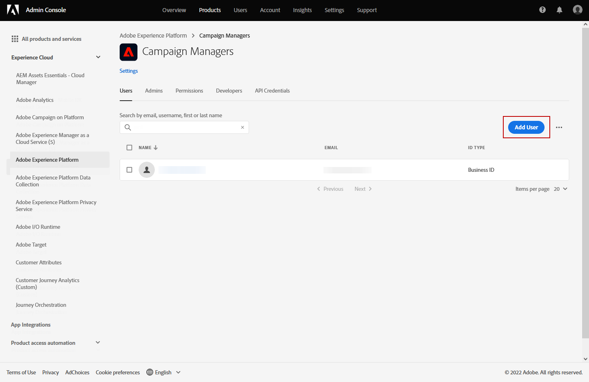

# Get started with campaigns {#get-started-campaigns}

>[!CONTEXTUALHELP]
>id="campaigns_list"
>title="Campaigns"
>abstract="Create campaigns to deliver one-time content to a specific segment across various channels. Before creating your campaign, make sure you have a channel surface (i.e. message preset) and an Adobe Experience Platform segment ready for use."

Use Journey Optimizer campaigns to deliver one-time content to a specific segment using various channels. When using journeys, actions are designed to be executed in sequence. With campaigns, actions are performed simultaneously, either immediately, or based on a specified schedule.

Create campaigns to send simple ad-hoc batch communications for marketing use cases like promotional offers, engagement campaigns, announcements, legal notices, or policy updates.

➡️ [Discover this feature in video](#video)

<!--You can create two types of campaigns:

* **Scheduled campaigns** allow for simple ad-hoc batch communications for marketing use cases like promotional offers, engagement campaigns, announcements, legal notices, or policy updates.
* **API Triggered Campaigns** allow for simple transactional/operational messages with REST APIs (password reset, card abandonment, etc.), where the need may involve personalization using profile attributes and contextual data from payload.-->

## Before starting {#campaign-prerequisites}

Check the following prerequisites before starting creating your first campaign in Journey Optimizer:

1. **You need proper permissions**. Campaigns are only available to users with access to a campaign related **[!UICONTROL Product profile]** such as Campaign administrator, Campaign approver, Campaign manager and/or Campaign viewer. If you cannot access campaigns, your permissions must be extended. If you have access to [Adobe Admin Console](https://adminconsole.adobe.com/){target="_blank"} for your organization, follow the steps below. If not, contact your Journey Optimizer Administrator.

+++Learn how to assign campaign permissions

To assign the corresponding **[!UICONTROL Product profile]** to your users:

1. From the [!DNL Admin console], select the [!DNL Adobe Experience Platform] product.

1. From the **[!UICONTROL Product profile]** tab, select one of the built-in Campaign related **[!UICONTROL Product profile]**: Campaign administrator, Campaign approver, Campaign manager or Campaign viewer. 

    For more information on Journey Optimizer campaign **[!UICONTROL Product profiles]** and **[!UICONTROL Permissions]**, [refer to this page](../administration/ootb-product-profiles.md).

    

1. Click **[!UICONTROL Add user]** to assign to your user the selected **[!UICONTROL Product profile]**.

    

1. Type-in your user's name, group, or email address and click **[!UICONTROL Save]**.

Your user will now be able to access **[!UICONTROL Campaigns]**. 

+++

1. **You need an audience**. Audience segments need to be available before creating the campaign. Learn more about audience creation [in this page](../segment/about-segments.md).
1. **You need a channel surface**. To be able to select a channel, you must have the corresponding channel surface created and available. Learn more about channel surfaces (i.e presets) [in this page](../configuration/channel-surfaces.md)

## Access campaigns {#access}

Campaigns are accessible from the **[!UICONTROL Campaigns]** menu.

By default, the list shows all campaigns with the **[!UICONTROL Draft]**, **[!UICONTROL Scheduled]**, and **[!UICONTROL Live]** statuses. To display stopped, completed and archived campaigns, you need to clear the filter.

## Campaign statuses {#statuses}

Campaigns can have multiple statuses:

* **[!UICONTROL Draft]**: The campaign is being edited, it has not been activated.
* **[!UICONTROL Activating]**: The campaign is being activated.
* **[!UICONTROL Live]**: The campaign has been activated.
* **[!UICONTROL Scheduled]**: The campaign has been configured to be activated on a specific start date.
* **[!UICONTROL Stopped]**: The campaign has been stopped manually. You cannot activate or reuse it anymore (see [Stop a campaign](modify-stop-campaign.md#stop))
* **[!UICONTROL Completed]**: The campaign is complete. This status is automatically assigned 3 days after a campaign has been activated, or at the campaign's end date if it has a recurring execution.
* **[!UICONTROL Archived]**: The campaign has been archived.

>[!NOTE]
>
>The "Open draft version" icon next to a **[!UICONTROL Live]** or **[!UICONTROL Scheduled]** status indicates that a new version of the campaign has been created and has not been activated yet (see [Modify a campaign](modify-stop-campaign.md#modify)).

## How-to video {#video}

Learn how to create your first campaign.

>[!VIDEO](https://video.tv.adobe.com/v/346680?quality=12)
