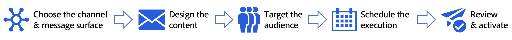

# Get started with campaigns {#get-started-campaigns}

>[!CONTEXTUALHELP]
>id="ajo_homepage_card3"
>title="Create campaigns"
>abstract="Use **Adobe Journey Optimizer** to deliver one-time content to a specific audience using various channels. When using journeys, actions are executed in sequence. With campaigns, actions are performed simultaneously, either immediately, or based on a specified schedule."

>[!CONTEXTUALHELP]
>id="campaigns_list"
>title="Campaigns"
>abstract="Create campaigns to deliver one-time content to a specific audience across various channels. Before creating your campaign, make sure you have a channel surface (i.e. message preset) and an Adobe Experience Platform audience ready for use."

Use Journey Optimizer campaigns to deliver one-time content to a specific audience using various channels. When using journeys, actions are executed in sequence. With campaigns, actions are performed simultaneously, either immediately, or based on a specified schedule.

You can create two types of campaigns:

* **Scheduled campaigns** allow for simple ad-hoc batch communications for marketing use cases like promotional offers, engagement campaigns, announcements, legal notices, or policy updates.
* **API-triggered campaigns** allow either for marketing communications to reach out to an audience at the right time, or for transactional/operational messages to an individual like a password reset, where the need may involve personalization by not just using profile attribute but also the real-time context data in the trigger which is a REST API payload.

The main steps to create a campaign are as follows:

➡️ [Discover this feature in video](#video)

## Before starting {#campaign-prerequisites}

Check the following prerequisites before starting creating your first campaign in Journey Optimizer:

1. **You need proper permissions**. Campaigns are only available to users with access to a campaign related **[!UICONTROL Product profile]** such as Campaign administrator, Campaign approver, Campaign manager and/or Campaign viewer. 
    
    If you cannot access campaigns, your permissions must be extended. If you have access to [Adobe Admin Console](https://adminconsole.adobe.com/){target="_blank"} for your organization, follow the steps below. If not, contact your Journey Optimizer Administrator.

    +++Learn how to assign campaign permissions

    To assign the corresponding **[!UICONTROL Product profile]** to your users:

    1. From [Adobe Admin Console](https://adminconsole.adobe.com/){target="_blank"}, select the [!DNL Adobe Experience Platform] product.

    1. Browse to the **[!UICONTROL Product profile]** tab, select one of the built-in campaign related **[!UICONTROL Product profile]**: Campaign administrator, Campaign approver, Campaign manager or Campaign viewer. 

        For more information on Journey Optimizer campaign **[!UICONTROL Product profiles]** and **[!UICONTROL Permissions]**, [refer to this page](../administration/ootb-product-profiles.md).

        

    1. Click **[!UICONTROL Add user]** to assign to your user the selected **[!UICONTROL Product profile]**.

        

    1. Type-in your user's name, group, or email address and click **[!UICONTROL Save]**.

    Your user is now able to access **[!UICONTROL Campaigns]**. 

    +++

1. **You need an audience**. Audiences need to be available before creating the campaign. Learn more about audiences [in this page](../audience/about-audiences.md).
1. **You need a channel surface**. To be able to select a channel, you must have the corresponding channel surface (i.e preset) created and available. Learn more about channel surfaces [in this page](../configuration/channel-surfaces.md).

## How-to video {#video}

Learn how to create your first campaign.

>[!VIDEO](https://video.tv.adobe.com/v/346680?quality=12)
