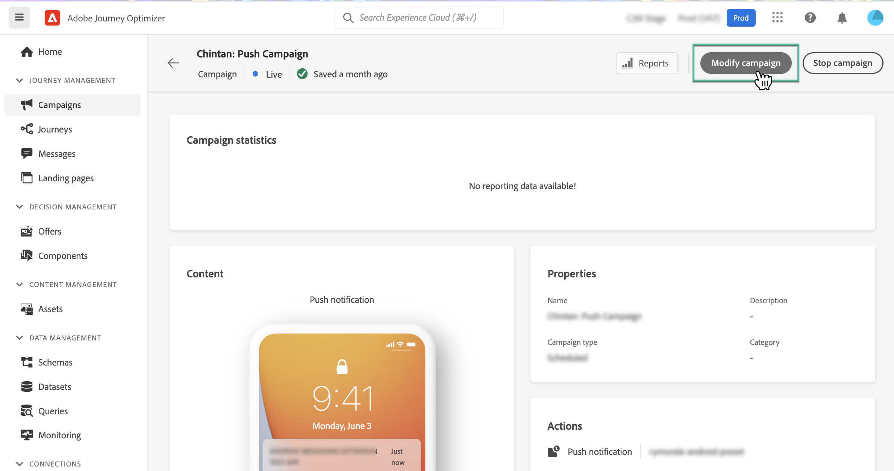
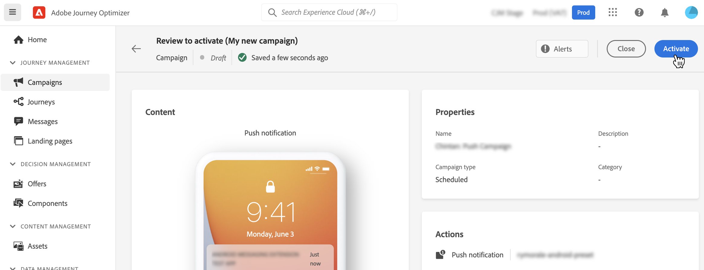

# Modify or stop a campaign {#modify-stop-campaign}

Once a campaign has been activated, you can edit it or stop it at any time. To do this, follow the steps below.

## Modify an activated campaign {#modify}

To modify and create a new version of a campaign, follow these steps:

1. Open the campaign then click the **[!UICONTROL Modify campaign]** button.

    

1. A new version of the campaign is created. You can check the live version of the campaign at any time by clicking **[!UICONTROL Open live version]**.

    

    In the campaigns list, activated campaigns with a draft version in progress display with a specific icon in the **[!UICONTROL Status]** column. Click this icon to open the draft version of the campaign.

    

1. Once your changes are ready, you can activate the new version of the campaign (see [Review and activate a campaign](create-campaign.md#review-activate)).

    >[!IMPORTANT]
    >
    >Activating the draft will replace the live version of the campaign.

    

## Stop a campaign {#stop}

To stop a campaign, open it then click the **[!UICONTROL Stop campaign]** button.

>[!IMPORTANT]
>
>After stopping a campaign, it will be available in read-only mode only. You will not be able to activate it again, or use it to create a new campaign.

