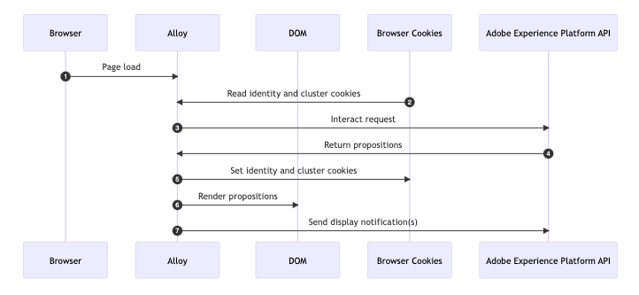
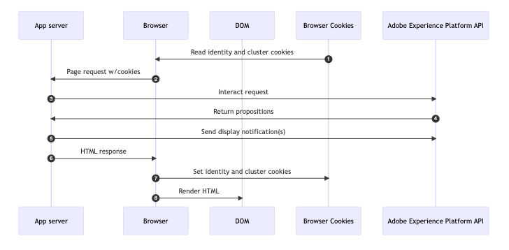

# Code-based implementation methods samples {#implementation-samples}

>[!BEGINSHADEBOX]

What you'll find in this documentation guide:

* [Get started with code-based channel](get-started-code-based.md)
* [Code-based prerequisites](code-based-prerequisites.md)
* **[Code-based implementation samples](code-based-implementation-samples.md)**
* [Create code-based experiences](create-code-based.md)

>[!ENDSHADEBOX]

Code-based experience supports any type of customer implementation. On this page you can find samples for each implementation method:

* [Client-side](#client-side-implementation)
* [Server-side](#server-side-implementation)
* [Hybrid](#hybrid-implementation)

You can also follow [this link](https://github.com/adobe/alloy-samples/tree/main/ajo){target="_blank"} to find sample implementations for different personalization and experimentation use cases. Check them out and run them in order to better understand what are the implementation steps needed and how the end-to-end personalization flow works.

## Client-side implementation {#client-side-implementation}

If you have a client-side implementation, you can use one of the AEP client SDKs: AEP Web SDK or AEP Mobile SDK. The steps below describe the process of fetching the content published on the edge by the code-based experience campaigns in a sample Web SDK implementation and displaying the personalized content.

### How it works

1. [Web SDK](https://experienceleague.adobe.com/docs/experience-platform/edge/home.html){target="_blank"} is included on the page.

1. You need to use the `sendEvent` command and specify the surface URI to fetch personalization content.

    ```javascript
    alloy("sendEvent", {
    renderDecisions: true,
    personalization: {
        surfaces: ["#sample-json-content"],
    },
    }).then(applyPersonalization("#sample-json-content"));
    ```

1. Code-based experience items should be manually applied by the implementation code (using the [`applyPersonalization`](https://github.com/adobe/alloy-samples/blob/ac83b6927d007dc456caad2c6ce0b324c99c26c9/ajo/personalization-client-side/public/script.js){target="_blank"} method) to update the DOM based on the decision.

1. For code-based experience campaigns, display events must manually be sent to indicate when the content has been displayed. This is done via the `sendEvent` command.

```javascript
function sendDisplayEvent(decision) {
  const { id, scope, scopeDetails = {} } = decision;

  alloy("sendEvent", {

    xdm: {
      eventType: "decisioning.propositionDisplay",
      _experience: {
        decisioning: {
          propositions: [
            {
              id: id,
              scope: scope,
              scopeDetails: scopeDetails,
            },
          ],
        },
      },
    },
  });
}
```

### Key Observations

**Cookies**

Cookies are used to persist user identity and cluster information. When using a client-side implementation, the Web SDK handles the storing and sending of these cookies automatically during the request lifecycle.

| Cookie                   | Purpose                                                                    | Stored by | Sent by |
| ------------------------ | -------------------------------------------------------------------------- | --------- | ------- |
| kndctr_AdobeOrg_identity | Contains user identity details                                             | Web SDK   | Web SDK |
| kndctr_AdobeOrg_cluster  | Indicates which experience edge cluster should be used to fulfill requests | Web SDK   | Web SDK |

**Request placement**

Requests to Adobe Experience Platform API are required to get propositions and send a display notification. When using a client-side implementation, the Web SDK makes these requests when the `sendEvent` command is used.

| Request                                        | Made by                             |
| ---------------------------------------------- | ----------------------------------- |
| interact request to get propositions           | Web SDK using the sendEvent command |
| interact request to send display notifications | Web SDK using the sendEvent command |

**Flow Diagram**



## Server-side implementation {#server-side-implementation}

If you have a server-side implementation, you can use one the AEP Edge Network API. The steps below describe the process of fetching the content published on the edge by the code-based experience campaigns in a sample Edge Network API implementation for a webpage and displaying the personalized content.

### How it works

1. The web page is requested and any cookies previously stored by the browser prefixed with `kndctr_` are included.
1. When the page is requested from the app server, an event is sent to the [interactive data collection endpoint](https://experienceleague.adobe.com/docs/experience-platform/edge-network-server-api/data-collection/interactive-data-collection.html) to fetch personalization content. This sample app makes use of some helper methods to simplify building and sending requests to the API (see [aepEdgeClient.js](https://github.com/adobe/alloy-samples/blob/ac83b6927d007dc456caad2c6ce0b324c99c26c9/common/aepEdgeClient.js){target="_blank"}). But the request is simply a `POST` with a payload that contains an event and query. The cookies (if available) from the prior step are included with the request in the `meta>state>entries` array.

      ```javascript
      fetch(
        "https://edge.adobedc.net/ee/v2/interact?dataStreamId=abc&requestId=123",
        {
          headers: {
            accept: "*/*",
            "accept-language": "en-US,en;q=0.9",
            "cache-control": "no-cache",
            "content-type": "text/plain; charset=UTF-8",
            pragma: "no-cache",
            "sec-fetch-dest": "empty",
            "sec-fetch-mode": "cors",
            "sec-fetch-site": "cross-site",
            "sec-gpc": "1",
            "Referrer-Policy": "strict-origin-when-cross-origin",
            Referer: "https://localhost/",
          },
          body: JSON.stringify({
            event: {
              xdm: {
                eventType: "decisioning.propositionFetch",
                web: {
                  webPageDetails: {
                    URL: "https://localhost/",
                  },
                  webReferrer: {
                    URL: "",
                  },
                },
                identityMap: {
                  FPID: [
                    {
                      id: "xyz",
                      authenticatedState: "ambiguous",
                      primary: true,
                    },
                  ],
                },
                timestamp: "2022-06-23T22:21:00.878Z",
              },
              data: {},
            },
            query: {
              identity: {
                fetch: ["ECID"],
              },
              personalization: {
                schemas: [
                  "https://ns.adobe.com/personalization/default-content-item",
                  "https://ns.adobe.com/personalization/html-content-item",
                  "https://ns.adobe.com/personalization/json-content-item",
                  "https://ns.adobe.com/personalization/redirect-item",
                  "https://ns.adobe.com/personalization/dom-action",
                ],
                surfaces: ["web://localhost/","web://localhost/#sample-json-content"],
              },
            },
            meta: {
              state: {
                domain: "localhost",
                cookiesEnabled: true,
                entries: [
                  {
                    key: "kndctr_XXX_AdobeOrg_identity",
                    value: "abc123",
                  },
                  {
                    key: "kndctr_XXX_AdobeOrg_cluster",
                    value: "or2",
                  },
                ],
              },
            },
          }),
          method: "POST",
        }
      ).then((res) => res.json());
      ```

1. The JSON experience from the code based experience campaign is read from the response and used when producing the HTML response.
1. For code-based experience campaigns, display events must manually be sent in the implementation to indicate when the campaign content has been displayed. In this example the notification is sent server-side during the request lifecycle.

    ```javascript
    function sendDisplayEvent(aepEdgeClient, req, propositions, cookieEntries) {
      const address = getAddress(req);

      aepEdgeClient.interact(
        {
          event: {
            xdm: {
              web: {
                webPageDetails: { URL: address },
                webReferrer: { URL: "" },
              },
              timestamp: new Date().toISOString(),
              eventType: "decisioning.propositionDisplay",
              _experience: {
                decisioning: {
                  propositions: propositions.map((proposition) => {
                    const { id, scope, scopeDetails } = proposition;

                    return {
                      id,
                      scope,
                      scopeDetails,
                    };
                  }),
                },
              },
            },
          },
          query: { identity: { fetch: ["ECID"] } },
          meta: {
            state: {
              domain: "",
              cookiesEnabled: true,
              entries: [...cookieEntries],
            },
          },
        },
        {
          Referer: address,
        }
      );
    }
    ```

1. When the HTML response is returned, the identity and cluster cookies are set on the response by the application server.

### Key Observations

**Cookies**

Cookies are used to persist user identity and cluster information. When using a server-side implementation, the application server must handle the storing and sending of these cookies during the request lifecycle.

| Cookie                   | Purpose                                                                    | Stored by          | Sent by            |
| ------------------------ | -------------------------------------------------------------------------- | ------------------ | ------------------ |
| kndctr_AdobeOrg_identity | Contains user identity details                                             | application server | application server |
| kndctr_AdobeOrg_cluster  | Indicates which experience edge cluster should be used to fulfill requests | application server | application server |

**Request placement**

Requests to Adobe Experience Platform API are required to get propositions and send a display notification. When using a client-side implementation, the Web SDK makes these requests when the `sendEvent` command is used.

| Request                                        | Made by                                                      |
| ---------------------------------------------- | ------------------------------------------------------------ |
| interact request to get propositions           | application server calling the Adobe Experience Platform API |
| interact request to send display notifications | application server calling the Adobe Experience Platform API |

**Flow Diagram**



## Hybrid implementation {#hybrid-implementation}

If you have a hybrid implementation, check out the links below.

* Adobe Tech Blog: [Hybrid Personalization in the Adobe Experience Platform Web SDK](https://blog.developer.adobe.com/hybrid-personalization-in-the-adobe-experience-platform-web-sdk-6a1bb674bf41){target="_blank"}
* SDK Documentation: [Hybrid personalization using Web SDK and Edge Network Server API](https://experienceleague.adobe.com/docs/experience-platform/edge/personalization/hybrid-personalization.html){target="_blank"}

