# Create code-based experiences {#create-code-based}

>[!BEGINSHADEBOX]

What you'll find in this documentation guide:

* [Get started with code-based channel](get-started-code-based.md)
* [Code-based prerequisites](code-based-prerequisites.md)
* [Code-based implementation samples](code-based-implementation-samples.md)
* **[Create code-based experiences](create-code-based.md)**

>[!ENDSHADEBOX]

>[!AVAILABILITY]
>
>The code-based experience channel is currently available as a beta to select users only. To join the beta program, contact Adobe Customer Care.

## Create a code-based campaign {#create-code-based-campaign}

To start building your code-based experience through a campaign, follow the steps below.

>[!CAUTION]
>
>Currently in [!DNL Journey Optimizer] you can only create code-based experiences using **campaigns**.

1. Create a campaign. [Learn more](../campaigns/create-campaign.md)

1. Select the **[!UICONTROL Code-based experience (Beta)]** action.

1. Enter the code-based experience surface. [Learn more](#surface-definition)

    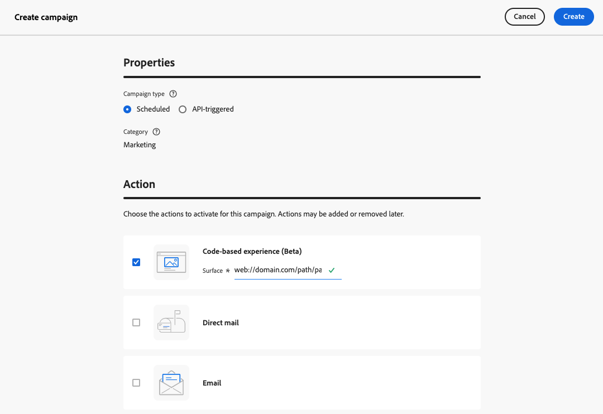

    >[!CAUTION]
    >
    >Make sure the surface URI used in your code-based campaign matches the one used in your own implementation. Otherwise, the changes will not be delivered.

1. Select **[!UICONTROL Create]**.

1. Complete the steps to create a campaign, such as the campaign properties, [audience](../audience/about-audiences.md), and [schedule](../campaigns/create-campaign.md#schedule).

    >[!NOTE]
    >
    >For more information on how to configure a campaign, refer to [this page](../campaigns/get-started-with-campaigns.md).

1. Edit your content as desired using the Expression editor. [Learn more](#edit-code)

    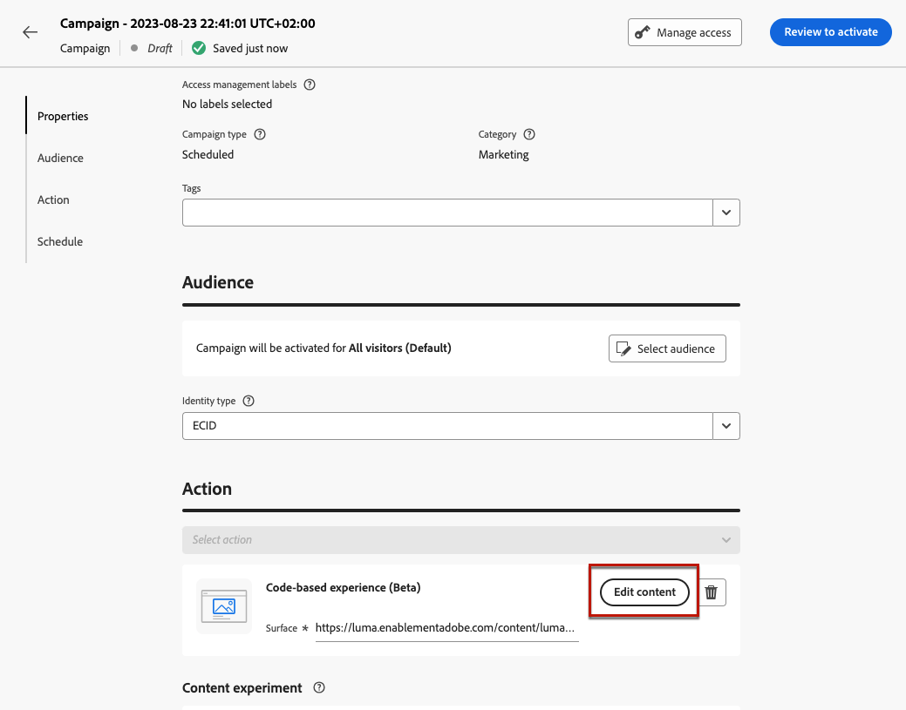

## Edit the code content {#edit-code}

>[!CONTEXTUALHELP]
>id="ajo_code_based_experience"
>title="Use the Expression editor"
>abstract="Insert and edit the code you want to deliver as part of this code-based experience action."
>additional-url="https://experienceleague.adobe.com/docs/journey-optimizer/using/personalized-dynamic-content/personalization/expression-editor/personalization-build-expressions.html" text="Get started with the Expression editor"

1. From the campaign edition screen, select **[!UICONTROL Edit code]**.

    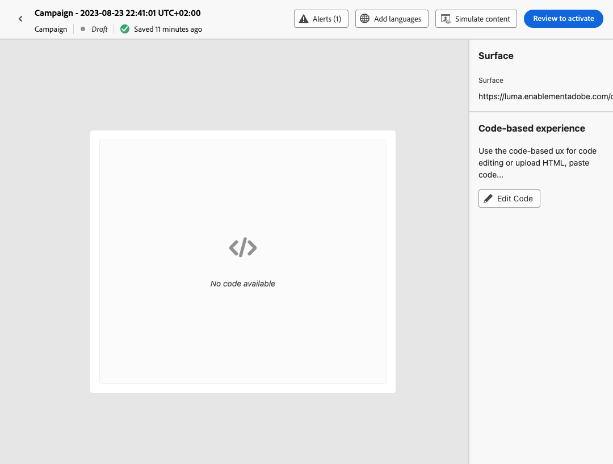

1. The [Expression editor](../personalization/personalization-build-expressions.md) opens. It is a non-visual experience creation interface which allows you to author your code.

1. You can switch the authoring mode from HTML to JSON, and vice versa.

    >[!CAUTION]
    >
    >Changing the authoring mode will result in losing all of your current code, so make sure to switch modes before you start authoring.

1. Enter your code as needed. You can leverage the [!DNL Journey Optimizer] Expression editor with all its personalization and authoring capabilities. [Learn more](../personalization/personalization-build-expressions.md)

    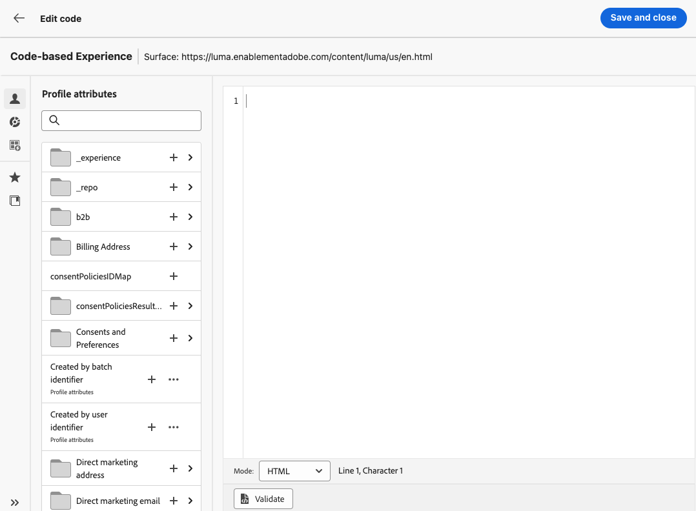

1. In code-based campaigns, you can use the experience decisioning feature. Select the **[!UICONTROL Decisions]** icon from the left bar and click **[!UICONTROL Create decision]**. [Learn more](../experience-decisioning/create-decision.md)

    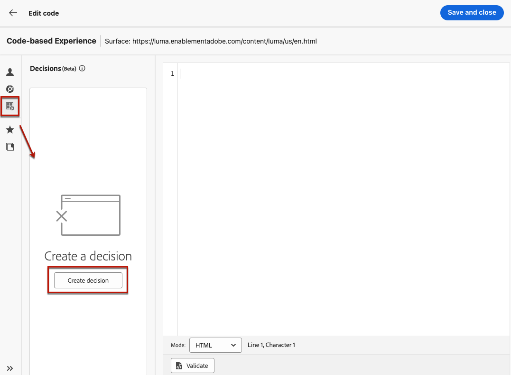

    >[!NOTE]
    >
    >The experience decisioning feature is currently available as a beta to select users only.

1. Click **[!UICONTROL Save and close]** to confirm your changes.

Now as soon as your developer makes an API or SDK call to fetch content for the selected surface, the changes will be applied to your web page or app.

## Test the code-based campaign {#test-code-based-campaign}

>[!CONTEXTUALHELP]
>id="ajo_code_based_preview"
>title="Preview your code-based experience"
>abstract="Get a simulation of what your code-based experience will look like."

To display a preview of your modified code-based experience, follow the steps below.

>[!CAUTION]
>
>You must have test profiles available to simulate which offers will be delivered to them. Learn how to [create test profiles](../audience/creating-test-profiles.md).

1. From either the Expression editor or edit content screen, select **[!UICONTROL Simulate content]**.

    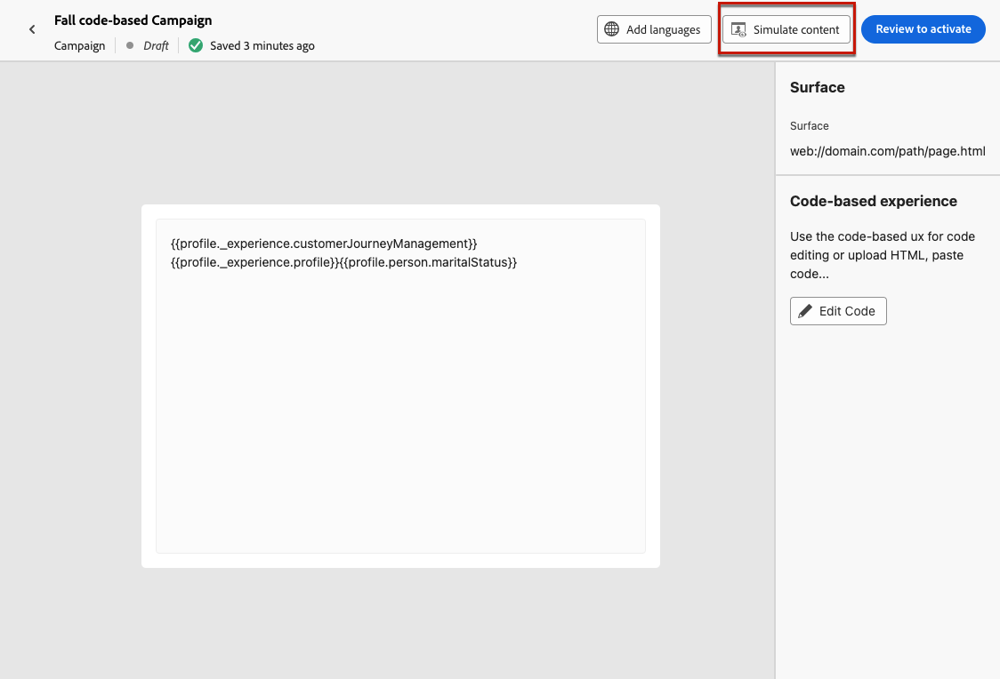

1. Click **[!UICONTROL Manage test profiles]** to select one or more test profiles.

1. A preview of your modified code-based experience is displayed.
    
<!--
    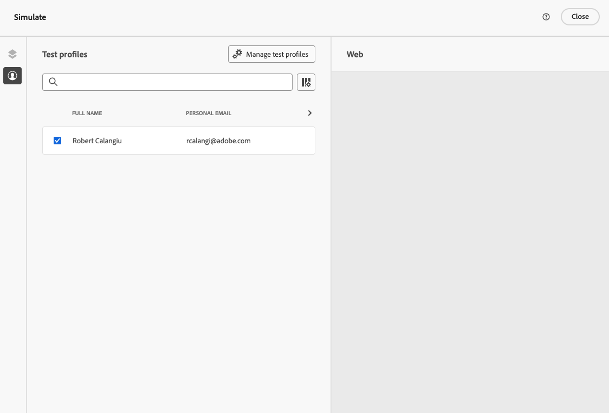

    You can also open it in the default browser, or copy the test URI to paste it in any browser. This allows you to share the link with your team and stakeholders who will be able to preview the new web experience in any browser before the campaign goes live.

    When copying the test URI, the content displayed is the one personalized for the test profile used when the content simulation was generated in [!DNL Journey Optimizer].-->

## Activate the code-based campaign {#activate-code-based-campaign}

Once you defined your code-based campaign and edited your content as desired using the [code-based editor](#edit-code), you can review and activate it. Follow the steps below.

>[!NOTE]
>
>You can also preview your campaign content before activating it. [Learn more](#test-code-based-campaign)

1. From your code-based campaign, select **[!UICONTROL Review to activate]**.

    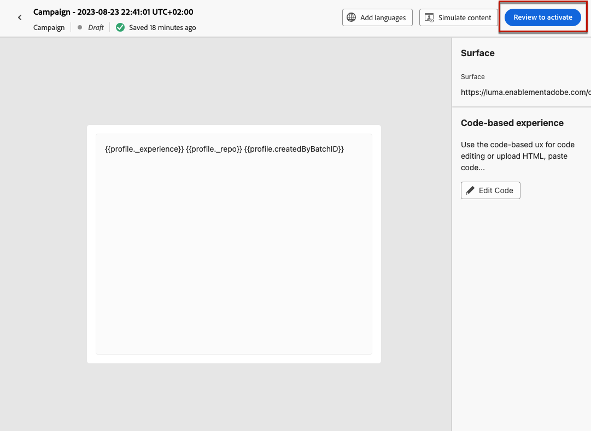

1. Check and edit if needed the content, properties, surface, audience and schedule.

1. Select **[!UICONTROL Activate]**.

    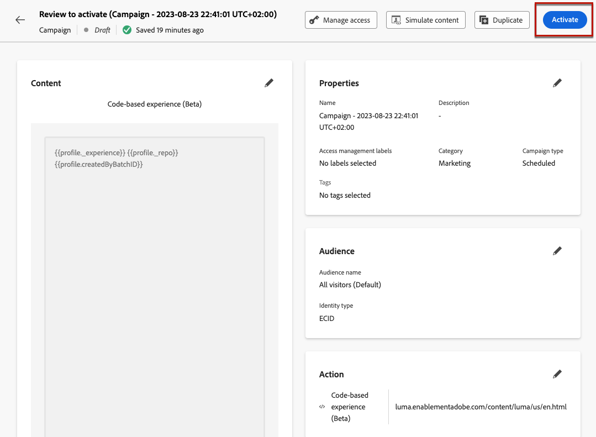

    >[!NOTE]
    >
    >After you click **[!UICONTROL Activate]**, it can take up to 1 minute for code-based campaigns changes to be available live on your location.

Your code-based campaign takes the **[!UICONTROL Live]** status and is now visible to the selected audience. Each recipient of your campaign can see your modifications.

>[!NOTE]
>
>If you defined a schedule for your code-based campaign, it has the **[!UICONTROL Scheduled]** status until the start date and time are reached.
>
>If you activate a code-based campaign impacting the same locations as another campaign which is already live, all the changes will be applied to your locations.

Learn more on activating campaigns in [this section](../campaigns/review-activate-campaign.md).

## Stop a code-based campaign {#stop-code-based-campaign}

When a code-based campaign is live, you can stop it to prevent your audience from seeing your modifications. Follow the steps below.

1. Select a live campaign from the list.

1. From the top menu, select **[!UICONTROL Stop campaign]**.

    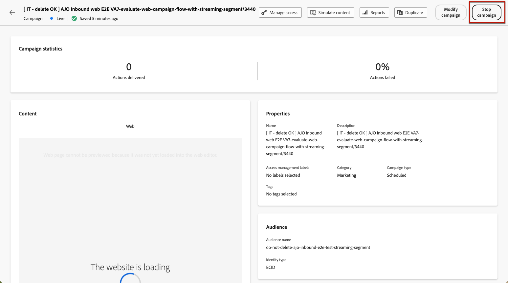

1. The modifications you added will not be visible anymore to the audience you defined.

>[!NOTE]
>
>Once a code-based campaign is stopped, you cannot edit or activate it again. You can only duplicate it and activate the duplicated campaign.

## Code-based campaign reports

You can access code-based campaign reports from the campaign summary screen.

Global reports display events that occurred at least two hours ago and cover events over a selected time period. In comparison, Live reports focus on events that took place within the past 24 hours, with a minimum time interval of two minutes from the event occurrence.

### Code-based live report {#live-report-code-based}

From your campaign **[!UICONTROL Live report]**, the **[!UICONTROL Code-based experience]** tab details the main information relative to your apps or web pages. [Learn more on live report](../reports/campaign-live-report.md)

+++Learn more on the different metrics and widgets available for the Code-based experience report.

The **[!UICONTROL Code-based experience performance]** KPIs detail the main information relative to your visitors' engagement with your code-based experiences, such as:

* **[!UICONTROL Impressions]**: total number of experiences delivered to all users.

* **[!UICONTROL Interactions]**:  total number of engagements with your app/page. This includes any actions taken by the users, such as clicks or any other interactions.

The **[!UICONTROL Code-based experience summary]** graph shows the evolution of your experiences (impressions, unique impressions and interactions) for the last 24 hours.

<!--The **[!UICONTROL Interactions by element]** table details the main information relative to your visitors' engagement with the various elements on your app/pages.-->
+++

### Code-based global report {#global-report-code-based}

Code-based campaign global report can be accessed directly from your campaign with the **[!UICONTROL View report]** button. [Learn more on global report](../reports/campaign-global-report.md)

From your Campaign **[!UICONTROL Global report]**, the **[!UICONTROL Code-based experience]** tab details the main information relative to your apps or web pages.

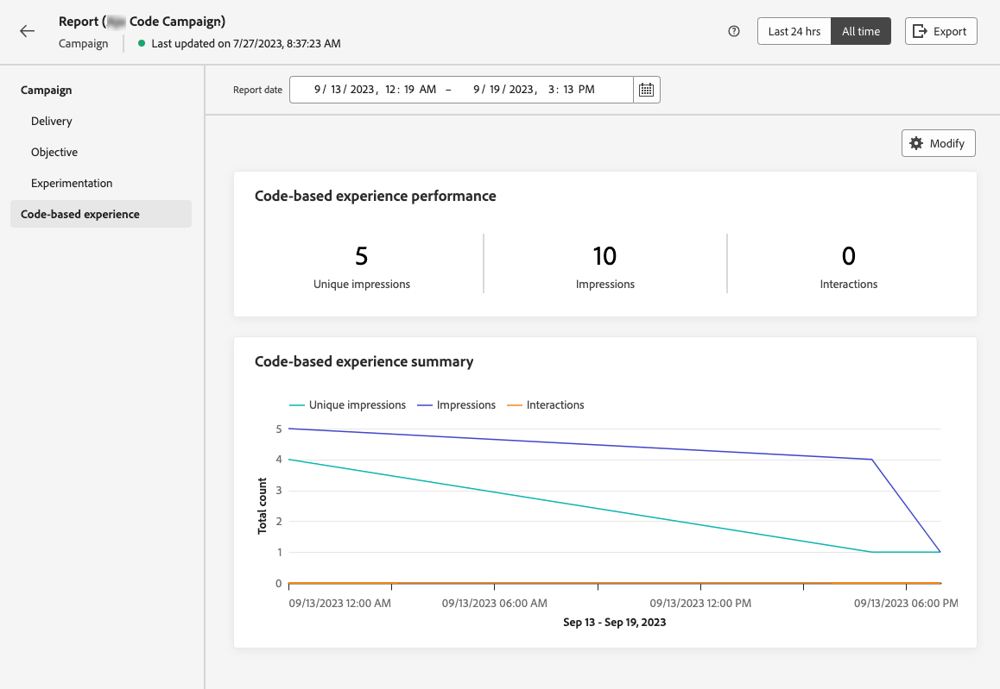

<!--image-->

+++Learn more on the different metrics and widgets available for the Code-based experience report.

The **[!UICONTROL Code-based experience performance]** KPIs detail the main information relative to your visitors' engagement with your experiences, such as:

* **[!UICONTROL Unique impressions]**: number of unique users to whom the experience was delivered.

* **[!UICONTROL Impressions]**: total number of experiences delivered to all users.

* **[!UICONTROL Interactions]**: percentage of engagements with your app/page. This includes any actions taken by the users, such as clicks or any other interactions.

The **[!UICONTROL Code-based experience summary]** graph shows the evolution of your experiences (unique impressions, impressions and interactions) for the concerned period.

<!--The **[!UICONTROL Interactions by element]** table details the main information relative to your visitors' engagement with the various elements on your apps/pages.-->
+++

<!--
## How-to video{#video}

The video below shows how to create a code-based campaign, configure its properties, review, and publish it.

>[!VIDEO]()

-->
