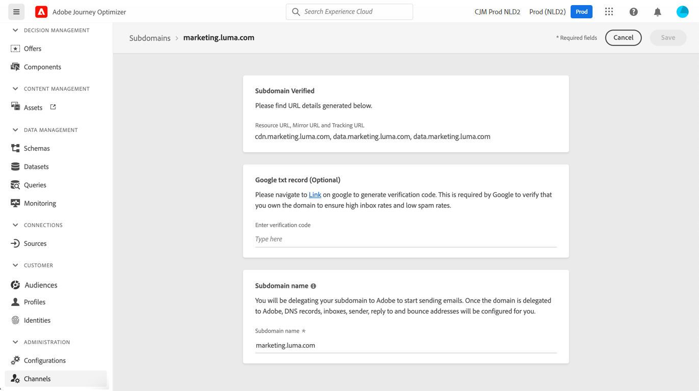

# Subdomain delegation in [!DNL Journey Optimizer] {#subdomain-delegation}

Creating a subdomain for email campaigns allows brands to isolate varying types of traffic (marketing vs. corporate for example) into specific IP pools and with specific domains, which will speed the IP warming process and improve deliverability overall. If you share a domain and it gets blocked or added to the deny list, it could impact your corporate mail delivery. However, reputation issues or blocks on a domain specific to your email marketing communications will impact just that flow of email. Using your main domain as the sender or 'From' address for multiple mail streams could also break email authentication, causing your messages to be blocked or placed in the spam folder.

>[!NOTE]
>
>You cannot use the same sending domain to send out messages from [!DNL Adobe Journey Optimizer] and from another product, such as [!DNL Adobe Campaign] or [!DNL Adobe Marketo Engage].

## Why set up subdomains? {#why-set-up-subdomains}

A subdomain is a division of your domain that can be used to isolate your brands, or various types of traffic - for example transactional messages and marketing communications.

Let's take the example of the "mybrand.com" domain, that is used to send both transactional and marketing communications. In this situation, you can decide to set up two subdomains:

* "info.mybrand.com" subdomain for your transactional communications (purchases confirmation, password reset, etc.),
* "marketing.mybrand.com" subdomain for your prospecting emailings.

By doing so, you will help preserve the reputation of your domain and other subdomains. For example, if the "marketing.mybrand.com" subdomains ended up being added to the block list by Internet Service Providers due to bad deliverability, this would prevent the whole "mybrand.com" domain and the "info.mybrand.com" subdomain from being added to the block list.

When implementing a solution, there are requirements for externally-facing components: these include setting up links and web pages to be tracked, displaying mirror pages, etc.

While these requirements are being managed through components hosted by both Adobe and the customer, they include URLs which can be seen by the recipients of the emails. To avoid having URLs which indicate the underlying technical solution or hosting provider, subdomains can be set up to make this transparent to the recipients of the emails.

**Learn more**

* Learn how to [delegate your subdomains](delegate-subdomain.md) directly from the interface
* Learn how to [add Google TXT records](google-txt.md) to your subdomains to ensure the successful delivery of emails to Gmail addresses
* Learn how to [access the PTR records](ptr-records.md) generated for your subdomains, allowing them to be verified by sending mail servers

## Subdomain configuration methods {#subdomain-delegation-methods}

Subdomain configuration allows you to configure a subsection of your domain (technically a "DNS zone") for use with Adobe Campaign. Available setup methods are:

* **Full subdomain delegation to Adobe** (recommended): The subdomain is fully delegated to Adobe. Adobe is able to control and maintain all aspects of DNS that are required for delivering, rendering and tracking messages. [Learn more on full subdomain delegation](delegate-subdomain.md#full-subdomain-delegation)

* **Use of CNAMEs**: Create a subdomain and use CNAMEs to point to Adobe-specific records. Using this setup, both you and Adobe share responsibility for maintaining DNS. [Learn more on CNAME subdomain delegation](delegate-subdomain.md#cname-subdomain-delegation)

>[!CAUTION]
>
>* The full subdomain delegation is the preferred method.
>
>* The CNAME method is recommended if your organization's policies restrict the full subdomain delegation method. This approach requires you to maintain and manage DNS records on your own. Adobe will not be able to assist in changing, maintaining or managing DNS for a subdomain configured through the CNAME method.

The table below provides a summary of how these methods work, as well as the implied level of effort:

| Configuration method | How it works | Level of effort |
|---|---|---|
| **Full delegation** | Create the subdomain and namespace record. Adobe will then configure all DNS records required for Adobe Campaign.  In this setup, Adobe is fully responsible for managing the subdomain and all the DNS records. | Low |
| **CNAME, custom method** |  Create the subdomain and namespace record. Adobe will then provide the records to be placed in your DNS servers and will configure the corresponding values in Adobe Campaign DNS servers.  In this setup, both you and Adobe share responsibility for maintaining DNS. | High |

Additional information on domain configuration is available in [this documentation](https://experienceleague.adobe.com/docs/deliverability-learn/deliverability-best-practice-guide/additional-resources/product-specific-resources/campaign/ac-domain-name-setup.html).

If you have any question regarding subdomain configuration methods, reach out to Adobe, or eventually contact Customer Care to request Deliverability consulting.

## Access delegated subdomains {#access-delegated-subdomains}

All your delegated subdomains display in the **[!UICONTROL Administration]** > **[!UICONTROL Channels]** > **[!UICONTROL Subdomains]** menu. Filters are available to help you refine the list (delegation date, user or status).

The **[!UICONTROL Status]** column provides information on the subdomain delegation process:

* **[!UICONTROL Draft]**: The subdomain delegation has been saved as a draft. Click the subdomain name to resume the delegation process,
* **[!UICONTROL Processing]**: The subdomain is going through several configuration checks before it can be used,
* **[!UICONTROL Success]**: The subdomain has gone through the checks successfully and can be used to deliver messages,
* **[!UICONTROL Failed]**: One or several checks have failed after the subdomain delegation was submitted.

To access detailed information about a subdomain with the **[!UICONTROL Success]** status, open it from the list.

You can:
    
* Retrieve the subdomain name (read-only) configured during the delegation process, as well as the generated URLs (resources, mirror pages, tracking URLs),

* Add a Google site verification TXT record to your subdomain to ensure that it is verified (see [Add a Google TXT record to a subdomain](google-txt.md)). 

>[!CAUTION]
>
>Subdomain configuration is common to all environments. Therefore any modification to a subdomain will also impact the production sandboxes.
